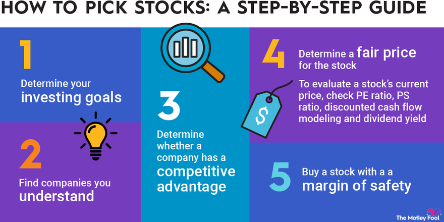

## Table of Contents

## What is stock picking and why is it important?

Stock picking is when you choose specific stocks to buy, hoping they will go up in value so you can make money. It's like picking fruits from a tree, where you try to choose the best ones that will be the tastiest and most valuable. People who pick stocks look at many things like the company's financial health, how the industry is doing, and even world events that might affect the stock's price.

It's important because it can help you grow your money over time. If you pick the right stocks, you could earn more than if you just put your money in a savings account. However, it's also risky because if you pick the wrong stocks, you could lose money. That's why many people spend a lot of time researching and learning about different companies before they decide which stocks to buy.

## How does stock picking differ from passive investing?

Stock picking and passive investing are two different ways to invest your money in the stock market. Stock picking is when you choose specific stocks to buy. You do a lot of research on companies and try to find the ones that you think will do well. It's like going to a store and picking out your favorite items one by one. You believe that by choosing the right stocks, you can beat the market and make more money.

Passive investing, on the other hand, is a more laid-back approach. Instead of [picking](/wiki/asset-class-picking) individual stocks, you invest in a whole bunch of stocks at once by buying something called an index fund or an [ETF](/wiki/etf-trading-strategies). These funds track a market index, like the S&P 500, which means you get a little piece of many different companies. It's like buying a mixed bag of candies instead of choosing each piece yourself. The goal is to match the market's performance, not to beat it, and it usually costs less in fees and takes less time to manage.

## What are the basic principles of effective stock picking?

Effective stock picking starts with doing your homework. You need to learn about the companies you want to invest in. Look at their financial reports to see if they are making money and growing. It's also important to understand the industry they are in and how it's doing. Keep an eye on the news and world events because they can affect stock prices. The more you know, the better choices you can make.

Another key principle is having a clear plan. Decide what you want to achieve with your investments and how much risk you are willing to take. Don't just buy stocks because they are popular or because someone else is doing it. Stick to your plan and be patient. Remember, good stock picking is not about getting rich quick; it's about making smart choices over time.

Lastly, it's important to keep an eye on your investments and be ready to make changes. If a company starts doing poorly, you might need to sell your stock. On the other hand, if a company is doing really well, you might want to buy more. Always think about the long term and don't let short-term ups and downs scare you. Effective stock picking is about being informed, sticking to a plan, and staying flexible.

## Can you explain the role of fundamental analysis in stock picking?

Fundamental analysis is like doing a health check on a company before deciding to buy its stock. It's all about looking at the company's financial reports to see if it's doing well. You check things like how much money the company is making, how much it owes, and how fast it's growing. This helps you figure out if the stock is a good buy. If a company is healthy and growing, its stock might be a good choice.

Besides looking at the numbers, [fundamental analysis](/wiki/fundamental-analysis) also means understanding the bigger picture. You need to know about the industry the company is in and what's happening in the world that could affect it. For example, if a company makes electric cars and more people are buying them, that's a good sign. By putting all this information together, you can make smarter choices about which stocks to pick. It's like being a detective, gathering all the clues to solve the mystery of whether a stock is worth buying.

## How does technical analysis contribute to stock picking?

Technical analysis is another way to pick stocks, but it's different from fundamental analysis. Instead of looking at a company's financial health, technical analysis focuses on the stock's price movements and trading patterns. It's like studying a map to see where a stock has been and where it might be going. People who use technical analysis look at charts and graphs to spot trends and patterns. They believe that by understanding these patterns, they can predict when a stock's price will go up or down.

For example, if a stock's price has been going up steadily and then it starts to go down, a technical analyst might see this as a sign that the stock's price will keep falling. They might decide to sell the stock before it drops even more. On the other hand, if they see a pattern that suggests the stock's price is about to go up, they might buy it. Technical analysis helps stock pickers make decisions based on what the stock's price is doing, rather than what the company is doing. It's all about timing and trying to buy low and sell high.

## What are some common strategies used by successful stock pickers?

Successful stock pickers often use a strategy called value investing. This means they look for companies that they think are undervalued, or cheaper than they should be. They study the company's financial reports and compare them to what the stock is selling for. If they think the stock is a good deal, they buy it and hold onto it until the price goes up. This strategy is all about patience and believing in the long-term growth of the company.

Another common strategy is growth investing. Here, stock pickers look for companies that are growing fast and are expected to keep growing. They might not be making a lot of money right now, but they have big plans for the future. Investors using this strategy are willing to pay more for the stock because they believe it will be worth even more later. This approach can be riskier, but it can also lead to big rewards if the company does well.

Some stock pickers also use a mix of technical and fundamental analysis. They look at the company's financial health and the stock's price patterns to make their decisions. This combined approach helps them see the full picture and make more informed choices. By using these strategies, successful stock pickers aim to find the best stocks to buy and hold onto them for the long term.

## How can one evaluate the performance of a stock picking strategy?

To evaluate the performance of a stock picking strategy, you need to look at how well it's doing over time. Start by checking the returns of the stocks you picked. Compare these returns to a benchmark, like the S&P 500. If your stocks are doing better than the benchmark, your strategy might be working well. It's also important to consider how much risk you took to get those returns. If you took a lot of risk and only got small returns, your strategy might not be that good.

Another way to evaluate your strategy is to look at how consistent it is. Did your stocks go up and down a lot, or did they grow steadily? A good strategy should give you steady growth without too many ups and downs. Also, think about how much time and effort you spent on picking stocks. If you spent a lot of time and didn't get good results, you might need to change your strategy. By looking at returns, risk, consistency, and effort, you can figure out if your stock picking strategy is working well or if you need to try something different.

## What are the psychological factors that affect stock picking decisions?

When people pick stocks, their feelings and thoughts can really affect their choices. One big thing is fear. If someone is scared that the stock market might crash, they might sell their stocks too soon or not buy any at all. This can make them miss out on good opportunities. On the other hand, if someone is too hopeful or excited about a stock, they might buy it without doing enough research. This is called being too optimistic, and it can lead to picking stocks that don't do well.

Another psychological [factor](/wiki/factor-investing) is something called confirmation bias. This is when people only pay attention to information that supports what they already believe. For example, if someone thinks a certain stock is going to do well, they might only look at news that says good things about it and ignore any bad news. This can make them hold onto a stock even when it's not doing well. It's important to try to look at all the information, not just the stuff that makes you feel good about your choices.

## How do market conditions influence the effectiveness of stock picking?

Market conditions can really change how well stock picking works. When the market is doing well and going up, it's easier to pick stocks that will make money. A lot of stocks might go up, so even if you pick a few that don't do as well, your other picks can still make up for it. But when the market is going down, it's harder. Even good stocks might lose value, so it's tougher to find ones that will do better than the market. That's why it's important to think about what the market is doing when you're picking stocks.

Also, different market conditions can make certain types of stocks do better than others. For example, during a strong economy, stocks from growing companies might do really well. But in a weak economy, stocks from companies that pay steady dividends might be safer. Knowing what's going on in the market can help you pick the right kind of stocks for the time. It's like picking the right clothes for the weather – you need to know what's happening outside to make the best choice.

## What are the risks associated with stock picking, and how can they be mitigated?

Stock picking can be risky because you might pick the wrong stocks and lose money. If you don't do enough research, you might buy stocks that seem good but actually aren't. Also, even if you pick good stocks, the whole market might go down and take your stocks with it. It's hard to predict what will happen, so there's always a chance you could lose some or all of your money. Another risk is getting too emotional. If you get scared and sell your stocks when they go down a little, or if you get too excited and buy stocks without thinking, you might make bad choices.

To lower these risks, it's important to do a lot of research before picking stocks. Look at the company's financial reports, understand the industry, and keep up with the news. This can help you make better choices. It's also a good idea to spread your money out by buying different kinds of stocks. This way, if one stock does badly, the others might still do well. Lastly, try to stay calm and stick to your plan. Don't let your feelings make you buy or sell stocks too quickly. By doing these things, you can make stock picking less risky.

## How has the rise of algorithmic trading impacted traditional stock picking?

The rise of [algorithmic trading](/wiki/algorithmic-trading) has changed the way people pick stocks. Before, people used to spend a lot of time looking at company reports and news to pick stocks. Now, computers use math and data to make quick trades. These computers can look at a lot more information than a person can, and they can buy and sell stocks in seconds. This means that the stock market can move faster than ever, and it can be harder for people to keep up with all the changes.

Even though algorithmic trading is popular, it doesn't mean traditional stock picking is gone. Many people still believe in doing their own research and picking stocks based on what they learn about companies. But they need to be aware of how computers are affecting the market. They might need to use tools and information that help them understand what the algorithms are doing. This way, they can still make good choices about which stocks to buy, even in a world where computers are making a lot of the trades.

## What advanced tools and technologies are available to enhance stock picking effectiveness?

There are many advanced tools and technologies that can help make stock picking better. One popular tool is stock screeners. These are like search engines for stocks. You can set up rules, like finding companies that are growing fast or ones that pay good dividends, and the screener will show you a list of stocks that match your rules. This saves a lot of time because you don't have to look through every stock one by one. Another helpful tool is financial analysis software. This software can quickly go through a company's financial reports and show you important numbers and charts. It's like having a smart helper who can do the math for you and make it easier to understand if a stock is a good buy.

Another technology that's becoming more popular is [artificial intelligence](/wiki/ai-artificial-intelligence) (AI). AI can look at a lot of data very quickly and find patterns that people might miss. Some AI programs can even predict what might happen to a stock's price in the future. This can be really useful, but it's important to remember that AI isn't perfect and it can make mistakes too. Lastly, there are trading platforms that have built-in tools like real-time data, news feeds, and even social sentiment analysis. These platforms can help you stay up-to-date with what's happening in the market and what other people are thinking about certain stocks. By using these tools, you can make smarter choices and maybe pick better stocks.

## References & Further Reading

[1]: Malkiel, B.G. (2003). ["The Efficient Market Hypothesis and Its Critics."](https://www.princeton.edu/~ceps/workingpapers/91malkiel.pdf) Journal of Economic Perspectives, 17(1), 59-82.

[2]: Buffa, A., Vayanos, D., & Woolley, P. (2014). ["Asset Management Contracts and Equilibrium Prices."](https://personal.lse.ac.uk/vayanos/Papers/AMCEP_JPE22.pdf) Econometrica, 82(4), 1143-1178.

[3]: Chandra, A. S., & Thenmozhi, M. (2015). ["Do Technical Indicators Outperform Buy-and-Hold Strategy?"](https://www.sciencedirect.com/science/article/abs/pii/S0275531916304731) International Journal of Economics and Finance, 7(3).

[4]: De Prado, M. L. (2018). ["Advances in Financial Machine Learning."](https://www.amazon.com/Advances-Financial-Machine-Learning-Marcos/dp/1119482089) Wiley Finance.

[5]: Chan, E. (2017). ["Quantitative Trading: How to Build Your Own Algorithmic Trading Business."](https://github.com/ftvision/quant_trading_echan_book) Wiley Trading.

[6]: Shleifer, A., & Vishny, R.W. (1997). ["The Limits of Arbitrage."](https://onlinelibrary.wiley.com/doi/full/10.1111/j.1540-6261.1997.tb03807.x) The Journal of Finance, 52(1), 35-55.

[7]: Kissell, R. (2013). ["The Science of Algorithmic Trading and Portfolio Management."](https://www.sciencedirect.com/book/9780124016897/the-science-of-algorithmic-trading-and-portfolio-management) Academic Press.

[8]: Aronson, D. R. (2007). ["Evidence-Based Technical Analysis: Applying the Scientific Method and Statistical Inference to Trading Signals."](https://onlinelibrary.wiley.com/doi/book/10.1002/9781118268315) Wiley Finance.

[9]: Aldridge, I. (2013). ["High-Frequency Trading: A Practical Guide to Algorithmic Strategies and Trading Systems."](https://www.ahmetbeyefendi.com/wp-content/uploads/2020/07/High-Frequency-Trading-Irene-Aldridge.pdf) Wiley Trading.