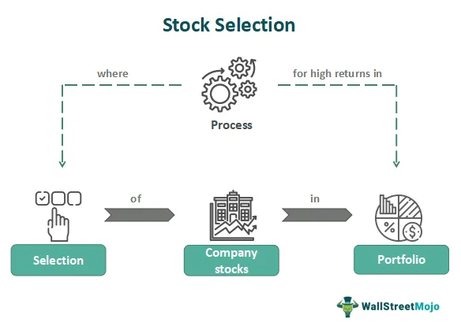

In today's fast-paced financial markets, investors are constantly seeking new strategies to maximize returns and mitigate risks. The complexities of stock market investing have prompted the emergence of stock picking and algorithmic trading as key strategies. These methods allow investors to navigate market intricacies by leveraging different analytical and technological approaches.

Stock picking involves selecting individual stocks based on various analytical techniques, aiming to achieve returns surpassing market benchmarks. Despite the prevalence of passive investing, stock picking remains a favored approach among those seeking higher gains through detailed analysis and insights. It caters to investors who believe they can identify undervalued stocks or potential growth opportunities that the market hasn't yet recognized.

In contrast, algorithmic trading, or algo trading, automates the investment decision-making process. By utilizing computer algorithms to execute trades based on predefined criteria, this strategy minimizes human intervention. Algorithmic trading offers the advantages of speed and precision, allowing for high-frequency trading and cost efficiency. It has revolutionized how stocks are traded by integrating advanced technology with financial decision-making.

This article provides a comprehensive overview of these prominent investment strategies, exploring their potential benefits and drawbacks. The analysis will highlight how these strategies function in both efficient and actual market conditions to optimize investment outcomes. By understanding the intricacies of stock picking and algorithmic trading, investors can make more informed decisions, aligning their strategies with their financial goals and risk appetites. This knowledge is crucial for anyone involved in financial market ventures seeking to enhance their portfolios and achieve superior investment results.

## Table of Contents

## Stock Picking in Financial Markets

Stock picking involves selecting individual stocks to invest in based on various analytical techniques. This investment strategy seeks to outperform market benchmarks by identifying stocks that are undervalued or possess the potential for significant growth. Despite the rise of passive investing, where funds attempt to mirror market performance, stock picking remains a popular method for investors seeking higher returns.

The Efficient Market Hypothesis (EMH) is a fundamental concept in finance that impacts stock picking strategies. EMH posits that stock prices fully reflect all available information, implying that consistently outperforming the market through stock picking is unlikely except through riskier investments. EMH presents three levels of market efficiency: weak, semi-strong, and strong. Each level suggests the degree to which information is reflected in stock prices, making it challenging for stock pickers to gain an edge.

Key strategies in stock [picking](/wiki/asset-class-picking) often revolve around fundamental and technical analysis. Fundamental analysis involves evaluating a company's financial health, management, industry position, and economic factors to estimate its intrinsic value. Metrics such as price-to-earnings ratios, return on equity, and earnings per share are crucial in this analysis. The advantage of [fundamental analysis](/wiki/fundamental-analysis) lies in its comprehensive assessment of a company's potential value, but it can be time-intensive and may lead to subjective interpretations.

Technical analysis, on the other hand, focuses on historical price patterns and trading volumes to forecast future stock price movements. Tools like moving averages, relative strength index (RSI), and Bollinger Bands help predict market trends. Technical analysis offers the advantage of quick insights into market sentiment, but it can be critiqued for neglecting underlying business fundamentals.

Real-world examples highlight the complexities of stock picking. Investors like Warren Buffett, known for their successful stock picking through fundamental analysis, illustrate how in-depth company knowledge can lead to substantial returns. Conversely, the collapse of the tech bubble in the early 2000s shows how reliance on speculative stock picks can result in significant losses. Instances like these underscore the inherent uncertainties in stock picking, where even seasoned investors can face challenges due to market [volatility](/wiki/volatility-trading-strategies) or unforeseen economic changes.

In conclusion, while stock picking in financial markets offers opportunities for substantial gains, it requires skillful analysis and a keen understanding of market dynamics. The interplay between the efficient market hypothesis and the diversity of analytical strategies suggests that while stock picking can be rewarding, it is not without risks. Investors must weigh these factors when integrating stock picking into their broader investment strategies.

## Algorithmic Trading: Automating Investment Decisions

Algorithmic trading, commonly referred to as algo trading, has revolutionized the mechanisms of executing trades in financial markets. Utilizing sophisticated computer algorithms designed to make automatic trading decisions, algo trading minimizes the need for human intervention, thereby enhancing operational efficiency. The advent of [algorithmic trading](/wiki/algorithmic-trading) has significantly altered the dynamics of stock trading, enabling high-speed execution and reducing transactional costs.

### Strategies in Algorithmic Trading

Several notable strategies drive algorithmic trading, each employing distinct methodologies to capitalize on market opportunities. 

**High-Frequency Trading (HFT):** This strategy involves the execution of a large number of orders at extremely high speeds, often within microseconds. HFT relies on algorithms to rapidly interpret market data and execute trades in fractions of a second. The advantage of HFT lies in its ability to exploit minute price discrepancies, but it often requires substantial technological infrastructure and can be sensitive to latency issues.

**Trend Following:** Another popular algorithmic strategy is trend following, which aims to capitalize on ongoing market trends. By programming algorithms to identify and follow upward or downward trends, traders can potentially maximize profits while minimizing the risk of abrupt market reversals. Trend following strategies are typically reliant on technical analysis indicators like moving averages and momentum indicators.

**Arbitrage Opportunities:** Algorithms are also employed to exploit price differentials for identical or similar assets across different markets or platforms, known as arbitrage. An arbitrage strategy might involve simultaneously buying and selling an asset in different markets to take advantage of differing price points. Algorithmic efficiency is crucial here as these opportunities can be fleetingly short-lived.

### Pros and Cons of Algorithmic Trading

Algorithmic trading offers several advantages, such as enhanced efficiency and reduced potential for human error. By automating the decision-making process, algorithmic strategies can quickly analyze vast datasets, identify profitable opportunities, and execute orders at high speeds. This automation also mitigates the influence of human emotions, which can often lead to bias in trading decisions.

However, over-reliance on data models poses risks, particularly if the models are improperly designed or if they fail to account for unprecedented market conditions. Another disadvantage is the potential for exacerbating market volatility, as seen in events like the "Flash Crash" of 2010, where rapid trading algorithms contributed to significant market fluctuations.

### Real-World Applications

Algorithmic trading is utilized by both individual investors and large financial institutions to optimize their trading strategies. For example, firms may use algorithms to manage large portfolios by continuously rebalancing them to align with target allocations. On a smaller scale, individual investors might employ robo-advisors, which use algorithmic trading to make and manage investments based on the user's risk tolerance and investment goals.

In conclusion, algorithmic trading represents a significant advancement in the intersection of technology and finance. By harnessing the power of algorithms, traders can efficiently navigate the complexities of financial markets, though they must remain aware of the inherent risks associated with this approach.

## Comparing Stock Picking and Algorithmic Trading

Stock picking and algorithmic trading represent two contrasting methodologies for engaging with financial markets, each bringing distinct advantages and challenges to investors. Understanding these differences is crucial for determining which strategy aligns best with an investor’s objectives, expertise, and risk profile.

Stock picking relies heavily on human judgment and analytical skills. Investors who choose this approach often conduct thorough fundamental analysis, examining a company’s financial statements, management team, market position, and other qualitative factors. They may also use technical analysis, studying historical price movements and chart patterns to forecast future price directions. The benefit of stock picking lies in its potential for significant returns, especially when identifying undervalued stocks before the broader market does. However, this approach requires extensive knowledge and experience, and the success rate can be inconsistent due to market volatility and unforeseen events.

Algorithmic trading, on the other hand, is predominantly data-driven, utilizing computer algorithms to execute trades at speeds and frequencies that far surpass human capabilities. This strategy minimizes the emotional and psychological biases which can affect individual stock pickers. Algorithms can be programmed to follow multiple strategies, such as high-frequency trading, [trend following](/wiki/trend-following), or [arbitrage](/wiki/arbitrage), providing a systematic approach to trading. While the potential for reduced transaction costs and increased efficiency is significant, there is a risk of over-reliance on data models that may not always predict future market movements accurately.

When comparing these strategies, it becomes evident that each is suited to different investor profiles. Stock picking may be more appropriate for investors who prefer a hands-on approach and possess strong analytical skills and market insights. Conversely, algorithmic trading may appeal to those who favor a more systematic, less subjective method of investment, especially if they have access to sophisticated technological resources and data.

In practice, the integration of both approaches can yield benefits. A diverse investment portfolio might include a blend of human-centric stock picking insights and algorithmically-driven trading strategies. This combination allows investors to harness the strengths of both methodologies, potentially optimizing decision-making processes and enhancing portfolio performance.

Ultimately, the choice between stock picking and algorithmic trading should reflect an investor’s individual goals, expertise level, risk tolerance, and resources. By understanding these strategies' unique characteristics and potential synergies, investors can better position themselves to capitalize on market opportunities and achieve their financial objectives.

## The Role of AI in Modern Investment Strategies

Artificial Intelligence (AI) has fundamentally reshaped modern investment strategies, proving particularly transformative in areas like stock picking and algorithmic trading. AI-powered tools and robo-advisors have provided both retail and institutional investors with advanced analytical capabilities, enabling more informed decision-making. These technologies utilize [machine learning](/wiki/machine-learning) algorithms to process and analyze large datasets, reveal patterns, and predict market trends with unprecedented accuracy.

In stock picking, AI enhances the analytical process by automating fundamental and technical analyses, examining financial statements, historical price data, and market trends to identify optimal investment opportunities. AI tools can perform sentiment analysis by scanning news articles, financial reports, and social media to gauge market sentiment and predict stock movements. This capability allows investors to respond swiftly, often before traditional analysis methods could identify such opportunities.

Algorithmic trading has been particularly revolutionized by AI. Predictive analytics powered by AI can recognize complex trading patterns and trends, making real-time trading decisions that would be challenging for human traders due to the sheer [volume](/wiki/volume-trading-strategy) and complexity of the data. For example, AI algorithms can be programmed to execute trades based on predefined conditions, such as price movements or economic indicators, optimizing trading strategies and minimizing human errors.

However, integrating AI into investment strategies is not without challenges. Data privacy concerns are paramount as these systems require access to vast amounts of sensitive financial data. Ensuring compliance with data protection regulations is essential to maintain trust and legal assurance. Additionally, there is a significant risk of overfitting in AI models. Overfitting occurs when a model is too complex and captures noise instead of the underlying pattern, resulting in inaccurate predictions. This risk necessitates careful model validation and testing to ensure robustness and reliability.

Real-world applications of AI in investment strategies demonstrate its potential to enhance outcomes. For example, AI has been employed by financial institutions to optimize bond trading, manage diverse portfolios, and even automate customer service through chatbots. Companies like BlackRock and Vanguard have integrated AI into their investment processes to offer personalized investment solutions based on individual risk profiles and market conditions.

In conclusion, AI continues to be a catalyst for innovation in investment strategies, offering tools for more precise and data-driven decision-making. As AI technology evolves, its integration with traditional investment methods is likely to increase, offering even greater synergy between human insight and machine efficiency. Nonetheless, investors must remain vigilant regarding the complexities and ethical considerations that accompany AI adoption in the finance sector.

## The Bottom Line

Investment strategies such as stock picking and algorithmic trading have experienced significant evolution through technological advancements and shifts in market dynamics. Each approach presents distinct advantages; understanding and potentially integrating these strategies can optimize investment outcomes. Stock picking relies on human insights and detailed analysis to identify undervalued stocks, aiming for returns that outpace market benchmarks. On the other hand, algorithmic trading employs computer algorithms to automate the trading process, offering efficiencies such as high-speed execution and reduced transactional costs.

For investors aiming to enhance portfolio performance, it's crucial to consider the trade-offs between manual, human-driven strategies and automated, technology-driven processes. This decision should reflect an investor's risk tolerance and the prevailing market conditions. Manual strategies, such as stock picking, may provide a nuanced understanding of specific stocks, but can be time-consuming and subject to human error. Conversely, algorithmic approaches can process vast amounts of data quickly and without emotional bias, though they can be susceptible to over-reliance on data models and systemic risks inherent in automated systems.

Continued learning and adaptation are vital as financial landscapes rapidly change. Investors must stay informed about emerging technologies, regulatory changes, and market trends to sustain long-term financial goals. Adapting investment strategies to incorporate both human expertise and technological innovation could provide a balanced approach, leveraging the strengths of each method to mitigate their individual weaknesses.

The future of investing is likely to witness increased synergy between human judgment and technological innovations. This confluence may redefine traditional investing paradigms, offering new opportunities for tailored investment strategies that capitalize on the best of both worlds. Embracing these changes can empower investors to navigate the complexities of modern markets more effectively, ensuring a resilient and dynamic approach to portfolio management.

## References & Further Reading

[1]: Malkiel, B.G. (2003). ["The Efficient Market Hypothesis and Its Critics."](https://www.princeton.edu/~ceps/workingpapers/91malkiel.pdf) Journal of Economic Perspectives, 17(1), 59-82.

[2]: Buffa, A., Vayanos, D., & Woolley, P. (2014). ["Asset Management Contracts and Equilibrium Prices."](https://personal.lse.ac.uk/vayanos/Papers/AMCEP_JPE22.pdf) Econometrica, 82(4), 1143-1178.

[3]: Chandra, A. S., & Thenmozhi, M. (2015). ["Do Technical Indicators Outperform Buy-and-Hold Strategy?"](https://www.sciencedirect.com/science/article/abs/pii/S0275531916304731) International Journal of Economics and Finance, 7(3).

[4]: De Prado, M. L. (2018). ["Advances in Financial Machine Learning."](https://www.amazon.com/Advances-Financial-Machine-Learning-Marcos/dp/1119482089) Wiley Finance.

[5]: Chan, E. (2017). ["Quantitative Trading: How to Build Your Own Algorithmic Trading Business."](https://github.com/ftvision/quant_trading_echan_book) Wiley Trading.

[6]: Shleifer, A., & Vishny, R.W. (1997). ["The Limits of Arbitrage."](https://onlinelibrary.wiley.com/doi/full/10.1111/j.1540-6261.1997.tb03807.x) The Journal of Finance, 52(1), 35-55.

[7]: Kissell, R. (2013). ["The Science of Algorithmic Trading and Portfolio Management."](https://www.sciencedirect.com/book/9780124016897/the-science-of-algorithmic-trading-and-portfolio-management) Academic Press.

[8]: Aronson, D. R. (2007). ["Evidence-Based Technical Analysis: Applying the Scientific Method and Statistical Inference to Trading Signals."](https://onlinelibrary.wiley.com/doi/book/10.1002/9781118268315) Wiley Finance.

[9]: Aldridge, I. (2013). ["High-Frequency Trading: A Practical Guide to Algorithmic Strategies and Trading Systems."](https://www.ahmetbeyefendi.com/wp-content/uploads/2020/07/High-Frequency-Trading-Irene-Aldridge.pdf) Wiley Trading.