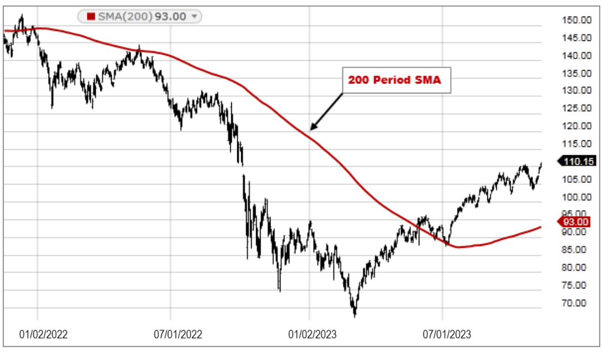

Technical indicators play an essential role in financial analysis and algorithmic trading, equipping investors with the tools required to make informed decisions. Among these, moving averages are especially significant as they help to smooth price data and identify trends, providing clarity amid market fluctuations. Moving averages are particularly valuable because they enable traders to focus on price trends by filtering out short-term price fluctuations, thus offering a clearer perspective of the market's direction. Within this category, simple moving averages (SMA) are widely utilized due to their straightforward calculation and effectiveness in trend analysis.

Moving averages such as SMAs are designed to calculate the average price of a security over a specific time frame, helping traders to discern patterns in price movements. This is achieved by taking the sum of all closing prices over a chosen period and dividing it by the number of observations, as seen in the formula:



$$
\text{SMA} = \frac{P_1 + P_2 + \cdots + P_n}{n}
$$

where $P$ represents the price at each time period and $n$ is the number of periods.

The simplicity of the calculation makes SMAs a preferred choice for many traders, especially those focused on long-term market trends. By examining SMAs, investors can gain insights into both minor and major trend changes, adjust their strategies accordingly, and optimize their trading algorithms. This article will explore the critical role simple moving averages play in financial analysis and how they can be effectively deployed in algorithmic trading to enhance decision-making and strategy formulation.

## Table of Contents

## Understanding Moving Averages

Moving averages, particularly simple moving averages (SMA), play a crucial role in financial analysis by smoothing out fluctuating price data to reveal underlying trends. A simple moving average is calculated by determining the arithmetic mean of a security’s price over a specified number of periods. This method allows traders and analysts to filter out short-term price fluctuations and focus on longer-term trends.

To illustrate, the calculation of an SMA for a given time period is expressed mathematically as follows:

$$
\text{SMA} = \frac{P_1 + P_2 + \ldots + P_n}{n}
$$

Here, $P_1, P_2, \ldots, P_n$ represent the prices of the security for each period, and $n$ is the total number of periods considered. This averaging process yields a rolling mean, which moves along the time axis as new data becomes available, thus the term "moving average."

In practical applications, moving averages are implemented not only to visualize and confirm trends but also to assist in identifying support and resistance levels. Their smoothing characteristic makes them effective at minimizing the noise present in day-to-day price fluctuations, which can often obscure the actual trend direction. By providing a clearer picture of the market trend, SMAs enhance the decision-making process for traders looking to enter or [exit](/wiki/exit-strategy) positions.

The efficacy of moving averages is underpinned by their simplicity and adaptability across various financial instruments and market conditions, making them a staple in technical analysis. They form the foundation on which more complex trading strategies are built, often serving as a benchmark for comparing price movements.

Overall, the use of simple moving averages is essential in financial analysis because it aids traders in making informed decisions by highlighting significant trends in the midst of market [volatility](/wiki/volatility-trading-strategies).

## Types of Moving Averages

Moving averages are critical components in financial analysis, with various forms such as Simple Moving Averages (SMA), Exponential Moving Averages (EMA), and Weighted Moving Averages (WMA) offering diverse analytical strengths.

**Simple Moving Averages (SMA)** are the most straightforward form, calculated by taking the arithmetic mean of a given set of prices over a specified number of periods. For example, a 10-day SMA is the average of the closing prices of a financial instrument over the last 10 days. The primary advantage of SMAs lies in their ability to smooth out price data, making it easier to identify long-term trends. However, SMAs may lag in response to price changes because they weigh each data point equally, which can be a disadvantage in volatile markets.

**Exponential Moving Averages (EMA)** address the lag issue by assigning more weight to recent prices. The formula for EMA is more complex, as each data point contributes exponentially less to the final average as time progresses. EMAs react faster to price changes, which makes them more suitable for short-term trading strategies where traders require timely signals. The formula for calculating EMA recursively uses today's price and yesterday's EMA, often seen as:

$$
\text{EMA}_\text{today} = \left( \frac{2}{n+1} \right) \times (\text{Price}_\text{today} - \text{EMA}_\text{yesterday}) + \text{EMA}_\text{yesterday}
$$

where $n$ is the number of periods considered.

**Weighted Moving Averages (WMA)** further refine the approach by assigning linear weights to the data points, with more recent prices receiving higher weights. The WMA provides a balance between the lag of an SMA and the responsiveness of an EMA, but the calculation is more cumbersome, which can be challenging without automated systems. The formula for WMA is:

$$
\text{WMA} = \frac{\sum_{i=1}^{n} (i \times \text{Price}_i)}{\sum_{i=1}^{n} i}
$$

where $n$ represents the number of periods and $i$ is the weight assigned to each price.

SMAs are particularly beneficial for analyzing long-term trends because they eliminate short-term fluctuations and provide a clearer picture of the overall direction. In contrast, EMAs and WMAs cater to short- to medium-term trading strategies by providing more immediate sensitivity to recent price movements.

Selecting the appropriate type of moving average is crucial for aligning with specific trading strategies. For instance, long-term investors may favor SMAs for their stability in trend analysis. In contrast, day traders might prefer EMAs or WMAs to capitalize on short-term price movements. Understanding the differences among these moving averages allows traders to effectively implement strategies tailored to their market perspectives.

## Moving Averages in Trend Analysis

Simple moving averages (SMAs) are crucial for identifying and analyzing financial trends, as they help in smoothing out erratic price movements—an action known as reducing market noise. By prioritizing significant price actions over random fluctuations, SMAs offer clearer visibility of market trajectories.

Traders frequently employ SMAs to identify trend reversals, utilizing crossover strategies to generate definitive buy or sell signals. For instance, when a shorter-term SMA crosses above a longer-term SMA, it often signals a potential upward trend and presents a buying opportunity. Conversely, when a shorter-term SMA crosses below a longer-term SMA, it indicates a potential downward trend, signaling a selling opportunity.

By calculating the average price of a security over a set number of periods, SMAs create a smoothed curve that traders use to discern trend directions. This smoothing process can be mathematically expressed as:

$$
\text{SMA}_{n} = \frac{P_1 + P_2 + \cdots + P_n}{n}
$$

where $P_1, P_2, \ldots, P_n$ are the prices of the security over $n$ periods.

In addition to identifying trend reversals, SMAs play a crucial role in defining support and resistance levels. When a security's price continually bounces off an SMA line, it signifies a support level. Conversely, when the price consistently fails to break above the SMA, it represents a resistance level. Utilizing SMAs in this manner assists traders in making strategic decisions about market entry and exit points.

## Using Moving Averages in Algorithmic Trading

Algorithmic trading employs moving averages as pivotal components to automate trading actions by aligning with market trends identified via simple moving averages (SMAs). The foundational principle rests on the ability of moving averages to smoothen price data, thereby facilitating the detection of trends and subsequent decision-making processes without emotional bias.

### Moving Average Crossover Strategies

One of the backbone strategies in [algorithmic trading](/wiki/algorithmic-trading) using SMAs is the moving average crossover strategy. This tactic primarily involves two types of SMAs: a short-term SMA and a long-term SMA. The short-term SMA responds quickly to price changes and reflects recent price movements, while the long-term SMA tends to be smoother and represents a more extended period.

A popular example is the 50-day SMA and the 200-day SMA. When the short-term SMA crosses above the long-term SMA, it generates a buy signal, indicating that the price trend is likely upward. Conversely, when the short-term SMA crosses below the long-term SMA, it creates a sell signal, suggesting that the price trend may be moving downward.

#### Python Implementation:

Here's a simple Python snippet to illustrate how moving average crossover strategies can be applied programmatically in trading algorithms:

```python
import pandas as pd

# Sample DataFrame with price data
# df = pd.DataFrame({'price': [your price data here]})

def calculate_sma(data, window):
    return data.rolling(window=window).mean()

# Short-term and long-term windows
short_window = 50
long_window = 200

# Calculate SMAs
df['short_sma'] = calculate_sma(df['price'], short_window)
df['long_sma'] = calculate_sma(df['price'], long_window)

# Generate buy/sell signals
df['signal'] = 0.0
df['signal'][short_window:] = np.where(
    df['short_sma'][short_window:] > df['long_sma'][short_window:], 1.0, -1.0
)

# Generate trading orders
df['positions'] = df['signal'].diff()
```

### Adaptability in Various Market Conditions

Simple Moving Averages are not static tools; their flexibility allows them to adapt to varying market conditions, making them ideal for diverse algorithmic trading strategies. During trending markets, SMAs can help confirm directionality and assist in riding trends, whereas, in sideways or consolidating markets, traders might use SMAs to identify potential [breakout](/wiki/breakout-trading) points.

The adaptability of SMAs is further seen in their integration with other trading indicators and systems. For instance, an SMA can be combined with [volume](/wiki/volume-trading-strategy) indicators to enhance the reliability of trading signals. Moreover, while the simple moving average strategy is straightforward, its successful application lies in adjusting the periods of the SMAs according to the volatility and the characteristics of the particular asset traded.

### Conclusion

Leveraging SMAs in algorithmic trading provides a robust framework for developing systematic trading strategies that can operate effectively across different market environments. Their ability to offer clear trend signals and automatic trade cues makes them indispensable in a trader’s algorithmic toolbox, facilitating the development of disciplined and unemotional trading models that can navigate the complexities of financial markets.

## Case Studies and Practical Applications

Real-world applications of simple moving averages (SMAs) highlight their strategic relevance in trading, particularly in identifying key market signals like the 'Golden Cross' and 'Death Cross'. These patterns are formed by the interaction of short and long-term SMAs and serve as robust indicators in technical analysis.

### Golden Cross and Death Cross

The 'Golden Cross' occurs when a short-term moving average (typically the 50-day SMA) crosses above a long-term moving average (typically the 200-day SMA). This crossover signifies the potential for a major uptrend, indicating a bullish market sentiment. Conversely, the 'Death Cross' materializes when the short-term moving average crosses below the long-term average, suggesting a downtrend and potentially bearish conditions.

These patterns provide traders with clear visual signals for strategic decision-making. For instance, a stock demonstrating a Golden Cross may prompt a trader to buy, anticipating a rising market. Conversely, a Death Cross might signal to sell or short the security due to expected declines.

### Practical Applications in Trading Strategy

Investors and algorithmic traders frequently incorporate SMAs to refine their trading decisions. Utilizing historical price data, traders can implement SMAs within algorithmic systems to automate buy or sell signals based on predefined crossover thresholds. This approach reduces emotional bias and facilitates disciplined trading.

#### Example Algorithm:
To illustrate, consider a basic Python script that identifies Golden and Death Cross patterns in a given dataset:

```python
import pandas as pd

# Load historical price data into a DataFrame
data = pd.read_csv('stock_data.csv')
data['200_SMA'] = data['Close'].rolling(window=200).mean()
data['50_SMA'] = data['Close'].rolling(window=50).mean()

# Identify Golden Cross and Death Cross
data['Signal'] = 0
data['Signal'][50:] = np.where(data['50_SMA'][50:] > data['200_SMA'][50:], 1, 0)

# Calculate positions
data['Position'] = data['Signal'].diff()

# Print Golden Cross dates
golden_crosses = data.loc[data['Position'] == 1.0]
print("Golden Cross dates:")
print(golden_crosses['Date'])

# Print Death Cross dates
death_crosses = data.loc[data['Position'] == -1.0]
print("Death Cross dates:")
print(death_crosses['Date'])
```

This code assesses historical stock prices to detect intersections of 50-day and 200-day SMAs, identifying periods indicative of Golden Cross and Death Cross formations.

### Case Study: Successful Applications

Numerous case studies underscore the effectiveness of SMAs. For example, during the 2008 financial crisis, some traders who effectively utilized the Death Cross as a sell signal were able to hedge against massive losses. Conversely, recognizing a Golden Cross in the aftermath allowed investors to re-enter the market as it recovered, capitalizing on new upward trends.

In conclusion, the practical application of SMAs like the Golden and Death Cross provides traders with essential insights for both long-term investing and short-term market strategies. Their integration into algorithmic systems further enhances their utility, offering a blend of technical precision and strategic foresight in navigating complex financial landscapes.

## Conclusion

Moving averages extend beyond basic technical tools; they are instrumental in providing crucial insights into financial trends, which are foundational for crafting effective trading strategies. The Simple Moving Average (SMA), in particular, stands out as a key component in this analytical process. By understanding and effectively implementing SMAs, traders are equipped with the ability to adeptly navigate the complexities of volatile markets and enhance trading algorithms' performance. This adaptability is particularly vital in algorithmic trading, where precision and timing are paramount.

SMAs contribute by flattening out price fluctuations, thereby facilitating the identification of trends and potential reversals. This capability not only helps in predicting future price movements but also allows traders to identify optimal entry and exit points, maximizing returns and minimizing risks. As traders integrate SMAs into algorithmic strategies, the focus is often on crossover methods like the 'Golden Cross' and 'Death Cross', which have been shown to signal bullish and bearish market conditions respectively.

The future trajectory of financial trading appears to be increasingly reliant on these trend analysis tools. As algorithmic innovations advance, the role of moving averages, particularly SMAs, is likely to evolve and expand. This evolution will further solidify their importance in defining robust and reliable trading frameworks. Consequently, traders who skillfully leverage these tools will be better positioned to exploit market opportunities and respond to shifts with agility and informed precision.

## References & Further Reading

[1]: ["Technical Analysis of the Financial Markets: A Comprehensive Guide to Trading Methods and Applications"](https://www.amazon.com/Technical-Analysis-Financial-Markets-Comprehensive/dp/0735200661) by John J. Murphy

[2]: ["Moving Averages 101: Incredible Signals That Will Make You Money in the Stock Market"](https://www.amazon.com/Moving-Averages-101-Incredible-Signals/dp/1515133966) by Steve Burns

[3]: Brock, W., Lakonishok, J., & LeBaron, B. (1992). ["Simple Technical Trading Rules and the Stochastic Properties of Stock Returns."](https://www.jstor.org/stable/2328994) Journal of Finance, 47(5), 1731-1764.

[4]: Neftci, S. N. (1991). ["Naive Trading Rules in Financial Markets and Wiener-Kolmogorov Prediction Theory: A Study of 'Technical Analysis'."](https://www.jstor.org/stable/pdf/2353293.pdf) Journal of Business, 64(4), 549-571.

[5]: ["Quantitative Technical Analysis: An integrated approach to Trading System Development and Trading Management"](https://www.amazon.com/Quantitative-Technical-Analysis-integrated-development/dp/0979183855) by Dr. Howard B. Bandy