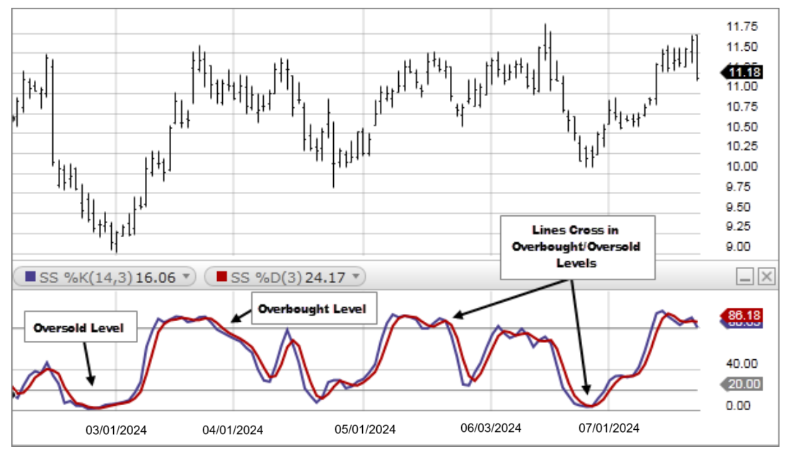

## Table of Contents

## What is the Slow Stochastic oscillator and how does it work?

The Slow Stochastic oscillator is a technical analysis tool used by traders to predict price movements in financial markets. It is designed to help identify potential trend reversals by comparing a security's closing price to its price range over a certain period. The oscillator generates values between 0 and 100, and it's based on the idea that in an uptrend, prices tend to close near the high of the period, while in a downtrend, prices tend to close near the low.

The Slow Stochastic oscillator works by using two lines: the %K line and the %D line. The %K line is calculated first and represents the current price's position within the recent trading range. The %D line is a moving average of the %K line, which helps smooth out the %K line's fluctuations and provides a clearer signal. Traders look for crossovers between these lines, as well as overbought and oversold conditions, to make trading decisions. When the %K line crosses above the %D line, it might signal a buying opportunity, while a crossover below might suggest selling. Additionally, readings above 80 are often considered overbought, and readings below 20 are considered oversold, indicating potential trend reversals.

## How does the Slow Stochastic differ from the Fast Stochastic?

The Slow Stochastic and Fast Stochastic are both used to predict price movements, but they differ in how they process and present the data. The Fast Stochastic is the original version and it reacts quickly to price changes. It uses the %K line, which is calculated directly from the price data, and the %D line, which is a simple moving average of the %K line. Because it reacts so quickly, the Fast Stochastic can be very sensitive and might give more false signals.

The Slow Stochastic, on the other hand, is a modification of the Fast Stochastic that aims to reduce this sensitivity. It does this by taking the %D line from the Fast Stochastic and using it as the new %K line. Then, it calculates a new %D line as a moving average of this new %K line. This extra step makes the Slow Stochastic smoother and less likely to give false signals, which can be helpful for traders who want more reliable indicators. In simple terms, the Slow Stochastic is less jumpy and might help traders make better decisions.

## What are the key components of the Slow Stochastic indicator?

The Slow Stochastic indicator has two main parts: the %K line and the %D line. The %K line shows where the current price is compared to the highest and lowest prices over a certain time. It's like a percentage that tells you if the price is near the top, middle, or bottom of the recent range. The %D line is a smoother version of the %K line. It's made by taking an average of the %K line over a few periods, which helps to make the indicator less jumpy and easier to read.

Traders use these two lines to make decisions. When the %K line crosses above the %D line, it might be a good time to buy. When the %K line crosses below the %D line, it could be a signal to sell. Also, if the %K or %D line goes above 80, it means the price might be too high and could go down soon. If it goes below 20, it means the price might be too low and could go up. By watching these lines and numbers, traders try to guess where the price will go next.

## How can beginners use the Slow Stochastic for day trading?

Beginners can use the Slow Stochastic for day trading by watching the %K and %D lines on their charts. When the %K line crosses above the %D line, it's a signal that might be a good time to buy. On the other hand, if the %K line crosses below the %D line, it could be a sign to sell. These crossovers help beginners decide when to enter or exit trades. It's important to practice using these signals on a demo account first to get comfortable with how the indicator works.

Another thing beginners should look at is the levels of the Slow Stochastic. If the %K or %D line goes above 80, it means the price might be too high and could drop soon. This is called an overbought condition. If the line goes below 20, it suggests the price might be too low and could rise, which is an oversold condition. By watching these levels, beginners can get an idea of when a price might change direction. Combining these signals with other simple tools, like moving averages, can help make better trading decisions.

## What are the best settings for the Slow Stochastic for day trading?

For day trading, the best settings for the Slow Stochastic often depend on the market you're trading and how fast you want the indicator to react. A common setting for day trading is to use a period of 14 for the %K line and a period of 3 for the %D line. This means the %K line looks at the last 14 periods, and the %D line is a 3-period moving average of the %K line. These settings give a good balance between reacting quickly to price changes and not being too jumpy.

Some traders might want to adjust these settings to make the Slow Stochastic work better for their specific trading style. If you want the indicator to react faster, you can use a shorter period for the %K line, like 5 or 10. But remember, shorter periods can make the indicator more sensitive and might give more false signals. If you want it to be smoother and less likely to give false signals, you can use a longer period for the %K line, like 20 or 25. It's a good idea to try different settings on a demo account to see what works best for you.

## How do you interpret Slow Stochastic signals for buying and selling?

When using the Slow Stochastic for trading, you mainly look at the %K and %D lines to decide when to buy or sell. If the %K line crosses above the %D line, it's a signal that the price might go up soon. This is a good time to think about buying. On the other hand, if the %K line crosses below the %D line, it's a signal that the price might go down. This could be a good time to sell or at least not buy more.

Another important thing to watch is the levels of the Slow Stochastic. If the %K or %D line goes above 80, it means the price might be too high and could drop soon. We call this being overbought. When you see this, it's a sign to be careful and maybe sell. If the %K or %D line goes below 20, it means the price might be too low and could rise. This is called being oversold, and it might be a good time to buy. By paying attention to these lines and levels, you can make better choices about when to trade.

## Can the Slow Stochastic be used effectively in different market conditions?

The Slow Stochastic can work well in different market conditions, like when the market is going up, going down, or staying the same. When the market is moving a lot, the Slow Stochastic can help you spot when the price might change direction. For example, if the market is going up and the Slow Stochastic shows it's overbought, it might mean the price will start to go down soon. In a market that's not moving much, the Slow Stochastic can still be useful by showing small changes that might be hard to see just by looking at the price.

In markets that are moving fast and changing a lot, the Slow Stochastic might give you more false signals because it's trying to keep up with the quick changes. You might need to adjust the settings to make it react faster or slower, depending on what's happening in the market. But even in these tricky conditions, the Slow Stochastic can help you see when the market might be getting ready to switch from going up to going down, or the other way around. By watching the %K and %D lines and the overbought and oversold levels, you can make better guesses about what the market might do next.

## What are common mistakes traders make when using the Slow Stochastic?

One common mistake traders make when using the Slow Stochastic is relying on it too much without looking at other things. The Slow Stochastic is just one tool, and it can give wrong signals sometimes. Traders might see the %K line cross above the %D line and think it's a sure sign to buy, but if they don't check other indicators or what's happening in the market, they might make a bad trade. It's important to use the Slow Stochastic along with other tools and to understand the bigger picture of what's going on in the market.

Another mistake is not adjusting the settings of the Slow Stochastic to fit the market they're trading in. Different markets move at different speeds, and what works in one market might not work in another. If a trader uses the same settings all the time, they might miss out on good signals or get too many false ones. It's a good idea to try different settings and see what works best for the market you're trading in. By being flexible and willing to change the settings, traders can use the Slow Stochastic more effectively.

## How can the Slow Stochastic be combined with other indicators for better results?

Combining the Slow Stochastic with other indicators can help traders make better decisions. One common way to do this is to use the Slow Stochastic with moving averages. For example, if the Slow Stochastic shows a buy signal and the price is above a certain moving average, it can make the signal stronger. This way, traders can feel more confident that the price might go up. Another useful indicator to use with the Slow Stochastic is the Relative Strength Index (RSI). If both the Slow Stochastic and RSI show that the market is overbought or oversold, it can give a clearer sign that the price might change direction soon.

Another approach is to combine the Slow Stochastic with trend indicators like the Moving Average Convergence Divergence (MACD). When the Slow Stochastic gives a buy or sell signal, traders can check if the MACD is also showing a similar trend. This can help confirm the direction the price might go. By using the Slow Stochastic with other tools, traders can get a more complete picture of what's happening in the market and make better trading choices.

## What advanced strategies can expert traders implement using the Slow Stochastic?

Expert traders can use the Slow Stochastic in more advanced ways by combining it with other indicators to create stronger trading signals. One strategy is to use the Slow Stochastic with the Average Directional Index (ADX) to confirm the strength of a trend. If the Slow Stochastic shows a buy signal and the ADX indicates a strong uptrend, it can give traders more confidence to enter a trade. Another advanced strategy is to use the Slow Stochastic with Bollinger Bands. When the Slow Stochastic shows an overbought condition and the price is touching the upper Bollinger Band, it might be a good time to sell. On the other hand, if the Slow Stochastic shows an oversold condition and the price is near the lower Bollinger Band, it could be a good time to buy. By using these combinations, expert traders can make more informed decisions.

Another advanced strategy is to use the Slow Stochastic for divergence trading. Divergence happens when the price moves in one direction, but the Slow Stochastic moves in the opposite direction. For example, if the price is making higher highs but the Slow Stochastic is making lower highs, it might be a sign that the price will soon go down. This can be a powerful signal for expert traders to sell. They can also look for the opposite situation where the price makes lower lows but the Slow Stochastic makes higher lows, which might be a good time to buy. By watching for these divergences, expert traders can spot potential trend reversals before they happen and take advantage of them.

## How does the Slow Stochastic perform in backtesting for day trading?

When expert traders use the Slow Stochastic for backtesting in day trading, they look at how well it would have worked in the past. Backtesting means running the Slow Stochastic on old price data to see if it would have given good signals to buy or sell. The Slow Stochastic can be pretty useful in backtesting because it helps find overbought and oversold conditions. If the Slow Stochastic shows a buy signal when the market is oversold and then the price goes up, that's a good sign. But, it's important to remember that past results don't always mean the same thing will happen in the future. The Slow Stochastic can give false signals sometimes, so traders need to be careful and not rely on it too much.

In backtesting, expert traders often mix the Slow Stochastic with other tools to make their trading strategy better. They might use it with moving averages or the RSI to see if the signals are stronger when both indicators agree. For example, if the Slow Stochastic shows a buy signal and the price is above a moving average, it can make the signal more reliable. Backtesting with these combinations can show if the Slow Stochastic works well in different market conditions. It can also help traders figure out the best settings for the Slow Stochastic to use in day trading. By testing and tweaking their strategies, traders can get a better idea of how to use the Slow Stochastic to make money in the markets.

## What are the limitations and potential pitfalls of using the Slow Stochastic in day trading?

One big problem with using the Slow Stochastic for day trading is that it can give false signals. This means it might tell you to buy or sell when it's not the best time. The Slow Stochastic can be too jumpy sometimes, especially in markets that move fast. If you only use the Slow Stochastic, you might end up making trades that lose money because the signals aren't always right. That's why it's important to use other tools along with the Slow Stochastic to check if its signals are good.

Another thing to watch out for is that the Slow Stochastic might not work the same in all market conditions. Sometimes, the market can stay overbought or oversold for a long time, and the Slow Stochastic might keep telling you to sell or buy when the price isn't going to change direction yet. Also, if you don't change the settings of the Slow Stochastic to fit the market you're trading in, you might miss good signals or get too many bad ones. It's a good idea to try different settings and use the Slow Stochastic with other indicators to make better trading choices.

## What is the Understanding of the Slow Stochastic Indicator?

The stochastic oscillator is a momentum-based technical indicator used primarily to identify overbought and oversold levels within a given asset's price movements. Created by George Lane in the late 1950s, this oscillator operates on the principle that closing prices tend to close near the high of the trading range during an uptrend and near the low during a downtrend. The stochastic oscillator typically ranges from 0 to 100, where readings above 80 indicate overbought conditions, while readings below 20 suggest oversold conditions.

There are two variations of the stochastic oscillator: fast and slow. The fast stochastic is known for its sensitivity to price movements and tends to generate more signals, which can result in false positives due to its quick fluctuations. The slow stochastic, on the other hand, reduces this sensitivity by smoothing the %K line with a moving average, resulting in less volatile and more reliable signals.

The slow stochastic indicator is calculated using the following steps:

1. Calculate the Fast %K:
$$
   \text{Fast } \%K = \frac{\text{Current Close} - \text{Lowest Low}}{\text{Highest High} - \text{Lowest Low}} \times 100

$$
   where the lowest low and highest high are calculated over a specified look-back period, typically 14 periods.

2. Determine the Slow %K by smoothing the Fast %K using a three-period simple moving average (SMA).

3. Calculate the Slow %D, which is the three-period SMA of the Slow %K.

The resulting slow stochastic consists of two lines: the %K line (slow %K) and the %D line (slow %D). The %K line is the main line, while the %D line serves as a signal line. Crossovers between these two lines are critical indicators of potential buy or sell signals — when %K crosses above %D, it may signal a buying opportunity, and conversely, when %K crosses below %D, it may suggest a selling opportunity.

The slow stochastic indicator effectively helps traders identify potential overbought and oversold conditions by observing the aforementioned crossover signals in conjunction with its positioning within the range. If the %K and %D lines are above the 80 threshold, the market is potentially overbought and ripe for a pullback or reversal. On the other hand, lines below 20 indicate a potentially oversold market, suggesting a possible upward price correction or reversal. This capability allows traders to make more informed decisions about entering or exiting trades based on perceived market conditions.

## What is Algorithmic Trading and how does it relate to Slow Stochastic?

Algorithmic trading involves the use of computer programs to execute trades based on predefined criteria, effectively eliminating human emotion from the decision-making process. This advanced form of trading offers numerous benefits, including increased speed and accuracy in executing trades, the ability to manage large volumes of data, and the facility for [backtesting](/wiki/backtesting) strategies, which helps traders optimize their decisions based on historical data trends.

The slow stochastic indicator can be effectively integrated into [algorithmic trading](/wiki/algorithmic-trading) strategies to identify market trends and potential entry and exit points. This integration involves utilizing the slow stochastic's %K and %D lines: %K being the main line and %D the signal line, which is a moving average of %K. These components help in detecting overbought or oversold conditions in a security, making them valuable for formulating algorithmic rules.

### Designing a Trading Algorithm with Slow Stochastic

1. **Data Collection**: The first step involves gathering historical price data for the security of interest. This data forms the basis of the algorithm's decision-making process.

2. **Indicator Calculation**: Compute the slow stochastic values. The %K value is determined over a set period as follows:
$$
   \%K = \frac{\text{Current Close} - \text{Lowest Low}}{\text{Highest High} - \text{Lowest Low}} \times 100

$$

   The %D line is then calculated as the simple moving average of %K over a specified period.

3. **Signal Generation**: Develop rules for buying and selling based on the stochastic values. Common strategies include buying when the %K line crosses above the %D line in the oversold region (typically below 20) and selling when the %K crosses below the %D in the overbought region (above 80).

4. **Backtesting**: Conduct backtesting to validate and refine the algorithm. Backtesting involves running the algorithm through historical data to evaluate its performance, ensuring that the strategy could have yielded profitable results in the past.

5. **Optimization and Deployment**: Adjust the strategy parameters based on backtesting results to optimize performance. Once refined, the algorithm can be deployed in a live trading environment with appropriate risk management protocols.

### Algorithmic Setup Example

A simple Python implementation for a slow stochastic algorithm might look like this:

```python
import pandas as pd
import numpy as np

def calculate_slow_stochastic(close_prices, period=14):
    lowest_low = close_prices.rolling(window=period).min()
    highest_high = close_prices.rolling(window=period).max()
    k_values = 100 * ((close_prices - lowest_low) / (highest_high - lowest_low))
    d_values = k_values.rolling(window=3).mean()
    return k_values, d_values

def generate_signals(k_values, d_values):
    buy_signals = (k_values < 20) & (k_values.shift(1) > d_values.shift(1)) & (k_values > d_values)
    sell_signals = (k_values > 80) & (k_values.shift(1) < d_values.shift(1)) & (k_values < d_values)
    return buy_signals, sell_signals

# Example usage
data = pd.read_csv('historical_prices.csv')  # Load your historical data
close_prices = data['Close']
k_values, d_values = calculate_slow_stochastic(close_prices)
buy_signals, sell_signals = generate_signals(k_values, d_values)

# Use resulting signals for trade execution
```

This approach highlights how slow stochastic can be incorporated into algorithmic trading, providing a systematic method of entering and exiting trades based on historical price movements. By leveraging the inherent strengths of algorithmic systems, traders can improve their trading efficiency and effectiveness while minimizing emotional bias.

## References & Further Reading

[1]: "Technical Analysis of the Financial Markets: A Comprehensive Guide to Trading Methods and Applications" by John J. Murphy

[2]: "Algorithmic Trading: Winning Strategies and Their Rationale" by Ernest P. Chan

[3]: "Technical Analysis Explained, Fifth Edition: The Successful Investor's Guide to Spotting Investment Trends and Turning Points" by Martin J. Pring

[4]: "Stochastic Calculus for Finance I: The Binomial Asset Pricing Model" by Steven E. Shreve

[5]: ["Slow Stochastics: A Momentum Indicator"](https://www.fidelity.com/learning-center/trading-investing/technical-analysis/technical-indicator-guide/slow-stochastic) on Investopedia

[6]: "Trading Systems and Methods" by Perry J. Kaufman

[7]: "Beyond Technical Analysis: How to Develop and Implement a Winning Trading System" by Tushar S. Chande