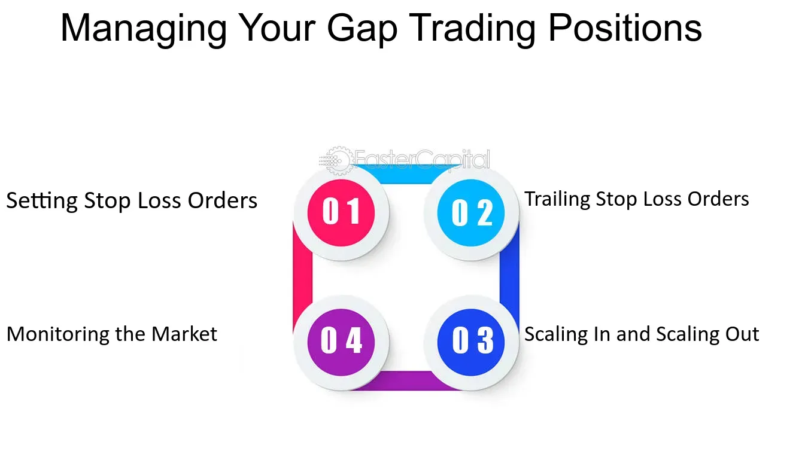

## Table of Contents

## What are stop-loss orders and how do they work?

A stop-loss order is a tool that investors use to limit their losses when they are trading stocks, currencies, or other financial assets. It works by setting a specific price at which the asset will be automatically sold if its value drops to that level. This helps investors avoid bigger losses if the price keeps falling. For example, if you buy a stock at $50 and set a stop-loss order at $45, the stock will be sold automatically if its price reaches $45, limiting your loss to $5 per share.

Stop-loss orders can be useful, but they also have some risks. One risk is that the price of the asset might drop quickly to the stop-loss level and then go back up. This is called a "stop-loss trigger," and it can result in selling the asset at a lower price than you wanted. Another risk is that during times of high market volatility, the price might jump past your stop-loss level before your order can be executed, leading to a bigger loss than you planned. Despite these risks, many investors use stop-loss orders as a way to manage their risk and protect their investments.

## What are limit orders and how do they work?

A limit order is a type of order you can use when you want to buy or sell a stock, but only at a specific price or better. When you set a limit order, you tell your broker the maximum price you're willing to pay if you're buying, or the minimum price you're willing to accept if you're selling. For example, if you want to buy a stock that's currently trading at $50, you might set a limit order to buy it at $48. This means your order will only be filled if the stock price drops to $48 or lower.

Limit orders give you more control over the price you pay or receive, but they don't guarantee that your order will be filled. If the stock never reaches your limit price, your order won't be executed. This can be good if you're patient and want to get a better deal, but it can also mean you miss out on a trade if the stock price moves away from your limit price quickly. Limit orders are useful tools for investors who want to be more precise about the prices at which they buy and sell.

## What are market gaps and how do they occur?

Market gaps happen when the price of a stock or other financial asset jumps from one level to another without any trading in between. This can happen overnight or between trading sessions when the market is closed. For example, if a company announces good news after the market closes, the stock might open the next day at a much higher price than it closed at the day before. This jump in price is called a gap.

Gaps can happen for many reasons, like big news about a company, changes in the economy, or unexpected events. When the news is good, the price might gap up. When the news is bad, the price might gap down. Gaps can be tricky for investors because they can make stop-loss orders less effective. If a stock gaps down below a stop-loss level, the order might be filled at a much lower price than expected. Understanding gaps can help investors make better decisions about when to buy and sell.

## How do stop-loss orders help in managing market gaps?

Stop-loss orders can help manage market gaps by setting a limit on how much money you could lose if the price of a stock suddenly drops a lot. When you set a stop-loss order, you pick a price where you want to sell the stock if it falls to that level. If there's a big gap down in the stock price, your stop-loss order will kick in and sell the stock at the next available price, even if it's lower than your stop-loss price. This can help stop your losses from getting too big.

However, stop-loss orders don't always work perfectly with market gaps. If the stock price gaps down a lot, your stop-loss order might get filled at a much lower price than you set. This is because the stock might open at a price that's already below your stop-loss level. So, while stop-loss orders can help manage the risk of market gaps, they can't always stop all the losses if the gap is really big.

## Can limit orders be effective in dealing with market gaps?

Limit orders can help with market gaps, but they have their limits. If you set a limit order to sell a stock at a certain price and the stock gaps down below that price, your order won't be filled until the stock price comes back up to your limit price. This means you might miss selling the stock at a better price if the gap is big and the stock stays below your limit.

Using limit orders during market gaps can be tricky. They give you control over the price you want to buy or sell at, but they don't guarantee that your order will be filled. If the stock price gaps up or down and never comes back to your limit price, you might not be able to trade at all. So, while limit orders can be useful, they might not always be the best way to deal with sudden big changes in stock prices.

## What are the potential risks of using stop-loss orders during market gaps?

Using stop-loss orders during market gaps can be risky. One big risk is that if the stock price gaps down a lot, your stop-loss order might get filled at a much lower price than you set. This happens because the stock might open at a price that's already below your stop-loss level. So, instead of selling at your stop-loss price, you end up selling at a worse price, which means you lose more money than you planned.

Another risk is that the stock price might gap down and then quickly go back up. If your stop-loss order gets filled during the gap, you'll sell the stock at a low price. But if you had waited, you could have sold it at a higher price later. This can be frustrating because you might feel like you sold too soon. So, while stop-loss orders can help limit your losses, they can also lead to bigger losses or missed chances if the market gaps a lot.

## How might limit orders fail to execute during market gaps?

Limit orders might not work well during market gaps. If you set a limit order to sell a stock at a certain price, but the stock's price suddenly drops a lot overnight or between trading sessions, your order won't be filled right away. This is because the stock might open at a price that's already lower than your limit price. Your order will only be filled if the stock price comes back up to your limit price, which might not happen if the gap is big.

This can be a problem because you might miss out on selling the stock at a better price. If the stock stays below your limit price after the gap, your order won't be filled at all. So, even though limit orders give you control over the price you want to trade at, they can't always help you if the market moves a lot suddenly.

## What strategies can traders use to optimize stop-loss and limit orders in the presence of market gaps?

Traders can use a few smart strategies to make stop-loss and limit orders work better when there are big gaps in the market. One good idea is to use a wider stop-loss order. Instead of setting it too close to the current price, you might set it a bit further away. This can help stop your order from being filled at a bad price if the stock suddenly drops a lot. Another idea is to check the stock's history for gaps. If a stock often has big gaps, you might want to set your stop-loss order even further away to be safe.

Another strategy is to use a trailing stop-loss order. This kind of order moves with the stock price, so it can help you keep more of your gains if the stock goes up. But it can also help limit your losses if the stock goes down a lot. You can set the trailing stop to be a certain percentage or dollar amount below the stock's highest price. This way, if the stock gaps down, you might still sell at a better price than a regular stop-loss order. 

Using limit orders during market gaps can be tricky, but one strategy is to set multiple limit orders at different prices. This can give you more chances to sell the stock at a good price if it gaps down. For example, if you want to sell a stock at $50, you could set limit orders at $50, $48, and $45. This way, if the stock gaps down below $50, you might still sell it at $48 or $45. It's all about being flexible and ready for big price changes.

## How do different market conditions affect the effectiveness of stop-loss and limit orders?

Different market conditions can change how well stop-loss and limit orders work. In a calm market where prices move slowly and steadily, stop-loss orders can be very effective. They can help you sell a stock at a set price if it starts to drop, which keeps your losses small. Limit orders also work well in calm markets because you can set a price to buy or sell at, and if the market moves to that price, your order will be filled. But if the market is very busy and prices are jumping around a lot, stop-loss and limit orders might not work as well. Your stop-loss order might get filled at a lower price than you wanted, and your limit order might not get filled at all if the price never reaches your set price.

In a fast-moving market with big gaps, like when there's big news or a lot of buying and selling, stop-loss and limit orders can be tricky. If a stock's price suddenly drops a lot overnight, your stop-loss order might sell the stock at a much lower price than you planned. And if you have a limit order to sell at a certain price, but the stock gaps down below that price, your order won't be filled until the price comes back up. This can mean you miss selling at a better price. So, in these kinds of markets, you need to be careful and maybe set your stop-loss orders a bit further away from the current price to give yourself more room for sudden changes.

## What advanced techniques can be used to adjust stop-loss and limit orders in volatile markets?

In volatile markets, one smart technique to adjust stop-loss orders is to use a wider stop-loss. Instead of setting it too close to the current price, you might want to set it further away. This gives the stock more room to move without hitting your stop-loss and selling at a bad price. Another technique is to use a trailing stop-loss order. This kind of order moves with the stock's price, so if the stock goes up, your stop-loss moves up too. This can help you keep more of your gains if the stock keeps going up, but it can also help limit your losses if the stock suddenly drops a lot.

For limit orders in volatile markets, setting multiple limit orders at different prices can be helpful. If you want to sell a stock at a certain price, you can set several limit orders at different levels. For example, if you want to sell at $50, you could also set orders at $48 and $45. This way, if the stock's price gaps down below $50, you might still sell it at $48 or $45. Another technique is to watch the stock's price closely and adjust your limit orders as the market moves. If the stock's price is jumping around a lot, you might need to change your limit orders to match the new prices and make sure you can still sell at a good price.

## How do institutional traders approach the use of stop-loss and limit orders in addressing market gaps?

Institutional traders often use more advanced strategies to deal with market gaps when they use stop-loss and limit orders. They might set their stop-loss orders further away from the current price to give the stock more room to move without getting sold off too soon. This can help them avoid selling at a bad price if the stock suddenly drops a lot. They also might use trailing stop-loss orders, which move up as the stock's price goes up. This helps them keep more of their gains if the stock keeps going up, but it also helps limit their losses if the stock suddenly goes down a lot.

Institutional traders also use limit orders in a smart way to deal with market gaps. They might set multiple limit orders at different prices to give themselves more chances to sell the stock at a good price if it gaps down. For example, if they want to sell a stock at $50, they might also set orders at $48 and $45. This way, if the stock's price gaps down below $50, they might still sell it at $48 or $45. They also keep a close eye on the market and adjust their limit orders as needed to make sure they can still sell at a good price even if the market is moving a lot.

## What empirical studies exist on the effectiveness of stop-loss and limit orders in various market scenarios?

There have been a few studies that looked at how well stop-loss and limit orders work in different market situations. One study by the Journal of Financial Markets found that stop-loss orders can be good at limiting losses in calm markets, where prices move slowly and steadily. But in fast-moving markets with big price gaps, stop-loss orders might not work as well. The study showed that if a stock's price suddenly drops a lot, like overnight, a stop-loss order might sell the stock at a much lower price than planned. This means that while stop-loss orders can help in some cases, they can also lead to bigger losses in others.

Another study published in the Journal of Trading looked at limit orders and found that they can be useful in calm markets because they let you set a price to buy or sell at, and if the market moves to that price, your order will be filled. But in busy markets with a lot of price jumping around, limit orders might not get filled at all if the price never reaches your set price. The study also found that setting multiple limit orders at different prices can help in markets with big gaps, giving you more chances to sell at a good price if the stock's price suddenly drops a lot. Overall, these studies show that while stop-loss and limit orders can be helpful, they need to be used carefully and adjusted based on the market conditions.

## References & Further Reading

[1]: Bergstra, J., Bardenet, R., Bengio, Y., & Kégl, B. (2011). ["Algorithms for Hyper-Parameter Optimization."](https://papers.nips.cc/paper/4443-algorithms-for-hyper-parameter-optimization) Advances in Neural Information Processing Systems 24.

[2]: ["Advances in Financial Machine Learning"](https://www.amazon.com/Advances-Financial-Machine-Learning-Marcos/dp/1119482089) by Marcos Lopez de Prado

[3]: ["Evidence-Based Technical Analysis: Applying the Scientific Method and Statistical Inference to Trading Signals"](https://www.amazon.com/Evidence-Based-Technical-Analysis-Scientific-Statistical/dp/0470008741) by David Aronson

[4]: ["Machine Learning for Algorithmic Trading"](https://github.com/stefan-jansen/machine-learning-for-trading) by Stefan Jansen

[5]: ["Quantitative Trading: How to Build Your Own Algorithmic Trading Business"](https://books.google.com/books/about/Quantitative_Trading.html?id=j70yEAAAQBAJ) by Ernest P. Chan