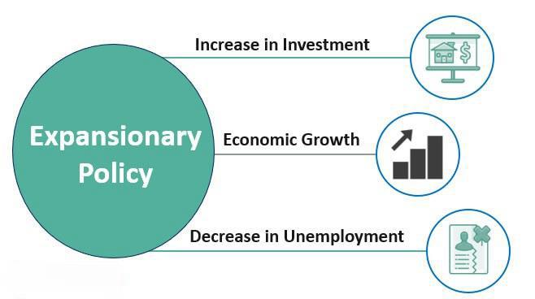

Expansionary economic policies significantly affect the stock market by stimulating economic growth through various government mechanisms. These strategies are primarily implemented during periods of economic downturns to rejuvenate economic activities and foster increased asset valuations. By executing these policies through fiscal and monetary channels, authorities aim to enhance liquidity, reduce unemployment, and boost consumer spending, which collectively contribute to an upward trend in financial market performance.

Monetary policies typically involve central banks adjusting interest rates and engaging in open market operations to influence money supply and borrowing costs. Lowering interest rates, a common tactic, decreases the cost of borrowing for corporations and consumers, leading to increased investment and spending. Simultaneously, fiscal policies may include tax reductions and augmented government spending to propel aggregate demand and consumer confidence. Such financial interventions create an environment conducive to enhanced corporate profit margins and rising stock valuations.



Understanding these mechanisms is crucial for investors and policymakers, as it aids in identifying market trends and making informed financial decisions. Moreover, with the advent and proliferation of algorithmic trading, these policy impacts can be rapidly magnified, resulting in significant and swift market movements. Algorithmic trading employs sophisticated algorithms to process market signals and execute trades at high speed, capitalizing on shifts induced by expansionary policies and often leading to increased market volatility.

In this article, we will examine the dynamic relationship between these expansionary economic policies, stock market performance, and the influence of algorithmic trading. This exploration is vital for navigating the increasingly complex landscape of modern financial markets.

## Table of Contents

## Understanding Expansionary Economic Policy

Expansionary economic policy refers to strategic measures employed by governments to stimulate economic growth, particularly during times of economic downturns or periods of low inflation. These policies broadly fall into two categories: fiscal policy and monetary policy.

Fiscal policy involves direct government interventions to boost economic activity through changes in taxation and public expenditure. Tax cuts are a common fiscal tool, designed to increase disposable income for consumers and businesses. For instance, by reducing income taxes, individuals have more money to spend, thus increasing aggregate demand. Simultaneously, businesses benefit from reduced corporate taxes, enabling them to invest more robustly in capital, technology, and human resources. The government may also increase spending on public infrastructure projects, creating jobs and spurring economic activity through the multiplier effect, where one dollar of government spending can generate more than one dollar in economic growth as it circulates through the economy.

Monetary policy, on the other hand, is primarily managed by central banks and involves controlling the money supply and influencing interest rates to foster economic stability and growth. Lowering interest rates is a pivotal tool in expansionary monetary policy. Reduced interest rates make borrowing cheaper for both consumers and businesses. This encourages spending and investment, leading to increased consumption and economic expansion. By reducing the cost of loans, central banks aim to stimulate economic growth by making it easier for consumers to buy homes, cars, and goods, while businesses are more inclined to undertake new projects or expand existing operations.

These expansionary policies are typically implemented during economic recessions or periods of low inflation to counteract sluggish economic conditions. By stimulating demand through fiscal and monetary channels, governments and central banks aim to catalyze growth, increase employment, and stabilize prices, hence fostering a more vibrant economic environment.

## Impact of Expansionary Policies on the Stock Market

Expansionary economic policies are instrumental in influencing the trajectory of stock markets, primarily through their impact on consumer spending and corporate earnings. By employing measures such as fiscal and monetary policies, governments and central banks can directly stimulate economic activity, thereby affecting stock valuations.

Fiscal policies, which include actions like tax cuts and increased government spending, directly enhance consumer confidence and aggregate demand. When consumers have more disposable income due to tax incentives, they are more likely to spend on goods and services. This increase in consumer spending can lead to higher corporate revenues and, consequently, improved earnings projections for companies. As investors anticipate higher profitability and growth prospects, stock valuations are likely to increase. For instance, during periods of recession, an aggressive fiscal stimulus can lead to a quick recovery in consumer spending, thereby bolstering stock markets.

Monetary policies also play a crucial role, especially through the manipulation of interest rates. Lower interest rates decrease the cost of borrowing, making it cheaper for corporations to finance expansion projects and for consumers to take loans for various expenditures, such as homes and cars. This reduction in borrowing costs facilitates increased economic activity. Moreover, lower interest rates make fixed-income investments like bonds less attractive, prompting investors to seek higher returns in the stock market. This portfolio rebalancing can lead to a rise in stock prices as demand for equities increases.

To illustrate, let us assume that the central bank reduces the nominal [interest rate](/wiki/interest-rate-trading-strategies) from $r_1$ to $r_2$. The enhanced affordability of loans increases corporate and consumer spending, represented as increases in functions $C$ (consumption) and $I$ (investment), written as:

$$
C = C(Y - T, r_2)
$$
$$
I = I(r_2)
$$

where $Y$ is the national income, $T$ is taxes, and $r_2 < r_1$. This boost in $C$ and $I$ leads to an upward shift in the aggregate demand curve, increasing the equilibrium level of output and income in the economy, which in turn positively impacts corporate earnings and stock valuations.

Overall, both fiscal and monetary policies can significantly elevate stock market performance during economic expansions, primarily through enhanced consumer spending and corporate earnings. However, the effectiveness and rapidity of these impacts may vary depending on the specific tools and magnitude of the policy measures employed.

## Fiscal Policy vs. Monetary Policy: Which Is More Effective?

Monetary policy often exerts a more direct influence on stock markets compared to fiscal policy. This distinction arises due to the inherent mechanisms and effects these policies have on economic variables. Monetary policy, primarily conducted through the adjustment of interest rates and open market operations, predominantly influences [liquidity](/wiki/liquidity-risk-premium) levels in the economy without necessarily impacting wage structures directly. Lowering interest rates, for instance, reduces borrowing costs, encouraging businesses to invest and consumers to spend. This can lead to immediate upticks in stock market indices as investors anticipate higher corporate profits.

Conversely, fiscal policy, which often involves government spending initiatives and tax adjustments, can have more complex and slower-to-materialize effects on the stock markets. Fiscal measures, such as substantial government spending, might initially boost economic activity and, consequently, corporate earnings. However, they can also lead to wage inflation as increased demand for goods and services may tighten labor markets, pushing up wages. Wage inflation can erode corporate margins over time, dampening stock market enthusiasm.

Historical analysis, such as during the Great Recession of 2007-2009, elucidates these dynamics. The Federal Reserve's aggressive monetary interventions, including slashing interest rates to near-zero levels and launching quantitative easing programs, significantly bolstered stock markets. The S&P 500, for instance, showed a robust recovery partly due to these liquidity-enhancing measures. The massive injection of liquidity into the financial system lowered the cost of capital and spurred investment in equities. In contrast, fiscal policy measures, such as stimulus packages, had a more delayed and less pronounced effect on stock valuations, with their impact more visible in long-term economic stabilization than immediate market gains.

The capacity of monetary policy to foster liquidity and stimulate immediate market responses underscores its direct impact on the stock market. However, it is also important to consider the externalities of both policy types, including potential long-term inflationary pressures from expansive monetary actions and the fiscal sustainability concerns arising from prolonged government spending. Therefore, while monetary policy exhibits a more acute impact on stock markets in the short term, both strategies play essential roles in shaping economic landscapes and must be coordinated for optimal economic outcomes.

## Role of Algorithmic Trading in Policy-Induced Market Movements

Algorithmic trading has revolutionized financial markets by employing sophisticated algorithms to automatically execute trades based on pre-determined criteria. These algorithms analyze vast datasets and financial indicators to identify profitable trading opportunities, adjusting to signals such as price fluctuations, trade volumes, and economic policy announcements.

Expansionary economic policies, like fiscal stimulus or monetary easing, create shifts in market conditions that [algorithmic trading](/wiki/algorithmic-trading) systems can exploit with exceptional speed and precision. For instance, when a central bank announces a lower interest rate, the expected outcome is a favorable borrowing environment, ultimately enhancing corporate profitability. Algorithmic trading systems rapidly process such policy changes, recalibrating their models to capture resulting price movements efficiently.

These systems employ techniques ranging from statistical [arbitrage](/wiki/arbitrage) to [momentum](/wiki/momentum) trading. Consider a simple example of momentum trading: if stock prices rise (or fall) due to policy impact, the algorithm detects this trend and executes buy or sell orders to capitalize on the momentum. Meanwhile, [statistical arbitrage](/wiki/statistical-arbitrage) involves complex models that identify price inefficiencies across related securities, using quantitative methods to profit. Here's a basic Python snippet illustrating a momentum trading strategy:

```python
import pandas as pd

# Sample data: hypothetical stock prices
data = {'Stock Prices': [100, 102, 105, 107, 106, 110]}
df = pd.DataFrame(data)

# Calculate daily returns
df['Returns'] = df['Stock Prices'].pct_change()

# Define a simple momentum trading signal
# Buy if today's return is positive, sell otherwise
df['Signal'] = df['Returns'].apply(lambda x: 'Buy' if x > 0 else 'Sell')

print(df)
```

In this example, the algorithm generates buying signals when returns are positive, demonstrating how rapid response to policy-induced price trends can be programmed.

Furthermore, the sheer speed at which algorithmic trading operates provides a tactical advantage over traditional trading. When implemented effectively, algorithms can detect and act on opportunities within milliseconds, reducing delay-related risks. This high-frequency trading can amplify the effects of economic policies on stock prices, as even subtle shifts are swiftly exploited, potentially leading to increased [volatility](/wiki/volatility-trading-strategies).

However, this efficiency and speed come with challenges. Algorithmic trading can exacerbate market volatility, particularly during high-impact policy announcements, as synchronized trading actions can lead to significant price swings. Additionally, unforeseen anomalies or "flash crashes" can occur, wherein automated systems respond to each other's trades, magnifying market disruptions.

In summary, algorithmic trading significantly influences policy-induced market movements by leveraging complex algorithms for rapid decision-making. While these systems enable the effective exploitation of economic policy changes, they also contribute to increased market responsiveness and volatility.

## Case Studies: Economic Policy Effects on Stock Markets

The 2007-2009 financial crisis, often referred to as the Great Recession, serves as a pivotal case study to comprehend the effects of economic policy on stock markets. The crisis was characterized by a dramatic collapse in housing prices coupled with severe stress in global financial systems. In response, policymakers employed unprecedented expansionary policies to stabilize and eventually revive the economies. 

During this period, central banks around the globe adopted aggressive monetary measures. The United States Federal Reserve slashed interest rates to near-zero levels and initiated large-scale asset purchases, a process known as quantitative easing (QE). The intention was to increase liquidity in financial markets, lower long-term interest rates, and foster an environment conducive to investment and spending. These policies played a critical role in stabilizing stock markets, as evidenced by the rebound in major indices like the S&P 500, which, after initial declines, began a significant upward trend from March 2009.

On the fiscal side, governments also enacted stimulus packages designed to spur economic recovery. The American Recovery and Reinvestment Act of 2009 in the United States, which included tax cuts and substantial public sector spending, sought to directly boost aggregate demand. The effects of these policies on stock markets were generally positive as they improved consumer confidence and corporate profitability, thus supporting higher stock valuations.

Algorithmic trading emerged as a significant player during this era due to its ability to leverage rapid, data-driven decision-making processes. Algorithms, designed to act on macroeconomic signals, could swiftly interpret and react to policy announcements and financial conditions. This increased market responsiveness, yet introduced greater volatility due to the speed and [volume](/wiki/volume-trading-strategy) of trades executed. Algorithmic trading systems exploited opportunities presented by policy-induced fluctuations, effectively amplifying the movements in stock prices. 

For instance, during QE announcements, algorithms could detect the likely short-term impact of increased liquidity in promoting stock buying and execute trades within milliseconds to capitalize on this trend. Thus, while traditional trading might lag in response time, algorithmic systems not only expedited trading volume but also integrated policy expectations more efficiently into market prices.

Analyzing this period reveals the profound influence that both fiscal and monetary policies exert on the stock market, particularly within crisis contexts. The adaptation and exploitation of these opportunities by algorithmic trading highlight its role in reshaping the landscape of financial markets amid policy shifts. 

The Great Recession exemplifies how robust and timely economic policies can catalyze stock market recovery, with algorithmic trading introducing a new dimension to market dynamics by accelerating and intensifying these impact effects.

## Conclusion

Effective use of expansionary policies can rejuvenate stagnant economies and buoy stock markets. By injecting liquidity into financial systems and stimulating demand, these policies help mitigate the adverse effects of economic downturns. While both fiscal and monetary policies have their place in economic strategies, monetary policies often provide more immediate benefits to stock investors. This is primarily due to their capacity to influence interest rates directly, thereby affecting borrowing costs and investment decisions promptly. Lower interest rates can lead to increased capital availability for businesses, resulting in enhanced corporate performance and higher stock valuations.

Incorporating technological advancements like algorithmic trading has further amplified the responsivity of financial markets to policy shifts. Algorithmic trading systems leverage data-driven insights to execute trades at high speeds, thereby exploiting minor fluctuations caused by such policy implementations. While this rapid adaptation benefits market liquidity and efficiency, it can also introduce increased volatility, as algorithms react to incoming data and changes in economic signals more swiftly than traditional trading methods.

In conclusion, the strategic deployment of expansionary policies not only supports economic revitalization but also holds significant sway over stock market trajectories. As policymakers navigate these financial landscapes, understanding the nuanced interplay between fiscal interventions, monetary adjustments, and emerging technologies like algorithmic trading becomes crucial. This understanding enables the crafting of balanced economic policies that bolster market confidence while maintaining stability amid dynamic market conditions.

## References

- Investopedia Team. "How does expansionary economic policy impact the stock market?" This article explores the influence of government actions aimed at boosting economic growth on stock prices. Through detailed analysis, the team explains how changes in fiscal and monetary policies can lead to fluctuations in market conditions. 

- Samruddhi Somani. "The Effects of Government Policies on the Stock Market." Samruddhi Somani's work provides insights into the correlation between governmental economic strategies and stock market behavior. The analysis draws attention to past events where policy interventions significantly influenced market trends.

- Federal Reserve Board publications on monetary policy. The Federal Reserve Board offers comprehensive resources on the implementation and consequences of monetary policy. Their publications are critical for understanding the broader implications of monetary adjustments on financial markets and investment strategies.

## References & Further Reading

[1]: Bergstra, J., Bardenet, R., Bengio, Y., & Kégl, B. (2011). ["Algorithms for Hyper-Parameter Optimization."](https://dl.acm.org/doi/10.5555/2986459.2986743) Advances in Neural Information Processing Systems 24.

[2]: ["Advances in Financial Machine Learning"](https://www.amazon.com/Advances-Financial-Machine-Learning-Marcos/dp/1119482089) by Marcos Lopez de Prado

[3]: ["Evidence-Based Technical Analysis: Applying the Scientific Method and Statistical Inference to Trading Signals"](https://www.amazon.com/Evidence-Based-Technical-Analysis-Scientific-Statistical/dp/0470008741) by David Aronson

[4]: ["Machine Learning for Algorithmic Trading"](https://github.com/stefan-jansen/machine-learning-for-trading) by Stefan Jansen

[5]: ["Quantitative Trading: How to Build Your Own Algorithmic Trading Business"](https://www.amazon.com/Quantitative-Trading-Build-Algorithmic-Business/dp/1119800064) by Ernest P. Chan