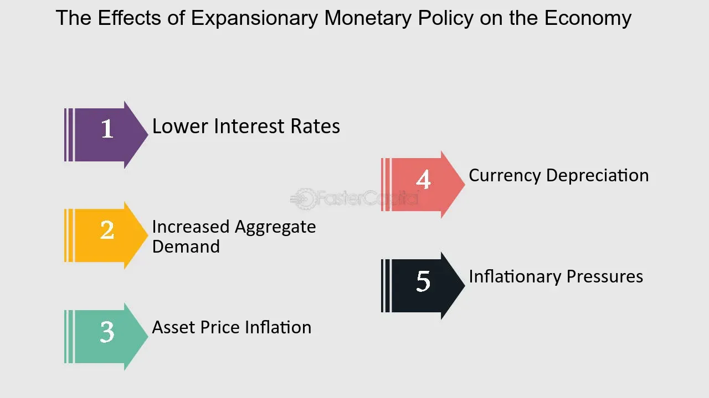

## Table of Contents

## What is expansionary economic policy?

Expansionary economic policy is when a government or a central bank takes actions to boost the economy. They do this by increasing spending, cutting taxes, or lowering interest rates. The goal is to encourage more spending and investment, which can help grow the economy and create jobs. When people and businesses feel more confident, they spend more money, which can lead to more economic activity.

These policies are often used during times of recession or when the economy is slowing down. By putting more money into the economy, the government hopes to stimulate demand for goods and services. This can help businesses grow and hire more workers. However, expansionary policies can also lead to higher inflation if too much money is pumped into the economy. It's a balancing act to make sure the economy grows without causing prices to rise too quickly.

## How does expansionary policy differ from contractionary policy?

Expansionary policy and contractionary policy are like two sides of the same coin when it comes to managing the economy. Expansionary policy is used when the economy needs a boost. This happens when the government or central bank increases spending, cuts taxes, or lowers interest rates. The idea is to put more money into people's pockets so they spend more, which helps businesses grow and create jobs. It's like giving the economy a shot of energy to get it moving faster.

On the other hand, contractionary policy is used when the economy is growing too fast and might overheat. This is when the government or central bank does the opposite: they decrease spending, raise taxes, or increase interest rates. The goal is to slow down the economy a bit to keep inflation in check. It's like putting on the brakes to make sure the economy doesn't go too wild and cause prices to rise too quickly.

Both types of policies are important tools that help keep the economy balanced. Expansionary policy helps during tough times, while contractionary policy keeps things under control when the economy is doing too well. It's all about finding the right balance to keep the economy stable and growing at a healthy pace.

## What are the main tools of expansionary economic policy?

The main tools of expansionary economic policy are increasing government spending, cutting taxes, and lowering interest rates. When the government spends more money, it can invest in things like building roads, schools, or hospitals. This not only improves the country but also creates jobs for people who work on these projects. When people have jobs, they spend more money, which helps the economy grow.

Another tool is cutting taxes. When taxes are lower, people and businesses keep more of their money. They can then spend or invest this extra money, which also helps the economy grow. For example, if a family gets a tax cut, they might buy a new car or go on a vacation, which means more money is being spent in the economy.

The third tool is lowering interest rates. This is usually done by the central bank. When interest rates are lower, it's cheaper for people and businesses to borrow money. They might take out loans to buy a house, start a business, or expand an existing one. All of this extra spending and investment helps the economy grow. These three tools work together to give the economy a boost when it needs it.

## How does expansionary policy aim to affect the economy?

Expansionary policy aims to help the economy grow by putting more money into it. When the government increases spending or cuts taxes, people and businesses have more money to spend. This extra spending helps businesses sell more stuff, which can lead to them hiring more workers. When more people have jobs, they spend even more money, creating a cycle that helps the economy grow. The central bank can also help by lowering interest rates, making it cheaper for people to borrow money. This encourages more spending and investment, which is good for the economy.

The main goal of expansionary policy is to boost economic activity, especially during tough times like a recession. By using these tools, the government hopes to increase demand for goods and services. When demand goes up, businesses grow and create more jobs, helping to reduce unemployment. However, it's important to use these tools carefully because if too much money is pumped into the economy, it can lead to higher prices, or inflation. So, the government has to find the right balance to make sure the economy grows without causing too much inflation.

## What is the relationship between expansionary policy and stock markets?

Expansionary policy can have a big impact on stock markets. When the government uses expansionary policy, like spending more money or cutting taxes, it puts more money into people's pockets. This can make people feel more confident about the economy. When people feel good about the economy, they are more likely to invest in stocks. More demand for stocks can push their prices up. Also, when interest rates are lowered, borrowing money becomes cheaper, which can help businesses grow and make more profit. This can make their stock prices go up too.

However, the relationship between expansionary policy and stock markets isn't always straightforward. Sometimes, if people think the government is spending too much money, they might worry about future inflation. Inflation can make money worth less over time, which can make people less willing to invest in stocks. Also, if the economy is already doing well, more expansionary policy might not help the stock market much. It's all about what people expect to happen in the future. If they think the economy will keep getting better, stocks might go up, but if they think things might get worse, stocks could go down.

## Can you explain how lower interest rates impact stock prices?

When interest rates go down, it can make stock prices go up. This happens because lower interest rates mean it's cheaper for people and businesses to borrow money. When borrowing is cheaper, businesses can take out loans to grow and make more money. If a business is doing well and making more money, its stock price usually goes up. Also, when interest rates are low, people might choose to invest their money in stocks instead of keeping it in the bank, because they can earn more from stocks than from low-interest savings accounts.

However, the impact of lower interest rates on stock prices isn't always the same. Sometimes, if interest rates are very low for a long time, people might start to worry about the economy. They might think the economy isn't doing well if the central bank keeps rates low to try to help it. This worry can make people less willing to invest in stocks, which can make stock prices go down. It all depends on what people think will happen in the future. If they think the economy will keep getting better, stocks might go up, but if they think things might get worse, stocks could go down.

## How does increased government spending influence corporate earnings and stock performance?

When the government spends more money, it can help companies make more money. This happens because the government might buy things from companies or hire them to do projects. When companies get more business from the government, they can sell more stuff and make more profit. This extra profit can make their stock prices go up. Also, when the government spends more, it can make the whole economy grow. When the economy is doing well, people feel more confident and spend more money on things like cars and houses. This means more business for companies, which can lead to higher profits and higher stock prices.

However, increased government spending doesn't always mean good news for all companies. Sometimes, if the government spends a lot of money, it can lead to higher inflation. Inflation means that prices go up, which can make it harder for companies to make money. If people think inflation will be a problem, they might not want to invest in stocks, which can make stock prices go down. Also, if the government spends too much money, it might have to raise taxes later to pay for it. Higher taxes can take money out of people's pockets, which can make them spend less. This can hurt companies' profits and make their stock prices go down.

## What are the potential short-term effects of expansionary policy on stock market volatility?

Expansionary policy can make the stock market more unpredictable in the short term. When the government says it will spend more money or cut taxes, it can make people feel more confident about the economy. They might start buying more stocks because they think the economy will do better. This can make stock prices go up quickly. But, if too many people start buying at the same time, it can also make the market more up and down. People might start to worry that the market is growing too fast and decide to sell their stocks, which can make prices drop suddenly.

Also, when the central bank lowers interest rates, it can make borrowing money cheaper. This can make people and businesses more willing to take risks and invest in stocks. But, if everyone starts borrowing and investing at the same time, it can make the stock market more volatile. If people start to worry about inflation or if they think the government is spending too much money, they might start selling their stocks. This can cause the market to swing up and down more than usual. So, while expansionary policy can help the economy grow, it can also make the stock market more unpredictable in the short term.

## How might expansionary policy lead to inflation, and what are the implications for stock markets?

Expansionary policy can lead to inflation because it puts more money into the economy. When the government spends more or cuts taxes, people have more money to spend. If everyone starts spending more at the same time, there can be too much money chasing too few goods. This can make prices go up, which is what we call inflation. Also, when the central bank lowers interest rates, borrowing money becomes cheaper. This can make people and businesses borrow more and spend more, which can also push prices up.

Inflation can have big effects on the stock market. If prices start going up a lot, people might worry that their money will be worth less in the future. This can make them less willing to invest in stocks. When people start selling their stocks because they're worried about inflation, it can make stock prices go down. But, if inflation is just a little bit and people think the economy is still doing well, they might keep investing in stocks. This can make stock prices go up. So, it's all about what people expect to happen with inflation and how it might affect the economy.

## What historical examples illustrate the impact of expansionary policy on stock markets?

One good example of expansionary policy affecting stock markets happened during the Great Recession in 2008. The U.S. government and the Federal Reserve used expansionary policies to help the economy. They spent a lot of money on programs like the American Recovery and Reinvestment Act and cut interest rates to almost zero. At first, the stock market was really shaky because people were worried about the economy. But, over time, as these policies started to work and the economy began to recover, the stock market started to go up. The S&P 500, which is a big stock market index, went from a low of around 676 in March 2009 to over 1,100 by the end of that year. This shows how expansionary policy can help the stock market recover after a big downturn.

Another example is from Japan in the 1990s. Japan's economy was struggling, so the government used expansionary policies to try to help. They spent a lot of money on public works projects and kept interest rates very low. At first, the stock market didn't react much because people were still worried about the economy. But, over time, as the economy started to get a little better, the stock market began to go up. The Nikkei 225, which is Japan's main stock market index, went from a low of around 14,300 in April 2003 to over 18,000 by the end of 2005. This shows that even though it can take time, expansionary policy can help the stock market when the economy is struggling.

## How do investors typically adjust their strategies in response to expansionary policy announcements?

When the government or the central bank announces expansionary policies, investors usually start to feel more hopeful about the economy. They think that more spending, tax cuts, or lower interest rates will help businesses make more money. This can make investors want to buy more stocks because they think the stock prices will go up. They might also move their money from safe investments like bonds to riskier ones like stocks, hoping to make more money as the economy grows. Sometimes, investors might even borrow money to invest more, since borrowing is cheaper when interest rates are low.

But, investors also have to be careful. If they think the government is spending too much money, they might worry about inflation. Inflation can make their money worth less over time, which can make them less willing to invest in stocks. They might start selling their stocks to protect their money. Also, if the economy is already doing well, investors might not think expansionary policies will help much. They might keep their money in safer investments or wait to see what happens before making big moves. So, while expansionary policies can make investors feel more confident, they also have to think about the risks and adjust their strategies carefully.

## What are the long-term risks and benefits of expansionary policy for stock market investors?

Expansionary policy can be good for stock market investors in the long run. When the government spends more money or cuts taxes, it can help the economy grow. This means businesses can make more money and their stock prices can go up. Also, when interest rates are low, it's cheaper for businesses to borrow money to grow. This can lead to more profits and higher stock prices over time. Investors who buy stocks when the economy is recovering from a downturn can make a lot of money as the market goes up. So, expansionary policy can create a good environment for stock market investors to make long-term gains.

But, there are also some risks to think about. If the government spends too much money, it can lead to higher inflation. Inflation can make prices go up, which can make it harder for businesses to make money. This can make stock prices go down if investors start to worry about it. Also, if the economy grows too fast because of expansionary policy, the government might have to raise taxes or interest rates later to slow it down. This can take money out of people's pockets and make them spend less, which can hurt businesses and their stock prices. So, while expansionary policy can help the stock market in the long run, investors need to be careful and think about these risks too.

## What is the impact of expansionary policies on the stock market?

Expansionary economic policies are instrumental in influencing the trajectory of stock markets, primarily through their impact on consumer spending and corporate earnings. By employing measures such as fiscal and monetary policies, governments and central banks can directly stimulate economic activity, thereby affecting stock valuations.

Fiscal policies, which include actions like tax cuts and increased government spending, directly enhance consumer confidence and aggregate demand. When consumers have more disposable income due to tax incentives, they are more likely to spend on goods and services. This increase in consumer spending can lead to higher corporate revenues and, consequently, improved earnings projections for companies. As investors anticipate higher profitability and growth prospects, stock valuations are likely to increase. For instance, during periods of recession, an aggressive fiscal stimulus can lead to a quick recovery in consumer spending, thereby bolstering stock markets.

Monetary policies also play a crucial role, especially through the manipulation of interest rates. Lower interest rates decrease the cost of borrowing, making it cheaper for corporations to finance expansion projects and for consumers to take loans for various expenditures, such as homes and cars. This reduction in borrowing costs facilitates increased economic activity. Moreover, lower interest rates make fixed-income investments like bonds less attractive, prompting investors to seek higher returns in the stock market. This portfolio rebalancing can lead to a rise in stock prices as demand for equities increases.

To illustrate, let us assume that the central bank reduces the nominal [interest rate](/wiki/interest-rate-trading-strategies) from $r_1$ to $r_2$. The enhanced affordability of loans increases corporate and consumer spending, represented as increases in functions $C$ (consumption) and $I$ (investment), written as:

$$
C = C(Y - T, r_2)
$$
$$
I = I(r_2)
$$

where $Y$ is the national income, $T$ is taxes, and $r_2 < r_1$. This boost in $C$ and $I$ leads to an upward shift in the aggregate demand curve, increasing the equilibrium level of output and income in the economy, which in turn positively impacts corporate earnings and stock valuations.

Overall, both fiscal and monetary policies can significantly elevate stock market performance during economic expansions, primarily through enhanced consumer spending and corporate earnings. However, the effectiveness and rapidity of these impacts may vary depending on the specific tools and magnitude of the policy measures employed.

## References & Further Reading

[1]: Bergstra, J., Bardenet, R., Bengio, Y., & Kégl, B. (2011). ["Algorithms for Hyper-Parameter Optimization."](https://dl.acm.org/doi/10.5555/2986459.2986743) Advances in Neural Information Processing Systems 24.

[2]: ["Advances in Financial Machine Learning"](https://www.amazon.com/Advances-Financial-Machine-Learning-Marcos/dp/1119482089) by Marcos Lopez de Prado

[3]: ["Evidence-Based Technical Analysis: Applying the Scientific Method and Statistical Inference to Trading Signals"](https://www.amazon.com/Evidence-Based-Technical-Analysis-Scientific-Statistical/dp/0470008741) by David Aronson

[4]: ["Machine Learning for Algorithmic Trading"](https://github.com/stefan-jansen/machine-learning-for-trading) by Stefan Jansen

[5]: ["Quantitative Trading: How to Build Your Own Algorithmic Trading Business"](https://www.amazon.com/Quantitative-Trading-Build-Algorithmic-Business/dp/1119800064) by Ernest P. Chan