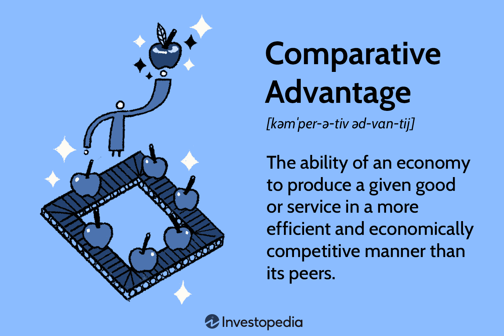

## Table of Contents

## What is globalization?

Globalization is when countries around the world connect more and more. It means that people, goods, and information can move easily from one country to another. It's like the world is becoming a smaller place because everything is more connected.

This happens because of better technology, like the internet and faster transportation. Companies can sell their products in many different countries, and people can learn about different cultures more easily. It helps the economy grow, but it can also make some problems bigger, like pollution and inequality.

## What is comparative advantage?

Comparative advantage is when a country can make something cheaper or better than other countries. It's not just about being the best at something, but about being relatively better. For example, if Country A can make both cars and computers, but it's much better at making computers than cars compared to Country B, then Country A should focus on making computers. This way, both countries can trade and everyone can get what they need at a lower cost.

This idea helps countries decide what they should produce and what they should buy from others. If every country focuses on what they are relatively good at, the whole world can benefit. It leads to more trade, more jobs, and cheaper products for everyone. But it's important for countries to keep improving and finding new things they can be good at, so they can keep their advantage.

## How does globalization affect trade between countries?

Globalization makes trade between countries easier and bigger. It's like the world is becoming one big market where countries can buy and sell things to each other more easily. Better technology, like the internet and faster ships and planes, helps this happen. Now, a company in one country can sell its products to customers all over the world. This means more choices for people and more opportunities for businesses to grow.

Because of globalization, countries can focus on making things they are good at and trade with others for things they are not so good at. This idea is called comparative advantage. When countries do this, everyone can get what they need at a lower cost. But, there are also challenges. Some jobs might move to other countries where it's cheaper to make things, and this can be hard for workers. Also, more trade can lead to problems like pollution if countries don't take care of the environment.

## Can globalization change a country's comparative advantage?

Globalization can change a country's comparative advantage by making it easier for new ideas and technologies to spread. When countries are more connected, they can learn from each other and improve their skills and technology. For example, if a country sees that another country is good at making cars, they might learn from them and start making cars too. This can change which things a country is good at making compared to others.

Also, globalization can make it easier for companies to move to different countries. If it's cheaper to make something in another country, a company might move there. This can change what a country is known for making. For example, if a country used to be good at making clothes but now it's cheaper to make them somewhere else, that country might lose its advantage in making clothes. So, globalization can make a country's comparative advantage change over time as the world changes.

## What are the traditional factors influencing comparative advantage?

The traditional factors that influence a country's comparative advantage include things like the natural resources a country has, the skills of its workers, and how advanced its technology is. For example, if a country has a lot of oil, it might be good at selling oil to other countries. Or, if a country has many skilled workers who are good at making cars, it might focus on making and selling cars. Technology also plays a big role because if a country has advanced technology, it can make things faster and better than others.

Another [factor](/wiki/factor-investing) is the cost of labor. If workers in a country don't ask for much money, it can be cheaper to make things there. This is why some countries are good at making things like clothes or toys, because they can make them cheaply. The size of the market in a country can also matter. If a country has a big market, it might be good at making things for its own people and not need to trade as much. All these factors together help decide what a country is good at making compared to other countries.

## How does globalization impact labor markets and comparative advantage?

Globalization changes how people work and what countries are good at making. When countries are more connected, companies can move their factories to places where it's cheaper to make things. This can mean jobs move from one country to another. For example, if it's cheaper to make clothes in another country, a company might move there. This can be hard for workers in the first country because they might lose their jobs. But it can be good for workers in the new country because they get new jobs.

Globalization also makes it easier for new ideas and technology to spread. When countries learn from each other, they can get better at making things. This can change what a country is known for making. For example, if a country learns how to make cars better from another country, it might start making more cars. This can change its comparative advantage. So, globalization can make the labor market and a country's comparative advantage change over time as the world changes.

## What role do technological advancements play in globalization and comparative advantage?

Technological advancements help globalization by making it easier for people and information to move around the world. The internet lets companies talk to customers everywhere, and faster transportation like airplanes and ships means goods can be sent quickly to different countries. This makes the world feel smaller and more connected. Because of technology, a company in one country can sell things to people all over the world. This helps the economy grow because more people can buy and sell things.

Technology also changes what countries are good at making, which is called comparative advantage. When new technology spreads, countries can learn to make things better or faster. For example, if a country gets new machines that help make cars, it might start making more cars and become known for that. This can change what the country is good at compared to others. So, technology can make a country's comparative advantage change over time, as it learns and improves.

## How do global supply chains influence a nation's comparative advantage?

Global supply chains help countries figure out what they're good at making. When countries can easily buy and sell things with each other, they can focus on making the things they're best at. For example, if a country is good at growing coffee but not so good at making computers, it can grow coffee and trade it for computers from another country. This way, everyone gets what they need, and it's cheaper for everyone. Global supply chains make it easier for countries to trade, so they can take advantage of what they're good at.

But global supply chains can also change what a country is good at over time. If a country starts making parts for cars and sending them to another country to be put together, it might get better at making those parts. This can make the country known for making car parts, which changes its comparative advantage. So, global supply chains not only help countries use what they're good at now, but they also help them get better at new things and change what they're known for in the future.

## What are the economic theories linking globalization to shifts in comparative advantage?

One important economic theory that links globalization to shifts in comparative advantage is the theory of comparative advantage itself, first explained by David Ricardo. This theory says that countries should focus on making things they are relatively better at compared to other countries. When countries trade with each other, they can all get what they need at a lower cost. Globalization makes it easier for countries to trade and learn from each other, so they can improve their skills and technology. This means a country's comparative advantage can change over time as it gets better at making new things or as other countries catch up.

Another theory is the product life cycle theory, which was developed by Raymond Vernon. This theory says that products go through different stages, from being new and expensive to being old and cheap. At first, a new product might be made in a rich country where people can afford to pay a lot for it. But as the product gets older and cheaper, it might start being made in countries where it's cheaper to make things. Globalization helps this happen because it makes it easier for companies to move their factories to different countries. So, globalization can change a country's comparative advantage by making it better at making older, cheaper products instead of new, expensive ones.

## How do multinational corporations affect comparative advantage in the context of globalization?

Multinational corporations can change what countries are good at making because they move their factories and businesses around the world. They look for places where it's cheaper to make things or where they can find the workers and resources they need. For example, if it's cheaper to make clothes in one country, a multinational company might move its factory there. This can make that country better at making clothes, which changes its comparative advantage. It's like the company helps the country get better at making certain things by bringing in new technology and skills.

But multinational corporations can also make some countries lose their advantage in making things. If a company moves its factory from one country to another, the first country might not be as good at making those things anymore. Workers in the first country might lose their jobs, and the country might need to find something new to be good at. So, multinational corporations can help countries change what they're known for making, but it can be hard for some workers and countries when companies move around.

## What are the long-term effects of globalization on the comparative advantage of developing versus developed countries?

Globalization can change what developing and developed countries are good at making over time. For developing countries, globalization can help them grow faster. They can learn new skills and use new technology from other countries. This can make them better at making things they were not good at before. For example, a developing country might start making cars or electronics if a big company from a developed country sets up a factory there. This can help the developing country become known for making these things, which changes its comparative advantage. But it can also be hard for these countries because they might depend too much on making things for other countries and not develop their own industries.

For developed countries, globalization can make them lose some of their advantages. If it's cheaper to make things in developing countries, companies might move their factories there. This can mean fewer jobs in the developed country, and it might not be as good at making those things anymore. But developed countries can still keep their advantage in making new, high-tech things. They have the money and skills to keep coming up with new ideas and inventions. So, globalization can make developed countries focus more on new technology and services, while developing countries might focus more on making things. This way, both types of countries can change what they're good at over time because of globalization.

## How can policy interventions modify the impact of globalization on comparative advantage?

Governments can use policies to change how globalization affects what their country is good at making. For example, they can give money or help to industries that they want to grow. This can make a country better at making certain things, even if it's not the cheapest place to do it. Governments can also make rules about trade, like putting taxes on things coming into the country. This can make it harder for other countries to sell their stuff there, so the country's own businesses have a better chance to grow. By doing these things, a government can help its country keep or change its advantage in making things.

But policy interventions can also make things harder. If a government helps one industry too much, it might stop other industries from growing. This can make the country depend too much on one thing, which can be risky if something changes. Also, if a country makes it hard for other countries to trade with them, other countries might do the same thing back. This can make it harder for the country to sell its own stuff to other places. So, while policies can help change what a country is good at, they need to be careful and think about how they might affect other parts of the economy and the world.

## References & Further Reading

[1]: Ricardo, D. (1817). ["On the Principles of Political Economy and Taxation."](https://www.econlib.org/library/Ricardo/ricP.html) Dover Publications.

[2]: Bhagwati, J. (2004). ["In Defense of Globalization."](https://archive.org/details/indefenseofglob00bhag) Oxford University Press.

[3]: Lopez de Prado, M. (2018). ["Advances in Financial Machine Learning."](https://www.amazon.com/Advances-Financial-Machine-Learning-Marcos/dp/1119482089) Wiley.

[4]: Jansen, S. (2018). ["Machine Learning for Algorithmic Trading: Predictive Models to Extract Signals from Market and Alternative Data for Systematic Trading Strategies with Python."](https://github.com/stefan-jansen/machine-learning-for-trading) Packt Publishing.

[5]: Chan, E. (2009). ["Quantitative Trading: How to Build Your Own Algorithmic Trading Business."](https://github.com/ftvision/quant_trading_echan_book) Wiley.