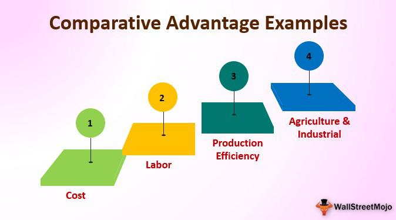

Globalization has become a pivotal aspect of the modern economy, deeply influencing international trade patterns and economic dynamics. The integration of economies across the globe has accelerated the flow of goods, services, capital, and labor, forming an interconnected network that enhances economic growth and fosters international cooperation. One of the fundamental theories explaining the dynamics of international trade within this globalized framework is the concept of comparative advantage.

Introduced by the economist David Ricardo in the 19th century, comparative advantage refers to the ability of a country to produce a particular good at a lower opportunity cost than its trading partners. This concept underpins the rationale for countries engaging in trade, suggesting that even if a nation is not the most efficient producer of any good (in absolute terms), it can still benefit from trade by focusing on goods where it has a lower relative efficiency loss. Through specialization based on comparative advantage, countries can achieve greater overall efficiency and production, leading to increased economic welfare globally.

In recent years, the rapid advancement of technology has introduced a new element into the globalization-trade equation: algorithmic trading. This form of trading uses algorithms—sets of rules or instructions—to automate and optimize financial decision-making processes in market transactions. Algorithmic trading has revolutionized how financial markets operate, offering the potential for increased speed, precision, and reduced costs in trading activities. Its deployment in financial markets across countries has both capitalized on and contributed to the globalization trend, allowing for more seamless and efficient cross-border trading.

This article explores the intersection of globalization, comparative advantage, and algorithmic trading in shaping international trade. By examining these concepts together, we gain insights into the complexities and dynamics of the modern global economy, offering a comprehensive view of how these factors collectively influence trade practices and economic relationships worldwide.

## Table of Contents

## Globalization and Comparative Advantage

Globalization refers to the process of increasing interdependence and interconnectedness among countries, economically, politically, and culturally. It facilitates the flow of goods, services, capital, information, and people across international borders, effectively transforming local economies into integrated components of the global economy. Globalization significantly enhances the exchange of ideas, technology, and resources, leading to improved efficiency and productivity.

David Ricardo's theory of comparative advantage, formulated in the early 19th century, remains a fundamental principle in understanding international trade in today's globalized economy. This theory posits that countries should specialize in producing goods and services in which they have a relative efficiency advantage. By focusing on their comparative advantages, countries can trade with each other to mutual benefit, increasing overall economic welfare even when one nation is less efficient in the production of all goods compared to another.

In a globalized world, comparative advantage becomes even more pronounced as international markets open up. Globalization allows countries to specialize further and exploit their advantages by accessing a broader customer base and more diverse resources. For example, China's manufacturing sector has thrived due to its comparative advantage in cost-efficient labor and large-scale production capacity. This specialization has been facilitated by access to global supply chains and international markets, enabling China to become the world's largest manufacturer and exporter of goods.

Conversely, the United States has leveraged its comparative advantage in the services sector, particularly in areas like technology, finance, and entertainment. The U.S. economy benefits from a highly skilled workforce, sophisticated technological infrastructure, and a culture of innovation, allowing it to export services worldwide. The global interconnectedness enables U.S. companies to offer services remotely, expanding their reach and creating new economic opportunities.

Globalization thus amplifies the comparative advantages of countries by removing barriers to trade and fostering an environment conducive to specialization and efficiency. By engaging in trade, nations can improve their economic performance and provide consumers with a more diverse and affordable range of products and services, ultimately contributing to economic growth and development on a global scale.

## The Impact of International Trade

International trade serves as a mechanism for countries to exploit their comparative advantages, thereby enhancing overall economic efficiency. Comparative advantage, a concept pioneered by economist David Ricardo, posits that countries should specialize in producing goods and services they can produce more efficiently and at a lower opportunity cost than others. This specialization allows economies to benefit from increased efficiency and productivity, fueling economic growth on a global scale.

One of the primary benefits of international trade is economic growth. By enabling countries to specialize based on their strengths, resources are allocated more efficiently, leading to an increase in the production capacity of nations. This, in turn, contributes to a rise in GDP and improved standards of living. Additionally, international trade fosters job creation as industries expand to cater to global markets. For instance, countries with a comparative advantage in technology or agriculture can create numerous jobs in these sectors while importing goods and services that are less efficient to produce domestically.

International trade also broadens consumer choice. With access to a global market, consumers can enjoy a variety of goods and services that may not be available locally. This variety can lead to better quality products at competitive prices, enhancing consumer welfare. For instance, the import of electronics from countries like South Korea and Japan provides consumers worldwide with access to cutting-edge technology.

However, international trade and globalization are not without their challenges and criticisms. One significant concern is labor exploitation, particularly in developing countries. The demand for low-cost production can lead to poor working conditions and inadequate wages, as businesses and countries strive to maintain a competitive edge. Moreover, the environmental impact of increased production and transportation associated with global trade is a growing concern. The carbon footprint and ecological degradation resulting from heightened trade activities pose significant threats to global sustainability.

Examples of countries benefiting from international trade are pervasive. Developed nations such as Germany have leveraged their technological expertise to dominate industries like automotive manufacturing, exporting high-quality vehicles worldwide. Conversely, developing countries like Vietnam have capitalized on their abundance of labor to become prominent players in textile and garment production, supplying major international brands.

Despite its benefits, the criticism global trade receives necessitates the implementation of policies aimed at mitigating its adverse effects. Policies focusing on fair labor practices, environmental protection, and sustainable development are crucial to ensuring that the advantages of international trade are maximized while minimizing its potential drawbacks. Addressing these challenges will help create a balanced global trading system that promotes economic development and social equity.

## Algorithmic Trading in a Globalized Market

Algorithmic trading, also known as algo-trading or automated trading, has significantly transformed financial markets by leveraging computer programs to execute trades at speeds and frequencies impossible for human traders. This method employs advanced mathematical models and algorithms to make trading decisions, often relying on historical data analysis and real-time market information. Algorithmic trading is increasingly vital in the modernization of financial markets due to its ability to process large volumes of data and execute trades with precision and efficiency.

One of the major benefits of [algorithmic trading](/wiki/algorithmic-trading) is its symbiotic relationship with globalization, which provides vast amounts of real-time data and expanded market access. Globalization facilitates the flow of information across borders, enabling algorithmic traders to access diverse datasets from international markets. This increased access allows traders to refine their algorithms using a broader spectrum of economic indicators, market trends, and financial instruments available in various global financial centers.

Algorithmic trading introduces several efficiencies in international trade. For instance, it enhances [liquidity](/wiki/liquidity-risk-premium) in financial markets by enabling rapid buying and selling of securities, which often leads to narrower bid-ask spreads. This high liquidity facilitates smoother transactions and better price discovery, benefiting both individual and institutional investors. However, the speed and automation of algorithmic trading also present certain risks. One such risk is the potential for market [volatility](/wiki/volatility-trading-strategies), as demonstrated by incidents like the "Flash Crash" of May 6, 2010, where markets swiftly dropped and recovered within minutes, primarily driven by algorithmic trades. Moreover, the reliance on complex algorithms sometimes leads to erroneous trades due to software bugs or unforeseen market conditions, posing systemic risks.

Global algorithmic trading also influences market dynamics across international borders. In foreign exchange markets, for example, algorithmic trading systems efficiently execute trades based on currency value changes, contributing to the trillion-dollar daily trading [volume](/wiki/volume-trading-strategy). Moreover, these systems are prominent in cross-border equity trading, where they facilitate investment in international stocks by providing traders with the necessary tools to navigate different time zones and regulatory environments.

Overall, algorithmic trading is a key component in the globalization of financial markets, offering both unprecedented efficiencies and challenges. As international trade and market access continue to expand through globalization, the role of algorithmic trading in influencing global market dynamics is likely to increase, necessitating a careful balance between embracing technological innovation and managing associated risks.

## Challenges and Critiques of Globalization

Globalization has undeniably transformed global economies, but it also presents several challenges and critiques, particularly in terms of job displacement, inequality, environmental impact, and ethical concerns in financial markets.

One significant drawback of globalization is job displacement in developed economies. As companies seek to minimize production costs, they often relocate manufacturing units to countries with cheaper labor. This outsourcing can lead to significant job losses in the home country, particularly in manufacturing sectors. For instance, automation and offshore manufacturing have drastically reduced the number of factory jobs in countries like the United States and parts of Europe. This shift not only results in unemployment but also widens income inequality as low-skilled workers face severe challenges finding new employment opportunities at comparable wages.

Globalization also contributes to increased inequality. While it can drive economic growth and increase wealth in developing countries, the benefits are not evenly distributed. Wealth is often concentrated in the hands of a few, exacerbating the income gap both within and between nations. The Gini coefficient, a common measure of inequality, often reflects this growing disparity in many globalized economies.

The environmental impact of globalization is another pressing concern. Enhanced international trade and production often lead to increased carbon emissions, deforestation, and resource depletion. The transportation of goods across long distances contributes significantly to greenhouse gas emissions, while the surge in production to meet global demand places enormous pressure on natural resources, leading to environmental degradation. For example, the expansion of palm oil plantations in Indonesia and Malaysia, driven by global demand, has led to significant deforestation and loss of biodiversity in these regions.

In the financial sector, globalization has introduced ethical concerns, particularly with the advent of algorithmic trading. While it brings efficiencies and liquidity to markets, it also poses risks of market manipulation. High-frequency trading ([HFT](/wiki/high-frequency-trading-strategies)) algorithms can execute thousands of trades in microseconds, sometimes providing unfair advantages to those with better technology and resources. This practice can lead to market volatility and has raised questions about fairness and transparency in financial markets.

Addressing the negative effects of globalization requires comprehensive solutions and policy measures. To mitigate job displacement, governments and businesses could invest in retraining and reskilling programs to help displaced workers transition into new industries. Implementing progressive taxation and enhancing social welfare systems can help reduce inequality by redistributing wealth more equitably. 

Environmental challenges can be tackled through stricter regulations on emissions and resource usage, promoting sustainable trade practices, and incentivizing green technologies. International agreements, like the Paris Agreement, play a crucial role in unifying global efforts to combat environmental degradation.

In terms of ethical concerns in financial markets, regulators must ensure more stringent oversight and transparency in algorithmic trading practices. Implementing policies that limit the speed of trading or introducing taxes on financial transactions could help curb the negative impacts of high-frequency trading.

By acknowledging and addressing these challenges, policymakers can work towards a balanced approach that maximizes the benefits of globalization while minimizing its adverse effects on society and the environment.

## Future Outlook: Globalization, Trade, and Technology

Globalization continues to evolve, heavily influencing international trade dynamics. As economies become more interconnected, the integration of advanced technologies such as [artificial intelligence](/wiki/ai-artificial-intelligence) (AI) and [machine learning](/wiki/machine-learning) has the potential to further amplify the effects of globalization on trade. These technological advancements are primed to transform various sectors, optimizing supply chains, enhancing production capacities, and facilitating real-time data analysis. AI and machine learning can support globalization by improving decision-making processes and risk management in international markets, thus making trade operations more efficient and resilient.

Technological innovations are also expected to redefine comparative advantage, especially in emerging markets. As these markets adopt advanced technologies, they may develop new competitive strengths. For instance, a country traditionally known for its low-cost manufacturing may leverage AI and robotics to move up the value chain, producing more sophisticated products with higher profit margins. Emerging markets might also capitalize on technology-driven improvements in areas like digital infrastructure and e-commerce, positioning themselves as hubs for technological services and innovation.

Balancing the benefits of globalization with its social and environmental responsibilities is increasingly crucial. The ongoing challenge lies in establishing sustainable practices that support economic growth while protecting the environment. This can be addressed through the development and enforcement of robust regulatory frameworks designed to mitigate negative externalities such as environmental degradation and social inequality. Sustainable practices might involve promoting green technologies, enforcing stricter environmental standards in trade agreements, and encouraging corporate social responsibility.

Moreover, international collaboration will be essential to ensure that technological progress and globalization benefit a wide range of stakeholders. Policymakers must focus on creating inclusive growth strategies that prioritize fair trade practices and equitable resource distribution to foster a more sustainable global economy. Encouraging dialogue across nations to harmonize these standards can promote more equitable globalization that respects both human and environmental concerns.

## Conclusion

Globalization, comparative advantage, and algorithmic trading collectively shape the paradigm of international trade by fostering increased economic integration, efficiency, and technological application. On the positive side, globalization facilitates the flow of goods, services, and capital, amplifying economic growth and elevating living standards. Comparative advantage, rooted in David Ricardo's theory, remains central by allowing countries to specialize in the production of goods where they have a lower opportunity cost, thus maximizing global resource efficiency. Algorithmic trading further exemplifies technological advancement by enhancing liquidity, decreasing transaction costs, and enabling faster execution times in financial markets.

However, these dynamics also generate notable challenges. Globalization can lead to job displacement in certain sectors within developed economies and exacerbate income inequality. The environmental impacts due to heightened production and trade activities pose sustainability concerns. Moreover, algorithmic trading, despite its efficiencies, introduces risks related to market volatility and potential manipulation.

A balanced policy approach is necessary to navigate these complexities, aiming to capitalize on the benefits while minimizing the drawbacks. Policies should promote equitable resource distribution, support retraining programs for displaced workers, and enforce regulations to ensure ethical trading practices. Environmental considerations must also be integrated into trade agreements to guarantee sustainable development.

Encouraging ongoing exploration at the crossroads of globalization, trade, and technological innovation is vital. Advancements in artificial intelligence and machine learning have the potential to further redefine trade practices and comparative advantages, potentially offering new solutions to persistent challenges. Embracing these innovations with a mindful approach towards social and environmental responsibilities will be crucial for a sustainable global economic future.

## References & Further Reading

[1]: Ricardo, D. (1817). ["On the Principles of Political Economy and Taxation."](https://www.econlib.org/library/Ricardo/ricP.html) Dover Publications.

[2]: Bhagwati, J. (2004). ["In Defense of Globalization."](https://archive.org/details/indefenseofglob00bhag) Oxford University Press.

[3]: Lopez de Prado, M. (2018). ["Advances in Financial Machine Learning."](https://www.amazon.com/Advances-Financial-Machine-Learning-Marcos/dp/1119482089) Wiley.

[4]: Jansen, S. (2018). ["Machine Learning for Algorithmic Trading: Predictive Models to Extract Signals from Market and Alternative Data for Systematic Trading Strategies with Python."](https://github.com/stefan-jansen/machine-learning-for-trading) Packt Publishing.

[5]: Chan, E. (2009). ["Quantitative Trading: How to Build Your Own Algorithmic Trading Business."](https://github.com/ftvision/quant_trading_echan_book) Wiley.