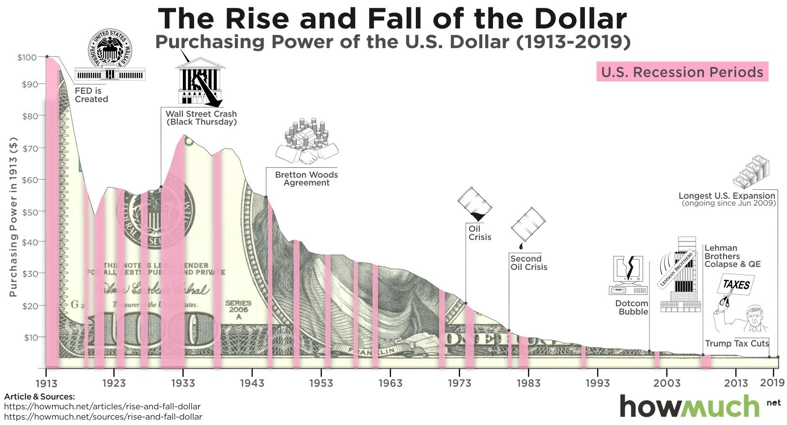

## Table of Contents

## What is inflation?

Inflation is when the prices of things we buy, like food and toys, go up over time. It means that the money we have can buy less than it used to. For example, if a toy cost $10 last year and now it costs $11, that's inflation. It happens because the amount of money in the economy grows faster than the number of goods and services available.

There are different reasons why inflation happens. Sometimes, it's because the cost of making things goes up, like when the price of oil increases. Other times, it's because people have more money to spend, so they are willing to pay more for things. Governments and banks try to control inflation by changing interest rates or the amount of money in circulation. If inflation is too high, it can make life harder for people because their money doesn't go as far.

## How is inflation measured?

Inflation is measured by looking at the prices of a bunch of different things that people commonly buy. This group of things is called a "basket of goods and services." Economists track the prices of items in this basket over time to see how much they change. The most common way to measure inflation is by using the Consumer Price Index (CPI). The CPI compares the cost of the basket now to what it cost in the past. If the basket costs more now, that means there's inflation.

Another way to measure inflation is by using the Producer Price Index (PPI). The PPI looks at the prices that businesses pay for things they need to make their products. If these prices go up, it can mean that the prices for the things we buy might go up too. Both the CPI and PPI help economists understand how fast prices are rising and if inflation is getting too high or too low. Governments and central banks use these numbers to make decisions about money and the economy.

## What causes inflation?

Inflation happens when the prices of things we buy go up over time. One main reason for inflation is when there's too much money chasing too few goods. Imagine if everyone suddenly had more money to spend, but there weren't more things to buy. People would start paying more for the same stuff, and that's inflation. Another reason is when it costs more to make things. If the price of oil goes up, for example, it can make everything more expensive because oil is used to make and transport a lot of goods.

Sometimes, inflation can also happen because of expectations. If people think prices will go up in the future, they might start buying things now, which can push prices up even more. Governments and central banks can also affect inflation. If they print more money or keep interest rates low, it can lead to more spending and higher prices. On the other hand, if they raise interest rates, it can slow down spending and help keep inflation in check. Balancing these factors is important to keep inflation at a level that doesn't hurt the economy.

## How does inflation affect the purchasing power of the dollar?

Inflation makes the dollar worth less over time. When prices go up, the same amount of money can buy fewer things. For example, if a toy that cost $10 last year now costs $11, you need more dollars to buy the same toy. This means that the purchasing power of the dollar goes down because each dollar buys a smaller share of goods and services.

To keep up with inflation, people might ask for higher wages or prices for their goods. If wages go up but prices go up even more, people still feel like they have less money. Governments and central banks try to manage inflation to keep it from getting too high, because if it does, it can make it hard for people to afford the things they need. Keeping inflation at a steady, low level helps keep the value of the dollar stable and maintains people's purchasing power.

## What has been the historical trend of inflation in the United States?

In the United States, inflation has gone up and down over the years. From the 1950s to the 1970s, inflation was pretty low, usually between 1% and 3% each year. But in the late 1970s and early 1980s, inflation got really high, reaching over 13% in 1980. This was a tough time because prices were going up so fast that it was hard for people to keep up. The government and the Federal Reserve worked hard to bring inflation down, and by the mid-1980s, it was back to around 3% to 4%.

Since the 1980s, inflation in the U.S. has been pretty steady. Most years, it's been between 1% and 3%, which is seen as a good level because it's not too high or too low. There have been some ups and downs, like in the early 1990s when it went up a bit, and during the 2008 financial crisis when it dropped. But overall, the Federal Reserve has been good at keeping inflation in check. In recent years, inflation has been a bit higher, reaching around 7% in 2021 and 2022, but it's starting to come back down. Keeping inflation steady helps people plan for the future and keeps the economy strong.

## How do different rates of inflation impact the value of the dollar over time?

When inflation is low, like around 1% to 3%, the value of the dollar stays pretty stable over time. This means that the things you can buy with a dollar don't change much from year to year. Low inflation is good because it helps people plan for the future. They know that their money will still be worth about the same next year. It also makes it easier for businesses to set prices and for people to save money without worrying that it will lose too much value.

But when inflation is high, like it was in the 1970s and early 1980s, the value of the dollar goes down a lot. If prices are going up fast, you need more dollars to buy the same things. This can make life harder because people's wages might not go up as fast as prices. High inflation can also make people less likely to save money because they know it will be worth less in the future. That's why governments and central banks try to keep inflation at a steady, low level to protect the value of the dollar and help the economy stay strong.

## What are the effects of hyperinflation on the dollar?

Hyperinflation is when prices go up super fast, like really, really fast. It makes the dollar worth a lot less in a very short time. Imagine if a candy bar that cost $1 one day cost $10 the next day, and $100 the day after that. That's what hyperinflation does. It's like your money is melting away. People rush to spend their dollars before they become worth even less. This can make it hard to buy things you need because prices are changing so quickly.

When hyperinflation happens, it can mess up the whole economy. People lose trust in the dollar because it's not a good way to save or buy things anymore. Businesses have a hard time because they don't know what to charge for their products. Workers want higher wages to keep up with the rising prices, but if wages go up, prices might go up even more. It's a big, scary cycle. Governments and central banks need to act fast to stop hyperinflation, like changing how much money is in the economy or using a different currency. If they don't, it can lead to big problems for everyone.

## How does inflation influence interest rates and investment returns?

Inflation can make banks change the interest rates they charge for loans and pay on savings. When inflation goes up, banks might raise interest rates to keep up with the rising prices. This means it costs more to borrow money, like taking out a loan for a car or a house. But it also means that if you save money in the bank, you might get a higher interest rate, so your savings can grow faster. The goal is to balance things out so that the money people save or borrow keeps up with inflation.

Inflation also affects how much money you can make from investments. If you invest in things like stocks or bonds, you want your investment to grow faster than inflation. If inflation is high, the returns from your investments need to be even higher to make sure you're not losing money. For example, if inflation is 5%, your investment needs to grow by more than 5% just to keep up. This is why people pay close attention to inflation when they're deciding where to put their money. They want to make sure their investments will still be worth something in the future.

## What role does the Federal Reserve play in managing inflation and the value of the dollar?

The Federal Reserve, often called the Fed, is like the boss of money in the United States. Its main job is to keep the economy running smoothly, and one big way it does this is by managing inflation. The Fed tries to keep inflation at a steady, low level, usually around 2%. It does this by changing interest rates. If inflation is too high, the Fed might raise interest rates to make borrowing money more expensive. This can slow down spending and help bring prices down. If inflation is too low, the Fed might lower interest rates to make borrowing cheaper, which can encourage people to spend more and help prices go up a little.

The Fed also affects the value of the dollar by controlling how much money is in circulation. If there's too much money, it can lead to higher inflation and make the dollar worth less. To fix this, the Fed might take some money out of circulation. If there's not enough money, it can make it hard for businesses to grow and for people to spend, so the Fed might add more money. By balancing these actions, the Fed helps keep the dollar strong and stable. This makes it easier for people to save, spend, and plan for the future.

## How do international factors affect the value of the dollar in relation to inflation?

The value of the dollar can change because of things happening in other countries. If a country like China or Europe has a lot of inflation, their money might be worth less compared to the dollar. This can make the dollar stronger because people might want to use dollars instead of the other country's money. Also, if other countries buy a lot of things from the U.S., like cars or computers, it can make the dollar stronger because they need dollars to pay for those things. But if the U.S. buys a lot from other countries, like oil or toys, it can make the dollar weaker because we need to use dollars to pay for them.

Another way international factors affect the dollar is through interest rates. If the U.S. has higher interest rates than other countries, people from around the world might want to invest their money in the U.S. to get those higher returns. This can make the dollar stronger because more people are buying dollars. But if other countries have higher interest rates, people might move their money there instead, which can make the dollar weaker. So, the value of the dollar is always changing based on what's happening around the world, and it's all connected to inflation and how much people want to use or invest in dollars.

## What are the long-term economic consequences of persistent inflation on the dollar's value?

When inflation keeps going up over a long time, the dollar slowly loses its value. This means that over the years, the same amount of money can buy fewer things. For example, if you saved $100 ten years ago, that $100 might not buy as much today because prices have gone up. People who save money might see their savings shrink in value, which can make them less likely to save. Businesses might also find it hard to plan for the future because they don't know how much things will cost. If inflation stays high for a long time, it can make people lose trust in the dollar, which can hurt the whole economy.

In the long run, persistent inflation can lead to bigger problems. If people expect prices to keep going up, they might start buying things now instead of later, which can make inflation even worse. This can create a cycle where prices keep going up and up. Governments and central banks might need to take strong actions, like raising interest rates a lot, to stop this cycle. If they don't, it could lead to hyperinflation, where prices go up so fast that the dollar becomes almost worthless. Keeping inflation under control helps keep the dollar strong and the economy stable over time.

## How can individuals and businesses protect the value of their dollar holdings against inflation?

Individuals and businesses can protect the value of their dollar holdings against inflation by investing in things that grow faster than inflation. For example, they can put their money into stocks, real estate, or commodities like gold. These investments can go up in value over time, which can help keep up with or even beat inflation. Another way is to invest in inflation-protected securities, like Treasury Inflation-Protected Securities (TIPS), which adjust their value based on inflation rates. By choosing the right investments, people can make sure their money keeps its value even when prices are going up.

Another strategy is to keep borrowing costs low by paying off debts quickly, especially when interest rates are low. When inflation rises, the value of the money you owe can go down, which makes it easier to pay back loans. Businesses can also adjust their prices to keep up with inflation, making sure they're not losing money. For individuals, it's important to keep an eye on their budget and look for ways to save money or increase their income. By being smart about spending, saving, and investing, people and businesses can protect their dollar holdings and keep their financial health strong even when inflation is high.

## What is the relationship between dollar value and inflation?

Dollar value can be understood as its purchasing power, which is significantly affected by inflation—a sustained increase in the general price level of goods and services in an economy over a period. Inflation erodes the real value of money, meaning that over time, each unit of currency buys fewer goods and services. Understanding the causes of inflation is crucial for economic actors, as it impacts financial decision-making across sectors.

Inflation is primarily driven by several factors:

1. **Supply-demand imbalances**: When demand for goods and services exceeds supply, prices tend to rise. This demand-pull inflation is a common occurrence in expanding economies where consumer spending is robust.

2. **Monetary policies**: Central banks, like the Federal Reserve in the United States, influence inflation through monetary policy, often by adjusting interest rates and controlling money supply. For instance, increasing the money supply can devalue a currency, leading to higher prices.

3. **External shocks**: Events outside the control of a country's economy, such as oil price shocks or global financial crises, can lead to inflation. These shocks can disrupt supply chains or alter commodity prices, thereby impacting inflation rates.

The relationship between inflation and purchasing power is inverse by nature. To quantify this, consider the formula:

$$
\text{Real Value} = \frac{\text{Nominal Value}}{(1 + \text{Inflation Rate})^n}
$$

where:
- Real Value represents the purchasing power of a currency at a future date.
- Nominal Value is the actual dollar amount today.
- Inflation Rate is the rate at which prices are increasing annually.
- $n$ is the number of years into the future.

Considering historical trends, inflation in the United States and its impact on the dollar can be reflected in various economic phases. The 1970s oil crisis and subsequent stagflation, the high inflation period of the early 1980s, and recent inflation surges due to supply chain disruptions post-COVID-19 illustrate how persistent inflation can influence dollar value and economic stability. Understanding these trends is crucial for predicting future economic environments and for devising strategies to mitigate adverse impacts of inflation on purchasing power.

For economic actors, the implications of inflation are far-reaching. Investors and businesses need to account for purchasing power erosion when making long-term decisions, balancing their portfolios, or setting prices. Thus, keeping abreast of inflation trends and potential triggers is vital for making informed financial decisions in an ever-changing economic landscape.

## What is the economic impact of inflation?

Inflation, a persistent increase in the general price level of goods and services, impacts the economy in multifaceted ways. As inflation progresses, it affects different sectors and alters both consumer behavior and investment decisions. 

One of the primary responses to rising inflation is the intervention by central banks, which often increase interest rates to temper excessive price escalations. Higher interest rates make borrowing more expensive and saving more attractive, thereby reducing consumer spending and investment. This contraction in expenditure can, in turn, slow down economic growth. For instance, if the nominal [interest rate](/wiki/interest-rate-trading-strategies) is $i$ and the inflation rate is $\pi$, the real interest rate can be approximated as:

$$
r \approx i - \pi
$$

where $r$ is the real interest rate. Rising inflation without a corresponding increase in interest rates could result in a negative real interest rate, encouraging excessive borrowing and potentially destabilizing the economy.

Businesses face direct challenges from inflation due to increased production costs. These costs often necessitate higher consumer prices unless companies are willing to absorb the increase, which could reduce their profit margins. For example, if the cost of raw materials rises, businesses may have to choose between increasing product prices or accepting lower profits. This choice can lead to decreased demand or reduced investment in expansion, affecting overall economic productivity.

Nevertheless, moderate inflation has its advantages. It can incentivize spending and investment by discouraging hoarding money since the value of cash diminishes over time. Inflation at moderate levels can stimulate economic growth by encouraging businesses to invest in new projects and consumers to purchase goods before prices increase further. This propensity to spend can enhance demand for goods and services, fostering economic expansion.

Furthermore, inflation allows for the automatic adjustment of relative prices and wages, which can help correct market imbalances and allocate resources more efficiently. It also reduces the real burden of debt, as the future nominal value of debt repayments decreases in real terms, which can spur borrowing and investment activities that fuel economic development.

In summary, inflation intricately shapes economic dynamics by influencing interest rates, increasing business costs, and altering consumption patterns. While it poses challenges through increased costs and potentially higher interest rates, moderate inflation also provides advantages by promoting economic activity and reducing debt burdens. Understanding these impacts allows policymakers, businesses, and consumers to navigate the economic landscape effectively.

## What are some case studies of algorithmic trading in action?

### Case Studies: Algorithmic Trading in Action

Algorithmic trading has demonstrated its capacity to adapt and thrive in inflation-driven economic changes. This section presents two notable case studies highlighting how algorithmic traders leveraged technology and strategy during challenging financial periods.

#### Case Study 1: High-Frequency Trading (HFT) During the 2008 Financial Crisis

The 2008 financial crisis marked a period of severe economic instability, characterized by heightened [volatility](/wiki/volatility-trading-strategies) and rapid market fluctuations. Amidst this turbulence, firms specializing in high-frequency trading ([HFT](/wiki/high-frequency-trading-strategies)) harnessed advanced algorithms to execute trades at unprecedented speeds. HFT firms capitalized on short-term price discrepancies between different exchanges, employing strategies such as statistical [arbitrage](/wiki/arbitrage) to generate profits.

These strategies typically involved analyzing historical data to identify correlated price movements across assets. For instance, if stock A and stock B generally moved in tandem but a temporary divergence was detected, algorithms rapidly executed trades to exploit the price correction. The formula for [statistical arbitrage](/wiki/statistical-arbitrage) might look something like this:

$$
\text{Profit}_{\text{arb}} = (\text{Price}_{\text{stock A}} - \text{Price}_{\text{stock B}}) \times \text{Volume}
$$

HFT's adaptability was exemplified by its ability to adjust to [liquidity](/wiki/liquidity-risk-premium) constraints and regulatory changes, allowing firms to maintain profitability even as traditional trading activities suffered.

#### Case Study 2: Quantitative Hedge Fund Strategies in Post-COVID Inflationary Pressures

The post-COVID era ushered in new economic challenges, with inflationary pressures affecting global markets. Quantitative hedge funds utilized [algorithmic trading](/wiki/algorithmic-trading) strategies to navigate this complex environment. One such strategy was the application of [machine learning](/wiki/machine-learning) models to predict inflation trends and adjust investment portfolios accordingly.

These funds deployed algorithms capable of processing vast datasets, including macroeconomic indicators, market data, and social media sentiment. Machine learning models, particularly those using techniques like neural networks or support vector machines, analyzed these inputs to forecast inflation impacts on various asset classes. A simplified Python example of a machine learning pipeline for this purpose might involve:

```python
from sklearn.model_selection import train_test_split
from sklearn.ensemble import RandomForestRegressor
from sklearn.metrics import mean_squared_error

# Sample data (features and target)
features = ... # Includes macroeconomic indicators
target = ... # Inflation-adjusted asset values

# Split data into training and testing
X_train, X_test, y_train, y_test = train_test_split(features, target, test_size=0.2, random_state=42)

# Initialize and train model
model = RandomForestRegressor()
model.fit(X_train, y_train)

# Predictions and evaluation
predictions = model.predict(X_test)
mse = mean_squared_error(y_test, predictions)
```

This flexibility allowed quantitative funds to pivot their strategies, managing risks more effectively and exploiting opportunities in inflation-sensitive sectors.

These case studies underscore the strategic advantage and resilience algorithmic traders possess in inflationary markets. By leveraging advanced technology and adaptive strategies, firms successfully navigated complex economic landscapes, highlighting the importance of algorithmic trading in modern finance.

## References & Further Reading

1. **Investopedia - Understanding Inflation and Its Impact:** Investopedia is a comprehensive resource for learning about economic concepts, including inflation, algorithmic trading, and their implications on financial markets. Visit [Investopedia](https://www.investopedia.com) for detailed articles and guides.

2. **"Introduction to Algorithmic Trading: Basic to Advanced Strategies" by StocksToTrade:** This resource provides an overview of algorithmic trading strategies, discussing both fundamental and technical analyses. The book covers a range of strategies from beginner to advanced levels, making it useful for traders aiming to enhance their knowledge and skills.

3. **Journal of Economic Perspectives - Articles on Inflation and Economic Impact:** This academic journal provides peer-reviewed articles on various economic topics. For those interested in understanding the broader economic implications of inflation, exploring articles from this journal can be highly beneficial.

4. **"Algorithmic and High-Frequency Trading" by Álvaro Cartea, Sebastian Jaimungal, and José Penalva:** This textbook offers a deep dive into the theory and practice of algorithmic and high-frequency trading. The authors explain the mathematical models and strategies used in trading, making it an excellent resource for those looking to understand the technical aspects of the field.

5. **National Bureau of Economic Research (NBER) Working Papers:** The NBER publishes working papers that address the latest research on economics and finance, including studies on inflation and its effects. These papers offer insights into current economic trends and models.

6. **"Machine Learning for Asset Managers" by Marcos López de Prado:** This book explores the application of machine learning in finance, particularly in asset management and trading. It provides practical examples and case studies on how machine learning can be leveraged in trading algorithms to navigate complex market environments.

7. **Economic Analysis and Policy - Articles on Financial Markets:** This journal publishes articles that focus on analysis and policy issues in economics. Topics such as inflation, market volatility, and the economic impact of trading practices are frequently discussed.

Readers interested in gaining a deeper understanding of these complex interactions are encouraged to explore the listed resources. These sources provide valuable insights into the dynamics between dollar value, inflation, and algorithmic trading, offering a solid foundation for further study and analysis.

