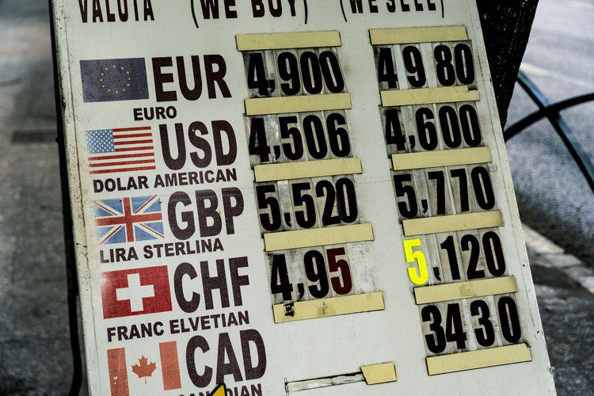

In global finance, the interplay between foreign exchange rates, currency depreciation, and advancements in algorithmic trading plays a crucial role. The weakening of a nation's currency, particularly the U.S. dollar, is often seen as a reflection of the country's economic conditions. This depreciation directly impacts international trade and investment decisions, influencing a wide array of economic activities. 

The U.S. dollar, being a dominant global currency, holds significant sway in international markets. When it weakens, it affects not only the domestic economy but also the global economic landscape. A weaker dollar can make U.S. exports more attractive due to lower relative prices, stimulating economic activity within the country. However, this comes at a cost, as the price of imports increases, potentially leading to higher inflation rates. Businesses and consumers may face increased costs, influencing spending and saving behaviors, which in turn affects overall economic growth.



Algorithmic trading, also known as algo trading, has emerged as a transformative force in financial markets. It leverages cutting-edge technology and sophisticated algorithms to process vast amounts of financial data rapidly and execute trades at speeds and frequencies beyond human capacity. In volatile currency environments, such as those characterized by a weak dollar, algorithmic trading plays a pivotal role. It helps in navigating complex market conditions, allowing traders to capitalize on short-term price fluctuations and arbitrage opportunities that arise due to currency depreciation.

This article explores these interconnected elements—currency depreciation and algorithmic trading—highlighting their profound impacts on the forex market. By understanding the nuances of how a weakening dollar influences global financial systems and the strategic role of algo trading, policymakers, investors, and traders can make more informed decisions. In a rapidly changing financial environment, insights into these dynamics are essential for navigating the challenges and opportunities presented by the forex market.

## Table of Contents

## Understanding Currency Depreciation

Currency depreciation is a financial phenomenon where a nation's currency loses value relative to foreign currencies. This process plays a significant role in shaping economic policy and influencing international trade dynamics. For the U.S. dollar, depreciation signifies a reduction in purchasing power against foreign currencies, impacting trade balances by making imports more expensive and exports more competitive. Consequently, this can spur inflationary pressures as import costs rise, affecting domestic consumers and businesses.

Several factors contribute to currency depreciation. Economic policies, such as fiscal and monetary decisions, impact a currency's strength. For instance, an expansionary monetary policy that lowers interest rates can lead to depreciation by making domestic assets less attractive to foreign investors. Inflation differentials between countries also matter; countries with higher inflation rates typically see their currencies weaken compared to nations with lower inflation.

Geopolitical stability is another critical [factor](/wiki/factor-investing). Political unrest or economic sanctions can deter foreign investment, leading to a weaker currency. Additionally, trade balances themselves can influence currency value: a sustained trade deficit may weaken a currency as more domestic currency flows out for foreign goods than flows in from exports.

Understanding these factors is critical for evaluating the broader economic implications. A depreciated currency can boost exports by lowering the relative price of goods in foreign markets, potentially improving the trade balance. However, it can also raise the cost of debt servicing and create inflationary pressures, challenging policymakers to balance currency management with broader economic objectives. By analyzing these dynamics, stakeholders can better navigate the complex global financial environment.

## The Impact of a Weak Dollar

A weakening dollar has wide-ranging effects across various economic sectors, influencing trade balances, tourism, and the operations of multinational corporations. When the dollar depreciates, American goods become more affordable for foreign buyers, potentially boosting exports. However, this temporary competitive advantage is counterbalanced by increasing import costs, which can lead to higher prices for consumer goods and potentially erode consumer confidence over time.

Moreover, a depreciating dollar complicates debt servicing for foreign holders of dollar-denominated assets. As the currency loses value, repaying and servicing debt becomes more costly, putting additional financial pressure on foreign borrowers. This is particularly challenging for countries or entities that have large amounts of debt denominated in U.S. dollars.

Policy makers face the delicate challenge of mitigating inflationary pressures while attempting to enhance national competitiveness through exports. A weak dollar might contribute to inflation by increasing the cost of imported goods, thus affecting the overall purchasing power of consumers. At the same time, a more competitive export sector could aid economic recovery, though this is dependent on the global demand for U.S. goods.

The manufacturing sector, in particular, may experience significant shifts due to currency depreciation. U.S. manufacturers could see increased foreign demand for their products, given their price competitiveness. However, for those reliant on imported raw materials, the high cost of imports may offset the benefits of increased exports. Consequently, businesses might need to reassess their supply chains and pricing strategies to navigate these challenges effectively. This dynamic often necessitates strategic adjustments in both economic policy and business approaches to maintain equilibrium and promote sustainable growth amidst currency fluctuations.

## The Role of Algorithmic Trading

Algorithmic trading has transformed [forex](/wiki/forex-system) markets by enabling swift and complex decision-making through real-time data analysis. In weak currency environments, where [volatility](/wiki/volatility-trading-strategies) is heightened, [algorithmic trading](/wiki/algorithmic-trading) becomes an essential tool for exploiting [arbitrage](/wiki/arbitrage) opportunities and discrepancies in currency prices.

One of the primary advantages of algorithmic trading is its ability to process vast amounts of data quickly. Traders can react to global events and economic indicators at speeds unattainable by human traders. This computational efficiency allows for rapid execution of trades, capitalizing on fleeting opportunities and avoiding losses due to slow decision-making.

Several strategies are pivotal within algorithmic trading to manage the risks associated with a weak dollar. Statistical arbitrage, for instance, involves identifying mispricings between correlated currency pairs and profiting from their eventual convergence. These strategies rely on mean reversion principles, where the expectation is that currency prices will revert to their historical average over time.

Another common approach is [carry](/wiki/carry-trading) trading, which exploits [interest rate](/wiki/interest-rate-trading-strategies) differentials between currencies. Traders borrow in a low-interest-rate currency and invest in a higher-interest-rate currency, aiming to profit from both the interest rate spread and favorable currency movements. Algorithmic models can enhance these strategies by continuously recalibrating positions based on real-time data insights, optimizing the carry trade gains while minimizing exposure to currency depreciation risks.

Incorporating advanced analytical tools and programming languages such as Python further augments the efficacy of algorithmic trading. For example, a Python script can be devised to implement an algorithm for continuous monitoring of exchange rate movements:

```python
import pandas as pd
import numpy as np

# Example function to calculate moving averages for a currency pair
def moving_average(prices, window):
    return prices.rolling(window=window).mean()

# Fetch real-time currency price data
currency_data = pd.read_csv('currency_data.csv')  # Replace with real-time data source

# Calculate short and long-term moving averages
short_term_ma = moving_average(currency_data['price'], window=20)
long_term_ma = moving_average(currency_data['price'], window=100)

# Implement a basic trading strategy based on moving average crossovers
currency_data['signal'] = np.where(short_term_ma > long_term_ma, 'Buy', 'Sell')
```

Such automated systems allow traders to execute trades based on predefined criteria with minimal latency, thus optimizing strategies amidst currency depreciation. This advanced trading approach is vital for navigating the complexities of the forex market, ensuring traders and investors can adapt to the dynamic landscape influenced by a weakening U.S. dollar.

## Strategic Approaches for Traders and Investors

Traders and investors employ a variety of strategic approaches to mitigate the risks linked to a weakening U.S. dollar, utilizing tools such as currency futures, options, and diversification. These strategies are designed to protect portfolios against the adverse effects of currency depreciation. Currency futures and options allow traders to hedge against potential losses by locking in exchange rates for future transactions. For example, purchasing a currency option grants the buyer the right, but not the obligation, to exchange money at a predetermined rate, thereby providing a safety net against unfavorable currency movements.

Long-term investors frequently shift their focus to sectors that either benefit from a weakened dollar or are less sensitive to currency fluctuations. Industries such as technology, which often have significant foreign revenue or cost bases in foreign currencies, can benefit from a weaker dollar by reporting increased profits in their home currency. Conversely, sectors like utilities, which primarily operate domestically, may be less affected by fluctuations in exchange rates, offering stability amid currency volatility.

In contrast, short-term trading strategies often leverage the speed and precision of high-frequency algorithmic trading. This method allows traders to exploit rapid fluctuations in currency values, capitalizing on small price discrepancies that occur within very short time frames. High-frequency trading systems, designed for quick turnovers, can process large volumes of data and execute orders within milliseconds to gain from the market's ebbs and flows.

Ensuring informed decision-making is another pillar of successful currency trading. Traders use both macroeconomic updates and technical analysis to anticipate market trends and inform their trading decisions. Technical analysis involves studying price charts and using statistical indicators to predict future price movements, while staying updated on economic indicators such as interest rates and inflation offers insights into potential currency movements.

Risk management remains a cornerstone of strategic trading and investing. Techniques such as stop-loss orders and position sizing are employed to limit potential losses. In addition, maintaining a diversified investment portfolio helps spread risk across various assets and markets, mitigating the impact of a weak dollar on overall investment performance.

Adaptive strategies are crucial in navigating the challenges posed by currency depreciation. This involves continuously reassessing and adjusting investment strategies in response to evolving economic landscapes and volatility in the forex market. By staying agile and responsive, traders and investors can effectively capitalize on opportunities while minimizing exposure to adverse effects of currency fluctuations.

## Conclusion

Navigating the challenges of currency depreciation and a weak dollar requires a comprehensive understanding of both economic fundamentals and technological advancements. Currency depreciation, particularly of a major currency like the U.S. dollar, influences global trade balances, inflation, and economic strategies. Realizing these impacts, policymakers and investors must continually refine their approaches to address potential economic shifts.

Algorithmic trading, a modern technological advancement, offers powerful tools to optimize trades and manage volatility inherent in fluctuating currencies. By employing advanced algorithms, traders can swiftly respond to market dynamics, enabling them to exploit opportunities such as arbitrage and mitigate risks associated with rapid currency changes. For instance, integrating quantitative strategies can enhance decision-making processes, which is crucial during periods of heightened volatility.

For future resilience, integrating emerging technologies alongside responsive fiscal policies will be essential. Policymakers need to adopt adaptable strategies, incorporating data analytics and [machine learning](/wiki/machine-learning) to forecast currency trends and economic impacts accurately. Investors and businesses should focus on diversification and risk management strategies to safeguard against adverse currency movements.

The global economic environment is increasingly interconnected, requiring a synergistic use of data, technology, and strategic planning. Embracing such an integrated approach will not only help navigate the complexities of a weak dollar but also position stakeholders to benefit from emerging opportunities in the forex market. As these dynamics continue to evolve, the ability to adapt through innovative technologies and informed policy-making will be critical for economic resilience and growth.

## References & Further Reading

[1]: Bergstra, J., Bardenet, R., Bengio, Y., & Kégl, B. (2011). ["Algorithms for Hyper-Parameter Optimization."](https://dl.acm.org/doi/10.5555/2986459.2986743) Advances in Neural Information Processing Systems 24.

[2]: ["Advances in Financial Machine Learning"](https://www.amazon.com/Advances-Financial-Machine-Learning-Marcos/dp/1119482089) by Marcos Lopez de Prado

[3]: ["Evidence-Based Technical Analysis: Applying the Scientific Method and Statistical Inference to Trading Signals"](https://www.amazon.com/Evidence-Based-Technical-Analysis-Scientific-Statistical/dp/0470008741) by David Aronson

[4]: ["Machine Learning for Algorithmic Trading"](https://github.com/stefan-jansen/machine-learning-for-trading) by Stefan Jansen

[5]: ["Quantitative Trading: How to Build Your Own Algorithmic Trading Business"](https://www.amazon.com/Quantitative-Trading-Build-Algorithmic-Business/dp/1119800064) by Ernest P. Chan

[6]: ["Currency Wars: The Making of the Next Global Crisis"](https://archive.org/details/currencywarsmaki0000rick) by James Rickards

[7]: ["Exchange Rates and International Finance"](https://novapublishers.com/shop/foreign-exchange-rates-and-international-finance/) by Laurence Copeland

[8]: ["Algorithmic and High-Frequency Trading"](https://www.amazon.com/Algorithmic-High-Frequency-Trading-Mathematics-Finance/dp/1107091144) by Álvaro Cartea, Sebastian Jaimungal, and José Penalva