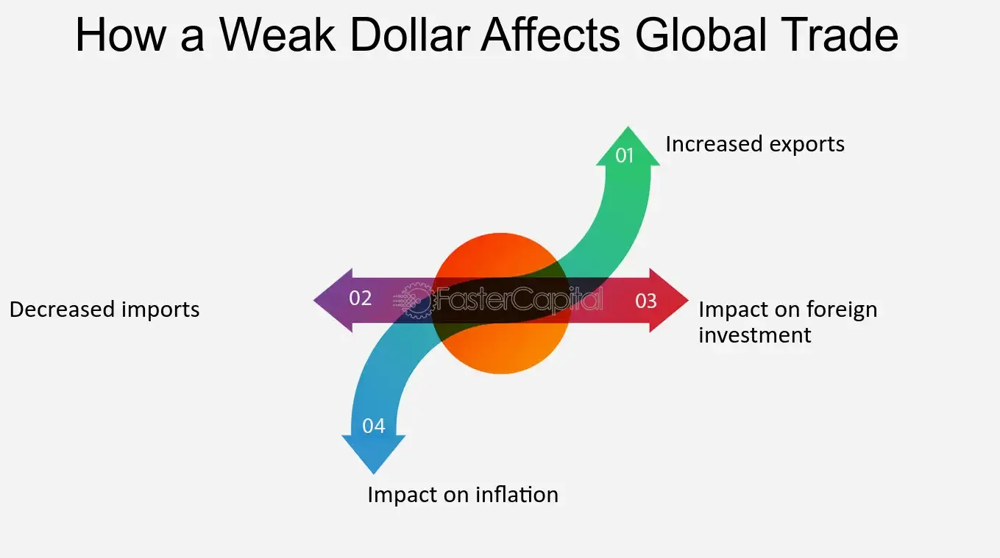

## Table of Contents

## What does it mean for the dollar to be weak?

When people say the dollar is weak, it means that the value of the U.S. dollar has gone down compared to other countries' money. This can happen for many reasons, like when the U.S. economy is not doing well or when other countries' economies are doing better. A weak dollar means you need more dollars to buy things from other countries, like cars or electronics, because those things become more expensive.

A weak dollar can have both good and bad effects. On the good side, it makes things that the U.S. makes cheaper for people in other countries to buy. This can help U.S. businesses sell more of their products abroad. But on the bad side, a weak dollar can make it more expensive for Americans to travel to other countries or buy things that are made outside the U.S. It can also make investors worried about the U.S. economy, which might lead them to move their money to other countries.

## How does a weak dollar affect the average consumer?

A weak dollar makes things from other countries more expensive for people in the U.S. When you go to the store and want to buy something that was made in another country, like a toy or a phone, you might have to pay more money for it. This is because the weak dollar means you need more dollars to buy the same amount of foreign money. So, if you like to buy things that are not made in the U.S., you might find that your money doesn't go as far as it used to.

On the other hand, a weak dollar can make traveling outside the U.S. more expensive. If you want to go on a trip to another country, you will need more dollars to buy their money, which can make your vacation cost more. But there is a good side too. If you like to buy things that are made in the U.S., they might become cheaper for people in other countries to buy. This can help U.S. businesses sell more of their products abroad, which could be good for the economy in the long run.

## What are the immediate effects of a weak dollar on the economy?

When the dollar is weak, it means that the value of the U.S. dollar has gone down compared to other countries' money. This can make things that are made in other countries more expensive for people in the U.S. to buy. For example, if you want to buy a car that was made in Japan, you might have to pay more money for it because you need more dollars to buy the same amount of Japanese money. This can affect everyday people because they might have to spend more money on things they need or want.

On the other hand, a weak dollar can make things that are made in the U.S. cheaper for people in other countries to buy. This can be good for U.S. businesses because they might be able to sell more of their products to people in other countries. However, it can also make investors worried about the U.S. economy. If they think the economy is not doing well, they might move their money to other countries, which can affect the stock market and other parts of the economy.

Overall, a weak dollar has both good and bad effects. It can make things from other countries more expensive for people in the U.S., but it can also help U.S. businesses sell more of their products abroad. The immediate effects can be seen in the prices of goods, the behavior of investors, and the overall confidence in the U.S. economy.

## How does a weak dollar influence import and export prices?

When the dollar is weak, it means that the value of the U.S. dollar has gone down compared to other countries' money. This makes things that the U.S. imports from other countries more expensive. For example, if you want to buy a toy that was made in China, you will need more dollars to buy the same amount of Chinese money. This can make the toy cost more for people in the U.S. So, a weak dollar can make imported goods more expensive for everyone.

On the other hand, a weak dollar can make things that are made in the U.S. cheaper for people in other countries to buy. This is because people in other countries need less of their money to buy the same amount of U.S. dollars. For example, if you are selling apples from the U.S. to Japan, the Japanese people will find those apples cheaper because they need less Japanese money to buy the dollars needed to pay for the apples. This can help U.S. businesses sell more of their products abroad, which can be good for the economy.

## What impact does a weak dollar have on inflation?

A weak dollar can make inflation go up. Inflation means that the prices of things you buy every day, like food and clothes, go up over time. When the dollar is weak, things that are made in other countries cost more for people in the U.S. to buy. For example, if you want to buy a shirt that was made in another country, you might have to pay more money for it because you need more dollars to buy the same amount of that country's money. This can make the prices of many things go up, which is what we call inflation.

But a weak dollar can also help some parts of the economy. It can make things that are made in the U.S. cheaper for people in other countries to buy. This can help U.S. businesses sell more of their products abroad, which can be good for the economy. However, if the prices of imported goods keep going up because of the weak dollar, it can still make inflation worse overall. So, a weak dollar can have both good and bad effects on inflation.

## How does a weak dollar affect tourism and travel?

When the dollar is weak, it can make traveling outside the U.S. more expensive for Americans. If you want to go on a trip to another country, you will need more dollars to buy their money. This means your vacation might cost more than it used to. For example, if you want to go to France, you'll need more dollars to buy euros, which can make your trip more expensive. So, a weak dollar can make it harder for Americans to travel abroad.

On the other hand, a weak dollar can make the U.S. a cheaper place for people from other countries to visit. When their money is worth more than the dollar, they can buy more things in the U.S. with the same amount of money. This can make the U.S. a more attractive place for tourists from other countries. So, while it might be more expensive for Americans to travel abroad, a weak dollar can bring more tourists to the U.S., which can be good for businesses like hotels and restaurants.

## What are the long-term economic consequences of a sustained weak dollar?

If the dollar stays weak for a long time, it can have big effects on the U.S. economy. One big effect is that it can make inflation worse. When the dollar is weak, things that come from other countries cost more for people in the U.S. to buy. This can make the prices of many things go up, like food, clothes, and cars. If prices keep going up, it can make life harder for people because their money doesn't go as far as it used to. This can also make it harder for the government to keep the economy stable.

On the other hand, a weak dollar can help some parts of the economy in the long run. It can make things that are made in the U.S. cheaper for people in other countries to buy. This can help U.S. businesses sell more of their products abroad, which can create more jobs and help the economy grow. But if the dollar stays weak for too long, it can make investors worried about the U.S. economy. They might move their money to other countries, which can hurt the stock market and make it harder for businesses to get the money they need to grow. So, a weak dollar can have both good and bad effects on the economy over time.

## How do foreign exchange markets react to a weak dollar?

When the dollar is weak, it means the U.S. dollar is worth less compared to other countries' money. This can make the foreign exchange markets very busy. People who trade money, called [forex](/wiki/forex-system) traders, start to buy and sell more because they want to make money from the changes in the dollar's value. They might sell dollars and buy other countries' money because they think those currencies will become worth more compared to the dollar. This can make the dollar's value go down even more.

A weak dollar can also make investors worried about the U.S. economy. They might think that the U.S. is not doing well and decide to move their money to other countries where the economy seems stronger. When investors move their money out of the U.S., it can make the dollar weaker. On the other hand, if other countries' economies start to do better than the U.S., their money might become worth more, which can also make the dollar weaker. So, the foreign exchange markets can react a lot to a weak dollar, with traders and investors making many changes to their money.

## What monetary policies can be used to counteract a weak dollar?

To counteract a weak dollar, the central bank, like the Federal Reserve in the U.S., can use a few different monetary policies. One way is to raise interest rates. When interest rates go up, it can make the dollar more attractive to investors because they can earn more money by keeping their money in the U.S. This can help make the dollar stronger. Another way is for the central bank to buy and sell different currencies in the foreign exchange market. If they buy dollars and sell other countries' money, it can help make the dollar worth more.

But using these policies can be tricky. Raising interest rates can slow down the economy because it makes borrowing money more expensive for businesses and people. This can make them spend less and can lead to fewer jobs. On the other hand, buying and selling currencies in the foreign exchange market can be expensive and might not work if other countries are doing the same thing. So, the central bank has to be careful and think about all the different effects when they try to make the dollar stronger.

## How does a weak dollar affect multinational corporations and their strategies?

A weak dollar can be good and bad for big companies that work in many countries, called multinational corporations. When the dollar is weak, it makes things that these companies sell in other countries cheaper for people there to buy. This can help them sell more of their products abroad and make more money. For example, if a U.S. company sells cars in Europe, a weak dollar means Europeans need less of their money to buy the same car, which can boost sales. But it can also make things that these companies need to buy from other countries more expensive. If they need parts from Japan, they will have to pay more dollars to buy the same amount of Japanese money, which can make their costs go up.

To deal with a weak dollar, multinational corporations might change their strategies. They might try to make more of their products in the U.S. to take advantage of the lower prices for people in other countries. They could also look for new ways to save money, like finding cheaper places to buy the things they need. Some companies might even use financial tools, like currency hedging, to protect themselves from the risks of a weak dollar. This means they can make deals that help them keep their costs steady even if the dollar's value changes a lot.

## What are the geopolitical implications of a weak dollar?

When the dollar is weak, it can change how other countries see the U.S. and how they act towards it. A weak dollar might make other countries think that the U.S. economy is not doing well. This can make them less likely to want to work with the U.S. on big projects or trade deals. They might also try to use the weak dollar to their advantage, like by making their own money stronger or trying to get better deals in trade talks. This can lead to more competition and tension between countries.

On the other hand, a weak dollar can also make the U.S. more dependent on other countries. If the U.S. needs to borrow money from other countries because the dollar is weak, it can give those countries more power over the U.S. They might ask for things in return, like changes in U.S. policies or more say in international decisions. This can make the U.S. less able to do what it wants on the world stage. So, a weak dollar can change the balance of power and how countries interact with each other.

## How can investors take advantage of or protect themselves from a weak dollar?

Investors can take advantage of a weak dollar by investing in things that do well when the dollar is weak. One way is to buy stocks of companies that sell a lot of their products to other countries. When the dollar is weak, these companies' products become cheaper for people in other countries to buy, which can help them sell more and make more money. Another way is to invest in foreign currencies or assets in other countries. If the dollar keeps getting weaker, the money investors have in other countries might become worth more when they change it back to dollars.

To protect themselves from a weak dollar, investors can use something called currency hedging. This is like buying insurance for their money. It helps them keep their money safe even if the dollar's value changes a lot. They can also invest in things that usually go up in price when the dollar is weak, like gold or other precious metals. These things can help protect their money because they often become more valuable when the dollar is not doing well. By using these strategies, investors can try to make the best of a weak dollar or keep their money safe from its effects.

## References & Further Reading

[1]: Bergstra, J., Bardenet, R., Bengio, Y., & Kégl, B. (2011). ["Algorithms for Hyper-Parameter Optimization."](https://dl.acm.org/doi/10.5555/2986459.2986743) Advances in Neural Information Processing Systems 24.

[2]: ["Advances in Financial Machine Learning"](https://www.amazon.com/Advances-Financial-Machine-Learning-Marcos/dp/1119482089) by Marcos Lopez de Prado

[3]: ["Evidence-Based Technical Analysis: Applying the Scientific Method and Statistical Inference to Trading Signals"](https://www.amazon.com/Evidence-Based-Technical-Analysis-Scientific-Statistical/dp/0470008741) by David Aronson

[4]: ["Machine Learning for Algorithmic Trading"](https://github.com/stefan-jansen/machine-learning-for-trading) by Stefan Jansen

[5]: ["Quantitative Trading: How to Build Your Own Algorithmic Trading Business"](https://www.amazon.com/Quantitative-Trading-Build-Algorithmic-Business/dp/1119800064) by Ernest P. Chan

[6]: ["Currency Wars: The Making of the Next Global Crisis"](https://archive.org/details/currencywarsmaki0000rick) by James Rickards

[7]: ["Exchange Rates and International Finance"](https://novapublishers.com/shop/foreign-exchange-rates-and-international-finance/) by Laurence Copeland

[8]: ["Algorithmic and High-Frequency Trading"](https://www.amazon.com/Algorithmic-High-Frequency-Trading-Mathematics-Finance/dp/1107091144) by Álvaro Cartea, Sebastian Jaimungal, and José Penalva