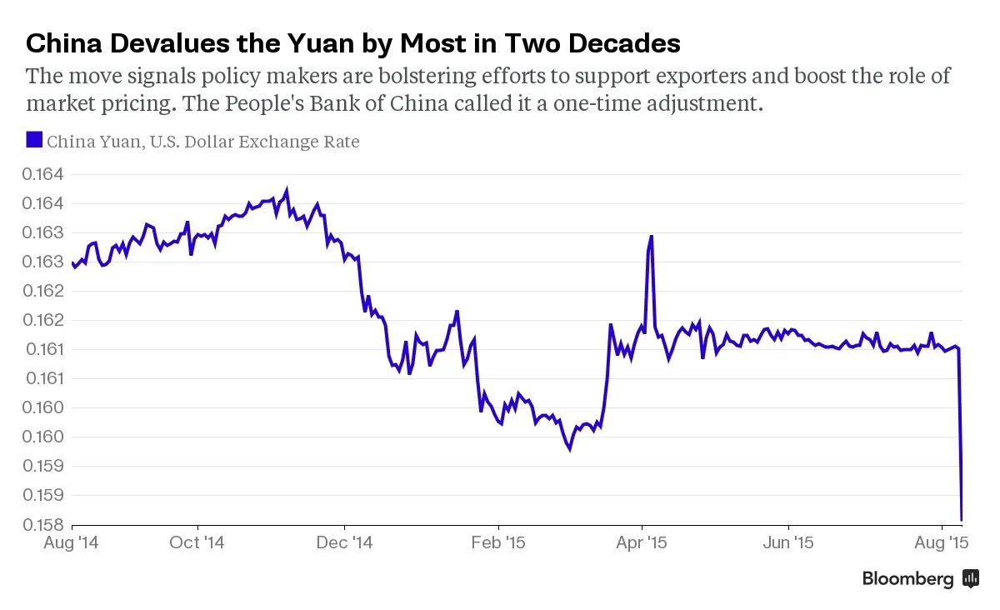

## Table of Contents

## What was China's 2015 Yuan devaluation?

In 2015, China decided to change the value of its money, called the Yuan. They made it worth less compared to other countries' money. This happened on August 11, 2015. China did this to help their businesses sell more things to other countries because their products would be cheaper. But it also made some people worried because it could affect the world's money markets.

After China made the Yuan worth less, many people around the world started to worry. They thought it might cause problems in other countries' economies. Some countries' money also became worth less because of this. The stock markets in many places went down, and people were unsure about what would happen next. China said they did this to make their money system work better, but it caused a lot of talk and worry around the world.

## Why did China decide to devalue the Yuan in 2015?

China decided to devalue the Yuan in 2015 because they wanted to help their businesses sell more things to other countries. When the Yuan is worth less, Chinese products become cheaper for people in other countries to buy. This can make more people want to buy things from China, which can help Chinese businesses grow. Also, China wanted to make their money system work better. They thought that by changing the value of the Yuan, it would be easier for them to control their money and make their economy stronger.

However, this decision made a lot of people around the world worried. When China made the Yuan worth less, it affected other countries' money too. Some countries' money also became worth less, and this caused problems in their economies. The stock markets in many places went down because people were unsure about what would happen next. Even though China said they did this to improve their money system, it caused a lot of talk and worry around the world.

## How was the Yuan devaluation implemented?

In 2015, China decided to make the Yuan worth less. They did this by changing the way they set the value of the Yuan every day. Before, they used a special rate called the "central parity rate" to decide how much the Yuan was worth. But on August 11, 2015, they said they would use the price of the Yuan in the market more to set this rate. This meant the Yuan's value would be more based on what people were willing to pay for it, and it made the Yuan worth less compared to other countries' money.

This change was a surprise to a lot of people. China did it to help their businesses sell more things to other countries because their products would be cheaper. But it also made some people worried. When the Yuan became worth less, it affected other countries' money too. Some countries' money also became worth less, and this caused problems in their economies. The stock markets in many places went down because people were unsure about what would happen next.

## What were the immediate effects of the Yuan devaluation on China's economy?

When China made the Yuan worth less in 2015, it had quick effects on their economy. Chinese businesses that sold things to other countries got a boost because their products became cheaper. This made more people around the world want to buy things from China, which helped these businesses grow. But at the same time, it made things that China buys from other countries more expensive. This could hurt businesses in China that need to import things to make their products.

The devaluation also made people in China worried about their money. Some people started taking their money out of banks and moving it to other countries because they were afraid the Yuan would keep losing value. This made the Chinese government worried because they wanted people to keep their money in China. The stock market in China also went down a lot right after the devaluation. This was because people were unsure about what would happen next and they started selling their stocks.

## How did the Yuan devaluation affect global financial markets?

When China made the Yuan worth less in 2015, it caused a lot of worry in global financial markets. People around the world were not sure what would happen next, so they started selling their stocks. This made stock markets in many countries go down. Some countries' money also became worth less because of what China did. This made it harder for these countries to buy things from other places because their money was not as strong.

The devaluation also made people worried about the world's economy. They were afraid that China's move could make other countries' economies weaker. Banks and businesses around the world started to be more careful about how they spent their money. They were worried that if China's economy got worse, it could affect everyone. So, they tried to protect themselves by holding onto their money more tightly. This made the global financial markets more nervous and unsure.

## What were the short-term impacts on international trade due to the Yuan devaluation?

When China made the Yuan worth less in 2015, it had quick effects on international trade. Chinese products became cheaper for people in other countries to buy. This meant more people wanted to buy things from China, which helped Chinese businesses sell more. But it also made things that other countries sell to China more expensive. This could hurt businesses in other countries because they might sell less to China. Some countries even put up new rules to protect their own businesses from the cheaper Chinese products.

The devaluation also made some countries worried about their own money. When the Yuan became worth less, other countries' money also became worth less compared to the Yuan. This made it harder for them to buy things from China. Some countries started to buy less from China because their money was not as strong. This change in trade patterns caused some confusion and worry in the world of international trade. People were not sure what would happen next, so they started being more careful with their money and trade.

## How did the Yuan devaluation influence China's export competitiveness?

When China made the Yuan worth less in 2015, it helped Chinese businesses sell more things to other countries. Their products became cheaper for people in other places to buy. This made more people want to buy things from China, which helped Chinese businesses grow and sell more. It was good for China's export competitiveness because their products were more attractive to buyers around the world.

But making the Yuan worth less also had some problems. It made things that China buys from other countries more expensive. This could hurt businesses in China that need to import things to make their products. Also, other countries started to worry about their own money. When the Yuan became worth less, other countries' money also became worth less compared to the Yuan. This made it harder for them to buy things from China, and some countries started to buy less from China because their money was not as strong.

## What were the long-term economic consequences for China following the Yuan devaluation?

After China made the Yuan worth less in 2015, it had some big effects on their economy over time. One big thing that happened was that China's exports grew because their products were cheaper for people in other countries to buy. This helped Chinese businesses sell more things and make more money. But it also made things that China buys from other countries more expensive. This could hurt businesses in China that need to import things to make their products. Over time, China had to work hard to balance these effects and keep their economy strong.

Another long-term effect was that people started to worry more about the value of the Yuan. Some people in China took their money out of banks and moved it to other countries because they were afraid the Yuan would keep losing value. This made the Chinese government worried because they wanted people to keep their money in China. The government had to make new rules and plans to make people feel better about the Yuan. Over time, they tried to make the Yuan's value more stable so that people would trust it more. This was a big challenge for China, but they worked to make their economy stronger and more stable in the long run.

## How did the Yuan devaluation impact foreign investment in China?

When China made the Yuan worth less in 2015, it made some foreign investors worried. They were not sure if their money would be safe in China because the value of the Yuan was changing. Some investors decided to take their money out of China and move it to other countries where they thought it would be safer. This made less foreign money come into China, which can slow down their economy. The Chinese government had to work hard to make investors feel better about putting their money in China.

Over time, China made new rules and plans to make the Yuan more stable. They wanted to show foreign investors that China was a good place to put their money. Even though some investors were still careful, others started to see that China was working to fix the problems. Slowly, more foreign money started coming back into China. But it took time and effort for China to rebuild trust with foreign investors after the Yuan devaluation.

## What were the responses of other countries to China's Yuan devaluation?

When China made the Yuan worth less in 2015, other countries were worried. They thought it might make their own money weaker and hurt their economies. Some countries, like the United States, talked to China about it. They wanted to know why China did this and what it would mean for the world. Other countries started to be more careful with their money. They made new rules to protect their businesses from the cheaper Chinese products that were now easier to buy.

Some countries also decided to change the value of their own money. They made their money worth less too, hoping it would help their businesses sell more things like China was doing. But this made the world's money markets even more unsure. Everyone was trying to figure out what would happen next. Over time, countries worked together to make the world's money system more stable. They talked a lot and made plans to help each other's economies stay strong, even after China's big change to the Yuan.

## How did the 2015 Yuan devaluation fit into China's broader economic strategy?

When China made the Yuan worth less in 2015, it was part of a bigger plan to help their economy. They wanted to make their products cheaper for people in other countries to buy. This could help Chinese businesses sell more things and grow. China also wanted to make their money system work better. They thought that by changing the value of the Yuan, it would be easier for them to control their money and make their economy stronger. But this move was a surprise to a lot of people and caused a lot of worry around the world.

The devaluation was also about trying to fix some problems in China's economy. For a long time, China had been growing very fast, but it was getting harder to keep that up. They needed new ways to keep their economy strong. Making the Yuan worth less was one way to do that. But it also made some people in China worried about their money. The Chinese government had to work hard to make people feel better about the Yuan and to make their economy more stable. Over time, they tried different things to keep their economy growing and to make sure their money was trusted around the world.

## What lessons can be learned from China's 2015 Yuan devaluation for future economic policy?

One big lesson from China's 2015 Yuan devaluation is that big changes to money can cause a lot of worry around the world. When China made the Yuan worth less, it made people in other countries scared about their own money. This made stock markets go down and made everyone unsure about what would happen next. So, if a country wants to change the value of its money, it needs to be very careful. They should talk to other countries first and explain why they are doing it. This can help make the change smoother and less scary for everyone.

Another lesson is that making your money worth less can help your businesses sell more things to other countries. But it can also make things you buy from other countries more expensive. This can hurt businesses that need to import things. So, a country needs to think about all the good and bad things that can happen before they make their money worth less. They should have a plan to help businesses that might get hurt. This way, they can make sure the change helps more than it hurts.

A final lesson is about trust. When China made the Yuan worth less, it made some people in China and around the world worried about the value of their money. This made some people take their money out of China. To keep trust, a country needs to be clear about why they are changing their money's value and what they are doing to make it stable. They should work hard to make people feel safe about their money. This can help keep the economy strong and make people trust the country's money more in the future.

## References & Further Reading

[1]: Luo, Z., Peng, H., & Zhang, P. (2016). ["The Impacts of the RMB’s Fluctuation on International Stock Markets."](https://www.sciencedirect.com/science/article/pii/S092633732030429X) Applied Economics Letters, 23(10), 729-734.

[2]: Bhagwati, J. (1988). ["Protectionism."](https://www.cambridge.org/core/journals/american-political-science-review/article/abs/protectionism-by-jagdish-bhagwati-cambridge-mit-press-1988-147p-1695-resisting-protectionism-global-industries-and-the-politics-of-international-trade-by-helen-v-milner-princeton-princeton-university-press-1988-329p-2950/08CD99AE95D30A2BBEC60C3F27DF48C9) MIT Press.

[3]: Khandani, A. E., & Lo, A. W. (2007). ["What Happened To The Quants In August 2007?"](https://web.mit.edu/Alo/www/Papers/august07.pdf) National Bureau of Economic Research.

[4]: Lopez de Prado, M. (2018). ["Advances in Financial Machine Learning."](https://www.amazon.com/Advances-Financial-Machine-Learning-Marcos/dp/1119482089) John Wiley & Sons.

[5]: Chan, E. P. (2009). ["Quantitative Trading: How to Build Your Own Algorithmic Trading Business."](https://github.com/ftvision/quant_trading_echan_book) John Wiley & Sons.