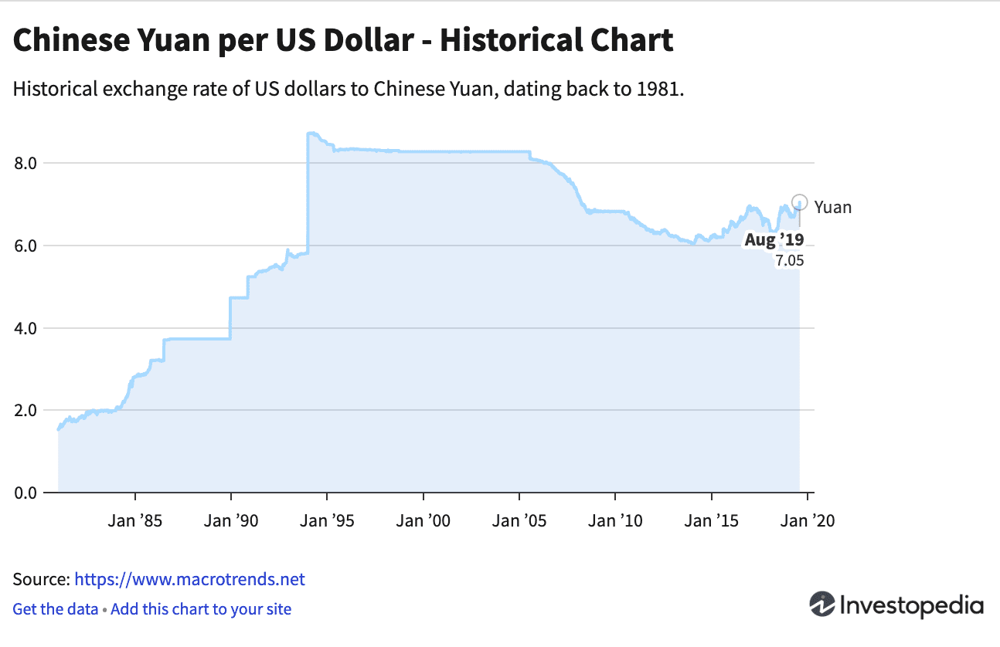

In August 2015, the People's Bank of China made a strategic move by devaluing the Yuan, an action that sent shockwaves through global financial markets. This decision represented the largest devaluation of the Chinese currency in over two decades, fundamentally altering the landscape of international finance. At its core, the devaluation was intended to bolster China's export competitiveness by making its goods more affordable to international buyers, thus stimulating economic growth in the face of slowing domestic expansion.

The devaluation had profound implications for algorithmic trading, a sector characterized by its capacity to quickly adjust to market changes through the use of advanced, automated trading strategies. With currency values influencing a wide array of economic indicators, algorithmic traders found themselves navigating unprecedented volatility. This required a rapid recalibration of algorithms to accommodate new market realities, highlighting the complex interrelationship between macroeconomic events and trading technologies.



The rationale for the Yuan's devaluation was multifaceted. China aimed to transition towards a more market-oriented exchange rate mechanism, aligning with global financial norms. Meanwhile, external pressures, such as declining domestic growth rates and mounting global trade tensions, necessitated intervention to maintain economic equilibrium.

Understanding the economic impact of the Yuan's devaluation and its specific effects on algorithmic trading is critical for financial market stakeholders. It underscores the importance of agility and strategic foresight in an increasingly interconnected global economy. As macroeconomic events continue to exert significant influence over trading dynamics, stakeholders must be equipped to manage the complexities of these shifts effectively. This comprehension is vital for navigating the constantly evolving landscape of modern financial markets.

## Table of Contents

## Background of the Yuan Devaluation

The People's Bank of China (PBOC) strategically devalued the Chinese Yuan on August 11, 2015, resulting in the steepest depreciation of the currency in over 20 years. This move was primarily aimed at bolstering China's export competitiveness by making its goods more affordable on the global market. In the years leading up to this decision, China experienced a notable slowdown in its economic growth. While the country had previously enjoyed rapid industrial expansion, by 2015, this growth had decelerated significantly, raising concerns about the sustainability of its economic model. Additionally, external market pressures contributed to the decision. China's major trading partners, including the United States and the European Union, were experiencing varying degrees of economic challenges, thereby affecting demand for Chinese exports.

The devaluation was also a step towards adopting a more market-oriented exchange rate mechanism. Prior to this, China's currency policy was characterized by a managed float system where the PBOC closely regulated the Yuan's value against other currencies. The devaluation signaled a shift towards allowing market forces to play a more significant role in determining the Yuan's exchange rate, aligning with China's long-term objective of integrating further into the global financial system and its inclusion in the International Monetary Fund's (IMF) Special Drawing Rights basket.

The market's initial reaction to the Yuan's devaluation was significant and immediate. Global stock markets experienced a sharp downturn, as investors reacted to the unexpected policy shift. Many feared that this could initiate a currency war, where countries competitively devalue their currencies to gain trade advantages, potentially destabilizing global trade and financial markets. The move also triggered volatile fluctuations in currency markets, prompting concerns over the economic stability of emerging markets tied closely to China. These reactions underscored the crucial role of the Yuan in the interconnected global economy and heightened awareness of the potential implications of China's economic policy decisions on world markets.

## Global Economic Impact

The devaluation of the Yuan by the People's Bank of China in August 2015 sent significant tremors across the global economic landscape. One of the most immediate effects was felt in emerging markets, which often rely heavily on capital inflows to sustain their economies. The sudden shift in China's currency policy led to increased capital outflows from these markets as investors sought refuge in more stable currencies and economies. This exodus of capital caused local currencies to depreciate, exacerbating financial instability and inflationary pressures in emerging economies.

Commodities, often denominated in U.S. dollars, experienced a marked decline in prices following the Yuan's devaluation. This decline was largely due to market perceptions of reduced demand from China, a major global consumer of raw materials. As a result, economies that are heavily reliant on commodity exports, such as those in Latin America and Africa, faced significant economic challenges. The drop in commodity prices led to reduced revenues for these countries, hampering their economic growth prospects and fiscal health.

Central banks worldwide were prompted to take measures aimed at stabilizing their respective currencies and economies in response to the Yuan's devaluation. The uncertainty and [volatility](/wiki/volatility-trading-strategies) induced by China's currency move compelled many central banks to either adjust their interest rates or intervene directly in foreign exchange markets to prevent excessive currency depreciations. These actions were necessary to mitigate potential adverse impacts on their economies, such as increased inflation or financial market instability.

This series of interconnected events underscored the profound interdependence of global financial systems. The ripple effects of the Yuan's devaluation demonstrated that major currency fluctuations have the potential to disrupt a wide array of economic sectors across the world. It highlighted the intricate linkages between global markets and the need for coordinated responses to macroeconomic shocks, emphasizing the importance of maintaining international financial stability.

## Impact on Algorithmic Trading

Algorithmic trading systems rely on advanced mathematical models and high-speed computing to execute trades based on market data. The unexpected devaluation of the Yuan in 2015 posed significant challenges and opportunities for these systems. The immediate volatility triggered by the devaluation tested the adaptability and resilience of [algorithmic trading](/wiki/algorithmic-trading) models.

### Challenges and Opportunities

When the Yuan's value dropped, algorithmic trading systems faced increased market volatility. The sudden shifts in currency values necessitated rapid recalibrations in trading algorithms to maintain their effectiveness. This was particularly critical for models designed to minimize risks and optimize trade execution.

The devaluation resulted in increased currency pairs' volatility, directly affecting algorithms that involved foreign exchange trades. The real-time data fluctuations required algorithms to adjust trading thresholds and reevaluate risk parameters continuously. While this presented a challenge, it also provided opportunities for traders who could swiftly adapt their strategies to capitalize on the market's fast-paced movements.

### Recalibration of Trading Algorithms

Recalibrating trading algorithms involves adjusting various parameters and models to better respond to new market conditions. For instance, volatility-based strategies might have required modifications in their volatility estimation techniques to account for the increased fluctuation levels. A common approach is the use of Exponentially Weighted Moving Averages (EWMA) to adjust volatility estimates.

```python
import numpy as np

# Example of recalibration using EWMA for volatility estimation
def ewma_volatility(returns, span):
    return returns.ewm(span=span, min_periods=1).std()

# Simulate returns data
returns_data = np.random.randn(100) * 0.01  # Random returns for simulation
span = 10  # Span for EWMA

volatility_estimate = ewma_volatility(returns_data, span)
```

### Role of High-Frequency Trading

High-frequency trading ([HFT](/wiki/high-frequency-trading-strategies)) played a crucial role in amplifying market reactions during the Yuan's devaluation. HFT systems, operating at microsecond-level speeds, can quickly react to market changes, often exacerbating price movements due to their sheer [volume](/wiki/volume-trading-strategy) of trades and the execution speed.

The rapid succession of trades executed by these systems can lead to increased [liquidity](/wiki/liquidity-risk-premium) but also increase short-term volatility. This was evident in the immediate aftermath of the Yuan's devaluation when a surge in trading activities was observed. HFT strategies needed to incorporate new data points and adjust algorithms to manage the heightened risks effectively.

### Enhancing Models and Risk Management

To improve algorithmic models and fortify risk management strategies, it is essential for algo traders to integrate adaptive learning techniques. Machine learning can be leveraged to analyze massive datasets, identify patterns, and forecast potential market shifts more accurately.

Implementing features like real-time risk monitoring and incorporating stress-testing frameworks can help anticipate adverse conditions and adjust strategies accordingly. These methodologies enable trading systems to maintain robustness against unexpected market upheavals, such as those seen during the Yuan's devaluation.

The events of 2015 underscored the need for algorithmic trading systems to be agile and responsive to abrupt market events. By continuously improving models and implementing sophisticated risk management practices, traders can better navigate the complexities of financial markets.

## Lessons Learned and Future Implications

The 2015 devaluation of the Yuan emerged as a critical examination point for algorithmic trading systems. The rapid depreciation tested the limits of these systems, many of which were designed to function optimally under predictable market conditions. The key lesson for algorithmic traders was recognizing the necessity of developing flexible algorithms capable of swiftly adapting to unforeseen macroeconomic events like currency devaluations. 

The rigid nature of many trading algorithms at the time meant they struggled to cope with the sudden volatility. Hence, financial institutions have since emphasized creating adaptable models that can redefine parameters in response to real-time data inputs. These adaptive models incorporate [machine learning](/wiki/machine-learning) techniques that allow them to learn from past data and improve decision-making processes dynamically.

As [artificial intelligence](/wiki/ai-artificial-intelligence) (AI) continues to advance, there is substantial potential for enhancing the predictive capabilities of algorithmic trading. AI advancements such as natural language processing (NLP) and [deep learning](/wiki/deep-learning) can analyze vast datasets, including market news and economic indicators, to forecast currency movements and inform trading decisions. For instance, AI systems could parse through geopolitical news to assess probable impacts on currency stability, thus enabling algorithms to preempt shifts in market trends.

Looking forward, the possibility of future currency devaluations remains a pertinent consideration for algorithmic strategies. Events like geopolitical tension, trade wars, or global financial crises could precipitate similar scenarios, testing the resilience of trading algorithms again. Algorithms need to be programmed with a robust risk management framework capable of simulating diverse economic conditions and potential devaluation scenarios.

Moreover, ongoing learning and updating of algorithmic systems are crucial in the rapidly changing field of algorithmic trading. Traders must ensure their systems are equipped with the latest technologies and insights into economic indicators. Regular system audits and upgrades can prevent stagnation and enhance the ability to cope with the dynamism of global financial markets.

In summary, the Yuan devaluation incident underscores the importance of flexibility, foresight, and technological integration in algorithmic trading. Financial institutions must remain vigilant, consistently upgrading their predictive analytics and algorithmic strategies to maintain resilience in the face of potential economic disruptions.

## Conclusion

The 2015 devaluation of the Yuan was a pivotal event in global economic history, leading to both short-term disturbances and long-term recalibrations within financial markets. As the People's Bank of China took bold steps to devalue its currency, international markets felt immediate ripples highlighting their interconnectedness. This event underscored the critical function of algorithmic traders who managed real-time reactions to the shifting currency values.

For participants in today's intricate financial ecosystem, agility and strategic foresight are paramount. Algorithmic traders, equipped with advanced technological tools, were tasked with swiftly responding to the volatility sparked by the Yuan's devaluation. This period illustrated the necessity of employing adaptable algorithms capable of processing macroeconomic changes. Moreover, it emphasized the importance of continuously upgrading trading systems to address unforeseen challenges.

The lessons learned from this devaluation are invaluable for risk and volatility management, particularly within sophisticated trading technologies. Effective use of predictive models and enhanced risk management strategies have since become crucial for stakeholders aiming to secure their positions amidst market shifts.

As global markets remain in flux, stakeholders must maintain vigilance, ready to deploy technology in navigating economic transformations. The incident serves as a reminder that preparation, powered by innovation, remains vital in adapting to and thriving during major economic events.

## References & Further Reading

[1]: Luo, Z., Peng, H., & Zhang, P. (2016). ["The Impacts of the RMB’s Fluctuation on International Stock Markets."](https://www.sciencedirect.com/science/article/pii/S092633732030429X) Applied Economics Letters, 23(10), 729-734.

[2]: Bhagwati, J. (1988). ["Protectionism."](https://www.cambridge.org/core/journals/american-political-science-review/article/abs/protectionism-by-jagdish-bhagwati-cambridge-mit-press-1988-147p-1695-resisting-protectionism-global-industries-and-the-politics-of-international-trade-by-helen-v-milner-princeton-princeton-university-press-1988-329p-2950/08CD99AE95D30A2BBEC60C3F27DF48C9) MIT Press.

[3]: Khandani, A. E., & Lo, A. W. (2007). ["What Happened To The Quants In August 2007?"](https://web.mit.edu/Alo/www/Papers/august07.pdf) National Bureau of Economic Research.

[4]: Lopez de Prado, M. (2018). ["Advances in Financial Machine Learning."](https://www.amazon.com/Advances-Financial-Machine-Learning-Marcos/dp/1119482089) John Wiley & Sons.

[5]: Chan, E. P. (2009). ["Quantitative Trading: How to Build Your Own Algorithmic Trading Business."](https://github.com/ftvision/quant_trading_echan_book) John Wiley & Sons.