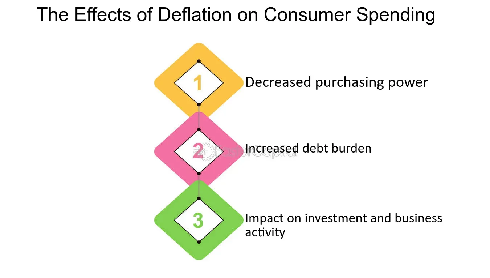

## Table of Contents

## What is deflation?

Deflation is when the prices of things we buy, like food and clothes, go down over time. It's the opposite of inflation, where prices go up. When deflation happens, people might wait to buy things because they think prices will be even lower later. This can slow down the economy because businesses sell less and might have to cut jobs.

Deflation can also make debts harder to pay back. If you borrowed money, the amount you owe stays the same, but your money becomes worth more. This sounds good, but if your income goes down because of the slowing economy, it can be tough to pay back what you owe. Governments and central banks try to avoid deflation because it can lead to a cycle of less spending and more economic problems.

## How does deflation affect the general price level?

Deflation makes the general price level go down. This means that over time, the things you buy, like groceries or clothes, cost less money. When prices are falling, people might decide to wait before buying things because they think the prices will drop even more. This waiting can make businesses sell less stuff, so they might lower prices even more to try to sell their products.

When prices keep going down like this, it can hurt the economy. Businesses might make less money and could have to let workers go or pay them less. This can make people have less money to spend, which makes the problem worse. Also, if people have loans, the money they owe doesn't change, but their money becomes worth more. This can make it harder to pay back loans if their income goes down because of the slowing economy.

## What are the immediate effects of deflation on consumer spending?

When deflation happens, the immediate effect on consumer spending is that people tend to hold off on buying things. They think that prices will keep going down, so they wait to get a better deal later. This waiting can slow down the economy because if everyone is waiting, businesses sell less and might have to lower prices even more.

This cycle can make people spend even less. If businesses are selling less, they might cut jobs or reduce workers' hours, which means people have less money to spend. When people have less money, they cut back on buying things, which makes the deflation problem worse. So, deflation can lead to a situation where everyone is spending less and the economy slows down.

## How does deflation influence consumer confidence?

Deflation can make people feel less confident about spending money. When prices are going down, people start to think that if they wait a little longer, they can buy things for even less money. This makes them hold off on buying things now, which can slow down the economy. If everyone is waiting to spend, businesses sell less, and this can make people worry about their jobs and the economy.

When people are worried about the economy, they might save their money instead of spending it. This saving can make deflation worse because if no one is buying, prices have to keep going down. So, deflation can create a cycle where people feel less confident about spending, which makes the economy weaker and can lead to more deflation.

## Can deflation lead to changes in consumer borrowing behavior?

Deflation can make people borrow less money. When prices are going down, people might think that waiting to buy things is a good idea because they can get them cheaper later. If people are not buying as much, businesses sell less, and the economy can slow down. When the economy slows down, people might worry about losing their jobs or making less money. This worry can make them not want to borrow money because they are not sure they can pay it back.

Also, if people do have loans when deflation happens, it can make paying them back harder. The amount of money they owe stays the same, but because prices are going down, the money they earn might not go as far. If their income goes down because of the slowing economy, paying back the loan becomes even tougher. So, people might decide to borrow less to avoid getting into a situation where they can't pay back what they owe.

## What are the long-term impacts of deflation on consumer purchasing power?

Deflation can make your money worth more over time because prices keep going down. If you have saved money, this can be good because you can buy more with it later. But if you are working and [earning](/wiki/earning-announcement) money, deflation can make it harder to get raises or higher wages. This means your income might not grow as fast as the value of money is growing, so you might not feel like you have more buying power even though prices are lower.

In the long run, deflation can hurt the economy and make it harder for people to buy things. When businesses see that people are not buying as much because they are waiting for even lower prices, they might sell less and have to lay off workers or cut their hours. This can make people have less money to spend, which makes the problem worse. So, even though prices are going down, if people are earning less and feeling less sure about the economy, their overall buying power might not get better and could even get worse.

## How does deflation affect different sectors of the economy and subsequently consumer behavior?

Deflation impacts different parts of the economy in different ways. For example, the manufacturing sector might struggle because if people are waiting to buy things until prices drop even more, factories make less stuff and might have to lay off workers. This can make the workers have less money to spend, which hurts other businesses like stores and restaurants. On the other hand, sectors like savings and investment might see some benefits because money becomes worth more over time, so people who have saved money can buy more with it later. But overall, most businesses don't like deflation because it can lead to less spending and slower growth.

Deflation can change how people behave when they buy things. When prices are going down, people might decide to wait before buying something because they think it will be cheaper later. This waiting can make businesses sell less, so they might lower prices even more, which makes people wait longer. This cycle can make the economy slow down because if everyone is waiting to spend, businesses make less money and might have to cut jobs. When people are worried about their jobs and the economy, they might save more and spend less, which can make deflation worse and lead to a cycle where everyone is spending less and feeling less sure about the future.

## What historical examples illustrate the effects of deflation on consumers?

One big example of deflation happened in the United States during the Great Depression in the 1930s. Prices kept going down, and people lost their jobs. When people saw prices dropping, they waited to buy things, hoping they would get even cheaper. This waiting made businesses sell less, so they had to cut prices more and lay off more workers. People who had loans found it hard to pay them back because their money was worth more, but they were making less. This made people feel unsure about spending money, and the economy got worse.

Another example is Japan in the 1990s and early 2000s, known as the "Lost Decade." Prices started going down, and people thought waiting to buy things was a good idea. This made businesses sell less, and the economy slowed down. People saved more and spent less, which made deflation worse. Many people didn't get raises, so even though prices were lower, they didn't feel like they had more money to spend. This long period of deflation made it hard for the economy to grow and for people to feel good about spending.

## How do consumers adapt their financial strategies during periods of deflation?

When prices start to go down because of deflation, people often change how they handle their money. They might decide to wait before buying things because they think prices will drop even more. This waiting can help them save money on what they buy, but it can also make businesses sell less, which can slow down the economy. People might also save more money instead of spending it, thinking that their money will be worth more later. This saving can make them feel safer, especially if they are worried about losing their jobs or the economy getting worse.

Another way people adapt during deflation is by being very careful with borrowing money. If they have loans, they know that the money they owe stays the same, but the money they earn might not go as far because prices are going down. So, they might try to pay off their loans faster or avoid taking out new loans. This careful approach can help them avoid getting into money trouble if the economy keeps slowing down. Overall, during deflation, people tend to spend less, save more, and be very cautious about borrowing, all to make sure they can handle whatever happens with the economy.

## What role do government policies play in mitigating the effects of deflation on consumers?

Governments can help stop deflation by using different policies. One way is by spending more money on things like building roads or schools. This spending can help businesses sell more and hire more workers, which means people have more money to spend. Another way is by lowering taxes, so people and businesses have more money to spend or invest. When people spend more, it can stop prices from going down and help the economy grow.

Central banks, which are part of the government, can also help by making it easier for people and businesses to borrow money. They do this by lowering interest rates, which makes loans cheaper. When borrowing is cheaper, people might spend more, and businesses might invest more, which can help stop deflation. Governments can also talk to people about the economy, making them feel more sure about spending money instead of waiting for prices to drop even more. By doing these things, governments can help make sure that deflation doesn't hurt consumers too much.

## How can deflation impact the global economy and international consumers?

Deflation in one country can affect the whole world because countries trade with each other. If prices are going down in one place, people there might buy less from other countries. This can make businesses in other countries sell less and maybe even lay off workers. If many countries are facing deflation at the same time, it can slow down the whole world's economy. People everywhere might start saving more and spending less, waiting for prices to go down even more, which can make the problem worse.

For people all over the world, deflation can make them change how they spend their money. They might wait to buy things, thinking they will be cheaper later. This waiting can hurt businesses everywhere because if no one is buying, businesses have to lower prices even more. If people are worried about their jobs because the economy is slowing down, they might save more and spend less. This can make deflation worse and lead to a situation where everyone is spending less and feeling unsure about the future.

## What advanced economic theories explain the nuanced effects of deflation on consumer behavior?

One advanced economic theory that helps explain how deflation affects what people buy is the "Fisher effect." This theory, named after economist Irving Fisher, says that when prices go down, people might think their money will be worth more later, so they save it instead of spending it. This saving can make deflation worse because if everyone is waiting to spend, businesses sell less and might have to lower prices even more. The Fisher effect shows how people's belief that their money will be worth more can lead to a cycle where everyone waits to spend, making the economy slow down.

Another theory is called the "[liquidity](/wiki/liquidity-risk-premium) trap," which was talked about a lot by economist John Maynard Keynes. A liquidity trap happens when interest rates are very low, and people still don't want to borrow money or spend it. During deflation, people might think prices will keep going down, so they save their money instead of spending or borrowing. This saving can make the economy slow down even more because if no one is buying, businesses sell less, and prices have to go down even more. The liquidity trap shows how deflation can make people so unsure about spending that even low interest rates can't get them to spend more, making the economy stuck in a slow cycle.

## References & Further Reading

[1]: Bordo, M. D., & Filardo, A. (2005). ["Deflation and Monetary Policy in a Historical Perspective: Remembering the Past or Being Condemned to Repeat It?"](https://www.jstor.org/stable/3601059) National Bureau of Economic Research.

[2]: Eggertsson, G., & Krugman, P. (2012). ["Debt, Deleveraging, and the Liquidity Trap: A Fisher-Minsky-Koo Approach."](https://www.princeton.edu/~pkrugman/debt_deleveraging_ge_pk.pdf) The Quarterly Journal of Economics, 127(3), 1469-1513.

[3]: McCulley, P. (2009). ["The Shadow Banking System and Hyman Minsky's Economic Journey."](https://rpc.cfainstitute.org/-/media/documents/book/rf-publication/2009/rf-v2009-n5-15.pdf) Global Interdependence Center.

[4]: Nagel, S. (2003). ["Financial Cycles and the Real Effects of Bank Lending."](https://casetext.com/case/nagel-v-glob-growth-holdings) The Review of Financial Studies, 19(2), 425-467.

[5]: Chen, H., & Perry, S. (2019). ["Algorithmic Trading: Opportunities and Challenges."](https://www.europarl.europa.eu/RegData/etudes/STUD/2019/624261/EPRS_STU(2019)624261_EN.pdf) ACM Digital Library.

[6]: ["Adaptive Markets: Financial Evolution at the Speed of Thought"](https://www.jstor.org/stable/j.ctvc7778k) by Andrew W. Lo

[7]: Ullah, S. (2021). ["The Role of Algorithmic Trading in Financial Markets."](https://pubs.aip.org/aip/acp/article/2919/1/090014/3279012/The-role-of-algorithmic-trading-in-the) Investment Analysts Journal, 50(1), 98-111.