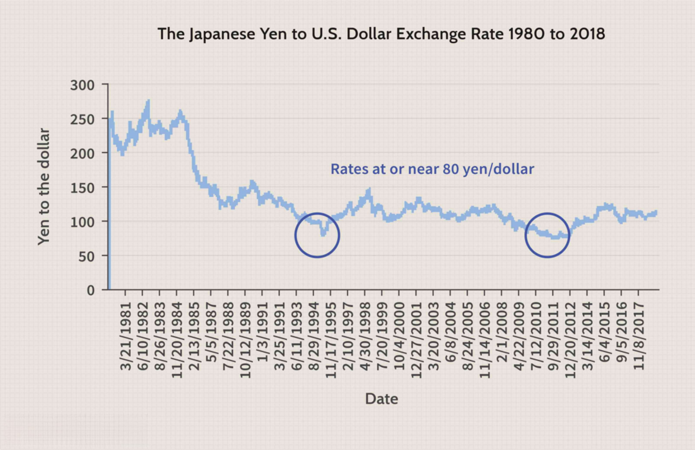

## Table of Contents

## What is an exchange rate?

An exchange rate is the value of one country's currency compared to another country's currency. It tells you how much of one currency you need to get one unit of another currency. For example, if the exchange rate between the US dollar and the Euro is 1 USD = 0.85 EUR, it means you need 0.85 Euros to get 1 US dollar.

Exchange rates change all the time because of many reasons like how well a country's economy is doing, interest rates, and even big events happening around the world. If a country's economy is strong, its currency might become more valuable. On the other hand, if a country is going through tough times, its currency might become less valuable. People who trade currencies, like banks and businesses, watch these rates closely because they affect how much things cost when you buy or sell them in different countries.

## How does the exchange rate affect Japan's economy?

The exchange rate has a big impact on Japan's economy. When the Japanese yen is strong, it means that other countries need more of their own money to buy yen. This can make Japanese products, like cars and electronics, more expensive for people in other countries. As a result, fewer people might buy these products, which can hurt Japan's exports. Japan relies a lot on exporting goods, so a strong yen can slow down the economy.

On the other hand, a weak yen makes Japanese products cheaper for foreigners to buy. This can boost Japan's exports because more people around the world can afford Japanese goods. However, a weak yen also means that things Japan imports, like oil and food, become more expensive. This can lead to higher prices for things inside Japan, which might make life harder for people living there. So, the exchange rate is a balancing act for Japan's economy, affecting both what they sell to the world and what they need to buy from it.

## What are the main factors that influence the yen's exchange rate?

The yen's exchange rate is influenced by many things. One big [factor](/wiki/factor-investing) is Japan's economy. If Japan's economy is doing well, more people might want to invest in Japan, which can make the yen stronger. Another factor is interest rates. If Japan's interest rates are higher than other countries, more people might want to keep their money in yen to get a better return, making the yen stronger. Also, Japan's trade balance matters. If Japan exports more than it imports, it can make the yen stronger because other countries need yen to buy Japanese goods.

Another important factor is what's happening around the world. If there's a lot of uncertainty or trouble in other parts of the world, people might see Japan as a safe place to keep their money, which can make the yen stronger. The value of the US dollar also affects the yen because many currencies are compared to the dollar. If the dollar gets weaker, the yen might get stronger compared to it. Finally, actions by Japan's government and its central bank can influence the yen's value. They might buy or sell yen to try to control its value and help the economy.

In summary, the yen's exchange rate is influenced by Japan's own economic health, interest rates, trade balance, global events, the value of the US dollar, and actions by Japan's government and central bank. All these things together decide how strong or weak the yen is compared to other currencies.

## How do changes in exchange rates impact Japan's export industry?

Changes in exchange rates can really affect Japan's export industry. When the yen gets stronger, it means that other countries need more of their own money to buy yen. This makes Japanese products, like cars and electronics, more expensive for people in other countries. As a result, fewer people might want to buy these products because they cost more. Since Japan relies a lot on selling things to other countries, a strong yen can make it harder for Japanese companies to sell their goods abroad. This can lead to fewer exports and can slow down Japan's economy.

On the other hand, when the yen is weaker, Japanese products become cheaper for people in other countries to buy. This can be good for Japan's export industry because more people around the world can afford Japanese goods. When exports go up, it can help Japan's economy grow. However, a weak yen also means that things Japan needs to import, like oil and food, become more expensive. This can make life harder for people in Japan because they might have to pay more for everyday things. So, the exchange rate is like a balancing act for Japan's export industry, affecting both what they sell and what they need to buy.

## What is the effect of a strong yen on Japan's economy?

When the yen is strong, it can make life harder for Japan's economy. A strong yen means that other countries need more of their own money to buy yen. This makes Japanese products, like cars and electronics, more expensive for people in other countries. Since Japan sells a lot of things to other countries, a strong yen can make it harder for Japanese companies to sell their goods abroad. When exports go down, it can slow down Japan's economy because fewer people are buying Japanese products.

But a strong yen isn't all bad. It can make things Japan buys from other countries, like oil and food, cheaper. This can be good for Japanese people because they might have to pay less for everyday things. However, the overall effect of a strong yen is often seen as a challenge for Japan's economy because the country relies so much on selling things to other countries. So, a strong yen is a balancing act, helping in some ways but hurting in others.

## What is the effect of a weak yen on Japan's economy?

When the yen is weak, it's easier for Japan to sell things to other countries. A weak yen means that Japanese products, like cars and electronics, become cheaper for people in other countries to buy. This can be good for Japan because more people around the world can afford Japanese goods. When exports go up, it helps Japan's economy grow because more money is coming in from selling things to other countries.

But a weak yen also has some downsides. It makes things Japan needs to buy from other countries, like oil and food, more expensive. This can make life harder for people in Japan because they might have to pay more for everyday things. So, while a weak yen can help Japan sell more products abroad, it can also make things at home more expensive. It's a balancing act for Japan's economy, with both good and bad effects.

## How do exchange rates affect inflation in Japan?

When the yen is weak, it can make inflation go up in Japan. A weak yen means that things Japan buys from other countries, like oil and food, become more expensive. When these things cost more, it can make prices go up for things people buy every day. This is called inflation. If the yen stays weak for a long time, it can make inflation a bigger problem because everything keeps getting more expensive.

On the other hand, when the yen is strong, it can help keep inflation low. A strong yen makes things Japan imports cheaper. When these things cost less, it can help keep prices from going up too fast. But if the yen is too strong, it can make it hard for Japan to sell its products to other countries, which can hurt the economy in other ways. So, the exchange rate is important for controlling inflation in Japan, but it's a tricky balance to get right.

## What role does the Bank of Japan play in managing exchange rates?

The Bank of Japan, which is like Japan's big bank that controls money, plays a big role in managing exchange rates. One way they do this is by buying or selling yen. If they think the yen is too strong and it's hurting Japan's exports, they might sell yen to make it weaker. On the other hand, if the yen is too weak and it's making things Japan needs to buy from other countries too expensive, they might buy yen to make it stronger.

Another thing the Bank of Japan does is set interest rates. If they make interest rates higher, it can make the yen stronger because more people might want to keep their money in yen to get a better return. If they make interest rates lower, it can make the yen weaker because people might not want to keep their money in yen as much. By doing these things, the Bank of Japan tries to keep the yen at a good level that helps Japan's economy.

## How have historical exchange rate policies affected Japan's economic growth?

In the past, Japan's exchange rate policies have had a big impact on its economic growth. During the 1980s, Japan used a policy called the Plaza Accord to make the yen stronger. This was done to help fix trade problems with other countries, but it made Japanese products more expensive for people in other countries to buy. As a result, Japan's exports went down, and this slowed down the country's economic growth. It also led to a big bubble in Japan's economy, where prices for things like houses and stocks got too high. When the bubble burst in the early 1990s, Japan went into a long period of slow growth called the "Lost Decades."

More recently, Japan has sometimes tried to make the yen weaker to help its economy. A weaker yen makes Japanese products cheaper for people in other countries to buy, which can help boost Japan's exports. The Bank of Japan has used things like buying lots of yen and keeping interest rates low to try to make the yen weaker. These policies have helped Japan's exports at times, but they've also made things Japan needs to buy from other countries more expensive. This can make life harder for people in Japan because they have to pay more for everyday things. So, Japan's exchange rate policies have been a balancing act, trying to help the economy grow without causing too many problems at home.

## What are the implications of exchange rate volatility for Japanese businesses?

Exchange rate [volatility](/wiki/volatility-trading-strategies) can be a big problem for Japanese businesses. When the yen's value goes up and down a lot, it makes it hard for companies to plan and budget. For example, if a Japanese company sells things to other countries, a sudden strong yen can make their products more expensive for people in other countries to buy. This can mean fewer sales and less money coming in. On the other hand, if the yen gets weaker suddenly, it can make things the company needs to buy from other countries more expensive, which can also hurt their profits.

To deal with this, Japanese businesses often use things called "hedging" strategies. Hedging means they try to protect themselves from big changes in the yen's value. They might use financial tools to lock in a certain exchange rate for a while, so they know how much they'll get or have to pay no matter what happens to the yen. But even with hedging, exchange rate volatility can still cause problems. It can make it harder for businesses to predict how much money they'll make or spend, and it can make them more cautious about investing in new projects or expanding their business.

## How do exchange rates influence foreign direct investment in Japan?

When the yen is strong, it can make foreign direct investment (FDI) in Japan less attractive. A strong yen means that foreign companies need more of their own money to invest in Japan. This can make it more expensive for them to buy things or start businesses in Japan. Also, if the yen gets even stronger after they invest, the money they make from their investments might be worth less when they change it back to their own currency. So, a strong yen can make foreign companies think twice about investing in Japan.

On the other hand, when the yen is weak, it can make Japan a more appealing place for foreign direct investment. A weak yen means that foreign companies can get more yen for their money, making it cheaper for them to invest in Japan. If the yen stays weak, the money they make from their investments might be worth more when they change it back to their own currency. This can encourage more foreign companies to invest in Japan, helping to bring in new money and ideas that can help the Japanese economy grow.

## What strategies can Japan employ to mitigate negative effects of exchange rate fluctuations?

Japan can use a few strategies to help with the ups and downs of exchange rates. One way is by using monetary policy. The Bank of Japan can buy or sell yen to try to keep its value steady. If the yen is too strong and it's hurting exports, they might sell yen to make it weaker. If the yen is too weak and it's making imports too expensive, they might buy yen to make it stronger. They can also change interest rates. Higher interest rates can make the yen stronger, while lower rates can make it weaker. By doing these things, Japan can try to keep the yen at a good level for its economy.

Another strategy is for Japanese businesses to use hedging. Hedging means they use financial tools to protect themselves from big changes in the yen's value. They can lock in a certain exchange rate for a while, so they know how much they'll get or have to pay no matter what happens to the yen. This can help them plan better and avoid big losses if the yen suddenly changes a lot. Also, Japan can work on diversifying its economy. By not relying too much on exports, Japan can be less affected by changes in the yen's value. This means growing other parts of the economy, like services and tourism, which might not be as affected by exchange rates.

## References & Further Reading

[1]: "The Plaza Accord" on the Federal Reserve History website: [The Plaza Accord](https://en.wikipedia.org/wiki/Plaza_Accord)

[2]: Hoshi, T., & Kashyap, A. K. (1999). "The Japanese Banking Crisis: Where Did It Come From and How Will It End?" In NBER Macroeconomics Annual 1999, Volume 14 (pp. 129-212). National Bureau of Economic Research, Inc. [Link to paper](https://www.nber.org/papers/w7250)

[3]: "Quantitative Easing Explained: 5 Facts About QE." The Balance. [Link to article](https://www.nytimes.com/2024/12/12/opinion/luigi-mangione-ceo-shooting.html)

[4]: Lopez de Prado, M. (2018). ["Advances in Financial Machine Learning."](https://www.amazon.com/Advances-Financial-Machine-Learning-Marcos/dp/1119482089) Wiley.

[5]: Schumpeter, J. (2014). "Japan: Still worthy." The Economist. [Link to article](https://www.economist.com/topics/schumpeter)

[6]: "The Hollowing Out of Japanese Industries," by David Mark. [Link to article](https://core.ac.uk/download/pdf/286945459.pdf)

[7]: "Algorithmic Trading & DMA: An Introduction to Direct Access Trading Strategies" by Barry Johnson. [Link on Amazon](https://www.amazon.com/Algorithmic-Trading-DMA-introduction-strategies/dp/0956399207)

[8]: "Exchange Rate Adjustments and Competitiveness in Japan - Insights from the IMF," International Monetary Fund [Link to document](https://www.imf.org/en/Publications/WEO/Issues/2024/04/16/world-economic-outlook-april-2024) 

[9]: "The Role of Exchange Rates in Global Financial Markets," featured in Journal of International Money and Finance. [Link to journal](https://www.academia.edu/126217964/Macro_Determinants_of_Stock_Return_in_Pakistan)