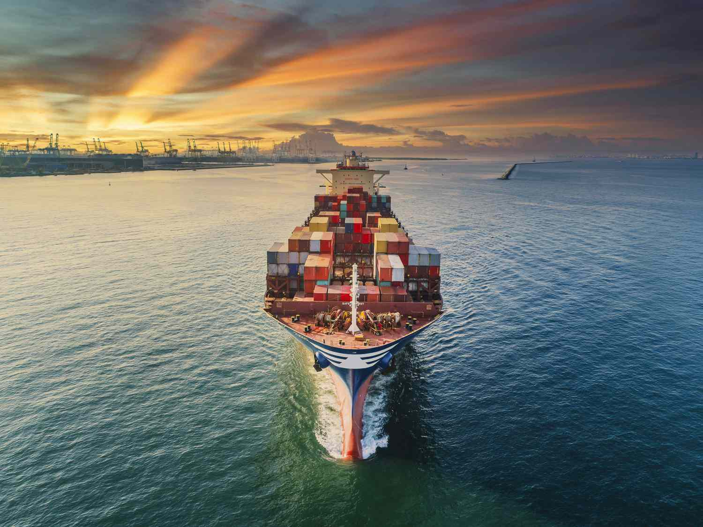

## Table of Contents

## What is the U.S. embargo on Cuba?

The U.S. embargo on Cuba is a set of trade and economic restrictions that the United States has placed on Cuba. It started in 1960, soon after the Cuban Revolution when Fidel Castro came to power. The U.S. wanted to pressure Cuba to change its government and its policies. The embargo limits trade, travel, and financial dealings between the U.S. and Cuba.

Over the years, the embargo has been tightened and loosened at different times. Many people and countries around the world think the embargo is too harsh and should be lifted. They argue that it hurts ordinary Cubans more than the government. However, the U.S. government believes the embargo is necessary to promote democracy and human rights in Cuba. The embargo is still in place today, though some changes have been made to allow more travel and trade.

## When was the U.S. embargo on Cuba first imposed?

The U.S. embargo on Cuba was first imposed in 1960. This happened after Fidel Castro took over the government in Cuba during the Cuban Revolution. The U.S. wanted to put pressure on Cuba to change its government and its ways. So, they started the embargo to limit trade, travel, and money dealings between the two countries.

The embargo has changed over time. Sometimes it has been made stricter, and sometimes it has been relaxed a bit. Many people around the world think the embargo is too tough and should be stopped. They say it hurts regular Cubans more than the government. But the U.S. government thinks the embargo is important to help bring democracy and better human rights to Cuba. Even today, the embargo is still in place, though some changes have been made to allow more travel and trade.

## What are the main reasons the U.S. imposed the embargo on Cuba?

The U.S. imposed the embargo on Cuba mainly because they didn't like the new government that came to power after the Cuban Revolution in 1959. Fidel Castro became the leader, and the U.S. was worried about his communist ideas. They thought that by stopping trade and making life harder in Cuba, they could push the government to change and become more like the U.S.

The embargo was also a way for the U.S. to show they didn't agree with Cuba's close relationship with the Soviet Union, which was a big enemy of the U.S. during the Cold War. The U.S. wanted to isolate Cuba and make it harder for them to get help from other countries. This was part of a bigger plan to stop the spread of communism around the world.

## How has the embargo affected the Cuban economy?

The embargo has made life harder for Cuba's economy. It has stopped a lot of trade between the U.S. and Cuba, which means Cuba can't easily get things like food, medicine, and other important supplies. This has made it tough for businesses in Cuba to grow and for people to find what they need. The embargo also makes it hard for Cuba to get money from other countries because many banks are scared to do business with them.

Because of the embargo, Cuba has had to find other ways to keep its economy going. They have tried to grow more of their own food and make more of their own things. But it's not easy, and the economy still struggles. Many Cubans have had to find ways to make money on their own, like starting small businesses or selling things on the street. The embargo has made it hard for Cuba to improve and grow, and many people in Cuba feel the effects every day.

## What are the potential immediate effects of lifting the embargo on Cuba?

If the U.S. lifts the embargo on Cuba, it could help the Cuban economy right away. Cuba could start trading more easily with the U.S., which means they could get things like food, medicine, and other important supplies more easily. This could help businesses in Cuba grow and make life better for people. More money could come into Cuba from other countries too, because banks and businesses might feel safer doing business with them.

But lifting the embargo could also cause some problems at first. The sudden change might be hard for Cuba to handle. They might need time to adjust to more trade and new ways of doing things. Also, if a lot of U.S. products come into Cuba quickly, it could make it hard for Cuban businesses to compete. So, while lifting the embargo could bring many good changes, it might take some time for Cuba to fully benefit from it.

## How might lifting the embargo influence U.S.-Cuba diplomatic relations?

Lifting the embargo could help improve the relationship between the U.S. and Cuba. If the U.S. stops the embargo, it shows that they want to be friends with Cuba again. This could make it easier for the two countries to talk and work together on things like trade, travel, and solving problems. It might also make other countries think better of the U.S. because they would see the U.S. trying to make peace with Cuba.

However, lifting the embargo might not fix everything right away. There could still be disagreements between the U.S. and Cuba about things like human rights and how each country should be run. But if the embargo is lifted, it could be a big first step toward better understanding and cooperation. It would show that both countries are willing to try to get along better, even if it takes time to build trust and work out all the details.

## What industries in Cuba could benefit most from the lifting of the embargo?

The tourism industry in Cuba could really benefit if the embargo is lifted. Right now, it's hard for Americans to visit Cuba because of the rules. If the embargo goes away, more Americans could come to Cuba for holidays. This would mean more money for hotels, restaurants, and places where tourists go to have fun. More tourists would also create jobs for people in Cuba, helping the economy grow.

Another industry that could do well is agriculture. Cuba has a hard time getting farming supplies like seeds and machines because of the embargo. If it's lifted, Cuba could buy these things from the U.S. easier. This would help farmers grow more food and make more money. Better farming could also mean more food for everyone in Cuba, making life a bit easier.

The healthcare industry could also see big changes. Cuba makes good medicines, but it's hard to sell them to other countries because of the embargo. If the embargo is lifted, Cuba could sell more medicine to the U.S. and other places. This would bring in more money and help Cuba's healthcare system grow. Plus, Cuba could get more medical supplies from the U.S., which would help doctors take better care of people.

## What are the potential long-term economic impacts on Cuba if the embargo is lifted?

If the embargo on Cuba is lifted, it could help the country's economy grow a lot over time. Cuba could start trading more with the U.S. and other countries, which means they could sell more of what they make, like medicine and sugar. This would bring in more money and help businesses grow. More trade would also create new jobs for people in Cuba, which is good for everyone. Over time, this could make the economy stronger and help Cuba become more like other countries that trade a lot.

But there could also be some challenges. At first, Cuban businesses might have a hard time competing with big companies from the U.S. They might need time to learn how to do business in a new way. Also, if a lot of U.S. products come into Cuba quickly, it could make it hard for local businesses to keep up. But if Cuba can handle these challenges, the long-term benefits could be huge. More money coming into the country could be used to improve schools, hospitals, and roads, making life better for everyone in Cuba.

## How could the lifting of the embargo affect trade relations between Cuba and other countries?

If the U.S. lifts the embargo on Cuba, it could help Cuba trade more with other countries too. Right now, many countries are scared to do business with Cuba because they don't want to make the U.S. mad. If the embargo goes away, other countries might feel safer to trade with Cuba. This could mean more money for Cuba from selling things like sugar and medicine to other places. It could also help Cuba buy things they need, like farming supplies and machines, from more countries.

But it might take some time for these changes to happen. At first, Cuba might need help to figure out how to trade with more countries. They might need to learn new rules and ways of doing business. Other countries might also be careful at first, waiting to see if the U.S. really means to lift the embargo for good. But if everything goes well, Cuba could end up trading a lot more with the world, which would be good for their economy in the long run.

## What are the political implications within Cuba of lifting the U.S. embargo?

If the U.S. lifts the embargo, it could change a lot of things in Cuba's government. Right now, the Cuban government uses the embargo to say why the country is having problems. They tell people that the U.S. is making life hard for them. If the embargo goes away, the government might have a harder time blaming the U.S. for their problems. This could make people in Cuba ask more questions about how the government is doing its job. Some people might want the government to change or do things differently.

But lifting the embargo could also help the government in some ways. If Cuba can trade more with the U.S. and other countries, it could bring in more money. The government could use this money to make life better for people in Cuba. This might make some people happier with the government. But it could also make people want even more changes, like more freedom to speak and vote. So, lifting the embargo could make things both easier and harder for the Cuban government at the same time.

## How might the lifting of the embargo impact migration patterns between Cuba and the U.S.?

If the U.S. lifts the embargo on Cuba, it could change how people move between the two countries. Right now, many Cubans want to leave Cuba because life is hard there. The embargo makes it tough to find jobs and things they need. If the embargo is lifted, life in Cuba might get better because more trade could create more jobs and make things easier to find. This might mean fewer Cubans would want to leave Cuba to go to the U.S.

But at first, lifting the embargo might make more Cubans want to go to the U.S. If it's easier to travel between the two countries, more people might want to visit family or look for better jobs in the U.S. Over time, though, as Cuba's economy gets better, fewer people might feel the need to leave. So, while lifting the embargo could change migration patterns, it might take some time for everything to settle down.

## What are the arguments against lifting the U.S. embargo on Cuba from both U.S. and international perspectives?

From the U.S. perspective, some people argue against lifting the embargo because they believe it puts pressure on Cuba to change its government and improve human rights. They think that without the embargo, Cuba's government might not feel the need to change. Some also worry that lifting the embargo could help Cuba's economy too much, making it stronger without making any political changes. They want to keep the pressure on Cuba to become more democratic and respect human rights more.

From an international perspective, some countries and groups argue that lifting the embargo might not solve all of Cuba's problems. They say that even without the embargo, Cuba's government might still not change its ways. Some also worry that if the U.S. lifts the embargo, it might make other countries think the U.S. is being too soft on Cuba. They believe the U.S. should keep the embargo to show that it's serious about wanting Cuba to change its government and improve how it treats its people.

## References & Further Reading

[1]: Hufbauer, G. C., & Schott, J. J. (2005). ["Economic Sanctions Reconsidered."](https://www.sciencedirect.com/science/article/abs/pii/S0022199608000597) Peterson Institute for International Economics.

[2]: Vidulich, A. (2016). ["Cuba-U.S. Relations: An Introduction."](https://link.springer.com/article/10.1007/s11192-023-04668-8) Congressional Research Service.

[3]: Lopez-Levy, A. (2021). ["Cuban-U.S. Relations: A Question of Strategic Realism."](https://scholar.google.com/citations?user=ZvO7iZwAAAAJ&hl=en) Routledge.

[4]: Lopez de Prado, M. (2018). ["Advances in Financial Machine Learning."](https://www.amazon.com/Advances-Financial-Machine-Learning-Marcos/dp/1119482089) Wiley.

[5]: Chan, E. P. (2008). ["Quantitative Trading: How to Build Your Own Algorithmic Trading Business."](https://github.com/ftvision/quant_trading_echan_book) Wiley.

[6]: Aronson, D. (2007). ["Evidence-Based Technical Analysis: Applying the Scientific Method and Statistical Inference to Trading Signals."](https://www.amazon.com/Evidence-Based-Technical-Analysis-Scientific-Statistical/dp/0470008741) Wiley.