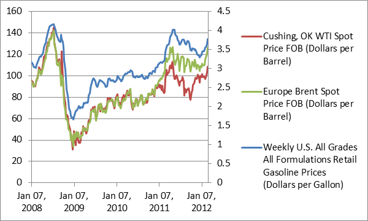

## Table of Contents

## What is the basic relationship between oil prices and the U.S. economy?

Oil prices have a big impact on the U.S. economy. When oil prices go up, it costs more for businesses to transport goods and for people to fill up their cars. This can lead to higher prices for everything, which is called inflation. When people and businesses have to spend more on oil, they have less money to spend on other things, which can slow down the economy. This is why high oil prices can sometimes lead to a recession, which is when the economy shrinks.

On the other hand, when oil prices are low, it can help the economy grow. Businesses can transport goods more cheaply, and people have more money to spend on other things. This can lead to more jobs and more economic activity. However, if oil prices stay too low for too long, it can hurt the oil industry and the areas of the country that depend on it. So, the relationship between oil prices and the U.S. economy is a balancing act.

## How do rising oil prices affect consumer spending in the U.S.?

When oil prices go up, it costs more for people to fill up their cars with gas. This means they have less money left over for other things they might want to buy, like clothes, electronics, or going out to eat. This is called a decrease in consumer spending. When people spend less, it can slow down the economy because businesses sell fewer things and might have to lay off workers.

High oil prices also make it more expensive for businesses to transport goods. This can lead to higher prices for all kinds of products, not just gas. When everything costs more, people might decide to save their money instead of spending it. This can make the economy grow more slowly, and it can take a while for things to get back to normal even after oil prices come down again.

## What industries in the U.S. are most affected by changes in oil prices?

The transportation industry is one of the most affected by changes in oil prices. This includes airlines, trucking companies, and shipping firms. When oil prices go up, it costs more for these businesses to run their planes, trucks, and ships. They might have to raise their prices to make up for it, which can make it harder for them to stay competitive. On the other hand, when oil prices go down, these businesses can save money on fuel and might be able to lower their prices or make more profit.

The oil and gas industry itself is also greatly impacted by oil price changes. When prices are high, oil companies can make a lot of money and invest in new projects like drilling for more oil. But when prices fall, these companies might have to cut back on spending and even lay off workers. This can hurt the communities that depend on the oil industry for jobs. Also, industries that use a lot of oil as a raw material, like the petrochemical industry, feel the effects of oil price changes.

Other industries like agriculture and manufacturing can also be affected by oil prices. Farmers use oil to run their machinery and transport their crops, so higher oil prices can squeeze their profits. Manufacturers might see their costs go up if the price of oil affects the cost of raw materials or transportation. When oil prices change, it can have a ripple effect across the economy, impacting many different kinds of businesses.

## How do fluctuations in oil prices impact inflation rates in the U.S.?

When oil prices go up, it can make inflation go up too. Inflation is when the prices of things we buy, like food and clothes, go up over time. Oil is used to make and move a lot of these things, so when oil gets more expensive, it costs more to make and move them. This means businesses might have to raise their prices to cover the extra costs. When people see these higher prices, they might expect prices to keep going up, which can make inflation even worse.

On the other hand, when oil prices go down, it can help keep inflation in check. If it costs less to make and move things, businesses might not have to raise their prices as much. This can help keep the prices of things we buy from going up too fast. But if oil prices drop a lot, it can also make some businesses, like oil companies, struggle, which can have other effects on the economy. So, changes in oil prices can have a big impact on inflation, making it go up or helping to keep it down.

## What role does the U.S. oil production play in buffering against global oil price changes?

The U.S. produces a lot of oil, which helps protect its economy from big changes in global oil prices. When oil prices go up around the world, the U.S. can use its own oil to keep prices from going up too much at home. This means people and businesses in the U.S. don't have to pay as much for gas and other things that use oil. By having its own oil, the U.S. can be less affected by what happens in other countries.

But, the U.S. can't completely avoid the effects of global oil prices. If oil prices drop a lot around the world, it can hurt the U.S. oil industry. Oil companies might have to cut back on drilling and lay off workers, which can hurt the economy in places where a lot of people work in the oil industry. So, while U.S. oil production helps cushion the economy from global price changes, it doesn't make the country immune to them.

## How have U.S. policies aimed at energy independence influenced the impact of oil prices on the economy?

U.S. policies aimed at energy independence have helped reduce how much oil prices affect the economy. By producing more of its own oil and gas, the U.S. doesn't have to buy as much from other countries. This means that when oil prices go up around the world, the U.S. can use its own oil to keep prices from going up too much at home. This helps keep costs down for people and businesses, which can make the economy more stable.

But, these policies don't completely protect the U.S. from oil price changes. If oil prices drop a lot around the world, it can still hurt the U.S. oil industry. Oil companies might have to cut back on drilling and lay off workers, which can hurt the economy in places where a lot of people work in the oil industry. So, while energy independence policies help, they don't make the U.S. completely safe from global oil price changes.

## What are the effects of oil price volatility on the U.S. stock market?

Oil price [volatility](/wiki/volatility-trading-strategies) can make the U.S. stock market go up and down a lot. When oil prices change quickly, it can be hard for businesses to plan ahead. If oil prices go up, companies that use a lot of oil, like airlines and trucking companies, might see their costs go up. This can make their profits go down, which can make their stock prices go down too. On the other hand, oil companies might see their profits go up when oil prices rise, which can make their stock prices go up. But if oil prices fall a lot, it can hurt oil companies and make their stock prices go down.

The stock market doesn't just react to what's happening in the oil industry. When oil prices change a lot, it can affect the whole economy. If oil prices go up, it can lead to higher prices for everything, which can make people spend less money. This can slow down the economy and make stock prices go down. But if oil prices go down, it can help the economy grow by making things cheaper. This can make people spend more money and help stock prices go up. So, oil price volatility can have a big impact on the U.S. stock market in many different ways.

## How do oil price changes affect the U.S. trade balance and dollar value?

When oil prices go up, it can hurt the U.S. trade balance. The trade balance is the difference between what a country sells to other countries and what it buys from them. The U.S. buys a lot of oil from other countries, so when oil prices go up, it costs more to buy that oil. This can make the U.S. trade balance worse because it's spending more money on imports. On the other hand, if the U.S. is selling more of its own oil to other countries because of high prices, it can help the trade balance. But overall, high oil prices usually mean the U.S. has to spend more money on oil imports, which can make the trade balance worse.

Oil price changes can also affect the value of the U.S. dollar. When oil prices go up, it can make people less sure about the economy. If people think the economy might slow down because of high oil prices, they might want to buy fewer U.S. dollars. This can make the dollar weaker compared to other currencies. But if the U.S. is producing a lot of its own oil and selling it to other countries, a strong oil industry can make people more confident in the U.S. economy. This can help keep the dollar strong. So, oil price changes can make the dollar go up or down depending on what's happening with the economy and the oil industry.

## What historical examples illustrate the impact of oil price shocks on the U.S. economy?

One big example of how oil prices can shake up the U.S. economy happened in the 1970s. Back then, oil prices jumped a lot because of something called the OPEC oil embargo. OPEC is a group of countries that produce oil, and they decided to stop selling oil to the U.S. and other countries. This made oil prices go way up, and it caused something called stagflation in the U.S. Stagflation is when prices go up a lot and the economy slows down at the same time. People had to pay more for gas, and businesses had to pay more to move their stuff around. This made everything more expensive, and it was hard for the economy to grow.

Another time oil prices had a big effect on the U.S. economy was in the late 2000s. In 2008, oil prices hit a record high, going over $140 a barrel. This made gas prices go up a lot, and it hurt a lot of people and businesses. At the same time, there was a big financial crisis happening. The high oil prices made things even worse by making everything more expensive and slowing down the economy. This helped push the U.S. into a deep recession. It took a long time for the economy to get better after that.

## How do oil prices influence U.S. monetary policy decisions?

When oil prices go up a lot, it can make the prices of everything else go up too. This is called inflation. The people who make decisions about money in the U.S., like the Federal Reserve, don't like too much inflation. So, if oil prices go up and start making inflation go up, the Federal Reserve might decide to raise interest rates. Raising interest rates can make people borrow less money and spend less, which can help slow down inflation. But it can also make the economy grow more slowly, so the Federal Reserve has to be careful.

On the other hand, if oil prices go down a lot, it can help keep inflation low. If inflation is too low, it can be bad for the economy too because people might not want to spend money if they think prices will keep going down. So, if oil prices drop and inflation is too low, the Federal Reserve might decide to lower interest rates. Lowering interest rates can make it cheaper for people to borrow money and spend more, which can help the economy grow. But the Federal Reserve has to watch out for too much spending, which can make inflation go up again. So, oil prices can make the Federal Reserve change its plans to keep the economy stable.

## What are the long-term economic implications of sustained high or low oil prices for the U.S. economy?

If oil prices stay high for a long time, it can make life harder for people and businesses in the U.S. People have to spend more money on gas, which means they have less money to spend on other things. This can slow down the economy because businesses sell less stuff. Businesses also have to pay more to move their goods around, which can make everything more expensive. This can lead to something called inflation, where the prices of things keep going up. If inflation gets too high, it can make the economy unstable. On the other hand, high oil prices can be good for the oil industry. Oil companies can make more money, and they might invest in new projects like drilling for more oil. But this can hurt other parts of the economy if people and businesses have to spend too much on oil.

If oil prices stay low for a long time, it can help the economy grow. When oil is cheap, it costs less for people to fill up their cars and for businesses to move their goods. This can make everything cheaper and help people spend more money on other things. Low oil prices can also make it easier for businesses to grow and hire more workers, which can make the economy stronger. But low oil prices can hurt the oil industry. Oil companies might have to cut back on drilling and lay off workers, which can hurt the economy in places where a lot of people work in the oil industry. So, while low oil prices can help the economy in some ways, they can also cause problems in other ways.

## How can econometric models predict the impact of future oil price changes on the U.S. economy?

Econometric models help us guess how future oil price changes might affect the U.S. economy by using math and past data. These models look at how oil prices have changed before and how those changes made the economy grow or shrink. They use numbers to find patterns and then use those patterns to make predictions. For example, if oil prices went up in the past and it made inflation go up and the economy slow down, the model might predict the same thing will happen if oil prices go up again. By looking at lots of different pieces of information, like how much oil the U.S. produces and how much it uses, these models can give us a good idea of what might happen next.

But, these models aren't perfect because the future can be hard to predict. Things like new laws, wars, or big changes in technology can change how oil prices affect the economy. So, while econometric models can give us a good guess, they can't tell us exactly what will happen. They are most useful when we use them along with other ways of looking at the economy, like talking to experts and watching what's happening in the world. This way, we can get a fuller picture of how oil prices might change things in the future.

## References & Further Reading

[1]: Blanchard, Olivier J., & Gali, Jordi (2007). ["The Macroeconomic Effects of Oil Price Shocks: Why are the 2000s so Different from the 1970s?"](https://www.nber.org/papers/w13368) International Monetary Fund.

[2]: Hamilton, James D. (2009). ["Understanding Crude Oil Prices."](https://www.jstor.org/stable/41323239) Journal of Economic Perspectives, 23(3), 149-166.

[3]: U.S. Energy Information Administration (2021). ["The Impact of the Shale Revolution on U.S. Energy."](https://www.eia.gov/)

[4]: Board of Governors of the Federal Reserve System. ["Monetary Policy and Oil Price Shocks: Empirical Evidence for the United States."](https://www.federalreserve.gov/?os=w&ref=app)

[5]: Van Vactor, Samuel A. (2010). ["Introduction to the Global Oil & Gas Business."](https://archive.org/details/introductiontogl0000vanv) PennWell Corporation.

[6]: Lopez de Prado, Marcos (2018). ["Advances in Financial Machine Learning."](https://www.amazon.com/Advances-Financial-Machine-Learning-Marcos/dp/1119482089) Wiley.

[7]: Sengupta, Jay (2017). ["Algorithmic Trading: A Practitioner’s Guide."](https://books.google.com/books/about/Algorithmic_Trading.html?id=doGXzQEACAAJ) Palgrave Macmillan.

[8]: Kilian, Lutz (2008). ["The Economic Effects of Energy Price Shocks."](https://www.aeaweb.org/articles?id=10.1257/jel.46.4.871) Journal of Economic Literature, 46(4), 871-909.

[9]: Kaufmann, Robert K., & Cleveland, Cutler J. (2001). ["Oil Production in the Lower 48 States: Economic, Geological, and Institutional Determinants."](https://journals.sagepub.com/doi/10.5547/ISSN0195-6574-EJ-Vol22-No1-2) The Energy Journal, 22(1), 27-49.