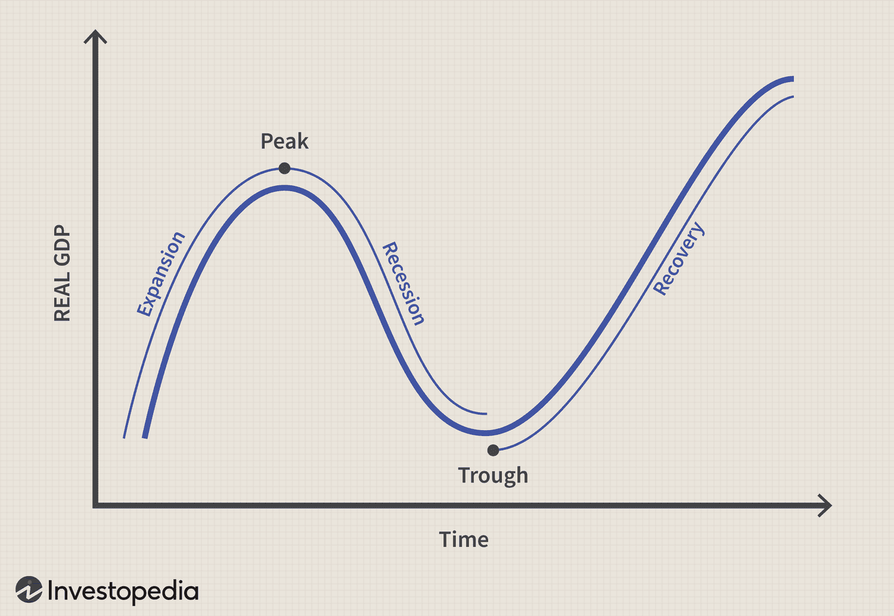

## Table of Contents

## What is a recession and how is it defined?

A recession is a time when the economy of a country is not doing well. It happens when people are buying less, businesses are making less money, and many people are out of work. Economists often say a recession is happening when the economy has been shrinking for two quarters in a row. A quarter is three months, so if the economy gets smaller for six months, that's usually called a recession.

Recessions can happen for many reasons. Sometimes, it's because there's a big event like a financial crisis or a war that shakes up the economy. Other times, it might be because people and businesses start to feel less confident about the future, so they spend and invest less. When this happens, it can lead to a cycle where the economy keeps getting worse until something changes to stop it. Governments and central banks often try to help by lowering interest rates or spending more money to boost the economy.

## How do recessions typically affect the stock market?

Recessions usually make the stock market go down. When the economy is not doing well, companies make less money, so their stock prices drop. People also feel less sure about the future, so they sell their stocks to get cash. This selling makes stock prices fall even more. During a recession, it's common to see big drops in the stock market, like the ones that happened in 2008 during the financial crisis.

But not all stocks are affected the same way. Some companies, like those that make things people always need, like food or medicine, might not see their stock prices fall as much. On the other hand, companies that sell things people can live without, like luxury goods, often see bigger drops in their stock prices. After a recession ends, the stock market usually starts to go up again as the economy gets better, but it can take time for everything to recover.

## What are the common impacts of a recession on individual investors?

When a recession hits, individual investors often see the value of their investments go down. This happens because the stock market usually falls during a recession. If someone has money in stocks or stock funds, they might see their savings shrink. This can be scary and might make people want to sell their investments quickly to avoid losing more money. But selling during a downturn can lock in losses, meaning they won't be able to recover those losses when the market eventually goes back up.

Recessions can also make people feel more worried about money. If someone loses their job or sees their income drop, they might need to use their savings just to get by. This can mean selling investments at a bad time. Also, during a recession, it can be hard to find good new investments because fewer companies are doing well. But if investors can hold on and keep their money in the market, they might see their investments grow again once the economy starts to recover. Patience and a long-term view can help individual investors get through a recession.

## How can investors prepare their portfolios for a potential recession?

To prepare for a potential recession, investors should think about making their portfolios more balanced. This means not putting all their money in one type of investment, like stocks. Instead, they could mix in some safer investments, like bonds. Bonds usually don't go down as much as stocks during a recession, so they can help keep the portfolio from losing too much value. Investors might also want to look at companies that make things people always need, like food or medicine. These companies tend to do better during tough economic times.

Another good idea is to have some cash saved up. Having cash on hand can be really helpful if the stock market goes down a lot. It can stop investors from having to sell their investments at a bad time just to get money. It's also smart to check and maybe change the portfolio every now and then. If an investor sees that their portfolio is too focused on one thing, they might want to spread it out more. This way, if one part of the market does badly, the whole portfolio won't be hurt as much.

## What investment strategies are effective during a recession?

During a recession, one good strategy is to focus on defensive stocks. These are stocks from companies that make things people always need, like food, medicine, and utilities. These companies tend to do better during tough times because people keep buying their products no matter what's happening with the economy. Another strategy is to invest in bonds. Bonds are usually safer than stocks and can give a steady income through interest payments. This can help keep your portfolio from losing too much value when the stock market is going down.

Another useful approach is to keep some cash on hand. Having cash can be really helpful because it lets you buy investments at lower prices when the market is down. It also means you don't have to sell your investments at a bad time just to get money. It's also a good idea to diversify your portfolio. This means spreading your money across different types of investments, like stocks, bonds, and maybe even real estate. If one part of your portfolio goes down, the other parts might not be hurt as much, which can help protect your overall investment.

Lastly, staying patient and keeping a long-term view is key. Recessions don't last forever, and the economy usually gets better over time. If you can hold onto your investments during a downturn, you might see them grow again when things improve. Trying to time the market by selling and buying at the right moments is very hard and often doesn't work out well. Instead, sticking with a well-thought-out plan can help you weather the storm of a recession.

## How do different asset classes perform during a recession?

During a recession, different asset classes can perform differently. Stocks often go down a lot because companies make less money and people feel less sure about the future. This can lead to big drops in stock prices. But not all stocks are the same. Some, like those from companies that make things people always need, like food or medicine, might not go down as much. These are called defensive stocks. On the other hand, stocks from companies that sell things people can live without, like luxury goods, often see bigger drops.

Bonds usually do better than stocks during a recession. They are seen as safer because they give a steady income through interest payments. This can help keep your money from losing too much value when the stock market is going down. Cash is also important during a recession. Having cash on hand can let you buy investments at lower prices when the market is down. It also means you don't have to sell your investments at a bad time just to get money.

Real estate can be a mixed bag during a recession. Sometimes, property values go down because people can't afford to buy homes. But other times, certain types of real estate, like rental properties, might do okay because people still need a place to live. It all depends on the specific situation and where the property is located. Diversifying your investments across these different asset classes can help protect your money during tough economic times.

## What are the psychological effects of a recession on investors and how can they be managed?

During a recession, investors often feel a lot of stress and worry. Seeing their investments go down can make them feel scared and unsure about the future. This can lead to quick decisions, like selling investments at the wrong time, which can make things worse. It's common for people to feel anxious and even lose sleep over their money. This can affect not just their financial health but their overall well-being too.

To manage these feelings, it's important for investors to stay calm and think long-term. One good way to do this is by talking to a financial advisor who can help explain what's happening and what to do. It's also helpful to remember that recessions don't last forever, and the economy usually gets better over time. Taking breaks from constantly checking the news or the stock market can also reduce stress. By focusing on a solid plan and not making quick decisions based on fear, investors can better handle the ups and downs of a recession.

## How do government policies during recessions influence investment decisions?

When a recession happens, governments often step in with policies to help the economy get better. They might lower interest rates to make it cheaper for people and businesses to borrow money. This can lead to more spending and investing, which can help the economy recover. Governments might also spend more money themselves, like on building roads or helping people who lost their jobs. These actions can make investors feel more confident about the future, so they might be more willing to keep their money in the market or even buy more investments.

But government policies can also make things trickier for investors. For example, if the government raises taxes to pay for their spending, it might mean less money for people to invest. Also, if the government's actions don't work well, it might make investors feel even more worried about the economy. So, investors need to keep an eye on what the government is doing and think about how it might affect their investments. By understanding these policies, investors can make smarter choices about where to put their money during a recession.

## What historical data shows about investor behavior during past recessions?

Historical data shows that during past recessions, many investors tend to panic and sell their investments when the market goes down. This happened a lot during the 2008 financial crisis, where people saw their savings shrink and got scared. They sold their stocks to get cash, which made the market fall even more. But selling during a downturn often means locking in losses, and those who sold might miss out on the recovery when the market eventually goes back up.

On the other hand, some investors stay calm and stick to their long-term plans. They understand that recessions don't last forever and that the market usually recovers over time. These investors might even see a recession as a chance to buy investments at lower prices. For example, during the 2008 crisis, those who kept their money in the market or bought more stocks when prices were low often saw big gains when the economy got better. This shows how important it is to have patience and a long-term view during tough economic times.

## How can investors identify the early signs of a recession and adjust their strategies accordingly?

Investors can spot the early signs of a recession by watching a few key things. One big sign is if the economy is shrinking for two quarters in a row. This means that for six months, the country is making and selling less stuff than before. Another sign is if more people are losing their jobs and the unemployment rate is going up. Also, if people and businesses are spending less money, that can be a warning that a recession might be coming. By keeping an eye on these signs, investors can get a heads-up and start thinking about what to do next.

When investors see these early signs, they can change their strategies to protect their money. One good move is to put more money into safer investments like bonds, which don't go down as much during a recession. They might also want to have some cash ready, so they don't have to sell their investments at a bad time. Another smart idea is to look at companies that make things people always need, like food or medicine, because these companies usually do better during tough times. By making these changes early, investors can be ready for a recession and maybe even find good chances to buy investments at lower prices.

## What advanced risk management techniques should investors employ during a recession?

During a recession, investors can use advanced risk management techniques like hedging to protect their money. Hedging means buying investments that go up when the market goes down. For example, investors might buy put options, which give them the right to sell a stock at a certain price. If the stock goes down, the put option goes up in value, which can help make up for the losses in their portfolio. Another technique is using stop-loss orders, which automatically sell an investment if it falls to a certain price. This can help limit how much money they lose on a single investment.

Another important technique is to use diversification in a smart way. This means spreading money across different types of investments, like stocks, bonds, and maybe even real estate, but also looking at different industries and countries. By doing this, if one part of their portfolio goes down a lot, the other parts might not be hurt as much. Investors can also look at their portfolio's beta, which measures how much it moves with the market. If their portfolio has a high beta, it means it's more risky, so they might want to change it to lower the risk during a recession. By using these advanced techniques, investors can better manage the risks that come with a recession.

## How do global recessions differ from national recessions in terms of impact on investors?

A global recession affects the whole world, not just one country. When the whole world's economy is struggling, it can make things harder for investors everywhere. If many countries are in a recession at the same time, it can mean bigger drops in stock markets around the world. This can make it tougher for investors to find safe places to put their money because even countries that usually do well might be having problems. Also, if a global recession is caused by something big, like a worldwide financial crisis or a global health emergency, it can take longer for the world to get better, which means investors might have to wait longer for their investments to recover.

A national recession, on the other hand, only affects one country. This can be easier for investors to handle because they can still invest in other countries that are doing better. For example, if the U.S. is in a recession but Europe is doing okay, investors might move their money to European stocks or bonds. This way, they can still make money even if their home country's economy is struggling. But, if the national recession is very bad or if it's caused by something that also affects other countries, like a big drop in oil prices, it can still have a big impact on investors, even if they try to invest in other places.

## References & Further Reading

[1]: Bergstra, J., Bardenet, R., Bengio, Y., & Kégl, B. (2011). ["Algorithms for Hyper-Parameter Optimization."](https://papers.nips.cc/paper/4443-algorithms-for-hyper-parameter-optimization) Advances in Neural Information Processing Systems 24.

[2]: ["Advances in Financial Machine Learning"](https://www.amazon.com/Advances-Financial-Machine-Learning-Marcos/dp/1119482089) by Marcos Lopez de Prado

[3]: ["Evidence-Based Technical Analysis: Applying the Scientific Method and Statistical Inference to Trading Signals"](https://www.amazon.com/Evidence-Based-Technical-Analysis-Scientific-Statistical/dp/0470008741) by David Aronson

[4]: ["Machine Learning for Algorithmic Trading"](https://github.com/stefan-jansen/machine-learning-for-trading) by Stefan Jansen

[5]: ["Quantitative Trading: How to Build Your Own Algorithmic Trading Business"](https://www.amazon.com/Quantitative-Trading-Build-Algorithmic-Business/dp/1119800064) by Ernest P. Chan