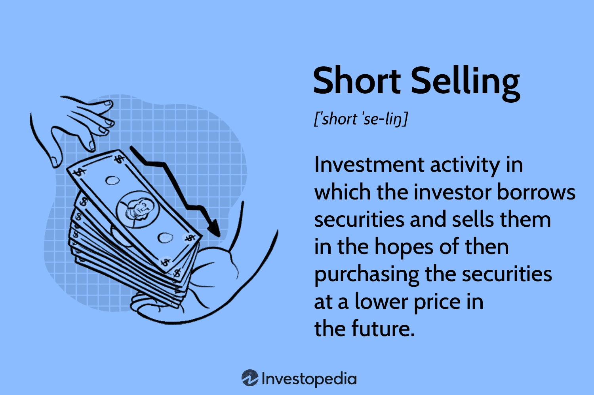

In today's dynamic financial markets, investors are increasingly looking to innovative methods to maximize returns and manage risk. Among these methods, short selling and algorithmic trading have become prominent strategies. These techniques leverage market volatility, providing investors with opportunities to profit even in declining markets or through precise, automated trades. This article explores the intricacies of short selling and algorithmic trading, examining their potential risks and rewards and how they can be effectively integrated into investment portfolios.

Short selling involves borrowing shares to sell at current market prices, with the aim of repurchasing them at a lower cost—thus profiting from the price difference. While this strategy offers significant profit potential during market downturns, it also carries high risks, including the possibility of unlimited losses if the stock price rises. Therefore, understanding the mechanics of short selling is essential for investors seeking to employ this strategy effectively.



Algorithmic trading, on the other hand, automates the trade execution process through the use of computer algorithms based on predefined criteria. It provides the capability to execute complex trading strategies at high speeds and volumes, optimizing trade timing and minimizing human judgment errors. As financial markets become more technologically driven, mastering algorithmic trading techniques is increasingly vital for traders and investors.

As these strategies continue to evolve with technological advancements and market complexities, a deep understanding of both short selling and algorithmic trading can provide investors with a critical edge. By comprehensively analyzing their integration into investment strategies, market participants can better navigate the challenges and opportunities in today's intricate financial landscape.

## Table of Contents

## Understanding Short Selling

Short selling is a well-established financial strategy that allows investors to potentially profit from a decline in the price of a stock. This approach involves a series of tactical steps that begin with the investor borrowing shares of the stock from a lender, typically through a brokerage firm. After acquiring the shares, the investor sells them on the open market at the current market price.

The primary objective of short selling is to repurchase the same number of shares at a lower price in the future. Once the shares are repurchased, they are returned to the lender, and the difference between the selling price and the repurchase price represents the investor’s profit, excluding any fees or interest charged by the lender for borrowing the shares.

Mathematically, the profit from short selling can be expressed as:

$$
\text{Profit} = (P_{\text{sell}} - P_{\text{buy}}) \times \text{Number of Shares} - \text{Borrowing Fees}
$$

Where $P_{\text{sell}}$ is the price at which the shares are sold, and $P_{\text{buy}}$ is the price at which they are repurchased.

While the potential profits of short selling can be significant, this strategy carries considerable risks. One of the most prominent dangers is the possibility of unlimited losses. Unlike traditional stock purchases where the maximum loss is capped at the initial investment, losses in short selling can escalate if the stock's price rises contrary to expectations. As the stock's price increases, so does the cost of repurchasing the borrowed shares, potentially surpassing the amount collected from the initial sale.

Additionally, short sellers might face challenges such as borrowing costs, margin requirements, and the risk of a short squeeze—a scenario where a rapid increase in the stock price forces short sellers to cover their positions quickly, further driving up the stock price. Due to these complexities, short selling requires a keen understanding of market conditions and prudent risk management practices.

## Risks and Rewards of Short Selling

Short selling is a trading strategy that can be highly profitable when executed correctly, as it allows investors to benefit from declines in stock prices. The mechanism of short selling involves borrowing shares of a stock and selling them on the open market with the intention of buying them back later at a lower price. The profit is realized if the price of the stock decreases, allowing the investor to buy back the shares at the reduced price and return them to the lender, pocketing the difference. While the potential returns from successful short selling can be significant, this strategy carries substantial risks.

One of the primary risks associated with short selling is the potential for unlimited losses. Unlike a conventional stock purchase where the maximum loss is limited to the initial investment, short selling exposes an investor to theoretically infinite losses if the stock price rises unexpectedly. As the stock price climbs, the loss for a short seller increases, since they may need to repurchase shares at a higher price to cover the borrowed stocks. This risk necessitates meticulous risk management strategies, including setting stop-loss orders or maintaining a diversified portfolio to mitigate potential losses.

A specific phenomenon that exacerbates the risk of short selling is the short squeeze. A short squeeze occurs when a stock with large short interest rises sharply, compelling short sellers to buy back shares rapidly to cover their positions. This buying pressure can further drive up the stock price, intensifying the losses for short sellers. An example of this was the GameStop short squeeze in 2021, where swift and substantial price increases created significant challenges for hedge funds with large short positions.

Investors engaged in short selling must also account for additional factors such as margin requirements and interest fees. Brokerage firms typically require short sellers to maintain a margin account, which involves borrowing funds and paying interest on those loans. The interest fees reduce the net profit from the short sale and increase the cost of holding a short position over time. Additionally, high margin calls can occur if the value of the shorted stock rises, requiring investors to deposit additional capital to maintain their positions.

Moreover, the [volatility](/wiki/volatility-trading-strategies) inherent in financial markets can significantly impact the outcomes of short selling strategies. Volatile markets can lead to abrupt price movements, raising the difficulty of predicting and capitalizing on downward trends. Consequently, market volatility should be a crucial consideration when assessing the risk associated with short selling.

In conclusion, while short selling offers the potential for high profits, it involves considerable risks that require careful strategy and risk management practices. Investors must be vigilant about market conditions, manage their exposure accurately, and prepare for rapid changes to make informed decisions when engaging in short selling.

## Basics of Algorithmic Trading

Algorithmic trading represents a transformative approach in modern financial markets, characterized by the use of computer programs to automate trade execution. These programs operate based on predefined sets of criteria that can analyze vast amounts of market data and execute trades with exceptional speed and precision, catering to various complex trading strategies at high volumes.

The foundation of [algorithmic trading](/wiki/algorithmic-trading) lies in its ability to process data rapidly, making data analysis a crucial component. Algorithms utilize historical and real-time market data to identify trading opportunities, revealing patterns and trends that may not be apparent to human traders. This data-driven approach enables traders to make more informed decisions, minimizing the impact of human emotions and biases.

A well-designed execution strategy is another vital aspect of algorithmic trading. Since markets can be highly volatile, the timing of trades can significantly influence profitability. Algorithms can be programmed to optimize trade timing using various strategies, such as mean reversion, [momentum](/wiki/momentum)-based, or statistical [arbitrage](/wiki/arbitrage) techniques. These strategies leverage mathematical models and statistical analysis to predict price movements and execute trades at opportune moments.

Robust risk management is integral to algorithmic trading systems. Given the inherent risks associated with financial markets, particularly the execution of high-frequency trades, managing exposure is critical. Algorithms may include built-in risk management protocols, such as stop-loss orders, position sizing algorithms, and volatility filters, to mitigate potential losses. This ensures that trading activities remain within acceptable risk parameters, safeguarding against unexpected market fluctuations.

Furthermore, the automation aspect of algorithmic trading provides significant advantages over traditional manual trading. By utilizing algorithms, trades can be executed at optimal prices with minimal delay, providing a competitive edge in fast-moving markets. This removes the possibility of manual errors and reduces latency, thereby enhancing the overall efficiency of trading operations.

In summary, algorithmic trading combines data analysis, sophisticated execution strategies, and risk management to optimize trading outcomes. This approach not only enhances precision and speed but also allows traders to seamlessly handle complex strategies and large transaction volumes. As financial markets continue to evolve, algorithmic trading will likely play an increasingly pivotal role in the trading landscape.

## Integrating Short Selling and Algo Trading

Integrating short selling with algorithmic trading can significantly enhance the performance of investment strategies by exploiting market inefficiencies with increased precision and speed. Algorithms designed for short selling identify overvalued stocks and execute trades effectively, minimizing human errors and trading biases. This synergy optimizes trade outcomes, especially in volatile markets.

At the core of this integration are [statistical arbitrage](/wiki/statistical-arbitrage) and technical indicators such as the Relative Strength Index (RSI). Statistical arbitrage involves profit-making from price discrepancies between related financial instruments. When combined with technical indicators, it can provide actionable insights. The RSI, in particular, measures the speed and change of price movements, helping identify overbought or oversold conditions that signal potential price reversals. Algorithms can continuously monitor RSI values, allowing timely execution of short sells when conditions indicate a stock is overvalued.

Risk management systems are pivotal in this integrated approach, primarily due to the inherent volatility and potential for significant losses associated with short selling. Robust risk management strategies include setting stop-loss orders, maintaining strict margin requirements, and continuously updating algorithms based on market conditions. For instance, an algorithm might incorporate a rule to halt trading if volatility exceeds a certain threshold, thus protecting the portfolio from excessive downside risk.

In implementing these systems, algorithmic traders often rely on Python due to its versatility and extensive library ecosystem catering to financial analytics. Below is a simple Python code snippet illustrating how one might set up a basic RSI-driven short selling algorithm:

```python
import pandas as pd
import numpy as np

def calculate_rsi(data, window=14):
    delta = data.diff()
    gain = (delta.where(delta > 0, 0)).rolling(window=window).mean()
    loss = (-delta.where(delta < 0, 0)).rolling(window=window).mean()
    rs = gain / loss
    rsi = 100 - (100 / (1 + rs))
    return rsi

def generate_signals(data, overbought=70, oversold=30):
    rsi = calculate_rsi(data['close'])
    data['rsi'] = rsi
    data['short_signal'] = np.where(data['rsi'] > overbought, 1, 0)
    return data

# Sample data
data = pd.DataFrame({'close': [110, 112, 115, 113, 110, 108, 105, 102, 100, 99, 97, 96]})
signals = generate_signals(data)
print(signals[['close', 'rsi', 'short_signal']])
```

This code calculates RSI for a given series of closing prices and generates short signals when the RSI exceeds a specified overbought level. While this example is simplified, real-world applications would require additional layers for risk management, such as portfolio diversification, advanced stop-loss mechanisms, and continuous [backtesting](/wiki/backtesting).

In conclusion, the integration of short selling with algorithmic trading leverages data-driven insights to execute complex strategies effectively. By identifying and capitalizing on market inefficiencies with precision, investors can achieve greater returns while mitigating risks through advanced risk management systems. This dynamic combination is increasingly essential in today's fast-paced financial environments.

## Case Studies and Examples

The GameStop short squeeze of 2021 serves as a prominent example illustrating the intricacies of short selling and the role of algorithmic trading within financial markets. In early 2021, a significant number of investors, many coordinated through platforms like Reddit, recognized that GameStop's stock was heavily shorted by institutional investors. As a result, they began purchasing shares and options en masse, driving up the stock price and creating a short squeeze. In a short squeeze, as prices rise rapidly, short sellers are forced to buy back shares at higher prices to cover their positions, thereby further increasing the price.

Algorithmic trading played a dual role in this event. On one hand, algorithms belonging to retail traders and institutional investors facilitated rapid executions of buy and sell orders, contributing to heightened market volatility. These algorithms, designed for speed and precision, leveraged real-time data analysis to capitalize on the price movements, thus amplifying the volatility. On the other hand, sophisticated algorithmic models used by hedge funds attempted to assess risk and make decisions based on shifting market conditions. The resulting interaction between algorithm-driven trades and manual actions by retail investors underscored a complex market dynamic where human sentiment and automated logic clashed.

Hedge funds like Renaissance Technologies illustrate how sophisticated algorithms are utilized to manage risk and exploit inefficiencies. Known for employing PhD-level researchers who craft intricate mathematical models, Renaissance leverages its algorithms to seek arbitrage opportunities and manage investment volatility. These algorithms analyze vast datasets and execute trades based on statistical probabilities, adapting to unpredictabilities in the market while controlling risk exposure.

The GameStop scenario demonstrated how interactions between automated trading strategies and coordinated retail investor actions could significantly impact market dynamics. Such events highlight the importance of comprehensive strategy formulation and risk management. Fund managers must adapt to the new reality where market movements can be driven by previously unconsidered factors such as social media trends. This necessitates a balanced integration of human intuition and algorithmic logic to navigate and mitigate risks in fluctuating market conditions effectively.

## Advantages and Disadvantages of Algo Trading

Algorithmic trading, or algo trading, has gained prominence in financial markets due to its capacity to execute trades with remarkable accuracy and speed, coupled with the elimination of emotional biases typically associated with manual trading. By leveraging computer programs to implement trading strategies based on predefined criteria, algo trading offers several advantages and disadvantages that investors and institutions must weigh carefully.

One of the foremost advantages of algo trading is its precision. Algorithms can be programmed to execute trades at optimal prices, capitalizing on market inefficiencies that human traders might miss. The speed with which these trades occur is another crucial advantage, allowing traders to react to market movements within milliseconds, thus enhancing the profitability of strategies that rely on quick decision-making.

Additionally, algo trading removes human emotions from the trading process. Emotions such as fear and greed often lead to suboptimal trading decisions. With automation, trades are executed based purely on data-driven strategies, which can improve consistency and discipline in trading activities.

Despite these advantages, algo trading comes with significant challenges. Technological dependencies are a primary concern, as the effectiveness of algorithmic systems is contingent on the robustness of the technology infrastructure. Any failures in hardware or software can result in missed trading opportunities or unintended trades. Flash crashes and other trading anomalies present another risk, as algorithms can be prone to exacerbating market fluctuations if not properly calibrated or monitored.

Moreover, algorithmic orders, especially large ones, can significantly impact markets, particularly in low [liquidity](/wiki/liquidity-risk-premium) environments. These orders may cause sudden price shifts that can be detrimental to market stability and trader profitability. To mitigate such risks, effective algorithms must undergo continuous monitoring and adaptation, ensuring they remain efficient and responsive to changing market conditions.

In summary, while algorithmic trading presents significant advantages in terms of speed, accuracy, and emotional neutrality, it also poses notable challenges like technological dependency and potential market disruptions. To harness its full potential, traders must invest in maintaining and updating their algorithms to adapt to evolving market dynamics consistently.

## Conclusion

Short selling and algorithmic trading present both opportunities and challenges, making them compelling strategies in today's intricate stock market environment. When effectively integrated, these approaches can yield substantial financial rewards. However, they also [carry](/wiki/carry-trading) inherent risks that require careful consideration and management.

The potential for financial returns through these strategies hinges on a thorough understanding of market dynamics. An astute appreciation for how markets function, coupled with precision in execution strategies, forms the bedrock of successful short selling and algorithmic trading. Risk management stands as a critical pillar in navigating the volatility associated with these strategies. This involves setting appropriate stop-loss limits, diversifying investment portfolios, and continuously monitoring positions to prevent potential losses.

Technology plays a pivotal role in enhancing the effectiveness of both short selling and algorithmic trading. Advances in computing power, [machine learning](/wiki/machine-learning), and data analytics have allowed for more refined and expedited decision-making processes. Traders leveraging these technologies gain a significant competitive edge, enabling them to respond swiftly to market shifts and seize advantageous opportunities.

Continuous learning and adaptation are indispensable for traders seeking to maximize their success in short selling and algorithmic trading. The financial landscape is ever-evolving, with new tools, trends, and market behaviors emerging regularly. Staying informed about the latest technological innovations and market developments ensures that trading strategies remain relevant and competitive. This proactive approach not only optimizes existing strategies but also fosters the development of new methodologies that can capitalize on emerging opportunities.

In conclusion, while short selling and algorithmic trading offer promising avenues for profit, they demand a comprehensive understanding of market conditions, robust risk management, and a commitment to leveraging technology effectively. Mastery of these elements is crucial for optimizing strategies and maintaining a competitive advantage in the fast-paced world of stock market trading.

## References & Further Reading

"Advances in Financial Machine Learning" by Marcos Lopez de Prado serves as a comprehensive guide for those interested in applying machine learning techniques to financial markets. This book outlines the essential algorithms and strategies that can be employed effectively in algorithmic trading, providing a robust framework for understanding the nuances of using machine learning tools in finance.

"Quantitative Trading: How to Build Your Own Algorithmic Trading Business" by Ernest P. Chan offers practical advice on creating a personal algorithmic trading system. It covers essential topics like algorithm design, testing, and deployment in trading environments. Chan breaks down complex quantitative strategies into understandable concepts, making it accessible for traders eager to enhance their strategies through algorithmic means.

"Machine Learning for Algorithmic Trading" by Stefan Jansen provides an in-depth exploration of how machine learning can optimize trading strategies. This resource explains the integration of machine learning models to capture market inefficiencies and includes Python code examples to facilitate practical implementation. Jansen's work is valuable for traders and data scientists aiming to leverage data-driven decisions in financial markets.

"Short Selling: Strategies, Risks, and Rewards" by Frank J. Fabozzi discusses the technical and psychological aspects of short selling, an essential strategy for profiting in declining markets. It provides a detailed analysis of risk management techniques and the regulatory framework surrounding short selling activities. Fabozzi's book is crucial for investors seeking to understand the risks and rewards associated with short selling in stock markets.

