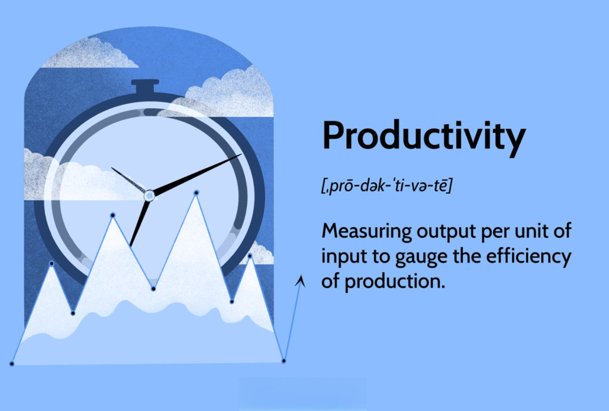

Algorithmic trading (Algo trading) has fundamentally transformed financial markets by leveraging computer algorithms to execute trades at speeds and frequencies beyond human capability. These systems analyze vast amounts of market data, rapidly making complex trading decisions that were previously unachievable. The rise of algo trading has fueled both optimism and skepticism. On one hand, it offers the potential for increased liquidity and tighter bid-ask spreads, potentially improving overall market efficiency. On the other hand, it raises concerns regarding market volatility, fairness, and the potential for systemic risks.

The introduction of algorithmic trading has sparked ongoing debates about its influence on market dynamics. Critics argue that high-frequency trading, a subset of algorithmic trading, could contribute to market instability and amplify volatility. Events such as the 2010 Flash Crash have intensified scrutiny and prompted calls for regulatory oversight to ensure fair and orderly markets.



Understanding and measuring the efficiency of algo trading systems is crucial for developing optimal strategies while maintaining market quality. Efficiency in this context refers to how effectively these systems execute trades with respect to speed, accuracy, and cost. Various metrics are employed to assess these components of efficiency, providing insights into the performance of trading algorithms. Key metrics such as the Order-to-Trade Ratio, execution efficiency, and cost efficiency are central to evaluating the effectiveness and impact of algo trading.

This article focuses on these efficiency metrics, examining their implications for traders and market observers. By exploring these metrics, we aim to provide a comprehensive understanding of how algorithmic trading efficiency can be optimized to enhance market quality and stability.

## Table of Contents

## Understanding Algorithmic Trading

Algorithmic trading, commonly referred to as Algo trading, is defined by the use of computer algorithms to execute trades at speeds and frequencies that far exceed human capabilities. The foundation of these programs lies in their ability to analyze vast quantities of market data rapidly and make decisions based on that analysis. These algorithmic systems operate by setting specific parameters and conditions under which trades are executed automatically. This can include criteria such as price, timing, and [volume](/wiki/volume-trading-strategy), all of which are formulated to optimize trading outcomes.

At the core of [algorithmic trading](/wiki/algorithmic-trading) systems are complex algorithms that are capable of dissecting market trends, predicting price movements, and executing trades with minimal latency. These algorithms leverage quantitative models to identify [arbitrage](/wiki/arbitrage) opportunities, determine trend directions, and implement a wide range of strategies, from [market making](/wiki/market-making) and arbitrage to [statistical arbitrage](/wiki/statistical-arbitrage) and [trend following](/wiki/trend-following).

The rise of Algo trading has markedly increased [liquidity](/wiki/liquidity-risk-premium) in the financial markets, facilitating smoother execution of trades and more efficient pricing mechanisms. With higher liquidity, the bid-ask spreads— the difference between the prices quoted for an immediate sale (ask) and an immediate purchase (bid)—tend to tighten. This narrowing of spread is beneficial as it reduces the cost for market participants to enter or [exit](/wiki/exit-strategy) positions, thereby improving market efficiency.

However, while Algo trading presents significant advantages, it also raises concerns regarding market manipulation and systemic risks. The speed and anonymity associated with algorithmic trading can potentially be exploited for manipulative practices such as quote stuffing—where excessive orders are placed and canceled to create confusion and slow down competitors. Moreover, since algorithmic systems can execute large volumes of transactions in milliseconds, they are also implicated in systemic risks, such as triggering flash crashes—rapid market sell-offs that can lead to sudden and severe market dislocations.

Despite these concerns, algorithmic trading continues to evolve, supported by advancements in [machine learning](/wiki/machine-learning) and [artificial intelligence](/wiki/ai-artificial-intelligence), which are further enhancing the algorithms’ capacity to make accurate and efficient trading decisions. As these systems become more sophisticated, they may address some of the challenges associated with market manipulation and systemic risks while continuing to bolster market liquidity and efficiency.

## Efficiency Metrics in Algorithmic Trading

Algorithmic trading efficiency can be measured using several key metrics, each providing unique insights into different aspects of trading performance. One primary metric is the Order-to-Trade Ratio (OTR), which is calculated as follows:

$$
\text{OTR} = \frac{\text{Total Orders}}{\text{Executed Trades}}
$$

A high OTR generally suggests the presence of high-frequency trading activity. While these activities can enhance market liquidity by increasing the number of quotes and trades per unit of time, they can also introduce market noise, potentially impacting market stability. This dual nature of high OTR underscores the need for careful analysis when evaluating trading strategies and market impact.

Another pivotal metric is execution efficiency, which evaluates the speed and accuracy of trade executions. It considers the time taken from placing an order to its execution and the extent to which the trade price deviates from the expected price. Execution efficiency can be quantitatively represented by latency metrics and slippage:

- **Latency** is measured as the time delay from order submission to order execution.
- **Slippage** is the difference between the expected trade price and the actual execution price.

Both latency and slippage are critical in assessing how well an algorithm adapts to fast-paced market changes and whether it can secure favorable trade prices without significant deviation.

Cost efficiency is another essential metric, focusing on the transaction costs incurred during trading. These costs include broker fees, taxes, and any other expenses associated with executing trades. Minimizing these costs is vital to improving overall trading performance. The total cost of a trade can be expressed by:

$$
\text{Total Cost} = \text{Broker Fees} + \text{Taxes} + \text{Slippage Costs} + \text{Other Expenses}
$$

Cost efficiency directly influences the net profitability of trading algorithms. Algorithms designed to minimize transaction costs can enhance trade profitability by ensuring that the gains from trading activity are not eroded by unnecessary expenses.

In summary, assessing the efficiency of algorithmic trading involves analyzing the Order-to-Trade Ratio, execution efficiency, and cost efficiency. Each of these metrics provides a distinct perspective on the performance and viability of trading strategies, helping traders and market observers optimize their approaches and understand the broader impact of algorithmic trading on market dynamics.

## Impact on Market Quality

Algorithmic trading (Algo trading) has become an integral component in modern financial markets, largely due to its capability to process vast amounts of data and execute trades with high efficiency. The influence of Algo trading on market quality is multifaceted, impacting liquidity, price discovery, [volatility](/wiki/volatility-trading-strategies), and overall market stability.

Efficient Algo trading systems enhance liquidity by enabling a large volume of trades to occur seamlessly, thus ensuring that buyers and sellers can execute transactions at desired price levels with minimal delay. This increased liquidity is often associated with tighter bid-ask spreads, which reflect the difference between the price at which sellers are willing to sell a stock and the price at which buyers are willing to buy. In competitive markets, tighter spreads are beneficial as they reduce the transaction costs for market participants.

Additionally, by facilitating rapid and precise execution of trades, efficient algorithms contribute to robust price discovery — the process through which the market determines the fair price of a security. With Algo trading, markets can more swiftly incorporate new information into asset prices, which may lead to more accurate reflections of an asset's intrinsic value. This function is crucial not just for daily trading activities but also for the broader financial system's stability, as it aids in preventing mispricing and potential asset bubbles.

The impact of Algo trading on market volatility, however, is subject to extensive research and debate. On one hand, efficient algorithms are capable of managing and distributing large orders over time, which can mitigate abrupt price swings and contribute to market stability. Conversely, the high-speed nature of Algo trading might amplify short-term volatility, particularly during periods of market stress when automated systems react en masse to the same market signals.

Research continues to address how Algo trading affects market depth—the ability of the market to sustain large orders without significant impact on prices. A deep market can absorb large volumes of trades without significant changes in asset prices, which is desirable for market stability. Efficient algorithms must be able to execute substantial volumes without depleting this depth, a challenge made complex by the dynamic nature of modern financial markets.

Ultimately, the efficacy of algorithmic trading in executing large volumes with minimal market disturbance marks a positive contribution to market quality. Effective execution not only benefits individual traders by optimizing their strategies but also supports the market infrastructure as a whole by ensuring a stable, liquid, and efficient trading environment. As research progresses, it is crucial for ongoing studies to develop metrics and models that accurately capture the nuanced impacts of trading algorithms on these market quality dimensions.

## Challenges in Measuring Efficiency

One of the primary challenges in measuring the efficiency of algorithmic trading is the difficulty in distinguishing between beneficial and harmful trading practices. Algorithmic trading encompasses a wide range of strategies, with varying degrees of impact on market quality. For instance, high-frequency trading strategies such as quote stuffing and front-running can significantly skew efficiency metrics, leading to misleading assessments.

Quote stuffing involves rapidly placing and then canceling orders to create confusion and slow down competitors, which can distort the perceived liquidity and mislead other market participants. This practice artificially inflates the Order-to-Trade Ratio (OTR), a critical metric for gauging trading activity efficiency. As OTR increases without a corresponding rise in actual trades, it can appear that there is more market activity and liquidity than there actually is, complicating the evaluation of algorithmic trading impacts.

Front-running, another high-frequency strategy, involves executing orders on a security for one's own account while benefiting from advance knowledge of pending orders from clients or others, leading to potential conflicts of interest and market manipulation. This practice can misrepresent the execution efficiency of trading algorithms, as trades are executed with minimal market impact but at the expense of market fairness and transparency.

Additionally, data limitations and the necessity for proprietary information further complicate the comprehensive evaluation of algorithmic trading efficiency. Many trading strategies rely on high-quality, granular data. However, such data may be inaccessible to researchers or independent evaluators due to its proprietary nature or cost, leading to incomplete analyses. The lack of standardization across data sources also poses significant challenges, as discrepancies in data accuracy and format can result in inconsistent interpretations of an algorithm's efficiency.

To illustrate these challenges, consider a scenario where an evaluator tries to assess the efficiency of a specific algorithmic strategy. The evaluator might use Python to access available trading data and calculate the OTR:

```python
def calculate_ot_ratio(orders, trades):
    return len(orders) / len(trades) if len(trades) > 0 else float('inf')

orders = [...]  # This would be populated with the algorithm's order activity data
trades = [...]  # This would be populated with the actual completed trades

ot_ratio = calculate_ot_ratio(orders, trades)
print("Order-to-Trade Ratio:", ot_ratio)
```

However, without access to complete datasets or insights into competitors' trading activities, this calculation could be significantly skewed. In conclusion, while efficiency measurement in algorithmic trading holds the potential to optimize trading strategies and enhance market stability, effectively doing so requires overcoming significant challenges related to differentiating between trading practices and overcoming data limitations.

## Regulatory Perspectives

Regulators are increasingly paying attention to metrics such as the Order-to-Trade Ratio (OTR) to monitor potential manipulative practices in algorithmic trading. OTR is a critical measurement, often scrutinized to detect aggressive trading strategies that might lead to unfair market conditions. High OTR can indicate high-frequency trading activities, which, while sometimes contributing to liquidity, can also involve tactics like quote stuffing that artificially inflate the number of orders to slow down competitors.

To ensure fair and transparent market operations, improved monitoring frameworks are essential. These frameworks aim to provide real-time analytics and insights into algorithmic trading behaviors, helping regulators swiftly identify and mitigate any form of market manipulation. For instance, applying machine learning models to historical and real-time data streams can flag anomalies that deviate from typical trading patterns, offering regulators a proactive approach to supervision.

Regulatory bodies strive to maintain a balance between fostering innovation in algorithmic trading and mitigating systemic risks associated with it. The evolution of technology in trading algorithms necessitates a dynamic regulatory approach. By focusing on metrics like OTR and enhancing their monitoring capabilities, regulators aim to create an environment that encourages technological advancements while safeguarding against potential market disruptions. Ensuring this balance is crucial as it serves not only to protect market integrity but also to bolster investor confidence, which is pivotal for the sustainable growth of financial markets.

## Conclusion

Measuring efficiency in algorithmic trading is crucial for optimizing trading strategies and ensuring the stability of financial markets. As the technology underpinning algorithmic trading continuously evolves, the metrics and methodologies used to assess efficiency will also adapt, accommodating the increasingly complex nature of market dynamics and trading systems. Traditionally, efficiency metrics such as the Order-to-Trade Ratio (OTR), execution efficiency, and cost efficiency have been central to evaluating these systems. However, as algorithmic strategies become more sophisticated, there is a growing need to refine these metrics to better capture the subtleties of trading impact.

The integration of advanced technologies like artificial intelligence and machine learning presents opportunities for developing more robust models that can provide deeper insights into algorithmic trading's impact on market quality. These models would need to account for factors such as the speed of information dissemination, non-linear relationships in trading data, and the impact of trades on market liquidity and volatility.

Future research should prioritize the development of comprehensive frameworks that incorporate these advanced analytical tools. Doing so will enable traders and regulators to distinguish between beneficial and potentially harmful trading practices more effectively. Moreover, enhanced empirical studies leveraging big data analytics could be instrumental in crafting strategies that improve the overall robustness of trading algorithms.

In summary, as the financial ecosystem becomes increasingly complex, the quest for more precise efficiency measurement in algorithmic trading will be crucial. This pursuit not only aids in optimizing trading performance but also in safeguarding market integrity by ensuring that trading practices contribute to a stable and transparent financial environment.

## References & Further Reading

[1]: Bergstra, J., Bardenet, R., Bengio, Y., & Kégl, B. (2011). ["Algorithms for Hyper-Parameter Optimization."](https://papers.nips.cc/paper/4443-algorithms-for-hyper-parameter-optimization) Advances in Neural Information Processing Systems 24.

[2]: ["Advances in Financial Machine Learning"](https://www.amazon.com/Advances-Financial-Machine-Learning-Marcos/dp/1119482089) by Marcos Lopez de Prado

[3]: ["Evidence-Based Technical Analysis: Applying the Scientific Method and Statistical Inference to Trading Signals"](https://www.amazon.com/Evidence-Based-Technical-Analysis-Scientific-Statistical/dp/0470008741) by David Aronson

[4]: ["Machine Learning for Algorithmic Trading"](https://github.com/stefan-jansen/machine-learning-for-trading) by Stefan Jansen

[5]: ["Quantitative Trading: How to Build Your Own Algorithmic Trading Business"](https://books.google.com/books/about/Quantitative_Trading.html?id=j70yEAAAQBAJ) by Ernest P. Chan