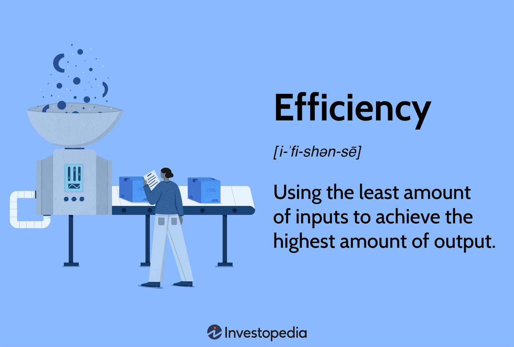

## Table of Contents

## What is efficiency and why is it important?

Efficiency means doing things in a way that saves time, money, or energy. It's about getting the best results with the least amount of waste. For example, if you can finish your homework in one hour instead of two, you are being efficient because you are using less time to get the same job done.

Efficiency is important because it helps us use our resources better. When we are efficient, we can do more things in less time, which means we have more time for other activities. It also means we can save money and energy, which is good for both us and the environment. For example, if a factory uses less energy to make the same number of products, it saves money and helps reduce pollution.

## How is efficiency typically measured in different industries?

In different industries, efficiency is measured in ways that make sense for the kind of work they do. For example, in manufacturing, efficiency is often measured by how many products can be made in a certain amount of time. This is called productivity. Another way to measure efficiency in manufacturing is by looking at how much it costs to make each product. If the cost goes down while the number of products stays the same or goes up, that means the factory is using its resources better.

In the service industry, like restaurants or hotels, efficiency might be measured by how quickly customers are served or how satisfied they are with the service. For example, a restaurant might track the average time it takes to serve a meal from the moment an order is placed. If this time gets shorter, it means the restaurant is working more efficiently. In healthcare, efficiency could be measured by how quickly patients are seen and treated, or by how well the hospital uses its resources to provide care.

In the technology industry, efficiency can be measured by how well a computer program or system uses its resources, like memory or processing power. If a program can do the same job using less memory or less time, it is considered more efficient. Companies also look at how quickly they can develop and release new products or updates. If they can do this faster, it means they are working more efficiently.

## What are the common metrics used to evaluate efficiency?

Common metrics used to evaluate efficiency include time, cost, and output. Time-based metrics measure how long it takes to complete a task or process. For example, in a factory, the time it takes to assemble a product from start to finish can be a key metric. In a restaurant, the time from when a customer orders to when they receive their meal is another example. Cost-based metrics look at how much money is spent to produce a certain output. If a business can make the same number of products for less money, it is considered more efficient. Output-based metrics focus on the quantity of goods or services produced within a given time frame. If a company can produce more items or serve more customers in the same amount of time, it is seen as more efficient.

Another important metric is resource utilization, which measures how well a business uses its resources like energy, materials, or labor. For example, a factory might track how much energy it uses to produce each unit of product. If it can produce the same amount using less energy, it is more efficient. In the service industry, labor productivity is a common metric, which looks at how much work each employee can do in a given time. If employees can serve more customers or complete more tasks without working longer hours, the business is operating more efficiently. These metrics help businesses understand where they can improve and how to make the best use of their resources.

## Can you explain the difference between efficiency and effectiveness?

Efficiency and effectiveness are two important ideas, but they are different. Efficiency means doing things in the best way to save time, money, or energy. It's about how well you use your resources to get a job done. For example, if you can finish your homework in one hour instead of two, you are being efficient because you are using less time to do the same work.

Effectiveness, on the other hand, means doing the right things to reach your goal. It's about whether you are actually achieving what you set out to do. For example, if your goal is to learn a new language and you spend an hour every day practicing, you are being effective if you are actually getting better at the language. You can be efficient without being effective if you are doing the wrong things quickly, and you can be effective without being efficient if you are doing the right things but taking a long time.

## What tools or software are available for measuring efficiency?

There are many tools and software that help measure efficiency. One common type is time tracking software, like Toggl or Harvest. These tools let you see how much time you spend on different tasks. This can help you find out if you are using your time well. Another type is project management software, like Asana or Trello. These tools help you keep track of what needs to be done and who is doing what. They can show you if your team is working efficiently by looking at how quickly tasks are completed.

Another useful tool is performance monitoring software, like New Relic or Datadog. These are often used in technology to see how well computer systems are working. They can tell you if your software is using resources efficiently. In manufacturing, tools like Overall Equipment Effectiveness (OEE) software help measure how well machines are being used. This can show if the factory is running efficiently. All these tools help businesses understand where they can improve and use their resources better.

## How can efficiency measurements be applied in a personal setting?

In a personal setting, measuring efficiency can help you do more with your time and energy. For example, if you want to get better at managing your daily tasks, you can use a time tracking app to see how long it takes you to do things like homework, chores, or even relaxing. If you find out that you spend too much time on one task, you can try to find ways to do it faster or better. This could mean setting a timer to focus on homework or finding a quicker way to clean your room. By measuring your efficiency, you can make small changes that save you time and help you get more done.

Another way to apply efficiency measurements at home is by keeping track of how you use money and resources. For example, if you want to save money, you can keep a budget to see where your money goes each month. If you notice you're spending too much on snacks, you can try to cut back and use that money for something more important. Also, if you want to use less energy, you can track how much electricity you use by looking at your bills. If you find out that you leave lights on too often, you can make a habit of turning them off when you leave a room. Measuring efficiency in these ways can help you make better choices and live a more organized and sustainable life.

## What are some case studies that demonstrate successful efficiency improvements?

In a manufacturing company called Toyota, they made a big change to how they worked. They came up with a system called "Just-In-Time" production. This means they only made parts when they needed them, instead of making a lot of parts and storing them. This saved a lot of space and money. They also used a method called "Kaizen," which means always trying to get a little better every day. By doing this, Toyota was able to make cars faster and with less waste. This made them more efficient and successful.

Another example is from a hospital in the United States called Virginia Mason Medical Center. They wanted to make their hospital run more smoothly. They used a system called the "Virginia Mason Production System," which was based on Toyota's ideas. They looked at every part of how the hospital worked and found ways to make things quicker and easier. For example, they changed how nurses got supplies so they didn't have to walk as far. This saved time and helped patients get better care faster. By focusing on efficiency, the hospital was able to improve their services and save money.

## How do you calculate Return on Investment (ROI) when improving efficiency?

When you want to see if making your work more efficient is worth it, you can use something called Return on Investment, or ROI. To calculate ROI, you first need to figure out how much money you spent to make the changes that improve efficiency. This could be the cost of new tools, training, or anything else you needed to make things better. Then, you need to see how much money you saved or made because of these changes. If you saved time, you can turn that into money by figuring out how much you earn per hour. Once you know both the cost and the savings, you can find the ROI by taking the savings, subtracting the cost, and then dividing that by the cost. Finally, you multiply by 100 to get a percentage. The formula looks like this: ROI = ((Savings - Cost) / Cost) * 100.

For example, let's say you spent $1,000 on new software to help you work faster. After using the software, you found that you saved 10 hours a week, and you earn $20 per hour. So, in a year, you saved 520 hours, which is worth $10,400. To find the ROI, you would take $10,400 (savings) minus $1,000 (cost), which equals $9,400. Then, you divide $9,400 by $1,000 and multiply by 100 to get a ROI of 940%. This means that for every dollar you spent, you got back $9.40 in savings. A high ROI like this shows that the money you spent on improving efficiency was a good investment.

## What are the limitations and potential biases in efficiency measurement methods?

Measuring efficiency can be tricky because there are limits to how well we can do it. One big problem is that we might only look at things we can easily measure, like time or money. But there are other important things that are hard to measure, like how happy people are at work or how good the quality of the work is. If we only focus on easy-to-measure things, we might miss out on important parts of efficiency. Also, the way we measure efficiency might not work the same in every situation. What works in a factory might not work in a school or a hospital. So, we need to be careful and use different ways to measure efficiency in different places.

Another issue is that efficiency measurements can have biases. This means that the way we measure things might not be fair or might favor certain people or groups. For example, if we only measure how fast someone works, we might not see that they are also very careful and do a good job. This can lead to unfair judgments about who is efficient and who is not. Also, the people who make the rules about how to measure efficiency might have their own ideas about what is important, and this can affect the results. So, it's important to think about these biases and try to use many different ways to measure efficiency to get a fair picture.

## How can advanced data analytics enhance efficiency measurements?

Advanced data analytics can help make efficiency measurements better by looking at a lot of information quickly and finding patterns that people might miss. For example, in a factory, data analytics can look at how machines are working and find out if they are using too much energy or if they are breaking down often. This helps the factory fix problems before they get worse and use their machines better. In a hospital, data analytics can look at how long patients wait to see a doctor and find ways to make the waiting time shorter. By using data analytics, businesses can see the big picture and make smarter choices about how to work more efficiently.

Another way data analytics helps is by predicting what might happen in the future. For example, if a store uses data analytics to look at what people buy at different times of the year, they can plan better for busy times and make sure they have enough staff. This means they can serve more customers without making them wait too long. Also, data analytics can help find small problems before they become big ones. If a company sees that one part of their work is slowing down, they can fix it quickly. This makes everything run smoother and helps the company use their time and money better.

## What role does machine learning play in predicting and improving efficiency?

Machine learning can help predict and improve efficiency by looking at a lot of data and finding patterns that people might not see. For example, in a factory, machine learning can look at how machines are working and predict when they might break down. This helps the factory fix the machines before they stop working, so they can keep making products without losing time. Machine learning can also help businesses see how their work is going and find ways to make it faster and better. By using machine learning, companies can make smart choices about how to use their time and resources.

Another way machine learning helps is by finding small problems before they become big ones. For example, if a store uses machine learning to look at what people buy, it can predict when they will need more staff or products. This means the store can be ready for busy times and serve more customers without making them wait too long. Machine learning also helps by showing businesses where they can save money or time. If machine learning finds that one part of the work is slowing things down, the business can fix it quickly. This makes everything run smoother and helps the company use their resources better.

## How can organizations implement a continuous improvement process based on efficiency metrics?

Organizations can start a continuous improvement process by using efficiency metrics to see where they can do better. They can look at how long it takes to do things, how much it costs, and how well they use their resources. By tracking these things, they can find out which parts of their work are slow or wasteful. Then, they can make small changes to fix these problems. For example, if a factory sees that one machine is always breaking down, they can fix it or replace it to make the whole process faster. By always looking at their efficiency metrics, the organization can keep making their work better and better.

Once the organization knows where they need to improve, they can use methods like "Kaizen," which means always trying to get a little better every day. They can set up teams to look at the efficiency metrics and come up with ideas for improvement. These teams can try out new ways of doing things and see if they work. If they do, the organization can use these new ways all the time. By doing this over and over, the organization can keep getting more efficient. This helps them save time and money, and do a better job for their customers.

## What are Efficiency Metrics in Algorithmic Trading?

Algorithmic trading efficiency can be measured using several key metrics, each providing unique insights into different aspects of trading performance. One primary metric is the Order-to-Trade Ratio (OTR), which is calculated as follows:

$$
\text{OTR} = \frac{\text{Total Orders}}{\text{Executed Trades}}
$$

A high OTR generally suggests the presence of high-frequency trading activity. While these activities can enhance market liquidity by increasing the number of quotes and trades per unit of time, they can also introduce market noise, potentially impacting market stability. This dual nature of high OTR underscores the need for careful analysis when evaluating trading strategies and market impact.

Another pivotal metric is execution efficiency, which evaluates the speed and accuracy of trade executions. It considers the time taken from placing an order to its execution and the extent to which the trade price deviates from the expected price. Execution efficiency can be quantitatively represented by latency metrics and slippage:

- **Latency** is measured as the time delay from order submission to order execution.
- **Slippage** is the difference between the expected trade price and the actual execution price.

Both latency and slippage are critical in assessing how well an algorithm adapts to fast-paced market changes and whether it can secure favorable trade prices without significant deviation.

Cost efficiency is another essential metric, focusing on the transaction costs incurred during trading. These costs include broker fees, taxes, and any other expenses associated with executing trades. Minimizing these costs is vital to improving overall trading performance. The total cost of a trade can be expressed by:

$$
\text{Total Cost} = \text{Broker Fees} + \text{Taxes} + \text{Slippage Costs} + \text{Other Expenses}
$$

Cost efficiency directly influences the net profitability of trading algorithms. Algorithms designed to minimize transaction costs can enhance trade profitability by ensuring that the gains from trading activity are not eroded by unnecessary expenses.

In summary, assessing the efficiency of algorithmic trading involves analyzing the Order-to-Trade Ratio, execution efficiency, and cost efficiency. Each of these metrics provides a distinct perspective on the performance and viability of trading strategies, helping traders and market observers optimize their approaches and understand the broader impact of algorithmic trading on market dynamics.

## References & Further Reading

[1]: Bergstra, J., Bardenet, R., Bengio, Y., & Kégl, B. (2011). ["Algorithms for Hyper-Parameter Optimization."](https://papers.nips.cc/paper/4443-algorithms-for-hyper-parameter-optimization) Advances in Neural Information Processing Systems 24.

[2]: ["Advances in Financial Machine Learning"](https://www.amazon.com/Advances-Financial-Machine-Learning-Marcos/dp/1119482089) by Marcos Lopez de Prado

[3]: ["Evidence-Based Technical Analysis: Applying the Scientific Method and Statistical Inference to Trading Signals"](https://www.amazon.com/Evidence-Based-Technical-Analysis-Scientific-Statistical/dp/0470008741) by David Aronson

[4]: ["Machine Learning for Algorithmic Trading"](https://github.com/stefan-jansen/machine-learning-for-trading) by Stefan Jansen

[5]: ["Quantitative Trading: How to Build Your Own Algorithmic Trading Business"](https://books.google.com/books/about/Quantitative_Trading.html?id=j70yEAAAQBAJ) by Ernest P. Chan