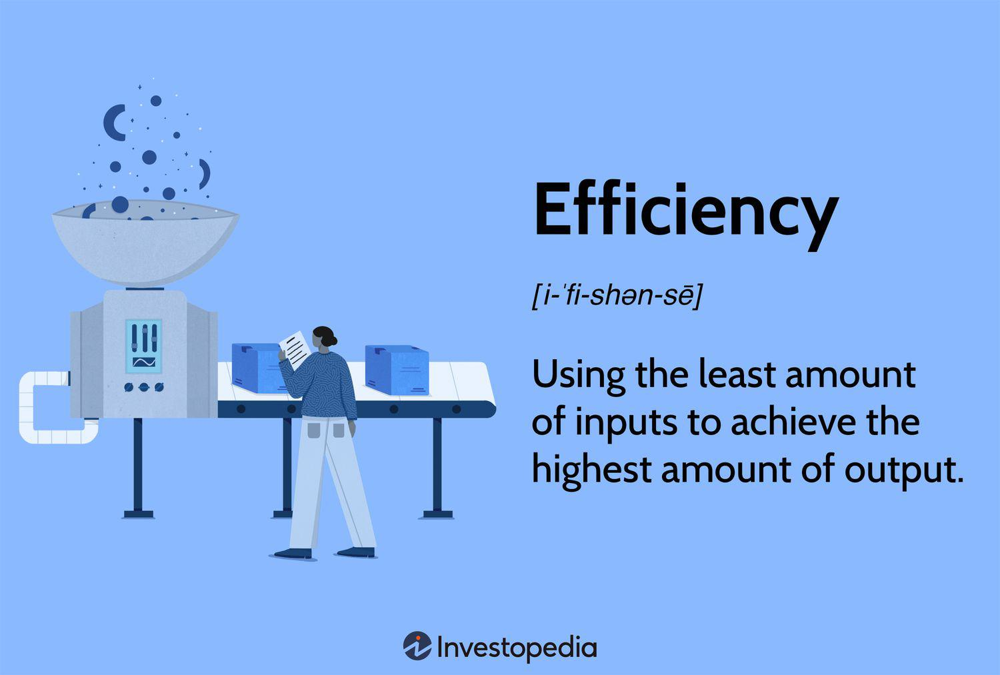

The modern economic landscape is dominated by the quest for efficiency, a pursuit that underpins the strategies of businesses and governments worldwide. Economic efficiency holds a crucial position as it strives to maximize outputs while minimizing inputs, ensuring optimal use of resources. It is a principle that resonates across various sectors, with algorithmic trading emerging as a significant area where economic efficiency is both essential and critically examined.

Algorithmic trading, by harnessing complex algorithms to execute trades rapidly, aims to achieve economic efficiency by capitalizing on fleeting market opportunities. This approach reduces waste, lowers transaction costs, and enhances the speed and accuracy of financial transactions. The significance of economic efficiency extends beyond finance, as it serves as a guiding beacon for policy-making and resource allocation in diverse economic environments.



This article examines the principles of economic efficiency and their applications, particularly in economics and algorithmic trading. By exploring these concepts, we aim to illuminate how the quest for efficiency influences economic strategies and decision-making processes. The analysis will involve a discussion of core economic theories, real-world applications, and the implications of pursuing efficiency in rapidly evolving markets.

## Table of Contents

## Understanding the Efficiency Principle

The efficiency principle is a foundational concept in economics, positing that maximum societal benefits are achieved when the marginal benefits of an action equal its marginal social costs. This balance ensures that resources are allocated in a way that maximizes overall welfare, minimizing waste and enhancing productivity. The principle is crucial for conducting cost-benefit analyses, which are used to evaluate the desirability of a project or decision by comparing the costs incurred against the benefits gained.

A fundamental mathematical expression of this principle involves equating the marginal benefit (MB) to the marginal cost (MC). In economic terms, the condition for efficiency can be expressed as:

$$
MB = MC
$$

Here, the marginal benefit represents the additional gain from producing or consuming one more unit, while the marginal cost is the additional cost of producing or consuming that unit. When these are equal, resources are said to be allocated efficiently.

However, translating this theoretical model into practice presents significant challenges due to various assumptions and the dynamic nature of markets. For instance, the principle assumes that all costs and benefits can be precisely measured and valued, an idealization that is rarely possible due to market imperfections and the presence of externalities. These imperfections can include information asymmetries, transaction costs, and market power that distort allocations away from those predicted by the efficiency principle.

Moreover, real-world market conditions often deviate from perfect competition, introducing complexities that hinder straightforward application. Factors such as regulatory constraints, consumer preferences, and technological changes further complicate the process of achieving true efficiency. As a result, while the efficiency principle offers a valuable framework for understanding resource allocation, its practical application is frequently constrained by these real-world complexities. 

Economists and policymakers must therefore account for these limitations when applying the efficiency principle, ensuring that assumptions are tailored to specific contexts and that the potential for unintended consequences is acknowledged. This careful consideration is crucial for leveraging the principle effectively in guiding economic decisions that aim to maximize societal benefits.

## The Role of Economic Efficiency in Economics

Economic efficiency is a foundational concept in economics, encompassing both allocative and productive efficiency. At its core, it strives for a state where resources are distributed in a manner that maximizes societal welfare. A significant aspect of economic efficiency is allocative efficiency, which occurs when resources are allocated in such a way that the marginal benefit equals the marginal cost. This balance ensures that resources are used where they are most valued, resulting in maximum net benefit to society.

One of the primary goals of economic efficiency is the reduction of deadweight loss, which represents the loss of economic efficiency when the equilibrium outcome is not achieved. Deadweight loss often occurs due to factors like taxation, subsidies, or market monopolies that disrupt the natural equilibrium. By minimizing these inefficiencies, economic efficiency aims to optimize resource use and prevent wastage.

Consumers play a critical role in achieving economic efficiency through their decision-making processes. Rational consumers make purchasing decisions by comparing marginal utilities—the additional satisfaction gained from consuming an extra unit of a good or service. This behavior directly influences demand and supply curves in markets. When consumers act rationally, aligning their choices with marginal costs and benefits, the result is often a more efficient allocation of resources.

This can be reflected in the following mathematical expression, which captures the equilibrium condition:

$$
MU = MC
$$

where $MU$ is the marginal utility derived from consuming an additional unit, and $MC$ represents the marginal cost of that unit.

However, real-world economics frequently experiences deviations from the ideal conditions of economic efficiency due to various market distortions. Factors such as externalities, information asymmetries, and the presence of public goods can lead to inefficiencies. Moreover, behavioral economics has shown that consumers do not always act entirely rationally, further complicating the achievement of true economic efficiency.

Despite these challenges, understanding and striving towards economic efficiency remains crucial for policymakers and businesses alike. By aiming to align marginal costs and benefits more closely, efforts can be directed toward reducing waste, improving productivity, and ultimately enhancing societal welfare. Continuing research and application of these principles help navigate the complex economic landscapes and adapt strategies that aim for efficiency while acknowledging and managing inherent real-world complexities.

## Economic Efficiency in Algorithmic Trading

Algorithmic trading pertains to the use of algorithms to automate the trading process, capitalizing on data-driven decisions at speeds and frequencies unmanageable by human traders. At its core, [algorithmic trading](/wiki/algorithmic-trading) seeks economic efficiency by executing trades at optimal prices, thereby reducing transaction costs and maximizing returns. This is achieved through the rapid analysis of vast amounts of market data to identify and [arbitrage](/wiki/arbitrage) away inefficiencies.

The implementation of algorithms in trading reduces human error and emotional bias. Algorithms follow predefined rules and strategies, offering a consistent approach to trading that is less susceptible to the psychological influences that often affect human traders. This predictable behavior aligns with the principles of economic efficiency, which advocate for decision-making processes that optimize resource allocation and outcome predictability.

Advancements in [machine learning](/wiki/machine-learning) and [artificial intelligence](/wiki/ai-artificial-intelligence) have significantly enhanced the decision-making capabilities of trading algorithms. Machine learning models can process large datasets to learn patterns and predict future market movements more accurately. For instance, these models might use historical price data, trading volumes, and even sentiment analysis from social media and news sources to forecast price trends. A simple Python example demonstrating how one might implement a basic machine learning model for trading is provided below:

```python
import pandas as pd
from sklearn.model_selection import train_test_split
from sklearn.ensemble import RandomForestClassifier

# Load historical trading data
data = pd.read_csv('historical_data.csv')

# Prepare feature and target variables
features = data[['price', 'volume', 'moving_average']]
target = data['target']

# Split data into training and test sets
X_train, X_test, y_train, y_test = train_test_split(features, target, test_size=0.2, random_state=42)

# Train a Random Forest model
model = RandomForestClassifier(n_estimators=100, random_state=42)
model.fit(X_train, y_train)

# Predictions
predictions = model.predict(X_test)
```

Despite the efficiency gains, algorithmic trading is not without risks. The speed and [volume](/wiki/volume-trading-strategy) of trades executed can lead to market [volatility](/wiki/volatility-trading-strategies). Notable incidents, such as flash crashes, where prices plummet and recover swiftly, raise concerns about market stability. To manage these risks, robust risk management systems are essential, and regulatory frameworks must balance efficiency with market stability and fairness.

In sum, while algorithmic trading epitomizes the quest for economic efficiency within financial markets, the application requires careful oversight. Continuous advancements in technology will likely continue to refine the efficiency of algorithmic trading, but a vigilant approach to managing its risks is crucial for maintaining market integrity.

## Challenges and Limitations

Economic efficiency, while a core principle in both theoretical and applied economics, encounters several challenges and limitations when applied to real-world scenarios. A primary constraint comes from the theoretical assumptions that underpin the efficiency principle. Economists often assume perfectly competitive markets, rational behavior by consumers and firms, and complete information availability—conditions rarely met in reality.

In practical settings, market dynamics are inherently complex and influenced by a multitude of diverse variables. Markets are often unpredictable, driven by asymmetric information, external shocks, and behavioral factors that deviate from ideal rationality models. These factors make achieving true economic efficiency a challenging endeavor.

Algorithmic trading embodies the quest for economic efficiency by aiming for optimal trade execution to capitalize on market inefficiencies. However, it brings its own set of challenges. While designed to enhance efficiency, algorithmic trading can inadvertently increase market volatility. One notable consequence is the potential for "flash crashes," sudden and severe market corrections triggered by automated trading activities. For instance, the flash crash of May 6, 2010, demonstrated how algorithmic trading could disrupt market stability within minutes.

Regulatory frameworks play a critical role in mitigating these risks, aiming to ensure that economic efficiency does not come at the expense of market fairness and stability. Regulators strive to balance the benefits of efficient markets with the need to prevent systemic risks and protect market participants from potential abuses or unintended consequences of high-frequency trading strategies.

To sustain efficiency while safeguarding against potential drawbacks, continual assessment of both economic and technological factors is necessary. This involves evaluating the evolving landscape of financial markets, technological advancements, and their interplay. For example, advancements in machine learning and artificial intelligence offer prospects for enhanced decision-making efficiency but also raise concerns regarding ethical considerations and the transparency of complex trading algorithms.

In conclusion, while the efficiency principle provides a valuable framework for understanding optimal resource allocation, its real-world application is often hampered by challenges that stem from deviations between theory and practice. A nuanced approach that incorporates both economic and regulatory considerations is essential for navigating these challenges effectively and ensuring sustainable efficiency in global markets.

## Conclusion

Economic efficiency remains a key objective in the quest to optimize resource use and maximize societal benefits. It serves as a benchmark for decision-making processes in various economic activities. At its core, the efficiency principle offers a robust theoretical foundation where the goal is to match marginal benefits with marginal costs. This alignment is imperative to ensure that resources are utilized where they yield the highest net benefit to society. However, translating the principle into practice necessitates meticulous consideration of real-world complexities, as theoretical assumptions often meet varied challenges in diverse and unpredictable market environments.

Algorithmic trading stands as a tangible manifestation of economic efficiency principles within financial markets. By harnessing advanced algorithms, it facilitates rapid data processing and decision-making, thereby enabling trades at optimal prices. This approach reduces human error and emotional influence, often resulting in more efficient market outcomes. Despite these benefits, algorithmic trading is not devoid of drawbacks. Issues such as increased market volatility and the risk of events such as flash crashes necessitate a cautious and balanced application of these technologies.

The landscape of economic efficiency is continuously shaped by advancements in technology and economic theories. Emerging innovations promise to further refine efficiency outcomes, offering potential for improved resource allocation and enhanced market performance. The integration of machine learning and artificial intelligence, for example, holds the potential to further optimize decision-making processes in resource allocation and trading.

In view of these dynamics, a balanced approach that weighs both the advantages of efficiency and its potential risks is vital. While pursuing efficiency, stakeholders must remain vigilant about the implications of their strategies on market stability, fairness, and long-term sustainability. As we look to the future, this equilibrium will be critical in steering growth and ensuring that efficiency contributes positively to societal welfare.

## References & Further Reading

[1]: Fama, E. F. (1970). ["Efficient Capital Markets: A Review of Theory and Empirical Work."](https://www.jstor.org/stable/2325486) The Journal of Finance, 25(2), 383-417.

[2]: Hasbrouck, J. (2003). ["Intraday Price Formation in U.S. Equity Markets."](https://onlinelibrary.wiley.com/doi/10.1046/j.1540-6261.2003.00609.x) The Review of Financial Studies, 16(1), 331-351.

[3]: Brossette, U., Filipová, L., & Bodnar, O. (2019). ["How Regulatory Frameworks Impact the Efficiency of Algorithmic Trading: Evidence from the EMIR Regulation."](https://link.springer.com/article/10.1007/s10203-019-00247-2) The Geneva Risk and Insurance Review, 44(2), 159-192.

[4]: Kissell, R. (2014). ["The Science of Algorithmic Trading and Portfolio Management."](https://www.sciencedirect.com/book/9780124016897/the-science-of-algorithmic-trading-and-portfolio-management) Academic Press.

[5]: Cartea, Á., Jaimungal, S., & Penalva, J. (2015). ["Algorithmic and High-Frequency Trading."](https://assets.cambridge.org/97811070/91146/frontmatter/9781107091146_frontmatter.pdf) Cambridge University Press.

[6]: Lo, A. W. (1997). ["Market Efficiency: Stock Market Behaviour in Theory and Practice."](https://books.google.com/books/about/Market_efficiency.html?id=CWgPAQAAMAAJ) Edward Elgar Publishing.