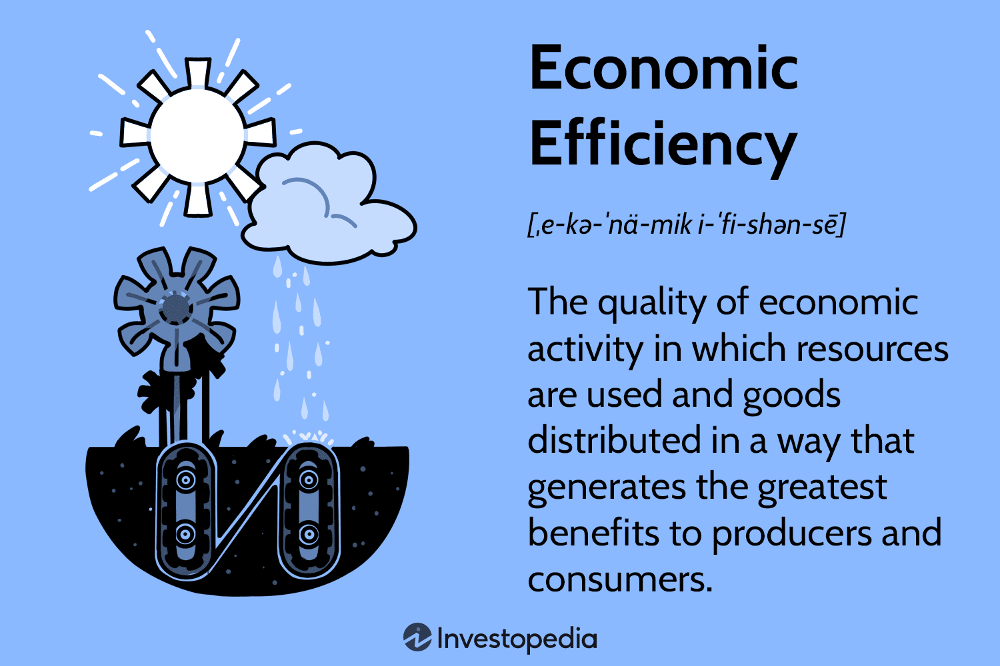

## Table of Contents

## What is the efficiency principle in economics?

The efficiency principle in economics is all about using resources in the best way possible to get the most out of them. Imagine you have a limited amount of money and you want to buy things that give you the most happiness or usefulness. In economics, this means using resources like labor, money, and materials to produce goods and services in a way that maximizes benefits and minimizes waste. It's like trying to get the biggest bang for your buck.

This principle is important because it helps guide decisions on how to allocate resources. For example, a business might decide to use a new technology that makes production faster and cheaper, which is more efficient than the old way. On a larger scale, governments might use the efficiency principle to decide how to spend tax money on things like healthcare or education, aiming to get the best results for their citizens. By focusing on efficiency, both businesses and governments can make better use of what they have, leading to more overall satisfaction and economic growth.

## How does the efficiency principle relate to resource allocation?

The efficiency principle is a key idea when it comes to deciding how to use resources. It's all about making the best use of what you have, like money, time, or materials. When you're trying to figure out how to allocate resources, you want to make sure you're getting the most benefit out of them. For example, if you're a farmer, you want to use your land, water, and seeds in a way that grows the most food possible. This means choosing the right crops and farming methods that will give you the best results without wasting anything.

In economics, this principle helps guide big decisions too. Governments and businesses use it to decide where to put their money and effort. For instance, a government might decide to build more schools instead of roads if they think education will help the country more in the long run. Businesses might invest in new technology to make their products faster and cheaper. By following the efficiency principle, they're trying to make sure every resource is used in a way that brings the most value, whether that's more profit for a business or better services for a community.

## Can you explain the concept of Pareto efficiency?

Pareto efficiency is a way to figure out if resources are being used in the best way possible. Imagine you and your friends are sharing a pizza. If you can't make anyone happier with their slice without making someone else less happy, then you've got a Pareto efficient situation. In economics, this means you can't make one person better off without making someone else worse off. It's all about finding that perfect balance where everyone is as happy as they can be, given what you have.

This idea is really important for understanding how to use resources in society. It helps economists and policymakers think about how to make things fair and efficient. For example, if a government is deciding how to spend money on healthcare and education, they want to do it in a way that helps as many people as possible without hurting anyone else. But remember, just because something is Pareto efficient doesn't mean it's perfect or fair. It just means you've used what you have in the best way you can, without making anyone worse off.

## What is the difference between allocative and productive efficiency?

Allocative efficiency is about making sure resources are used to produce the things that people want the most. Imagine you're at a restaurant and you have a limited budget. You want to spend your money on the dishes that will make you the happiest. In economics, it's the same idea. If a society is allocatively efficient, it's producing the right mix of goods and services that people value the most. It's like making sure the economy is giving people what they really want, without wasting anything.

Productive efficiency, on the other hand, is all about making things in the cheapest way possible. It's about using the least amount of resources to produce goods and services. Think of it like making a pizza. If you can make the same pizza with less dough, cheese, and toppings, that's being productively efficient. In the economy, businesses aim for productive efficiency by finding the best ways to make things, so they can save money and resources. Both types of efficiency are important, but they focus on different parts of the production and consumption process.

## How do markets achieve efficiency according to economic theory?

Markets achieve efficiency by letting people buy and sell things freely. When people can choose what they want to buy and sell, it helps make sure that resources go where they're needed the most. Imagine you're at a farmers' market. If lots of people want apples, the price of apples goes up. This tells farmers to grow more apples because they can make more money. At the same time, if nobody wants bananas, the price of bananas goes down, and farmers might decide to grow fewer bananas. This way, the market helps make sure that the right amount of apples and bananas are grown, based on what people want.

This process is called the price mechanism, and it helps markets reach both allocative and productive efficiency. Allocative efficiency happens when the market produces the things that people want the most. If people really want more apples, the market will make sure more apples are grown. Productive efficiency happens when businesses find the cheapest way to make things. If a farmer finds a new way to grow apples that uses less water and fewer seeds, they'll use that method to save money. By letting prices guide what gets made and how it gets made, markets can use resources in the best way possible, making everyone better off.

## What are the conditions necessary for a market to be efficient?

For a market to be efficient, a few important things need to be in place. First, there should be lots of buyers and sellers. This means no one person or company can control the prices too much. When there are many people buying and selling, prices can move freely based on what people want. Second, everyone in the market needs to have good information. If buyers and sellers know all about the products and prices, they can make smart choices. This helps the market work smoothly and fairly.

Another important condition is that there should be no big barriers stopping people from entering or leaving the market. If it's easy for new businesses to start selling, it keeps the market competitive. Also, the products being sold need to be similar enough so that people can easily switch between them. This makes sure that companies have to keep their prices and quality good to stay in business. When all these things are working well together, the market can use resources in the best way possible, making sure people get what they want at the best price.

## What are some common market failures that can lead to inefficiencies?

Market failures are when the market doesn't work the way it should, and this can lead to things not being used in the best way. One common problem is when there are too few sellers or buyers, which can let one group control prices. For example, if one big company owns all the water in a town, they might charge too much because people have no other choice. This is called a monopoly, and it can make the market less fair and efficient. Another issue is when people don't have all the information they need. If a car company hides problems with their cars, people might buy them thinking they're good, but they're not. This can lead to people making bad choices and resources being wasted.

Another type of market failure happens with things called externalities. These are costs or benefits that affect other people who aren't part of the buying or selling. For example, if a factory pollutes the air, it makes the air dirty for everyone nearby, but the factory doesn't pay for that. This can lead to too much pollution because the factory doesn't have to think about the harm it's causing. Public goods are another problem. These are things like street lights or national defense that everyone can use, but no one wants to pay for because they can use them even if they don't pay. This can mean not enough of these goods are made, which isn't good for everyone.

## How can government intervention improve or worsen economic efficiency?

Government intervention can help make the economy work better by fixing problems that markets can't solve on their own. For example, if a factory is polluting the air, the government can make rules to stop it. This helps everyone breathe cleaner air and makes sure the factory pays for the harm it causes. Governments can also help by making sure everyone has good information. They can set up rules so companies have to tell the truth about their products. This helps people make better choices and keeps the market fair. Another way governments can help is by providing public goods like roads and schools, which everyone can use but no one wants to pay for. By doing this, the government makes sure these important things are available for everyone, which helps the economy run smoothly.

But sometimes, government actions can make things worse instead of better. If the government sets prices too high or too low, it can mess up the market. For example, if the government says milk can't cost more than a certain amount, farmers might not want to sell milk because they can't make enough money. This can lead to less milk being available, which isn't good for anyone. Also, if the government spends too much money on things that aren't really needed, it can waste resources. Too many rules and regulations can also slow down businesses, making it harder for them to do what they do best. So, while government help can be good, it's important that they do it in a way that really helps the economy and doesn't cause more problems.

## What role do externalities play in the efficiency principle?

Externalities are like side effects of buying and selling things that affect other people who aren't part of the deal. They can make the market less efficient because they mess up the balance between what people want and what gets made. For example, if a factory makes a lot of smoke, it can make the air dirty for everyone nearby. The factory doesn't pay for the dirty air, so it keeps making smoke, even though it's bad for everyone else. This means too much smoke is being made, and that's not good for the economy or people's health.

Because of externalities, the market might not use resources in the best way. If the factory had to pay for the dirty air, it might find a cleaner way to make things, which would be better for everyone. Governments can help fix this problem by making rules or taxes that make companies think about their side effects. By doing this, they can help the market work better and use resources more efficiently. So, dealing with externalities is important for making sure the economy is as efficient as possible.

## How is the efficiency principle applied in cost-benefit analysis?

The efficiency principle is a big part of cost-benefit analysis. This is a way to figure out if doing something is worth it. Imagine you want to build a new playground in your town. You'd look at all the costs, like how much money it takes to build it, and all the benefits, like how much fun kids will have and how it might make the neighborhood nicer. The efficiency principle helps you see if the playground will give you more good stuff than it costs. If the benefits are bigger than the costs, then building the playground is a good use of resources, and that's what the efficiency principle is all about.

In cost-benefit analysis, you want to make sure you're using resources in the best way possible. Sometimes, you might find that the costs are too high compared to the benefits. For example, if building the playground would cost a lot of money but not many kids would use it, it might not be worth it. By using the efficiency principle, you can decide if the playground—or any project—is a smart choice. It helps you make decisions that will make the most people happy without wasting money or other resources.

## What are the criticisms of the efficiency principle from an economic perspective?

Some people think the efficiency principle has problems. They say it doesn't always think about fairness. If a market is efficient, it might make some people better off but leave others worse off. For example, a business might find a way to make things cheaper, but that could mean workers lose their jobs. So, even if the market is using resources well, it might not be fair for everyone.

Another criticism is that the efficiency principle can be hard to measure. It's tough to put a number on things like happiness or the value of clean air. If you can't measure these things well, it's hard to know if you're really being efficient. Plus, people might disagree on what's important. What one person thinks is a good use of resources might not be the same for someone else. So, using the efficiency principle to make decisions can be tricky because not everyone will see it the same way.

## How do advanced economic models measure and analyze efficiency?

Advanced economic models use math and computers to measure and analyze efficiency. They look at how resources are used and how much value they create. For example, they might use something called "production functions" to see how well a business turns raw materials into products. These models can also use "optimization techniques" to find the best way to use resources. By doing this, they can tell if a market or an economy is using its resources in the most efficient way possible.

But these models also have to think about things that are hard to measure, like happiness or the environment. They use "shadow pricing" to put a value on things that don't have a clear price tag. For example, they might try to figure out how much clean air is worth. These models can also run "simulations" to see what might happen if things change, like if a new law is passed or if there's a new technology. By doing all this, advanced economic models can give a detailed picture of how efficient an economy is and help make better decisions about using resources.

## What is the Efficiency Principle and how can it be understood?

The efficiency principle is a foundational concept in economics, positing that maximum societal benefits are achieved when the marginal benefits of an action equal its marginal social costs. This balance ensures that resources are allocated in a way that maximizes overall welfare, minimizing waste and enhancing productivity. The principle is crucial for conducting cost-benefit analyses, which are used to evaluate the desirability of a project or decision by comparing the costs incurred against the benefits gained.

A fundamental mathematical expression of this principle involves equating the marginal benefit (MB) to the marginal cost (MC). In economic terms, the condition for efficiency can be expressed as:

$$
MB = MC
$$

Here, the marginal benefit represents the additional gain from producing or consuming one more unit, while the marginal cost is the additional cost of producing or consuming that unit. When these are equal, resources are said to be allocated efficiently.

However, translating this theoretical model into practice presents significant challenges due to various assumptions and the dynamic nature of markets. For instance, the principle assumes that all costs and benefits can be precisely measured and valued, an idealization that is rarely possible due to market imperfections and the presence of externalities. These imperfections can include information asymmetries, transaction costs, and market power that distort allocations away from those predicted by the efficiency principle.

Moreover, real-world market conditions often deviate from perfect competition, introducing complexities that hinder straightforward application. Factors such as regulatory constraints, consumer preferences, and technological changes further complicate the process of achieving true efficiency. As a result, while the efficiency principle offers a valuable framework for understanding resource allocation, its practical application is frequently constrained by these real-world complexities. 

Economists and policymakers must therefore account for these limitations when applying the efficiency principle, ensuring that assumptions are tailored to specific contexts and that the potential for unintended consequences is acknowledged. This careful consideration is crucial for leveraging the principle effectively in guiding economic decisions that aim to maximize societal benefits.

## What is the role of economic efficiency in economics?

Economic efficiency is a foundational concept in economics, encompassing both allocative and productive efficiency. At its core, it strives for a state where resources are distributed in a manner that maximizes societal welfare. A significant aspect of economic efficiency is allocative efficiency, which occurs when resources are allocated in such a way that the marginal benefit equals the marginal cost. This balance ensures that resources are used where they are most valued, resulting in maximum net benefit to society.

One of the primary goals of economic efficiency is the reduction of deadweight loss, which represents the loss of economic efficiency when the equilibrium outcome is not achieved. Deadweight loss often occurs due to factors like taxation, subsidies, or market monopolies that disrupt the natural equilibrium. By minimizing these inefficiencies, economic efficiency aims to optimize resource use and prevent wastage.

Consumers play a critical role in achieving economic efficiency through their decision-making processes. Rational consumers make purchasing decisions by comparing marginal utilities—the additional satisfaction gained from consuming an extra unit of a good or service. This behavior directly influences demand and supply curves in markets. When consumers act rationally, aligning their choices with marginal costs and benefits, the result is often a more efficient allocation of resources.

This can be reflected in the following mathematical expression, which captures the equilibrium condition:

$$
MU = MC
$$

where $MU$ is the marginal utility derived from consuming an additional unit, and $MC$ represents the marginal cost of that unit.

However, real-world economics frequently experiences deviations from the ideal conditions of economic efficiency due to various market distortions. Factors such as externalities, information asymmetries, and the presence of public goods can lead to inefficiencies. Moreover, behavioral economics has shown that consumers do not always act entirely rationally, further complicating the achievement of true economic efficiency.

Despite these challenges, understanding and striving towards economic efficiency remains crucial for policymakers and businesses alike. By aiming to align marginal costs and benefits more closely, efforts can be directed toward reducing waste, improving productivity, and ultimately enhancing societal welfare. Continuing research and application of these principles help navigate the complex economic landscapes and adapt strategies that aim for efficiency while acknowledging and managing inherent real-world complexities.

## References & Further Reading

[1]: Fama, E. F. (1970). ["Efficient Capital Markets: A Review of Theory and Empirical Work."](https://www.jstor.org/stable/2325486) The Journal of Finance, 25(2), 383-417.

[2]: Hasbrouck, J. (2003). ["Intraday Price Formation in U.S. Equity Markets."](https://onlinelibrary.wiley.com/doi/10.1046/j.1540-6261.2003.00609.x) The Review of Financial Studies, 16(1), 331-351.

[3]: Brossette, U., Filipová, L., & Bodnar, O. (2019). ["How Regulatory Frameworks Impact the Efficiency of Algorithmic Trading: Evidence from the EMIR Regulation."](https://link.springer.com/article/10.1007/s10203-019-00247-2) The Geneva Risk and Insurance Review, 44(2), 159-192.

[4]: Kissell, R. (2014). ["The Science of Algorithmic Trading and Portfolio Management."](https://www.sciencedirect.com/book/9780124016897/the-science-of-algorithmic-trading-and-portfolio-management) Academic Press.

[5]: Cartea, Á., Jaimungal, S., & Penalva, J. (2015). ["Algorithmic and High-Frequency Trading."](https://assets.cambridge.org/97811070/91146/frontmatter/9781107091146_frontmatter.pdf) Cambridge University Press.

[6]: Lo, A. W. (1997). ["Market Efficiency: Stock Market Behaviour in Theory and Practice."](https://books.google.com/books/about/Market_efficiency.html?id=CWgPAQAAMAAJ) Edward Elgar Publishing.