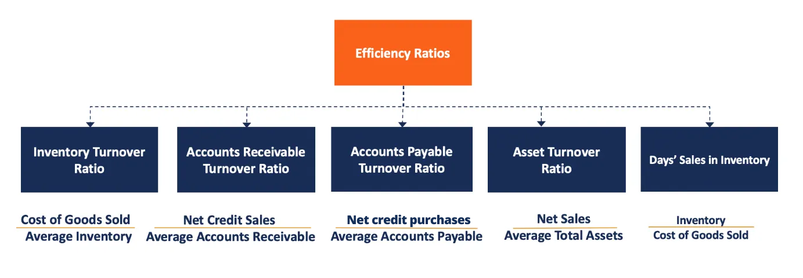

## Table of Contents

## What is the efficiency ratio in finance?

The efficiency ratio in finance is a way to see how well a bank or a financial institution is managing its costs. It is calculated by dividing the bank's non-interest expenses by its revenue. The result is shown as a percentage. A lower percentage means the bank is more efficient because it is spending less money to earn its revenue.

This ratio is important because it helps investors and managers understand how well the bank is using its resources. If the efficiency ratio is high, it means the bank is spending a lot of money to earn its revenue, which is not good. Banks always try to keep this ratio low to show they are managing their costs well and making more profit.

## How is the efficiency ratio calculated?

The efficiency ratio is a way to see how good a bank is at managing its costs. You find it by dividing the bank's non-interest expenses by its revenue. Non-interest expenses are costs like salaries, rent, and other things that don't come from paying interest on loans. Revenue is the money the bank earns, including interest from loans and fees from services. Once you divide these two numbers, you get a percentage. A smaller percentage means the bank is doing a better job at keeping costs low while earning money.

This ratio is important for people who invest in banks or manage them. It helps them see if the bank is using its money wisely. If the efficiency ratio is high, it means the bank is spending a lot to earn its money, which is not good. Banks want to keep this ratio low because it shows they are managing their costs well and making more profit. By looking at this number, investors and managers can make better decisions about the bank's future.

## Why is the efficiency ratio important for businesses?

The efficiency ratio is important for businesses because it shows how well they are managing their costs. For banks, this means looking at how much they spend on things like salaries and rent compared to the money they earn from loans and services. A lower efficiency ratio means the business is doing a good job at keeping costs down while making money. This is important because it helps the business make more profit.

Business owners and investors use the efficiency ratio to see if a company is using its resources wisely. If the ratio is high, it means the business is spending too much to earn its money, which can be a problem. By keeping an eye on this ratio, businesses can find ways to cut costs and improve how they operate. This helps them stay competitive and grow over time.

## What does a lower efficiency ratio indicate?

A lower efficiency ratio means a business is doing a good job at managing its costs. For banks, this means they are spending less money on things like salaries and rent compared to the money they earn from loans and services. When the efficiency ratio is low, it shows that the bank is efficient because it doesn't need to spend a lot to make money.

This is important for businesses because a lower efficiency ratio means they can make more profit. Investors and managers look at this ratio to see if the company is using its money wisely. If the ratio is low, it's a good sign that the business is doing well and can keep growing without spending too much.

## Can you provide an example of how to calculate the efficiency ratio?

Let's say a bank has non-interest expenses of $50 million. These are costs like salaries, rent, and other things that don't come from paying interest on loans. The bank also earns $100 million in revenue, which is the money it gets from loans and services. To find the efficiency ratio, you divide the non-interest expenses by the revenue. So, you take $50 million and divide it by $100 million. That gives you 0.5, which you then multiply by 100 to turn it into a percentage. The efficiency ratio for this bank is 50%.

A 50% efficiency ratio means that the bank is spending half of its revenue on non-interest expenses. This is a pretty good number because it shows the bank is managing its costs well. If the ratio was higher, like 70% or 80%, it would mean the bank is spending too much to earn its money. But with a 50% ratio, the bank is doing a good job at keeping costs down while making money, which helps it make more profit.

## How does the efficiency ratio differ from other financial ratios?

The efficiency ratio is a special kind of financial ratio that looks at how well a business, especially a bank, is managing its costs. It's calculated by dividing the non-interest expenses, like salaries and rent, by the total revenue the bank earns. This gives a percentage that shows how much of the bank's earnings go towards these costs. A lower percentage means the bank is doing a good job at keeping costs down while making money. This ratio is different from other financial ratios because it focuses specifically on cost management rather than other aspects like profitability or debt.

Other financial ratios might look at different things. For example, the return on assets (ROA) ratio shows how well a company is using its assets to make a profit. It's calculated by dividing net income by total assets. The debt-to-equity ratio looks at how much a company is borrowing compared to what its owners have invested, and it's calculated by dividing total liabilities by shareholders' equity. These ratios help investors and managers understand different parts of a company's financial health, but they don't tell you about cost management like the efficiency ratio does. Each ratio gives a different piece of the puzzle, helping to paint a complete picture of the company's financial situation.

## What are the common benchmarks for the efficiency ratio in various industries?

The efficiency ratio can vary a lot depending on the industry. For banks, a good efficiency ratio is usually around 50% to 60%. This means they're spending about half to a little more than half of their money on things like salaries and rent. If a bank's efficiency ratio is higher than 70%, it might be spending too much and not managing its costs well. But if it's lower than 50%, that's a sign the bank is doing a great job at keeping costs down.

In other industries, the benchmarks can be different. For example, in retail, a good efficiency ratio might be around 70% to 80%. This is because retail businesses often have higher costs for things like inventory and store upkeep. In manufacturing, an efficiency ratio of 60% to 70% is often seen as good. Each industry has its own standards, so it's important to compare a company's efficiency ratio to others in the same field to see if it's doing well.

## How can a company improve its efficiency ratio?

A company can improve its efficiency ratio by finding ways to spend less money on things that don't help it make money. This means looking at costs like salaries, rent, and other expenses that don't come from paying interest on loans. The company might decide to cut back on these costs or find cheaper ways to do things. For example, they could move to a smaller office to save on rent, or use technology to do some jobs instead of hiring more people. By spending less on these things, the company can keep more of its earnings, which makes the efficiency ratio go down.

Another way to improve the efficiency ratio is by making more money. This could mean finding new ways to earn more from the services or products the company already offers. They might also look for new customers or start selling new things. When the company earns more money, the efficiency ratio goes down because the non-interest expenses become a smaller part of the total revenue. By working on both spending less and [earning](/wiki/earning-announcement) more, a company can make its efficiency ratio better and show that it's good at managing costs.

## What are the limitations of using the efficiency ratio as a performance metric?

The efficiency ratio is a helpful way to see how well a business is managing its costs, but it has some limits. One big problem is that it only looks at costs and doesn't tell you anything about how much profit the business is making. A company might have a low efficiency ratio because it's spending very little, but if it's also not earning much money, it won't be doing well overall. So, looking at the efficiency ratio alone can be misleading because it doesn't show the whole picture of the business's financial health.

Another limit is that the efficiency ratio can be different for different industries. What's a good efficiency ratio for a bank might not be good for a retail store or a manufacturing company. This makes it hard to compare companies in different fields just by looking at their efficiency ratios. Also, the ratio can change a lot over time because of things like new technology or changes in the economy. So, while the efficiency ratio is useful, it's important to use it along with other financial ratios to really understand how a business is doing.

## How does the efficiency ratio correlate with profitability?

The efficiency ratio shows how well a company is managing its costs, which can affect how much profit it makes. If a company has a low efficiency ratio, it means it's spending less money on things like salaries and rent compared to the money it earns. This can lead to higher profits because the company is keeping more of its earnings. For example, if a bank spends less on its non-interest expenses, it can keep more of the money it makes from loans and services, which increases its profit.

However, the efficiency ratio alone doesn't tell the whole story about a company's profitability. It only looks at costs and doesn't show how much money the company is actually making. A company could have a low efficiency ratio but still not be very profitable if it's not earning enough money. So, while a low efficiency ratio can help a company be more profitable by managing costs well, it's important to look at other financial measures too, like the company's total earnings and profit margins, to really understand its financial health.

## What role does technology play in improving the efficiency ratio?

Technology can help a company improve its efficiency ratio by making things cheaper and faster. For example, instead of hiring more people, a company can use computers and software to do some jobs. This can save a lot of money on salaries, which are part of the non-interest expenses in the efficiency ratio. Also, technology like online meetings and cloud storage can help cut down on costs for things like travel and office space. By spending less on these things, the company can lower its efficiency ratio and keep more of its earnings.

Another way technology helps is by making it easier for a company to earn more money. With tools like online sales platforms and digital marketing, a company can reach more customers and sell more products or services. This can increase the company's revenue, which is the other part of the efficiency ratio. When a company earns more money while keeping its costs the same or lower, its efficiency ratio goes down, showing that it's managing its costs well. So, technology can play a big role in helping a company improve its efficiency ratio by both cutting costs and increasing earnings.

## How do analysts use the efficiency ratio in financial modeling and forecasting?

Analysts use the efficiency ratio in financial modeling and forecasting to see how well a company is managing its costs. They look at the ratio over time to see if it's getting better or worse. If the efficiency ratio is going down, it means the company is spending less to make money, which is good. This helps analysts predict how much profit the company might make in the future. They can also compare the company's efficiency ratio to others in the same industry to see if it's doing better or worse than its competitors.

In forecasting, analysts use the efficiency ratio to make guesses about how the company will do in the future. They might look at trends and see if the company is getting better at managing costs. If the efficiency ratio is improving, analysts might predict that the company will make more profit. They also use this ratio along with other financial measures to get a full picture of the company's financial health. By understanding the efficiency ratio, analysts can give better advice to investors and help companies make smarter decisions about their future.

## What is the Efficiency Ratio in Understanding Financial Metrics?

The efficiency ratio is a critical financial metric that enables businesses, particularly banks, to assess how effectively they utilize their resources and liabilities to produce revenue. This ratio specifically evaluates operational efficiency by comparing non-interest expenses with total revenue. The formula for calculating the efficiency ratio can be represented as:

$$
\text{Efficiency Ratio} = \frac{\text{Non-Interest Expenses}}{\text{Revenue}}
$$

In this context, non-interest expenses are typically composed of a bank's operating costs, which include salaries, rent, utilities, and other administrative expenses that are not directly tied to generating interest income. Revenue, on the other hand, encompasses all income streams, including interest and non-interest income.

For banks, maintaining a lower efficiency ratio is advantageous and indicative of superior cost management and enhanced profitability. Lower values imply that a bank is capable of generating greater revenue per dollar of operating expense, reflecting robust management practices aimed at cost control.

The efficiency ratio serves multiple strategic purposes. It provides a clear metric for assessing internal performance over time, allowing banks to track their efficiency improvements or identify areas needing attention. Furthermore, it allows for comparative analysis, enabling banks to benchmark their performance against industry standards or specific competitors. In this way, it forms a foundation for making informed operational and strategic decisions aimed at improving financial health and competitiveness.

Overall, the efficiency ratio plays an indispensable role in evaluating the operational prowess of banks, guiding management toward strategies that optimize revenue generation while minimizing unnecessary costs.

## What are Efficiency Ratios in Banking?

The efficiency ratio is a critical metric in banking, used to evaluate how well an institution manages its expenses relative to its revenue generation. The formula for calculating the efficiency ratio is given by: 

$$
\text{Efficiency Ratio} = \frac{\text{Non-Interest Expenses}}{\text{Total Revenue}}
$$

where non-interest expenses include costs such as salaries, rent, and utilities, and total revenue encompasses both interest and non-interest income. A lower efficiency ratio indicates superior management of operational costs, implying higher profitability. An optimal efficiency ratio for banks is typically around 50% or lower, reflecting controlled costs relative to revenues. 

Banks utilize the efficiency ratio as a benchmarking tool to gauge their performance against industry standards and competitors. It helps in identifying cost structures that are lean and efficient, thereby maximizing profitability. By maintaining a low efficiency ratio, banks can ensure that they are effectively converting resources into revenue, which is essential for sustaining competitiveness and achieving long-term growth.

## What is the role of efficiency ratios in algorithmic trading?

In [algorithmic trading](/wiki/algorithmic-trading), efficiency ratios play a pivotal role in assessing how effectively trading algorithms convert resources into profits. These ratios gauge the cost-effectiveness and overall performance of trading strategies, assisting traders in optimizing both individual trades and broader trading systems.

A fundamental efficiency ratio in this context is the net gain to gross gain ratio. This ratio evaluates the proportion of profits retained after accounting for transaction costs, taxes, and other expenses associated with trading. Mathematically, it is represented as:

$$
\text{Efficiency Ratio} = \frac{\text{Net Gains}}{\text{Gross Gains}}
$$

Where:
- Net Gains = Gross Gains - Costs
- Gross Gains represent the total income generated before costs.

Algorithmic traders aim to maximize this efficiency ratio, striving for strategies where net gains are a significant portion of gross gains. A higher ratio indicates that a larger share of gross profits is preserved after covering trading costs, reflecting a more cost-effective strategy.

For algorithmic traders, refining strategies based on efficiency ratios involves adjusting algorithms to minimize unnecessary transactions, thereby reducing slippage and trading costs. High-frequency trading algorithms, for example, benefit significantly from carefully calibrated efficiency ratios, as these algorithms execute a vast number of trades where even minor improvements can lead to substantial increases in overall profitability.

Python is commonly used to model and analyze these efficiency metrics due to its robust libraries for financial analysis. Here is a simple Python script illustrating the calculation of an efficiency ratio:

```python
def calculate_efficiency_ratio(gross_gains, costs):
    net_gains = gross_gains - costs
    efficiency_ratio = net_gains / gross_gains if gross_gains > 0 else 0
    return efficiency_ratio

# Example usage:
gross_gains = 100000  # Total profits before costs
costs = 20000  # Total cost including transaction fees, taxes, etc.
efficiency_ratio = calculate_efficiency_ratio(gross_gains, costs)
print(f"Efficiency Ratio: {efficiency_ratio:.2f}")
```

In this script, the efficiency ratio is calculated by subtracting the costs from the gross gains, then dividing the net gains by the gross gains. This calculation provides a clear metric for traders to assess and optimize their algorithmic strategies.

Overall, efficiency ratios serve as a vital tool for algorithmic traders, facilitating better strategy development and refining tactics to achieve improved profitability in the competitive trading environment.

## What are the key performance indicators for algorithmic trading metrics?

Evaluating trading algorithms necessitates the use of several key performance indicators (KPIs) to gauge their effectiveness and risk profile. Among the most critical metrics is the cumulative return, which measures the total profit or loss generated by an algorithm over a specific period. This metric provides a direct view of the strategy's success in generating wealth and is calculated by the formula:

$$
\text{Cumulative Return} = \frac{\text{Ending Value} - \text{Beginning Value}}{\text{Beginning Value}} \times 100\%
$$

Another pivotal metric is the Sharpe Ratio, which facilitates the assessment of risk-adjusted returns. It provides insights into the excess return a strategy generates per unit of risk taken. The Sharpe Ratio is calculated as follows:

$$
\text{Sharpe Ratio} = \frac{\bar{R}_a - R_f}{\sigma_a}
$$

where $\bar{R}_a$ is the average return of the algorithm, $R_f$ is the risk-free rate, and $\sigma_a$ is the standard deviation of the algorithm's excess return. A higher Sharpe Ratio indicates a more favorable risk-adjusted performance.

Maximum drawdown is another critical metric, reflecting the largest peak-to-trough decline in the portfolio value before reaching a new peak. This metric is essential for understanding the risks associated with significant losses and is calculated as:

$$
\text{Maximum Drawdown} = \frac{\text{Peak Value} - \text{Trough Value}}{\text{Peak Value}}
$$

This measure helps traders identify the vulnerability of their strategy to major losses, informing necessary adjustments.

Additionally, the win rate and risk-to-reward ratio are important in evaluating trading strategies. The win rate indicates the percentage of profitable trades over the total number of trades, providing a straightforward measure of the strategy's success rate:

$$
\text{Win Rate} = \left( \frac{\text{Number of Winning Trades}}{\text{Total Number of Trades}} \right) \times 100\%
$$

The risk-to-reward ratio assesses the potential loss against potential gain, informing decisions on trade viability. A favorable risk-to-reward ratio enables traders to ensure that profits adequately exceed potential losses, allowing them to refine strategies for improved outcomes.

Implementing these KPIs effectively helps algorithmic traders to optimize their strategies, enhancing the precision of decision-making processes and ultimately leading to improved financial results.

## How do the efficiency metrics of bank trading compare to those of algorithmic trading?

Efficiency metrics are crucial tools deployed across both banking and algorithmic trading sectors, albeit with distinct applications and objectives. In banks, efficiency ratios primarily focus on minimizing operational costs relative to generated revenues. These are calculated using the formula:

$$
\text{Efficiency Ratio} = \frac{\text{Non-Interest Expenses}}{\text{Revenue}}
$$

A lower efficiency ratio indicates a bank's proficiency in managing its operational costs, thus reflecting enhanced profitability and resource management. An optimal efficiency ratio for banks is typically around 50% or lower, suggesting effective cost control measures in relation to revenue.

In contrast, algorithmic trading uses efficiency metrics to optimize trading strategies and maximize net gains. The aim is to evaluate how well trading algorithms convert resources, such as time and capital, into profits. The efficiency ratio in this context can be expressed as:

$$
\text{Trading Efficiency} = \frac{\text{Net Gains}}{\text{Gross Gains}}
$$

This ratio measures the cost-effectiveness of trading strategies, where a higher trading efficiency indicates a more profitable and efficient algorithm.

Despite these differing focal points, the underlying goal in both sectors is analogous: to achieve maximum output with the minimum input. Banks strive to keep operational costs low while enhancing revenue, whereas algorithmic traders aim to refine their strategies to achieve higher net gains with minimal resource expenditure. This alignment in purpose underscores the universal significance of efficiency metrics in enhancing performance and strategic effectiveness across financial landscapes.

## References & Further Reading

[1]: ["Advances in Financial Machine Learning"](https://www.amazon.com/Advances-Financial-Machine-Learning-Marcos/dp/1119482089) by Marcos Lopez de Prado

[2]: ["Evidence-Based Technical Analysis: Applying the Scientific Method and Statistical Inference to Trading Signals"](https://www.amazon.com/Evidence-Based-Technical-Analysis-Scientific-Statistical/dp/0470008741) by David Aronson

[3]: ["Machine Learning for Algorithmic Trading"](https://github.com/stefan-jansen/machine-learning-for-trading) by Stefan Jansen

[4]: ["Quantitative Trading: How to Build Your Own Algorithmic Trading Business"](https://www.amazon.com/Quantitative-Trading-Build-Algorithmic-Business/dp/1119800064) by Ernest P. Chan

[5]: Jensen, M. C. (1986). ["Agency Costs of Free Cash Flow, Corporate Finance, and Takeovers."](https://www.jstor.org/stable/pdf/1818789) American Economic Review, 76(2), 323-329.