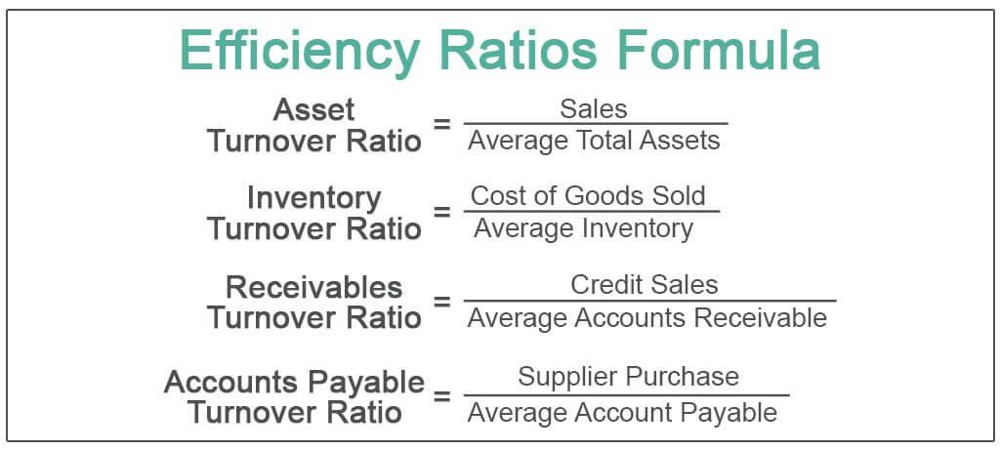

In the modern financial landscape, understanding key performance metrics is crucial for assessing the performance of banks and the efficiency of algorithmic trading strategies. As the financial industry continues to evolve with technological advancements and increasing competition, the ability to gauge operational efficiency and strategic effectiveness is more important than ever. Among the various tools used to measure performance, the efficiency ratio stands out as a significant metric in both banking and algorithmic trading.

The efficiency ratio provides insights into operational effectiveness by evaluating how well resources are converted into revenue or profits. In banking, this metric traditionally measures the relationship between a bank's non-interest expenses and its revenue, offering a view of how effectively the bank controls its operational costs to maximize profitability. A lower efficiency ratio is preferred, indicating that fewer resources are consumed to generate each unit of revenue, suggesting better management and higher profitability.



In the context of algorithmic trading, the efficiency ratio helps assess the cost-effectiveness of trading strategies. Here, it examines the conversion of resources, such as time and computational power, into trading profits. By comparing net gains to gross gains, algorithmic traders can evaluate and optimize their strategies to enhance profitability and reduce unnecessary resource expenditure.

Overall, efficiency ratios serve as a key lens through which financial institutions and trading entities measure their effectiveness and plan for improvements. This article explores the pivotal role that efficiency ratios play in understanding bank performance and algorithmic trading effectiveness, offering a comprehensive view of how these metrics are applied across different facets of the financial sector.

## Table of Contents

## Understanding Financial Metrics: The Efficiency Ratio

The efficiency ratio is a critical financial metric that enables businesses, particularly banks, to assess how effectively they utilize their resources and liabilities to produce revenue. This ratio specifically evaluates operational efficiency by comparing non-interest expenses with total revenue. The formula for calculating the efficiency ratio can be represented as:

$$
\text{Efficiency Ratio} = \frac{\text{Non-Interest Expenses}}{\text{Revenue}}
$$

In this context, non-interest expenses are typically composed of a bank's operating costs, which include salaries, rent, utilities, and other administrative expenses that are not directly tied to generating interest income. Revenue, on the other hand, encompasses all income streams, including interest and non-interest income.

For banks, maintaining a lower efficiency ratio is advantageous and indicative of superior cost management and enhanced profitability. Lower values imply that a bank is capable of generating greater revenue per dollar of operating expense, reflecting robust management practices aimed at cost control.

The efficiency ratio serves multiple strategic purposes. It provides a clear metric for assessing internal performance over time, allowing banks to track their efficiency improvements or identify areas needing attention. Furthermore, it allows for comparative analysis, enabling banks to benchmark their performance against industry standards or specific competitors. In this way, it forms a foundation for making informed operational and strategic decisions aimed at improving financial health and competitiveness.

Overall, the efficiency ratio plays an indispensable role in evaluating the operational prowess of banks, guiding management toward strategies that optimize revenue generation while minimizing unnecessary costs.

## Efficiency Ratios in Banking

The efficiency ratio is a critical metric in banking, used to evaluate how well an institution manages its expenses relative to its revenue generation. The formula for calculating the efficiency ratio is given by: 

$$
\text{Efficiency Ratio} = \frac{\text{Non-Interest Expenses}}{\text{Total Revenue}}
$$

where non-interest expenses include costs such as salaries, rent, and utilities, and total revenue encompasses both interest and non-interest income. A lower efficiency ratio indicates superior management of operational costs, implying higher profitability. An optimal efficiency ratio for banks is typically around 50% or lower, reflecting controlled costs relative to revenues. 

Banks utilize the efficiency ratio as a benchmarking tool to gauge their performance against industry standards and competitors. It helps in identifying cost structures that are lean and efficient, thereby maximizing profitability. By maintaining a low efficiency ratio, banks can ensure that they are effectively converting resources into revenue, which is essential for sustaining competitiveness and achieving long-term growth.

## The Role of Efficiency Ratios in Algorithmic Trading

In [algorithmic trading](/wiki/algorithmic-trading), efficiency ratios play a pivotal role in assessing how effectively trading algorithms convert resources into profits. These ratios gauge the cost-effectiveness and overall performance of trading strategies, assisting traders in optimizing both individual trades and broader trading systems.

A fundamental efficiency ratio in this context is the net gain to gross gain ratio. This ratio evaluates the proportion of profits retained after accounting for transaction costs, taxes, and other expenses associated with trading. Mathematically, it is represented as:

$$
\text{Efficiency Ratio} = \frac{\text{Net Gains}}{\text{Gross Gains}}
$$

Where:
- Net Gains = Gross Gains - Costs
- Gross Gains represent the total income generated before costs.

Algorithmic traders aim to maximize this efficiency ratio, striving for strategies where net gains are a significant portion of gross gains. A higher ratio indicates that a larger share of gross profits is preserved after covering trading costs, reflecting a more cost-effective strategy.

For algorithmic traders, refining strategies based on efficiency ratios involves adjusting algorithms to minimize unnecessary transactions, thereby reducing slippage and trading costs. High-frequency trading algorithms, for example, benefit significantly from carefully calibrated efficiency ratios, as these algorithms execute a vast number of trades where even minor improvements can lead to substantial increases in overall profitability.

Python is commonly used to model and analyze these efficiency metrics due to its robust libraries for financial analysis. Here is a simple Python script illustrating the calculation of an efficiency ratio:

```python
def calculate_efficiency_ratio(gross_gains, costs):
    net_gains = gross_gains - costs
    efficiency_ratio = net_gains / gross_gains if gross_gains > 0 else 0
    return efficiency_ratio

# Example usage:
gross_gains = 100000  # Total profits before costs
costs = 20000  # Total cost including transaction fees, taxes, etc.
efficiency_ratio = calculate_efficiency_ratio(gross_gains, costs)
print(f"Efficiency Ratio: {efficiency_ratio:.2f}")
```

In this script, the efficiency ratio is calculated by subtracting the costs from the gross gains, then dividing the net gains by the gross gains. This calculation provides a clear metric for traders to assess and optimize their algorithmic strategies.

Overall, efficiency ratios serve as a vital tool for algorithmic traders, facilitating better strategy development and refining tactics to achieve improved profitability in the competitive trading environment.

## Algorithmic Trading Metrics: Key Performance Indicators

Evaluating trading algorithms necessitates the use of several key performance indicators (KPIs) to gauge their effectiveness and risk profile. Among the most critical metrics is the cumulative return, which measures the total profit or loss generated by an algorithm over a specific period. This metric provides a direct view of the strategy's success in generating wealth and is calculated by the formula:

$$
\text{Cumulative Return} = \frac{\text{Ending Value} - \text{Beginning Value}}{\text{Beginning Value}} \times 100\%
$$

Another pivotal metric is the Sharpe Ratio, which facilitates the assessment of risk-adjusted returns. It provides insights into the excess return a strategy generates per unit of risk taken. The Sharpe Ratio is calculated as follows:

$$
\text{Sharpe Ratio} = \frac{\bar{R}_a - R_f}{\sigma_a}
$$

where $\bar{R}_a$ is the average return of the algorithm, $R_f$ is the risk-free rate, and $\sigma_a$ is the standard deviation of the algorithm's excess return. A higher Sharpe Ratio indicates a more favorable risk-adjusted performance.

Maximum drawdown is another critical metric, reflecting the largest peak-to-trough decline in the portfolio value before reaching a new peak. This metric is essential for understanding the risks associated with significant losses and is calculated as:

$$
\text{Maximum Drawdown} = \frac{\text{Peak Value} - \text{Trough Value}}{\text{Peak Value}}
$$

This measure helps traders identify the vulnerability of their strategy to major losses, informing necessary adjustments.

Additionally, the win rate and risk-to-reward ratio are important in evaluating trading strategies. The win rate indicates the percentage of profitable trades over the total number of trades, providing a straightforward measure of the strategy's success rate:

$$
\text{Win Rate} = \left( \frac{\text{Number of Winning Trades}}{\text{Total Number of Trades}} \right) \times 100\%
$$

The risk-to-reward ratio assesses the potential loss against potential gain, informing decisions on trade viability. A favorable risk-to-reward ratio enables traders to ensure that profits adequately exceed potential losses, allowing them to refine strategies for improved outcomes.

Implementing these KPIs effectively helps algorithmic traders to optimize their strategies, enhancing the precision of decision-making processes and ultimately leading to improved financial results.

## Comparing Bank and Algorithmic Trading Efficiency Metrics

Efficiency metrics are crucial tools deployed across both banking and algorithmic trading sectors, albeit with distinct applications and objectives. In banks, efficiency ratios primarily focus on minimizing operational costs relative to generated revenues. These are calculated using the formula:

$$
\text{Efficiency Ratio} = \frac{\text{Non-Interest Expenses}}{\text{Revenue}}
$$

A lower efficiency ratio indicates a bank's proficiency in managing its operational costs, thus reflecting enhanced profitability and resource management. An optimal efficiency ratio for banks is typically around 50% or lower, suggesting effective cost control measures in relation to revenue.

In contrast, algorithmic trading uses efficiency metrics to optimize trading strategies and maximize net gains. The aim is to evaluate how well trading algorithms convert resources, such as time and capital, into profits. The efficiency ratio in this context can be expressed as:

$$
\text{Trading Efficiency} = \frac{\text{Net Gains}}{\text{Gross Gains}}
$$

This ratio measures the cost-effectiveness of trading strategies, where a higher trading efficiency indicates a more profitable and efficient algorithm.

Despite these differing focal points, the underlying goal in both sectors is analogous: to achieve maximum output with the minimum input. Banks strive to keep operational costs low while enhancing revenue, whereas algorithmic traders aim to refine their strategies to achieve higher net gains with minimal resource expenditure. This alignment in purpose underscores the universal significance of efficiency metrics in enhancing performance and strategic effectiveness across financial landscapes.

## Conclusion

Efficiency ratios are indispensable in assessing the performance and efficiency of both banking institutions and algorithmic trading strategies. These metrics enable stakeholders to gain valuable insights into how effectively resources are utilized to generate revenue or profits. By analyzing efficiency ratios, banks can better manage operational costs, aligning their expenditures with generated revenue, which is crucial for sustaining competitiveness and profitability. An efficiency ratio in banking, calculated as $\frac{{\text{Non-Interest Expenses}}}{{\text{Revenue}}}$, serves as a benchmark for determining operational control and effectiveness. A lower ratio is indicative of superior management and enhanced profitability.

In the sphere of algorithmic trading, efficiency ratios serve a similar purpose, albeit with a focus on optimizing trading algorithms to maximize net gains relative to resources deployed. The constant evaluation of trading strategies through metrics like the ratio of net gains to gross gains allows traders to refine and improve their approaches, aiming for a high return on investment with minimal risk.

The application of these metrics is straightforward yet profound. By consistently measuring efficiency, organizations can make informed decisions that lead to better financial outcomes. The ability to measure and interpret efficiency ratios allows banks and traders to identify areas for improvement, adapt strategies, and implement changes that optimize performance. This strategic use of efficiency ratios not only supports immediate tactical decisions but also informs long-term planning and success strategies.

In conclusion, efficiency ratios provide a clear, quantitative measure of how well resources are being turned into financial gains, guiding entities in both banking and algorithmic trading toward effective resource management and strategic planning. Understanding and applying these metrics equips decision-makers with the tools necessary for enhanced performance, ensuring an edge in competitive financial environments.

## References & Further Reading

[1]: ["Advances in Financial Machine Learning"](https://www.amazon.com/Advances-Financial-Machine-Learning-Marcos/dp/1119482089) by Marcos Lopez de Prado

[2]: ["Evidence-Based Technical Analysis: Applying the Scientific Method and Statistical Inference to Trading Signals"](https://www.amazon.com/Evidence-Based-Technical-Analysis-Scientific-Statistical/dp/0470008741) by David Aronson

[3]: ["Machine Learning for Algorithmic Trading"](https://github.com/stefan-jansen/machine-learning-for-trading) by Stefan Jansen

[4]: ["Quantitative Trading: How to Build Your Own Algorithmic Trading Business"](https://www.amazon.com/Quantitative-Trading-Build-Algorithmic-Business/dp/1119800064) by Ernest P. Chan

[5]: Jensen, M. C. (1986). ["Agency Costs of Free Cash Flow, Corporate Finance, and Takeovers."](https://www.jstor.org/stable/pdf/1818789) American Economic Review, 76(2), 323-329.