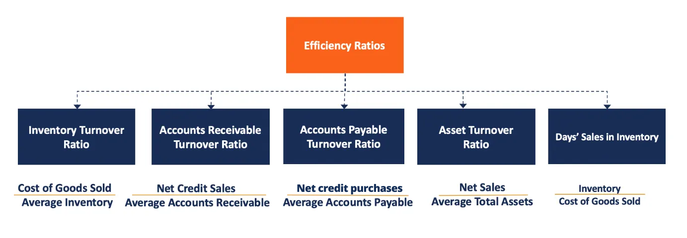

## Table of Contents

## What are efficiency ratios in financial analysis?

Efficiency ratios are tools used in financial analysis to see how well a company is using its resources. They help investors and managers understand if the company is managing its assets and liabilities in a smart way. These ratios look at things like how quickly a company can turn its inventory into sales, or how effectively it collects money from customers.

There are different types of efficiency ratios, but some common ones include the inventory turnover ratio, which shows how many times a company sells and replaces its stock over a period; the receivables turnover ratio, which shows how well a company is collecting money owed by customers; and the asset turnover ratio, which measures how efficiently a company uses its assets to generate sales. By looking at these ratios, people can get a good idea of the company's operational performance.

Understanding efficiency ratios is important because they can highlight areas where a company might need to improve. For example, a low inventory turnover might mean the company is holding onto too much stock, which ties up money that could be used elsewhere. On the other hand, a high receivables turnover could indicate that the company is doing a good job at collecting payments quickly. By keeping an eye on these ratios, a company can make better decisions to improve its overall efficiency and profitability.

## Why are efficiency ratios important for businesses?

Efficiency ratios are important for businesses because they show how well the company is using its resources. This means they help business owners and managers see if they are making good use of their money, time, and materials. For example, if a business has a lot of inventory but isn't selling it quickly, that's a problem. Efficiency ratios can point this out, so the business can fix it and use its resources better.

These ratios also help businesses understand how fast they get paid by customers. If it takes too long to collect money, it can hurt the business. By looking at efficiency ratios, a company can find out if it needs to change how it does things, like speeding up the collection process or selling products faster. This can make the business run smoother and make more profit.

## Can you list some common types of efficiency ratios?

Efficiency ratios help businesses see how well they are using their resources. Some common types of efficiency ratios are the inventory turnover ratio, the receivables turnover ratio, and the asset turnover ratio. The inventory turnover ratio tells you how many times a business sells and replaces its stock in a certain period. This helps businesses know if they are selling their products fast enough or if they have too much stock sitting around.

The receivables turnover ratio shows how well a business is at collecting money from customers. If this ratio is high, it means the business is good at getting paid quickly. On the other hand, if it's low, it might mean the business needs to do a better job at collecting payments. The asset turnover ratio measures how efficiently a business uses its assets to make sales. A higher ratio means the business is using its assets well to generate income.

These ratios are important because they help businesses see where they can improve. By looking at these numbers, a business can make changes to work better and make more money. For example, if the inventory turnover ratio is low, the business might need to sell its products faster or reduce the amount of stock it keeps. If the receivables turnover ratio is low, the business might need to change how it collects money from customers.

## How do you calculate the Inventory Turnover Ratio?

The Inventory Turnover Ratio tells you how many times a business sells and replaces its stock in a certain period, usually a year. To calculate it, you take the cost of goods sold (COGS) and divide it by the average inventory. The cost of goods sold is the total cost of all the products a business sold during the period. The average inventory is usually found by adding the beginning inventory and the ending inventory, then dividing by two.

This ratio is important because it shows how well a business is managing its stock. A higher ratio means the business is selling its products quickly and not keeping too much stock. A lower ratio might mean the business has too much stock that isn't selling, which can tie up money that could be used for other things. By looking at this ratio, a business can see if it needs to change how it handles its inventory to work better.

## What does the Accounts Receivable Turnover Ratio tell us?

The Accounts Receivable Turnover Ratio tells us how well a business is at collecting money from its customers. It shows how many times a business can turn its accounts receivable into cash over a certain period, usually a year. To find this ratio, you divide the net credit sales by the average accounts receivable. Net credit sales are the total sales made on credit, minus any returns or allowances. The average accounts receivable is calculated by adding the beginning and ending accounts receivable for the period and then dividing by two.

This ratio is important because it helps a business see if it's doing a good job at getting paid by its customers. A high ratio means the business is collecting money quickly, which is good because it means the business has more cash to use for other things. A low ratio might mean the business is having trouble getting paid, which can be a problem because it ties up money that could be used elsewhere. By looking at this ratio, a business can figure out if it needs to change how it collects money from customers to work better.

## How can the Asset Turnover Ratio be used to assess a company's performance?

The Asset Turnover Ratio helps businesses see how well they are using their assets to make sales. It's calculated by dividing the company's total sales by its average total assets. A higher ratio means the company is using its assets efficiently to generate income. For example, if a company has a high Asset Turnover Ratio, it means they are good at turning their assets, like buildings, machines, and money, into sales.

This ratio is important because it can show where a company might need to improve. If the ratio is low, it could mean the company isn't using its assets well. Maybe they have too many buildings or machines that aren't helping to make sales. By looking at the Asset Turnover Ratio, a company can decide if they need to sell some assets or use them in a different way to make more money. This helps the company work better and be more profitable.

## What is the significance of the Days Sales Outstanding (DSO) ratio?

The Days Sales Outstanding (DSO) ratio tells a business how many days, on average, it takes to collect money from customers after a sale. It's an important number because it shows how well a company is doing at getting paid. To find the DSO, you take the total accounts receivable and divide it by the total credit sales for a period, then multiply by the number of days in that period. A lower DSO means the business is getting its money back quickly, which is good because it means more cash is available to use for other things.

If the DSO is high, it might mean the business is having trouble collecting payments. This can be a problem because it ties up money that could be used elsewhere. By looking at the DSO, a company can see if it needs to change how it collects money from customers. For example, they might need to remind customers to pay sooner or offer discounts for early payment. Keeping the DSO low helps the business run smoother and be more profitable.

## How does the Operating Cycle relate to efficiency ratios?

The Operating Cycle is the time it takes for a business to buy or make products, sell them, and then get paid for them. It's like a big circle that starts with buying stuff and ends with getting money back. Efficiency ratios help us see how well a business is doing in this cycle. For example, the Inventory Turnover Ratio shows how fast the business is selling its products, and the Days Sales Outstanding (DSO) tells us how quickly they get paid after selling those products. These ratios are important because they help the business see if it's doing a good job at managing its money and resources.

If a business has a short Operating Cycle, it means they are good at turning their inventory into sales and then getting paid quickly. This can make the business more efficient and profitable. Efficiency ratios like the Inventory Turnover Ratio and DSO help the business understand if their Operating Cycle is too long or if they need to make changes. For example, if the Inventory Turnover Ratio is low, it might mean they need to sell their products faster. If the DSO is high, they might need to collect payments more quickly. By looking at these ratios, a business can make its Operating Cycle shorter and work better.

## What are the limitations of using efficiency ratios in financial analysis?

Efficiency ratios are helpful tools for understanding how well a business is using its resources, but they have some limitations. One big problem is that these ratios can be affected by things that are out of the company's control. For example, if there's a big economic change or a problem in the industry, the ratios might not show the true picture of how the business is doing. Also, different businesses in different industries might have very different numbers for their efficiency ratios, so it's hard to compare them directly.

Another limitation is that efficiency ratios only give a snapshot of a certain time period. They don't show the full story of how the business is doing over time. A business might look good in one year but not so good in another year, and the ratios might not catch these changes. Also, these ratios can be changed by how the business decides to do its accounting. For example, if a business changes how it counts its inventory or its sales, the ratios can look different even if the business is doing the same thing.

Because of these limitations, it's important not to rely only on efficiency ratios when looking at a business. They should be used with other tools and information to get a better understanding of how the business is really doing. This way, people can make smarter decisions about the business and see the bigger picture.

## How can efficiency ratios be used to compare companies within the same industry?

Efficiency ratios can help us compare how well companies in the same industry are using their resources. For example, if we look at the inventory turnover ratio, we can see which company is selling its products faster. If one company has a higher ratio than another, it means they are better at turning their stock into sales. This can be important in industries like retail, where having too much stock can tie up money that could be used for other things. By comparing these ratios, investors and managers can see which companies are more efficient and might be a better investment.

But it's not just about one ratio. We can also look at the receivables turnover ratio to see how quickly companies are collecting money from customers. A company with a high receivables turnover ratio is good at getting paid quickly, which means they have more cash to use for growing their business. If we compare this ratio across companies in the same industry, we can see which ones are better at managing their cash flow. Using different efficiency ratios together gives us a fuller picture of how companies are performing and helps us make smarter decisions about where to invest or how to improve a business.

## What advanced techniques can be applied to enhance the analysis of efficiency ratios?

To make the analysis of efficiency ratios better, we can use something called trend analysis. This means looking at how the ratios change over time, not just at one moment. For example, if we see that a company's inventory turnover ratio is getting better each year, it might mean they are getting better at selling their products. By looking at trends, we can see if a company is improving or if there are problems that keep coming up. This helps us understand the bigger picture and make better guesses about where the company is going.

Another advanced technique is benchmarking. This means comparing a company's efficiency ratios to the best companies in the same industry. If a company's ratios are not as good as the industry leaders, it might mean they need to make changes to catch up. Benchmarking can help a company see what the best practices are and how they can improve. By using these techniques, we can get a deeper understanding of how well a company is using its resources and make smarter decisions about investments or improvements.

## How do efficiency ratios integrate with other financial metrics to provide a comprehensive view of a company's financial health?

Efficiency ratios are important tools that help us see how well a company is using its resources. But to get a full picture of a company's financial health, we need to look at these ratios together with other financial metrics like profitability ratios, liquidity ratios, and solvency ratios. For example, if a company has a high inventory turnover ratio, it means they are good at selling their products quickly. But if we also look at their gross profit margin, we can see if they are making enough money from those sales. By combining efficiency ratios with profitability ratios, we can understand if the company is not just efficient, but also making good profits.

Liquidity ratios, like the current ratio or the quick ratio, tell us if a company can pay its short-term bills. When we look at these ratios alongside efficiency ratios, we can see if the company is managing its cash flow well. For example, a high receivables turnover ratio might mean the company is collecting money quickly, which is good for liquidity. On the other hand, solvency ratios, like the debt-to-equity ratio, show us if the company can handle its long-term debts. By putting all these pieces together, we get a clearer picture of the company's overall financial health. This helps us make better decisions about whether to invest in the company or how to improve its operations.

## What are Efficiency Ratios and How Can We Understand Them?

Efficiency ratios are vital tools in financial analysis, providing insights into how well a company utilizes its assets and manages its liabilities. These ratios are crucial for understanding operational performance and ensuring that a business is making the most of its available resources. In algorithmic trading, applying these ratios can help traders determine the efficiency of their trading algorithms, particularly in the context of resource utilization and revenue generation.

One of the key efficiency ratios is the **inventory turnover ratio**, which measures how effectively a company manages its inventory. It is calculated by dividing the cost of goods sold by the average inventory. A higher inventory turnover ratio indicates efficient inventory management, suggesting that inventory is sold and replenished quickly rather than sitting unused.

$$
\text{Inventory Turnover Ratio} = \frac{\text{Cost of Goods Sold}}{\text{Average Inventory}}
$$

Another important metric is the **asset turnover ratio**, which evaluates a company's ability to generate sales from its assets. It is computed by dividing sales or revenue by the average total assets. A higher asset turnover ratio signifies that the company is effectively using its assets to generate revenue.

$$
\text{Asset Turnover Ratio} = \frac{\text{Net Sales}}{\text{Average Total Assets}}
$$

The **receivables turnover ratio** assesses how efficiently a company collects its receivables or the credit it extends to its customers. This ratio is determined by dividing net credit sales by the average accounts receivable. A higher ratio indicates that the company collects its receivables quickly, improving [liquidity](/wiki/liquidity-risk-premium).

$$
\text{Receivables Turnover Ratio} = \frac{\text{Net Credit Sales}}{\text{Average Accounts Receivable}}
$$

In [algorithmic trading](/wiki/algorithmic-trading), these efficiency ratios can be adapted to evaluate algorithm performance. For instance, the concept of asset turnover can be applied to assess how well an algorithm uses its computational resources to generate profitable trades. An effective algorithm should demonstrate high resource utilization by executing trades that translate inputs into substantial returns, analogous to the asset turnover in traditional contexts.

Traders can employ these ratios to examine an algorithm's resource allocation and profitability. By recognizing inefficiencies in resource usage or cash flow, traders can make informed decisions to optimize algorithms for improved revenue generation. Overall, the application of efficiency ratios in algorithmic trading facilitates the enhancement of strategy performance, promoting better financial outcomes.

## What are the performance metrics used in algorithmic trading?

Performance metrics are integral to evaluating the effectiveness of trading algorithms. These metrics serve to gauge the success of a trading strategy by examining various elements such as profitability, risk, and stability. By using these metrics, traders can gain insights that are crucial for refining and optimizing their algorithms, thereby enhancing financial performance in algorithmic trading.

A fundamental performance metric in algorithmic trading is the Sharpe Ratio. Named after economist William Sharpe, this ratio measures the risk-adjusted return of an investment. It is calculated using the formula:

$$
\text{Sharpe Ratio} = \frac{R_p - R_f}{\sigma_p}
$$

where $R_p$ is the mean return of the portfolio, $R_f$ is the risk-free rate of return, and $\sigma_p$ is the standard deviation of the portfolio's excess return. A higher Sharpe Ratio indicates better risk-adjusted performance.

Maximum Drawdown (MDD) is another critical metric that quantifies the worst historical peak-to-trough decline of an asset or trading strategy. It serves as an important indicator of risk, helping traders to understand the potential downside of their strategies. The Maximum Drawdown can be expressed in Python as follows:

```python
def maximum_drawdown(returns):
    cumulative_returns = (1 + returns).cumprod()
    drawdown = 1 - cumulative_returns / cumulative_returns.cummax()
    return drawdown.max()
```

The Win Rate, representing the proportion of profitable trades to total trades, is vital for understanding the successful execution frequency of a strategy. Although a high Win Rate is desirable, it should be interpreted alongside other metrics to provide a comprehensive view of a strategy's performance.

Profit Factor, defined as the ratio of gross profits to gross losses, offers insights into trade profitability. A Profit Factor greater than one suggests that the strategy generates more profit than losses, indicating profitability.

Lastly, Average Trade evaluates the mean profit or loss per trade, providing insight into the efficiency of each executed trade. This metric can be particularly revealing when assessed in combination with others, helping traders pinpoint specific areas for optimization.

Together, these metrics provide a detailed picture of algorithm performance. By understanding and regularly evaluating these metrics, traders can identify strengths and vulnerabilities within their trading strategies, ultimately leading to improvements in both algorithmic efficiency and financial returns.

## What is the role of Financial Analysis in Algorithmic Trading?

Financial analysis in algorithmic trading involves the systematic evaluation of financial data to extract insights into the effectiveness and potential profitability of trading algorithms. This evaluation employs tools such as efficiency ratios and performance metrics to guide the development and optimization of trading strategies.

Efficiency ratios, typically used to assess a company's operational effectiveness, offer algorithmic traders insights into how well a trading algorithm uses its resources to generate returns. For example, the asset turnover ratio, given by:

$$
\text{Asset Turnover Ratio} = \frac{\text{Net Sales}}{\text{Average Total Assets}}
$$

can be adapted to evaluate the efficiency of an algorithm by considering "assets" as the data inputs and computational resources. Similarly, the inventory turnover ratio and receivables turnover ratio can be re-contextualized within the trading strategy to assess the periodicity of trades and the speed of execution relative to the resources employed.

Performance metrics are crucial for understanding and assessing the results delivered by trading algorithms. The Sharpe Ratio, one of the key metrics, measures risk-adjusted returns and is expressed as:

$$
\text{Sharpe Ratio} = \frac{E[R] - R_f}{\sigma_R}
$$

where $E[R]$ is the expected return of the portfolio, $R_f$ is the risk-free rate, and $\sigma_R$ is the standard deviation of the portfolio’s excess return. Other metrics like Maximum Drawdown, which assesses the peak-to-trough decline of a strategy, and Win Rate, which indicates the proportion of wins to total trades, provide critical insights into stability and profitability.

By leveraging these tools, traders can systematically assess potential trading strategies. Financial analysis in algorithmic trading aids in identifying profitable trends, managing risks, and reinforcing the financial viability of algorithms. This strategic evaluation is pivotal as it helps in optimization by adjusting parameters to improve risk-return profiles, thereby enhancing the overall execution of trading strategies.

Python, widely used in algorithmic trading for its data analysis and [machine learning](/wiki/machine-learning) capabilities, enables traders to implement these analyses efficiently. Here is an example snippet of how one might calculate the Sharpe Ratio using Python:

```python
import numpy as np

def sharpe_ratio(returns, risk_free_rate=0.01):
    excess_return = np.mean(returns) - risk_free_rate
    return np.sqrt(252) * excess_return / np.std(returns)

returns = np.random.normal(0.001, 0.02, 252)  # Simulated daily returns
print("Sharpe Ratio:", sharpe_ratio(returns))
```

In this snippet, daily returns are simulated and the Sharpe Ratio is calculated, offering insights into potential strategy optimization.

Overall, the integration of traditional financial analysis techniques, applied through the lens of algorithmic trading, enriches strategy development and enhances execution. This empowers traders to make informed decisions driven by robust financial insights.

## How can we integrate efficiency ratios and performance metrics?

Combining efficiency ratios with performance metrics in financial analysis provides a comprehensive approach to evaluating and enhancing trading strategies. This integration enables traders to achieve a more holistic understanding of algorithmic performance by accounting for both operational efficiency and financial effectiveness in their assessments.

Efficiency ratios assess how well an algorithm utilizes its 'assets'—such as data inputs and computational resources—while performance metrics evaluate financial outcomes like return on investment (ROI) and risk. By analyzing these dimensions together, traders can gain insights into potential bottlenecks in algorithmic processes and identify opportunities for improvements.

For instance, consider an algorithm designed to execute high-frequency trades. Its 'inventory’ might include data points from real-time market feeds, which are crucial for making split-second decisions. Similarly, its 'asset turnover' could be represented by the speed at which data is processed to generate trading signals. By calculating an equivalent of the inventory turnover ratio for these inputs, traders can determine how quickly and effectively data is being utilized.

On the other hand, performance metrics like the Sharpe Ratio help quantify the risk-adjusted returns of the algorithm’s trading activities, providing insights into its financial performance. Sharpe Ratio is calculated as follows:

$$
\text{Sharpe Ratio} = \frac{E[R_p - R_f]}{\sigma_p}
$$

where $E[R_p - R_f]$ is the expected excess return of the portfolio over the risk-free rate, and $\sigma_p$ is the standard deviation of the portfolio’s return.

By simultaneously evaluating efficiency ratios and performance metrics, traders can optimize their algorithms for better resource utilization and improved financial returns. An integrated approach allows for adjustments in strategy execution that align with resource management capabilities and desired financial outcomes. For example, if an analysis reveals high data processing times relative to the financial returns, efforts might be directed towards improving computational efficiency or refining data selection criteria.

In Python, this synergy can be computationally modeled using libraries such as NumPy and pandas to manipulate data efficiently, alongside specialized libraries like Pyfolio to track performance metrics. Here is a simple example code snippet that calculates basic trading [statistics](/wiki/bayesian-statistics):

```python
import numpy as np
import pandas as pd
import pyfolio as pf

# Assuming 'data' is a DataFrame containing 'price' and 'returns'
data['price'] = np.random.normal(100, 10, 1000)
data['returns'] = data['price'].pct_change()

# Calculate basic efficiency ratio
inventory_turnover = data['returns'].sum() / data['price'].sum()

# Performance metric
sharpe_ratio = pf.create_simple_tear_sheet(data['returns'])

print(f"Inventory Turnover: {inventory_turnover}")
print(f"Sharpe Ratio: {sharpe_ratio}")
```

This script demonstrates how efficiency ratios and performance metrics can be computed and analyzed within the same framework, facilitating an integrated evaluation of trading strategies. By leveraging this combined approach, traders are equipped to fine-tune their algorithms, optimize resource allocation, and achieve enhanced financial results.

## References & Further Reading

[1]: Bergstra, J., Bardenet, R., Bengio, Y., & Kégl, B. (2011). ["Algorithms for Hyper-Parameter Optimization."](https://dl.acm.org/doi/10.5555/2986459.2986743) Advances in Neural Information Processing Systems 24.

[2]: ["Advances in Financial Machine Learning"](https://www.amazon.com/Advances-Financial-Machine-Learning-Marcos/dp/1119482089) by Marcos Lopez de Prado

[3]: ["Evidence-Based Technical Analysis: Applying the Scientific Method and Statistical Inference to Trading Signals"](https://www.amazon.com/Evidence-Based-Technical-Analysis-Scientific-Statistical/dp/0470008741) by David Aronson

[4]: ["Machine Learning for Algorithmic Trading"](https://github.com/stefan-jansen/machine-learning-for-trading) by Stefan Jansen

[5]: ["Quantitative Trading: How to Build Your Own Algorithmic Trading Business"](https://www.amazon.com/Quantitative-Trading-Build-Algorithmic-Business/dp/1119800064) by Ernest P. Chan