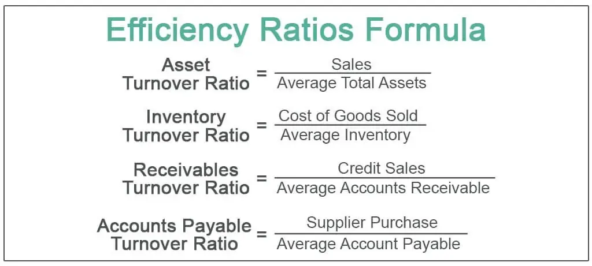

In the modern financial ecosystem, the integration of technology and finance has given rise to algorithmic trading, a method leveraging computers to execute pre-programmed trading instructions automatically. This evolution allows for rapid reactions to market changes and the efficient handling of large volumes of trades that would be impossible to execute manually. Algorithmic trading has revolutionized the financial industry by increasing execution speed and enhancing the precision of trades, thereby providing traders with strategic advantages.

Efficiency ratios and performance metrics are crucial components of financial analysis, particularly in the context of algorithmic trading. Efficiency ratios offer insights into how well a company is utilizing its assets and managing its liabilities, thus reflecting operational effectiveness. They measure aspects such as the rate of inventory turnover or the effectiveness of receivables collection, providing foundational insights into operational performance. Similarly, within algorithmic trading, these ratios assess the algorithms' efficiency in resource utilization and revenue generation.



On the other hand, performance metrics in algorithmic trading assess the effectiveness and success of trading strategies. These metrics consider several factors including profitability, risk, and stability. Crucial metrics like the Sharpe Ratio, Maximum Drawdown, and Profit Factor allow traders to evaluate risk-adjusted returns and trade profitability, guiding them in optimizing their trading strategies for better outcomes.

The purpose of this article is to explore the synergy between efficiency ratios, performance metrics, financial analysis, and algorithmic trading. By examining these key aspects, we present a comprehensive guide to optimizing trading strategies, improving decision-making, and enhancing overall financial outcomes. Through systematic analysis and application of these concepts, traders can improve the operational efficiency of their trading algorithms and potentially achieve sustained success in dynamic financial markets.

## Table of Contents

## Understanding Efficiency Ratios

Efficiency ratios are vital tools in financial analysis, providing insights into how well a company utilizes its assets and manages its liabilities. These ratios are crucial for understanding operational performance and ensuring that a business is making the most of its available resources. In algorithmic trading, applying these ratios can help traders determine the efficiency of their trading algorithms, particularly in the context of resource utilization and revenue generation.

One of the key efficiency ratios is the **inventory turnover ratio**, which measures how effectively a company manages its inventory. It is calculated by dividing the cost of goods sold by the average inventory. A higher inventory turnover ratio indicates efficient inventory management, suggesting that inventory is sold and replenished quickly rather than sitting unused.

$$
\text{Inventory Turnover Ratio} = \frac{\text{Cost of Goods Sold}}{\text{Average Inventory}}
$$

Another important metric is the **asset turnover ratio**, which evaluates a company's ability to generate sales from its assets. It is computed by dividing sales or revenue by the average total assets. A higher asset turnover ratio signifies that the company is effectively using its assets to generate revenue.

$$
\text{Asset Turnover Ratio} = \frac{\text{Net Sales}}{\text{Average Total Assets}}
$$

The **receivables turnover ratio** assesses how efficiently a company collects its receivables or the credit it extends to its customers. This ratio is determined by dividing net credit sales by the average accounts receivable. A higher ratio indicates that the company collects its receivables quickly, improving [liquidity](/wiki/liquidity-risk-premium).

$$
\text{Receivables Turnover Ratio} = \frac{\text{Net Credit Sales}}{\text{Average Accounts Receivable}}
$$

In [algorithmic trading](/wiki/algorithmic-trading), these efficiency ratios can be adapted to evaluate algorithm performance. For instance, the concept of asset turnover can be applied to assess how well an algorithm uses its computational resources to generate profitable trades. An effective algorithm should demonstrate high resource utilization by executing trades that translate inputs into substantial returns, analogous to the asset turnover in traditional contexts.

Traders can employ these ratios to examine an algorithm's resource allocation and profitability. By recognizing inefficiencies in resource usage or cash flow, traders can make informed decisions to optimize algorithms for improved revenue generation. Overall, the application of efficiency ratios in algorithmic trading facilitates the enhancement of strategy performance, promoting better financial outcomes.

## Performance Metrics in Algorithmic Trading

Performance metrics are integral to evaluating the effectiveness of trading algorithms. These metrics serve to gauge the success of a trading strategy by examining various elements such as profitability, risk, and stability. By using these metrics, traders can gain insights that are crucial for refining and optimizing their algorithms, thereby enhancing financial performance in algorithmic trading.

A fundamental performance metric in algorithmic trading is the Sharpe Ratio. Named after economist William Sharpe, this ratio measures the risk-adjusted return of an investment. It is calculated using the formula:

$$
\text{Sharpe Ratio} = \frac{R_p - R_f}{\sigma_p}
$$

where $R_p$ is the mean return of the portfolio, $R_f$ is the risk-free rate of return, and $\sigma_p$ is the standard deviation of the portfolio's excess return. A higher Sharpe Ratio indicates better risk-adjusted performance.

Maximum Drawdown (MDD) is another critical metric that quantifies the worst historical peak-to-trough decline of an asset or trading strategy. It serves as an important indicator of risk, helping traders to understand the potential downside of their strategies. The Maximum Drawdown can be expressed in Python as follows:

```python
def maximum_drawdown(returns):
    cumulative_returns = (1 + returns).cumprod()
    drawdown = 1 - cumulative_returns / cumulative_returns.cummax()
    return drawdown.max()
```

The Win Rate, representing the proportion of profitable trades to total trades, is vital for understanding the successful execution frequency of a strategy. Although a high Win Rate is desirable, it should be interpreted alongside other metrics to provide a comprehensive view of a strategy's performance.

Profit Factor, defined as the ratio of gross profits to gross losses, offers insights into trade profitability. A Profit Factor greater than one suggests that the strategy generates more profit than losses, indicating profitability.

Lastly, Average Trade evaluates the mean profit or loss per trade, providing insight into the efficiency of each executed trade. This metric can be particularly revealing when assessed in combination with others, helping traders pinpoint specific areas for optimization.

Together, these metrics provide a detailed picture of algorithm performance. By understanding and regularly evaluating these metrics, traders can identify strengths and vulnerabilities within their trading strategies, ultimately leading to improvements in both algorithmic efficiency and financial returns.

## Financial Analysis in Algorithmic Trading

Financial analysis in algorithmic trading involves the systematic evaluation of financial data to extract insights into the effectiveness and potential profitability of trading algorithms. This evaluation employs tools such as efficiency ratios and performance metrics to guide the development and optimization of trading strategies.

Efficiency ratios, typically used to assess a company's operational effectiveness, offer algorithmic traders insights into how well a trading algorithm uses its resources to generate returns. For example, the asset turnover ratio, given by:

$$
\text{Asset Turnover Ratio} = \frac{\text{Net Sales}}{\text{Average Total Assets}}
$$

can be adapted to evaluate the efficiency of an algorithm by considering "assets" as the data inputs and computational resources. Similarly, the inventory turnover ratio and receivables turnover ratio can be re-contextualized within the trading strategy to assess the periodicity of trades and the speed of execution relative to the resources employed.

Performance metrics are crucial for understanding and assessing the results delivered by trading algorithms. The Sharpe Ratio, one of the key metrics, measures risk-adjusted returns and is expressed as:

$$
\text{Sharpe Ratio} = \frac{E[R] - R_f}{\sigma_R}
$$

where $E[R]$ is the expected return of the portfolio, $R_f$ is the risk-free rate, and $\sigma_R$ is the standard deviation of the portfolio’s excess return. Other metrics like Maximum Drawdown, which assesses the peak-to-trough decline of a strategy, and Win Rate, which indicates the proportion of wins to total trades, provide critical insights into stability and profitability.

By leveraging these tools, traders can systematically assess potential trading strategies. Financial analysis in algorithmic trading aids in identifying profitable trends, managing risks, and reinforcing the financial viability of algorithms. This strategic evaluation is pivotal as it helps in optimization by adjusting parameters to improve risk-return profiles, thereby enhancing the overall execution of trading strategies.

Python, widely used in algorithmic trading for its data analysis and [machine learning](/wiki/machine-learning) capabilities, enables traders to implement these analyses efficiently. Here is an example snippet of how one might calculate the Sharpe Ratio using Python:

```python
import numpy as np

def sharpe_ratio(returns, risk_free_rate=0.01):
    excess_return = np.mean(returns) - risk_free_rate
    return np.sqrt(252) * excess_return / np.std(returns)

returns = np.random.normal(0.001, 0.02, 252)  # Simulated daily returns
print("Sharpe Ratio:", sharpe_ratio(returns))
```

In this snippet, daily returns are simulated and the Sharpe Ratio is calculated, offering insights into potential strategy optimization.

Overall, the integration of traditional financial analysis techniques, applied through the lens of algorithmic trading, enriches strategy development and enhances execution. This empowers traders to make informed decisions driven by robust financial insights.

## Integrating Efficiency Ratios and Performance Metrics

Combining efficiency ratios with performance metrics in financial analysis provides a comprehensive approach to evaluating and enhancing trading strategies. This integration enables traders to achieve a more holistic understanding of algorithmic performance by accounting for both operational efficiency and financial effectiveness in their assessments.

Efficiency ratios assess how well an algorithm utilizes its 'assets'—such as data inputs and computational resources—while performance metrics evaluate financial outcomes like return on investment (ROI) and risk. By analyzing these dimensions together, traders can gain insights into potential bottlenecks in algorithmic processes and identify opportunities for improvements.

For instance, consider an algorithm designed to execute high-frequency trades. Its 'inventory’ might include data points from real-time market feeds, which are crucial for making split-second decisions. Similarly, its 'asset turnover' could be represented by the speed at which data is processed to generate trading signals. By calculating an equivalent of the inventory turnover ratio for these inputs, traders can determine how quickly and effectively data is being utilized.

On the other hand, performance metrics like the Sharpe Ratio help quantify the risk-adjusted returns of the algorithm’s trading activities, providing insights into its financial performance. Sharpe Ratio is calculated as follows:

$$
\text{Sharpe Ratio} = \frac{E[R_p - R_f]}{\sigma_p}
$$

where $E[R_p - R_f]$ is the expected excess return of the portfolio over the risk-free rate, and $\sigma_p$ is the standard deviation of the portfolio’s return.

By simultaneously evaluating efficiency ratios and performance metrics, traders can optimize their algorithms for better resource utilization and improved financial returns. An integrated approach allows for adjustments in strategy execution that align with resource management capabilities and desired financial outcomes. For example, if an analysis reveals high data processing times relative to the financial returns, efforts might be directed towards improving computational efficiency or refining data selection criteria.

In Python, this synergy can be computationally modeled using libraries such as NumPy and pandas to manipulate data efficiently, alongside specialized libraries like Pyfolio to track performance metrics. Here is a simple example code snippet that calculates basic trading [statistics](/wiki/bayesian-statistics):

```python
import numpy as np
import pandas as pd
import pyfolio as pf

# Assuming 'data' is a DataFrame containing 'price' and 'returns'
data['price'] = np.random.normal(100, 10, 1000)
data['returns'] = data['price'].pct_change()

# Calculate basic efficiency ratio
inventory_turnover = data['returns'].sum() / data['price'].sum()

# Performance metric
sharpe_ratio = pf.create_simple_tear_sheet(data['returns'])

print(f"Inventory Turnover: {inventory_turnover}")
print(f"Sharpe Ratio: {sharpe_ratio}")
```

This script demonstrates how efficiency ratios and performance metrics can be computed and analyzed within the same framework, facilitating an integrated evaluation of trading strategies. By leveraging this combined approach, traders are equipped to fine-tune their algorithms, optimize resource allocation, and achieve enhanced financial results.

## Conclusion

The intersection of efficiency ratios, performance metrics, and financial analysis within algorithmic trading offers a robust framework for optimizing trading strategies. By systematically applying these methodologies, traders and firms can refine their operational efficiency and enhance strategic decision-making. This multifaceted approach not only addresses the effective utilization of resources but also emphasizes the importance of measuring profitability, managing risk, and evaluating stability. For instance, the application of efficiency ratios such as asset turnover can help in understanding how well a trading algorithm utilizes data inputs and computational resources to generate revenue. Similarly, performance metrics like the Sharpe Ratio provide insights into the risk-adjusted returns of trading strategies, allowing for more informed decisions.

Success in algorithmic trading is contingent upon continuous learning and adaptation. As financial markets and underlying technologies evolve, traders must stay informed about the latest developments and refine their strategies accordingly. By anchoring trading activities in robust metrics and sound financial analysis, traders can navigate the complexities of financial markets with greater confidence and precision. This proactive stance enables the anticipation of market shifts, adaptation to new conditions, and maintenance of a competitive edge.

Ultimately, the effective application of efficiency ratios and performance metrics in financial analysis represents more than a methodology—it is a strategic advantage. This advantage enables traders and firms to pursue and achieve sustained financial success. As the financial landscape continues to change, those who ground their strategies in discipline, data, and analytics will be best positioned to thrive.

## References & Further Reading

[1]: Bergstra, J., Bardenet, R., Bengio, Y., & Kégl, B. (2011). ["Algorithms for Hyper-Parameter Optimization."](https://dl.acm.org/doi/10.5555/2986459.2986743) Advances in Neural Information Processing Systems 24.

[2]: ["Advances in Financial Machine Learning"](https://www.amazon.com/Advances-Financial-Machine-Learning-Marcos/dp/1119482089) by Marcos Lopez de Prado

[3]: ["Evidence-Based Technical Analysis: Applying the Scientific Method and Statistical Inference to Trading Signals"](https://www.amazon.com/Evidence-Based-Technical-Analysis-Scientific-Statistical/dp/0470008741) by David Aronson

[4]: ["Machine Learning for Algorithmic Trading"](https://github.com/stefan-jansen/machine-learning-for-trading) by Stefan Jansen

[5]: ["Quantitative Trading: How to Build Your Own Algorithmic Trading Business"](https://www.amazon.com/Quantitative-Trading-Build-Algorithmic-Business/dp/1119800064) by Ernest P. Chan