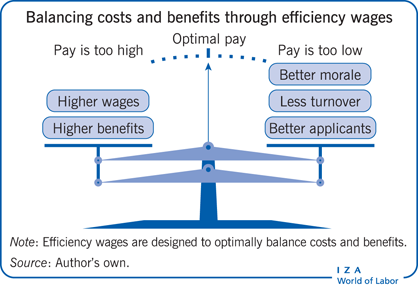

## Table of Contents

## What are efficiency wages?

Efficiency wages are higher than average wages that companies pay to their workers. The idea is that by paying more, companies can get better performance from their employees. When workers earn more, they feel happier and more loyal to the company. This can lead to them working harder and staying with the company longer. Also, higher wages can attract better and more skilled workers, which can help the company do better overall.

However, paying efficiency wages can also have some downsides. For one, it can be expensive for the company, especially if they are small or just starting out. If the company can't afford to keep paying high wages, they might have to cut them later, which can upset the workers. Also, if other companies in the same industry start paying similar high wages, it might not give the company any advantage anymore. So, while efficiency wages can help, they need to be used carefully.

## How do efficiency wages differ from market wages?

Efficiency wages are higher than market wages. Market wages are the normal pay that workers get for a job based on what other companies are paying for the same kind of work. When a company pays efficiency wages, they are choosing to pay more than what is usual in the market. This is done to make their workers happier, more loyal, and more productive.

Paying efficiency wages can help a company in different ways. It can attract better workers and keep them longer because they are happy with their pay. This can make the company more successful because the workers are working harder and staying with the company. But, efficiency wages can also be risky. They cost more money, and if a company can't keep paying them, it might have to lower them later, which can upset the workers. Also, if other companies start paying high wages too, then the advantage of efficiency wages might go away.

## What are the main theories behind efficiency wages?

One main theory behind efficiency wages is the "shirking model." This theory says that if workers are paid more than the market wage, they will work harder and not slack off. They don't want to lose their good job and high pay. So, they try their best to keep it. This makes the company more productive because the workers are working hard.

Another theory is the "turnover model." This theory says that when workers are paid more, they are happier and less likely to leave the company for another job. This means the company doesn't have to spend time and money hiring and training new people. It also means the company keeps experienced workers, which can make it do better.

A third theory is the "adverse selection model." This theory says that when a company pays high wages, it attracts better workers. Good workers are willing to work for a company that pays well. This means the company ends up with a team of skilled and motivated people, which can help the company succeed.

## Can you explain the shirking model of efficiency wages?

The shirking model of efficiency wages says that if a company pays its workers more than the usual market wage, the workers will work harder and not slack off. This is because they don't want to lose their good job and high pay. When workers are paid well, they feel more motivated to do their best work. They know that if they don't work hard, the company might fire them and they could lose their high-paying job. So, they try their best to keep their job and their good pay.

This model helps companies because when workers are not slacking off, the company becomes more productive. The workers are doing their jobs well, which means the company can make more money. It's a way for the company to make sure that its workers are always working hard and doing their best. By paying a little more, the company gets a lot more work done, which can help it succeed.

## How does the gift exchange model relate to efficiency wages?

The gift exchange model says that when a company pays its workers more than they need to, the workers see it as a gift. They feel happy and thankful for the extra money. Because of this, they want to give something back to the company. They do this by working harder and doing a better job. It's like a thank-you gift from the workers to the company for being paid more than they expected.

This model is a lot like efficiency wages because both ideas say that paying workers more can make them work better. In the gift exchange model, the extra pay is seen as a gift that makes workers want to work harder. With efficiency wages, the higher pay is used to make workers happier and more loyal, which also makes them work harder. So, both models show that paying workers more can help a company do better because the workers will work harder and be more productive.

## What is the turnover model and its connection to efficiency wages?

The turnover model is a theory about efficiency wages that says if a company pays its workers more, the workers will be happier and less likely to leave the company for another job. When workers are happy with their pay, they don't want to look for a new job. This means the company doesn't have to spend time and money hiring and training new people. It also means the company keeps experienced workers, which can make it do better.

This model is connected to efficiency wages because both ideas focus on keeping workers happy and loyal. By paying higher wages, a company can reduce the number of workers who leave, which saves money and keeps the team strong. This is one of the reasons why companies might choose to pay efficiency wages, as it helps them hold onto their good workers and keep their business running smoothly.

## What impact do efficiency wages have on unemployment?

Efficiency wages can lead to higher unemployment. When companies pay workers more than the usual market wage, it means they can't hire as many people. They have a limited budget, so if they're paying each worker more, they can only afford to hire fewer workers. This means there are fewer job opportunities, and more people might be out of work.

On the other hand, efficiency wages can also help reduce unemployment in some ways. If workers are paid more, they might work harder and be more productive. This can make the company more successful, which might lead to the company growing and hiring more people in the long run. So, while efficiency wages might cause higher unemployment at first, they could help lower it if the company does well because of the hard work of its employees.

## How do efficiency wages affect worker productivity?

Efficiency wages can make workers more productive. When companies pay their workers more than the usual market wage, the workers feel happier and more thankful. They see the extra money as a gift and want to work harder to show their thanks. This makes them do their jobs better and work more efficiently. Also, because they are paid well, they don't want to lose their good job, so they try their best to keep it by working hard.

On the other hand, efficiency wages can also help keep good workers. When workers are paid more, they are less likely to leave the company for another job. This means the company keeps experienced workers who know their jobs well. These experienced workers can do their jobs faster and better, which makes the whole company more productive. So, by paying efficiency wages, companies can get more work done and do it better.

## Can efficiency wages lead to wage inequality?

Efficiency wages can lead to wage inequality. When a company pays some workers more than the usual market wage, it means those workers earn more than others doing similar jobs at different companies. This can make the gap between what different workers earn bigger. If only some companies pay efficiency wages, then the workers at those companies will have higher pay, while workers at other companies will have lower pay. This can make people feel unfairness and can make the difference in pay between workers even bigger.

However, efficiency wages can also help reduce wage inequality in some ways. If more companies start paying efficiency wages, then more workers will get higher pay. This can help make the pay more equal across different companies. But, it depends on how many companies are paying efficiency wages and how much they are paying. If only a few companies pay high wages, then the inequality might still be there. So, efficiency wages can make wage inequality worse or better, depending on how they are used.

## What are the empirical evidences supporting efficiency wage theories?

There are some studies that show efficiency wages can work. One study looked at Henry Ford's company in the early 1900s. Ford started paying his workers $5 a day, which was a lot more than other companies were paying. After he did this, fewer workers left the company, and they worked harder. This made Ford's company do better. Another study looked at companies in different countries and found that when companies paid more, their workers were more productive and stayed with the company longer.

However, not all studies agree that efficiency wages always work. Some research shows that paying more doesn't always make workers work harder or stay longer. For example, a study in the service industry found that paying more didn't always lead to better service. It can depend on the kind of job and the workers. So, while there is some evidence that efficiency wages can help, it's not always clear, and it can depend on the situation.

## How do efficiency wages influence firm profitability?

Efficiency wages can help a company make more money. When a company pays its workers more than the usual market wage, the workers often feel happier and work harder. They see the extra money as a gift and want to do a good job to show their thanks. This can make the company more productive because the workers are doing their jobs well. Also, when workers are paid more, they are less likely to leave for another job. This means the company keeps experienced workers who know their jobs well, which can help the company do better and make more money.

However, paying efficiency wages can also make it harder for a company to make money. It costs more to pay workers more, so the company might not be able to hire as many people. This means they might not be able to do as much work. If the company can't afford to keep paying high wages, they might have to cut them later, which can upset the workers and make them less productive. So, while efficiency wages can help a company be more profitable if the workers work harder and stay longer, it can also be risky and expensive.

## What are the policy implications of adopting efficiency wage strategies?

When governments or companies think about using efficiency wages, it can affect how they make rules and plans. If a company pays workers more than the usual wage, it might help the workers feel happier and work harder. This could make the company do better and grow, which might be good for the economy. Governments might like this because it could mean more jobs and more money being made. But, they need to be careful because if too many companies start paying high wages, it might make it hard for other companies to compete. This could make some companies go out of business and cause more people to be out of work.

Also, using efficiency wages can make the difference in pay between workers bigger. If some companies pay more and others don't, the workers at the companies that pay less might feel it's not fair. Governments might need to make rules to help make pay more equal. They could do things like setting a minimum wage that all companies have to follow. This would help make sure that all workers get paid enough, even if some companies can't pay efficiency wages. So, while efficiency wages can help companies and workers, governments need to think about how to use them in a way that is fair for everyone.

## What are the theoretical foundations of efficiency wage theory?

Efficiency wage theory gained prominence in the 20th century through the contributions of economists such as Joseph Stiglitz and George Akerlof. Their work focused on the relationship between high wages and reduced employee turnover and shirking. The theory posits that by offering wages above the market equilibrium, firms can enhance worker productivity and loyalty, thereby solving several labor market inefficiencies.

Joseph Stiglitz's research indicates that higher wages serve as an incentive for workers, significantly reducing the likelihood of shirking. In conditions of high employment, the fear of losing a well-paying job encourages employees to exert optimal effort, thereby mitigating the risks associated with worker laziness. This relationship can be quantified by considering the utility maximization of workers. For instance, if $U$ represents utility, $w$ the wage, and $e$ the effort, the utility function can be expressed as:

$$
U = w - C(e)
$$

where $C(e)$ is the cost of effort. An increase in wages, $w$, can lead to higher optimal effort, $e^*$, such that the marginal utility from additional effort balances the marginal cost of effort, effectively reducing shirking behavior.

George Akerlof, along with Janet Yellen, made significant contributions to understanding how wage stickiness impacts employment. They demonstrated that wages do not always adjust downward during economic downturns because firms are reluctant to cut wages due to the negative effects on employee morale and productivity. Akerlof and Yellen's research highlighted the concept of involuntary employment, where workers are willing to work at the prevailing wage rate but cannot find jobs due to wage rigidity above market-clearing levels.

The presence of efficiency wages creates a scenario where wage setting deviates from the classical market equilibrium, as firms intentionally maintain wages above the equilibrium to capitalize on productivity gains. This is a critical component of the efficiency wage hypothesis, which challenges the standard neoclassical view where wages are solely determined by the intersection of labor supply and demand.

Thus, the theoretical foundations laid by Stiglitz, Akerlof, and Yellen provide a robust framework for understanding how efficiency wages influence employment dynamics, reducing turnover and shirking, while promoting a stable and productive workforce. These concepts have further implications in shaping wage policies and labor market regulations, emphasizing the strategic role of wage setting in optimizing firm performance and employee satisfaction.

## What are the challenges and criticisms?

Efficiency wages, while offering notable advantages, have sparked substantial debate in the field of labor economics due to certain inherent challenges and criticisms. The principal concern is the potential for efficiency wages to contribute to higher unemployment rates. By setting wages above the equilibrium level, firms may reduce the number of jobs available, as the cost of labor increases beyond the point where demand meets supply. This can result in a labor market imbalance, where more individuals are willing to work at the prevailing wage than there are positions available, thus increasing unemployment.

Mathematically, the labor supply and demand imbalance can be represented by:

$$
\text{Wage Level} > \text{Market-Clearing Wage} \Rightarrow \text{Quantity of Labor Supplied} > \text{Quantity of Labor Demanded}
$$

Moreover, the higher operational costs associated with efficiency wages present a critical drawback, especially for smaller firms with limited financial resources. These firms might struggle to maintain profitability if they adhere to efficiency wage models. Consequently, there arises a scenario where only larger firms, which can absorb the additional costs and potentially benefit from increased productivity, are able to implement such wage policies effectively.

Additionally, the efficacy of efficiency wages in enhancing productivity and reducing shirking is not universally guaranteed across all sectors or organizational settings. The assumption that higher wages lead to increased motivation and loyalty might not hold in environments where other factors, such as workplace culture or non-monetary incentives, play significant roles in employee performance. In such contexts, the expected productivity gains may not materialize, rendering the investment in higher wages unjustified.

Critics also debate whether efficiency wages might inadvertently lead to a complacent workforce. If employees perceive their compensation as secure regardless of performance, it might reduce their motivation to excel, potentially neutralizing the intended benefits of efficiency wages.

To optimize the implementation of efficiency wages, firms must tailor wage policies to align with specific organizational goals and understand their workforce's unique dynamics. A nuanced approach, considering both the financial viability of higher wages and the comprehensive motivational landscape, is essential for leveraging the benefits while mitigating the drawbacks of efficiency wage models.

## References & Further Reading

[1]: Stiglitz, J. E. (1986). ["Theories of Wage Rigidity."](https://www.semanticscholar.org/paper/Theories-of-Wage-Rigidity-Stiglitz/9d01c797f96c694819cdc9f54f7c2162264564ce) The Quarterly Journal of Economics, 101(4), 897-907. 

[2]: Akerlof, G. A., & Yellen, J. L. (1986). ["Efficiency Wage Models of the Labor Market."](https://www.cambridge.org/core/books/efficiency-wage-models-of-the-labor-market/introduction/4F66FC0C562555EB90BD581EEDB5F1CE) Cambridge University Press.

[3]: Yellen, J. L. (1984). ["Efficiency Wage Models of Unemployment."](https://mycourses.aalto.fi/pluginfile.php/2188365/mod_folder/content/0/Yellen%20Efficiency%20Wage%20Models%20AER%201984.pdf) American Economic Review, 74(2), 200-205.

[4]: Ford, H. (1926). ["Today and Tomorrow."](https://www.taylorfrancis.com/books/mono/10.4324/9780203735633/today-tomorrow-henry-ford) Doubleday, Page & Company.

[5]: Akerlof, G. A., & Yellen, J. L. (1990). ["The Fair Wage-Effort Hypothesis and Unemployment."](https://academic.oup.com/qje/article-abstract/105/2/255/1864771) The Quarterly Journal of Economics, 105(2), 255-283.