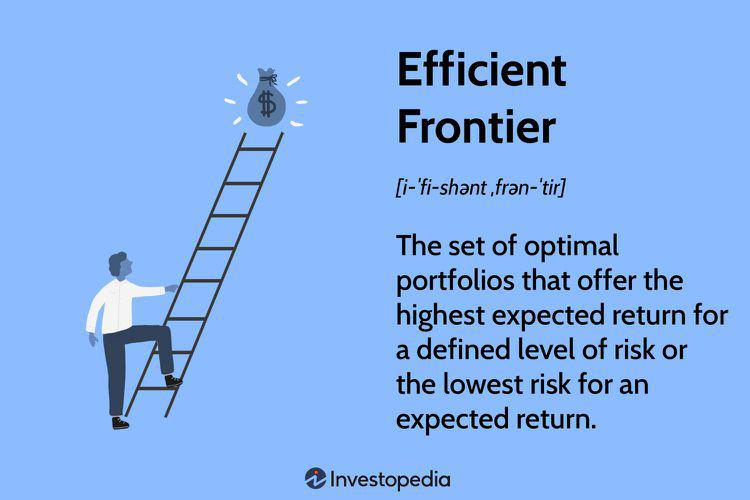

In the modern financial landscape, investors are constantly seeking strategies to maximize returns while minimizing risks. Among the many techniques available to achieve this balance, the efficient frontier and portfolio optimization stand out as crucial elements. The efficient frontier, a fundamental concept of modern portfolio theory developed by Harry Markowitz in the 1950s, helps investors identify portfolios that offer the highest expected return for a given level of risk. This theoretical framework encourages diversification to mitigate risks without sacrificing potential returns.

In parallel, algorithmic trading, commonly known as algo trading, has transformed how investors interact with financial markets. By deploying sophisticated algorithms, this method allows for the automatic execution of trades based on pre-defined strategies, enhancing trading speed and accuracy. Algo trading can capitalize on minor price discrepancies and respond to market events more swiftly than human traders, thus introducing greater efficiency into the trading process.



This article explores the intersection of these critical investment strategies—efficient frontier, portfolio optimization, and algo trading. Understanding these concepts collectively empowers investors to construct robust investment portfolios that proactively address risk and return considerations. As markets evolve and technological advancements continue, such strategies offer the potential for substantial gains in both portfolio performance and risk management. By leveraging these advanced techniques, investors can make more informed decisions, positioning themselves for long-term success in the financial markets.

## Table of Contents

## Understanding the Efficient Frontier

The efficient frontier is a central concept within modern portfolio theory, introduced by Harry Markowitz. It represents a graphical depiction of the optimal portfolios that yield the maximum expected return for a given level of risk. This concept is critical for understanding how to achieve the best possible trade-off between risk and return.

To construct portfolios on the efficient frontier, diversification plays a key role. By investing in a mix of assets that do not perfectly correlate, investors can reduce the overall risk of the portfolio. The process involves calculating the expected return and variance (or standard deviation) of different combinations of assets. The efficient frontier is formed by plotting portfolios with the lowest risk for each level of expected return.

Mathematically, an investor's decision can be framed as an optimization problem where the goal is to minimize the portfolio variance $\sigma_p^2$ for a given expected return $\mu_p$, represented as:

$$

\begin{align*}
\text{Minimize:} \quad & \sigma_p^2 = \mathbf{w}^T \mathbf{\Sigma} \mathbf{w} \\
\text{Subject to:} \quad & \mathbf{w}^T \mathbf{\mu} = \mu_p, \\
& \mathbf{w}^T \mathbf{1} = 1
\end{align*}
$$

Here, $\mathbf{w}$ is a vector of portfolio weights, $\mathbf{\Sigma}$ is the covariance matrix of the asset returns, $\mathbf{\mu}$ is a vector of expected asset returns, and $\mathbf{1}$ is a vector of ones ensuring that the sum of the weights equals one, i.e., the entire capital is invested.

Analyzing portfolios on the efficient frontier can significantly benefit investors by guiding them in making balanced investment choices. Such portfolios are considered 'efficient' because no other portfolios offer a higher expected return for the same level of risk. As a result, investors can use the efficient frontier to optimize their portfolios by selecting the most efficient portfolio that aligns with their risk tolerance.

## Portfolio Optimization Techniques

Portfolio optimization is a critical process in investment management, aimed at selecting an optimal portfolio from a set of possibilities to align with an investor's specific risk tolerance and financial objectives. Techniques employed in this process have evolved significantly, with mean-variance optimization, introduced by Harry Markowitz, being one of the foundational approaches. This technique involves balancing the trade-off between expected return and risk, typically gauged by the standard deviation of portfolio returns. The objective is to identify the "efficient" portfolios that yield the maximum return for a given level of risk or alternatively, the minimum risk for a given level of return.

Another sophisticated method utilized in portfolio optimization is quadratic programming. This mathematical technique solves optimization problems where the objective function is quadratic, and the constraints are linear. It is particularly useful in handling complex portfolio optimization problems with numerous constraints. Such constraints may include limits on the allocation to specific asset classes or mandatory inclusion of certain securities.

Modern portfolio optimization heavily relies on advanced software and financial models. These tools are capable of processing vast amounts of market data to forecast asset returns and estimate associated risks. Through these forecasts, investors aim to maximize the expected return of their portfolios while carefully managing risk exposure. Advanced statistical models, such as the Capital Asset Pricing Model (CAPM) and the Fama-French three-[factor](/wiki/factor-investing) model, are commonly employed to estimate expected returns and risk premiums of various securities.

To illustrate, a basic Python implementation of mean-variance optimization might involve the use of libraries like NumPy and SciPy. An example snippet for computing the efficient frontier could be as follows:

```python
import numpy as np
from scipy.optimize import minimize

# Example expected returns and covariance matrix
expected_returns = np.array([0.1, 0.12, 0.14])
cov_matrix = np.array([[0.005, -0.010, 0.004],
                       [-0.010, 0.040, -0.002],
                       [0.004, -0.002, 0.023]])

# Function to calculate portfolio variance
def portfolio_variance(weights, cov_matrix):
    return weights.T @ cov_matrix @ weights

# Constraint: Sum of weights must equal 1
constraints = ({'type': 'eq', 'fun': lambda weights: np.sum(weights) - 1})

# Bounds for each weight: 0 <= weight <= 1
bounds = tuple((0, 1) for _ in range(len(expected_returns)))

# Initial guess for the asset weights
initial_weights = np.array([1/len(expected_returns)] * len(expected_returns))

# Optimize and find the portfolio with minimum variance
result = minimize(portfolio_variance, initial_weights, args=(cov_matrix,),
                  method='SLSQP', bounds=bounds, constraints=constraints)

print('Optimal Weights:', result.x)
```

In practice, portfolio managers continually leverage these optimization techniques, adjusting portfolio compositions in response to shifts in market conditions and investment horizons. Such dynamic rebalancing ensures that portfolios remain aligned with evolving risk profiles and financial goals. Effective portfolio optimization not only demands sophisticated analytical tools and techniques but also an ongoing commitment to monitor and respond to market dynamics. As a result, it sits at the heart of modern investment strategy, empowering investors to achieve their desired financial outcomes with greater precision and confidence.

 to Algorithmic Trading

Algorithmic trading employs sophisticated computer algorithms to automate the process of buying and selling securities based on predefined criteria, thereby enhancing the speed and efficiency of trading operations. This technological advancement is particularly advantageous for handling large trading volumes, as it significantly reduces the manual labor and time involved in executing trades, allowing for rapid responses to market conditions.

One of the critical advantages of [algorithmic trading](/wiki/algorithmic-trading) is its ability to capitalize on minute price movements that often elude human traders. Algorithms can analyze vast amounts of market data in real-time and execute trades with precision and speed unattainable for individuals. By setting parameters such as timing, price, or quantity, these algorithms can make decisions and execute trades in milliseconds, reacting instantaneously to fluctuations in market conditions.

The widespread adoption of algorithmic trading has markedly increased over recent decades, fundamentally transforming global markets. According to a 2020 report by the CFA Institute, algorithmic trades account for approximately 60-73% of all U.S. equity trading [volume](/wiki/volume-trading-strategy). This shift has been driven by technological advancements, decreasing costs, and the pursuit of competitive advantages by institutional investors.

While algorithmic trading offers substantial benefits, the precision and speed with which trades are executed necessitate robust infrastructure and stringent regulatory oversight to mitigate risks such as those seen in the 2010 Flash Crash. Nevertheless, when properly managed, algorithmic trading remains a cornerstone of modern investing, providing a platform for sophisticated strategies such as high-frequency trading, statistical [arbitrage](/wiki/arbitrage), and [market making](/wiki/market-making), among others. These strategies continue to influence financial markets worldwide, underscoring the importance of understanding algorithmic trading in today's investment landscape.

## The Synergy of Portfolio Optimization and Algo Trading

Combining portfolio optimization with algorithmic trading has established a sophisticated method for managing investments, offering enhanced efficiency and effectiveness. Algorithms, when programmed strategically, can automatically adjust portfolios in real-time in response to continuously changing market conditions and optimization models. This capability ensures that portfolios remain aligned with the efficient frontier, which is fundamental in providing the maximum expected return for a given level of risk.

The dynamic nature of algorithmic trading allows it to capitalize on market inefficiencies more effectively than human traders. Algorithms can be executed at speeds incomprehensible to human operations, capitalizing on transient opportunities that arise in split-second market movements. For instance, an algorithm might detect a minor arbitrage opportunity in asset pricing and execute a series of rapid trades to exploit this anomaly, thereby enhancing the portfolio's return.

In practice, implementing the synergy between portfolio optimization and algorithmic trading involves integrating advanced mathematical models with real-time data processing. This integration enables the automated rebalancing of portfolios. For example, if a specific asset class within a portfolio underperforms compared to the optimization model's prediction, the algorithm might shift resources toward more promising assets, helping maintain alignment with the intended risk-return profile. This balancing act is crucial for maintaining an optimal position on the efficient frontier.

From a practical coding perspective, implementing such a system requires a robust infrastructure capable of processing large volumes of data in real time. A simple Python implementation outlining an adjustable portfolio strategy could look like this:

```python
import numpy as np
import pandas as pd
from scipy.optimize import minimize

def optimize_portfolio(returns, cov_matrix):
    num_assets = len(returns)

    def portfolio_volatility(weights):
        return np.sqrt(np.dot(weights.T, np.dot(cov_matrix, weights)))

    constraints = ({'type': 'eq', 'fun': lambda x: np.sum(x) - 1})
    bounds = tuple((0, 1) for _ in range(num_assets))

    initial_weights = num_assets * [1. / num_assets]
    result = minimize(portfolio_volatility, initial_weights, method='SLSQP', bounds=bounds, constraints=constraints)

    return result.x

# Example usage with dummy data
returns = np.array([0.12, 0.10, 0.07])  # Expected returns
cov_matrix = np.array([[0.005, -0.010, 0.004],
                       [-0.010, 0.040, -0.002],
                       [0.004, -0.002, 0.023]])  # Covariance matrix

optimal_weights = optimize_portfolio(returns, cov_matrix)
print("Optimized Portfolio Weights:", optimal_weights)
```

This Python snippet demonstrates how an optimization algorithm determines the optimal asset allocation based on expected returns and the covariance matrix of the assets, keeping the total weight sum to 1.

To fully harness these technological tools, investors must stay abreast of ongoing advancements in [machine learning](/wiki/machine-learning), big data analytics, and other related fields. This requires continuous learning and adaptation, ensuring that investment strategies remain competitive and aligned with the evolving financial landscape.

## Real-World Applications and Case Studies

Real-world case studies highlight the practical benefits of integrating portfolio optimization with algorithmic trading. Investment firms and hedge funds commonly leverage these strategies to maximize returns and manage risks effectively.

For example, automated rebalancing in response to market fluctuations is a widely used strategy. This involves adjusting the asset allocation of a portfolio to maintain its target risk profile. Consider a scenario where a portfolio composed of equities and bonds is set at a 60:40 equity-to-bond ratio. If market movements cause this ratio to drift to 70:30, an algorithm can automatically execute trades to restore the original balance. This process is iterative and helps in maintaining the portfolio on the efficient frontier, achieving optimal risk-adjusted returns. 

Hedge funds often employ strategies that hedge against specific risks using derivatives or other financial instruments. Algorithmic trading enables swift execution of complex hedging strategies. For instance, if a [hedge fund](/wiki/hedge-fund-trading-strategies) holds a significant position in a stock that suddenly becomes volatile due to market news, an algorithm can quickly initiate derivative trades to mitigate potential losses. This might involve purchasing put options as insurance against a drop in the stock's price, thereby protecting the portfolio's value.

In a broader context, BlackRock, one of the largest asset managers globally, utilizes advanced technology incorporating portfolio optimization algorithms to run its Aladdin platform. This sophisticated system analyzes vast amounts of data to optimize asset allocation and risk management for its clients. The integration of algorithmic trading within such platforms allows for real-time adjustments to portfolios based on predictive analytics and market conditions.

Code snippets can further illustrate how such integration might work. Below is a simplistic example in Python, demonstrating an automated rebalancing routine:

```python
import numpy as np

# Target allocations
target_alloc = {'equities': 0.6, 'bonds': 0.4}

# Current portfolio value (in millions)
portfolio_value = {'equities': 7, 'bonds': 3}

# Calculate the total portfolio value
total_value = sum(portfolio_value.values())

# Calculate current allocations
current_alloc = {asset: value/total_value for asset, value in portfolio_value.items()}

# Calculate the trades needed to rebalance the portfolio
trades = {asset: (target_alloc[asset] - current_alloc[asset]) * total_value for asset in current_alloc}

# Output trades needed
print("Trades needed for rebalancing:", trades)
```

This code calculates the trades needed to adjust a portfolio back to its target allocations. Such automated systems enable investment managers to respond promptly to market changes, optimizing their strategies without manual intervention.

These practical applications demonstrate the power of combining portfolio optimization with algorithmic trading. As technology continues to advance, these strategies are expected to become even more sophisticated, offering investors enhanced tools for managing complex financial portfolios effectively.

## Challenges and Risks in Algo Trading

Algorithmic trading, while highly advantageous in enhancing the speed and efficiency of trading processes, presents several challenges and risks that investors and financial institutions must navigate. One of the primary challenges is the vulnerability to technical failures. Algorithmic trading systems rely heavily on technology, including hardware, software, and communication networks. Any malfunction or interruption in these components can lead to significant trading errors, unintended positions, or missed trading opportunities. For instance, a failure of a network connection might prevent the execution of crucial trades based on time-sensitive strategies.

In addition to technical failures, unforeseen market [volatility](/wiki/volatility-trading-strategies) remains a critical risk associated with algorithmic trading. Algorithms are programmed based on historical data and set criteria that may not always account for unexpected market events, such as geopolitical incidents or sudden economic shifts. Such volatility can lead to significant financial losses if the algorithms cannot adapt quickly to the new market conditions. Furthermore, algorithms can amplify market volatility if many traders use similar trading models, leading to large-scale buy or sell orders that exacerbate price fluctuations.

Regulatory concerns and ethical considerations present another layer of complexity for algorithmic trading. As these systems can execute trades at speeds and volumes beyond human capability, they pose risks related to market fairness and integrity. For example, high-frequency trading ([HFT](/wiki/high-frequency-trading-strategies)), a subset of algorithmic trading, has been scrutinized for potentially providing unfair advantages to those with superior technology. Regulators worldwide have responded by imposing stricter guidelines to ensure transparency, prevent market manipulation, and safeguard against systemic risk. Compliance with these regulations requires continuous monitoring and adaptation of trading algorithms, which can be resource-intensive.

Investors and traders using algorithmic systems must therefore employ robust risk management strategies. These strategies include implementing comprehensive testing protocols, such as [backtesting](/wiki/backtesting) and stress testing, to ensure that algorithms perform as expected under various market conditions. Additionally, setting automated stop-loss orders can help limit potential losses during periods of high volatility. Regular audits and updates to algorithms are also necessary to maintain compliance with evolving market regulations and to address any ethical concerns.

Overall, while algorithmic trading offers significant benefits in terms of efficiency and precision, its successful application necessitates a thorough understanding of the associated risks and challenges. By adopting sound risk management strategies and adhering to regulatory standards, investors can harness the power of algorithmic trading while mitigating potential downsides.

## Future Trends in Investment Strategies

As technology continues to evolve, investors are presented with an array of new opportunities and challenges. In recent years, [artificial intelligence](/wiki/ai-artificial-intelligence) (AI) has begun to significantly influence both portfolio optimization and algorithmic trading. AI algorithms can process vast amounts of market data more quickly and accurately than traditional methods, enabling the creation of more responsive and adaptive investment strategies. Techniques such as machine learning and data analytics allow for more precise predictions of market movements and risk assessments. For example, AI can identify complex patterns and trends in historical data, facilitating more informed decision-making.

Another key trend is the increasing integration of sustainable and Environmental, Social, and Governance ([ESG](/wiki/esg-investing)) criteria into investment strategies. Investors are becoming more aware of the impact of their investments, leading to a greater emphasis on sustainable practices. Technological advancements enable better evaluation and reporting of ESG metrics, helping investors align their portfolios with these values. By incorporating ESG factors into algorithmic models, investors can balance financial returns with social and environmental impact, a consideration that is gaining importance in contemporary investment strategies.

To navigate these evolving investment landscapes, investors must remain vigilant and adaptable. They need to keep abreast of technological advancements and understand how these innovations can enhance their investment approaches. Continuous learning and staying informed about emerging trends, such as the use of AI and ESG integration, are crucial. By doing so, investors can not only optimize their portfolios but also ensure they contribute positively to sustainable development. Embracing these trends could lead to competitive advantages and a more resilient investment strategy in the future.

## Conclusion

Investment strategies that integrate the principles of the efficient frontier and portfolio optimization, enhanced by algorithmic trading methodologies, present a formidable approach to maximizing financial returns. These comprehensive strategies harness mathematical models and algorithmic precision to provide solutions that address both risk and reward, adapting dynamically to market conditions.

As financial markets evolve with new technologies and data analytics capabilities, the strategies for optimizing investments also advance. The utilization of algorithmic trading facilitates real-time data processing and swift execution of trades, allowing investors to capitalize on market opportunities that manual trading might miss. Portfolio optimization techniques, particularly those related to the efficient frontier, offer a way to systematically balance risk against potential returns. These mathematical and computational approaches provide a quantitative framework for making investment decisions that prioritize both growth and risk mitigation.

To fully leverage these advanced strategies, investors must remain vigilant and proactive in their learning. The financial landscape is subject to rapid changes, driven by technological advancements, regulatory shifts, and market dynamics. Continuous education and adaptation are necessary to keep up with these changes. Investors who commit to understanding and applying these concepts effectively are better poised to achieve dynamic portfolio growth, maintaining a competitive edge in increasingly complex markets.

In conclusion, the integration of efficient frontier principles, portfolio optimization, and algorithmic trading equips investors with powerful tools to enhance their investment portfolios. By embracing continuous learning and adaptation, investors can ensure these strategies are effectively applied, thereby securing their position for optimal portfolio performance over time.

## References & Further Reading

[1]: Markowitz, H. (1952). ["Portfolio Selection"](https://onlinelibrary.wiley.com/doi/abs/10.1111/j.1540-6261.1952.tb01525.x). The Journal of Finance, 7(1), 77-91. 

[2]: Malkiel, B. G. (1999). ["A Random Walk Down Wall Street: Including a Life-Cycle Guide to Personal Investing"](https://yourknowledgedigest.org/wp-content/uploads/2020/04/a-random-walk-down-wall-street.pdf). W. W. Norton & Company.

[3]: Lopez de Prado, M. (2018). ["Advances in Financial Machine Learning"](https://www.amazon.com/Advances-Financial-Machine-Learning-Marcos/dp/1119482089). Wiley.

[4]: Chan, E. P. (2009). ["Quantitative Trading: How to Build Your Own Algorithmic Trading Business"](https://github.com/ftvision/quant_trading_echan_book). Wiley.

[5]: Aronson, D. R. (2007). ["Evidence-Based Technical Analysis: Applying the Scientific Method and Statistical Inference to Trading Signals"](https://onlinelibrary.wiley.com/doi/book/10.1002/9781118268315). Wiley.

[6]: Hull, J. C. (2015). ["Options, Futures, and Other Derivatives"](https://archive.org/download/economia-usp/Hull%20J.C.-Options%2C%20Futures%20and%20Other%20Derivatives_9th%20edition.pdf). Pearson.

[7]: BlackRock's Aladdin Technology - ["How Aladdin Works"](https://www.blackrock.com/aladdin)

[8]: Fama, E. F., & French, K. R. (1993). ["Common risk factors in the returns on stocks and bonds"](https://people.hec.edu/rosu/wp-content/uploads/sites/43/2023/09/Fama-French-Common-risk-factors-1993.pdf). Journal of Financial Economics, 33(1), 3-56.