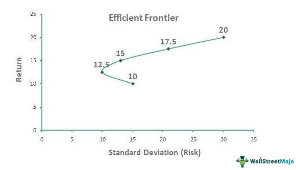

In the fast-paced world of algorithmic trading, making informed decisions is crucial for maximizing returns while minimizing risk. At the heart of effective portfolio management and trading strategies lies the concept of the Efficient Frontier. This principle is a cornerstone of Modern Portfolio Theory (MPT), which was introduced by Harry Markowitz in 1952. The Efficient Frontier represents a set of optimal portfolios that offer the highest expected return for a defined level of risk. It provides traders and portfolio managers with a framework to assess the trade-offs between risk and return, guiding them towards asset allocations that can enhance performance while controlling for volatility.

The significance of the Efficient Frontier in algorithmic trading cannot be overstated. Algorithmic trading involves the use of computer algorithms to execute trades at speeds and frequencies impossible for human traders. Given this backdrop, the Efficient Frontier aids in systematically identifying portfolios that align with specific risk tolerances, thereby optimizing trading strategies. By applying these principles, traders can better navigate the complexities of financial markets, systematically adjusting their asset allocations in response to changing market conditions.

In summary, understanding the Efficient Frontier is essential for traders who wish to employ algorithmic strategies in portfolio management. By integrating this concept, traders can apply a structured risk-return analysis framework to their decision-making processes, ultimately striving for optimal asset allocation in their trading activities.

## Table of Contents

## Understanding the Efficient Frontier

The Efficient Frontier is a foundational concept in Modern Portfolio Theory, providing a visual framework for understanding the balance between risk and return in portfolio construction. It is typically depicted on a two-dimensional graph where the x-axis represents risk, commonly quantified by the standard deviation of portfolio returns, and the y-axis denotes the expected return of the portfolio.

Mathematically, the expected return $E(R_p)$ of a portfolio is the weighted sum of the individual asset returns:

$$
E(R_p) = \sum_{i=1}^{n} w_i E(R_i)
$$

where $w_i$ is the weight of asset $i$ in the portfolio, and $E(R_i)$ is the expected return of asset $i$.

The Efficient Frontier represents a boundary of optimal portfolios that achieve the highest possible expected return for a given level of risk. Portfolios that reside on this boundary are deemed efficient. This efficiency is due to their ability to provide the maximum expected return for each level of risk embraced by the investor. Conversely, any portfolio that falls below the Efficient Frontier is classified as suboptimal, as these portfolios yield lower returns for equivalent levels of risk.

A critical aspect of understanding the Efficient Frontier is recognizing that it is based on the premise of diversification, which is achieved through the allocation of assets in different proportions. This diversification reduces the unsystematic risk inherent in individual assets, bringing portfolios closer to the Efficient Frontier.

To formally plot the Efficient Frontier, mean-variance optimization techniques are employed. These techniques involve computing various portfolio combinations from a universe of assets, calculating their expected returns, risks, and the covariance between assets, and subsequently identifying the set of portfolios that form the boundary. Any deviation from this frontier denotes potential inefficiencies in allocation.

In summary, the Efficient Frontier is an essential concept in portfolio management, providing guidance on how to construct portfolios that can best satisfy an investor's risk-return preferences. Its graphical representation underscores the trade-offs between risk and reward, helping investors identify optimal portfolio configurations.

## Mean-Variance Optimization and the Efficient Frontier

Mean-Variance Optimization (MVO) is an essential mathematical framework in Modern Portfolio Theory (MPT), introduced by Harry Markowitz, that assists in constructing the Efficient Frontier. This method utilizes historical financial data to predict future performance with an aim to enhance investment decisions. By assessing expected returns and associated risks, MVO identifies optimal portfolio allocations that balance these two variables effectively.

Central to MVO is the calculation of expected returns and the covariances between asset returns. Expected return is typically a weighted average of likely asset returns, expressed as:

$$

E(R_p) = \sum_{i=1}^n w_i E(R_i) 
$$

Where $E(R_p)$ is the expected return of the portfolio, $w_i$ is the weight of asset $i$, and $E(R_i)$ is the expected return of asset $i$.

The covariances between asset returns form the cornerstone for deciding the risk dimension of the portfolio, often summarized using a covariance matrix. Risk in this context is typically quantified using standard deviation or variance of returns. To achieve an optimally efficient portfolio, MVO solves for asset weights that minimize this risk at a defined level of expected return, or alternatively, maximize return for a given level of risk.

The objective function often used within MVO is:

$$

\min \left( w^T \Sigma w \right) 
$$

Subject to:

$$

\sum_{i=1}^n w_i = 1 
$$

and

$$

w_i \geq 0 
\] 

where $\Sigma$ denotes the covariance matrix of asset returns, and $w$ denotes the vector of asset weights in the portfolio.

A critical assumption in MVO is that risk is symmetrically distributed, treating deviations on the upside with the same caution as deviations on the downside. This uniform treatment fails to [factor](/wiki/factor-investing) in the investors' preference for positive risks (or returns) over negative ones, presenting a limitation known as symmetric risk aversion. Consequently, investors might seek to enhance traditional MVO approaches to better handle asymmetric risks.

By mapping out the Efficient Frontier, MVO provides traders with insights into achieving desired returns while managing inherent risks, crucial for informed asset allocation and risk management strategies.

## Application in Algorithmic Trading

In [algorithmic trading](/wiki/algorithmic-trading), the implementation of the Efficient Frontier plays a crucial role in optimizing trading strategies, primarily through the selection of portfolios that offer maximum returns for set risk levels. Algorithmic models are employed by traders to simulate various portfolio configurations, with the primary objective of identifying those that align closely with the Efficient Frontier. This alignment ensures that portfolios are chosen based on a balance of potential return against the risk involved, which is measured by standard deviation.

Utilizing the Efficient Frontier within algorithmic trading frameworks aids in automating the processes of asset allocation. Algorithms are capable of dynamically adjusting holdings according to real-time market data, thereby enabling more responsive and precise trading decisions. This integration is effectively a form of intelligent automation, where the principles of Modern Portfolio Theory are harnessed to guide allocation strategies. Thus, traders can swiftly adapt to changing market conditions by tweaking their portfolios in line with the efficient set of portfolios as defined by the Efficient Frontier.

Furthermore, the adoption of the Efficient Frontier offers a systematic methodology for continuous portfolio rebalancing. As market fluctuations occur, the quantitative models ensure portfolios remain optimized concerning risk and return. This process involves performing a series of calculations based on the covariance and returns of different asset combinations to determine optimal asset weights. By continuously recalibrating asset allocations, traders maintain portfolios that adhere to the desired risk-return profile, ensuring that they are not only aligned with current market conditions but also poised to capitalize on emerging opportunities. This iterative process is essential for maintaining a balanced and strategic approach in the fast-paced environment of trading.

## Benefits and Limitations

One primary benefit of utilizing the Efficient Frontier in algorithmic trading is its significant contribution to informed decision-making regarding asset purchases and sales. By employing the Efficient Frontier, traders are equipped to objectively assess the trade-off between risk and expected return, which can potentially lead to improved portfolio performance. This strategic approach allows traders to focus on portfolios that align closely with their specified risk tolerances and expected return goals, optimizing their trading strategies accordingly.

However, there are notable limitations associated with the use of the Efficient Frontier. A major limitation is its reliance on historical data, which may not always be a reliable predictor of future market conditions. This dependence raises concerns about the accuracy and robustness of portfolios designed based on past performance data. Market dynamics can shift unexpectedly, and historical data may not capture these changes, leading to portfolios that may not perform as anticipated in the future.

Furthermore, traditional Mean-Variance Optimization (MVO) frameworks that underlie the Efficient Frontier often do not adequately account for real-world factors such as transaction costs and [liquidity](/wiki/liquidity-risk-premium) constraints. These operational considerations can significantly impact the performance and feasibility of a trading strategy. As a result, traders need to adopt advanced models and techniques that incorporate these factors to ensure more effective and practical portfolio management. By addressing these limitations, traders can enhance their approach to algorithmic trading, achieving a more comprehensive and realistic assessment of risk and return in dynamic markets.

## Conclusion

The Efficient Frontier is an indispensable tool for traders aiming to enhance their portfolios through algorithmic strategies. By applying the principles of Modern Portfolio Theory (MPT) within algorithms, traders can systematically evaluate market opportunities using a structured risk-return analysis framework. This approach enables more informed decision-making, as it quantitatively balances potential returns against associated risks.

Technological advancements and improved data analysis techniques have significantly bolstered the Efficient Frontier's role in algorithmic trading. Innovations in computational power and [machine learning](/wiki/machine-learning) facilitate the rapid processing and analysis of vast datasets, which improve the precision of modeling expected returns and volatilities. This progress allows for more dynamic and real-time portfolio adjustments, aligning investment choices with ever-changing market conditions.

As the trading landscape continues to evolve, the refinement and adaptation of Efficient Frontier models are critical. Traders must continually update algorithms to account for emerging market patterns, transaction costs, and liquidity concerns. The continuing development of these models ensures that the Efficient Frontier remains a crucial component in strategic asset allocation, fostering more agile and responsive trading strategies in dynamic market environments.

## References

- Markowitz, H. (1952). Portfolio Selection. Journal of Finance. This foundational paper introduced Modern Portfolio Theory, laying the groundwork for financial models that optimize portfolios for maximum return at a given risk level. It elaborates on the concept of risk quantification and diversification in portfolio management, providing the mathematical basis for the Efficient Frontier.

- Sharpe, W. F. (1994). The Sharpe Ratio. Journal of Portfolio Management. This paper discusses the Sharpe Ratio, a critical tool in evaluating the performance of an investment by adjusting for its risk. It is particularly relevant for understanding the trade-off between risk and reward, an integral part of decisions involving the Efficient Frontier.

- Investopedia articles on Modern Portfolio Theory and the Efficient Frontier provide comprehensive insights into the application of these financial theories in practical settings. These resources explore key principles, benefits, and limitations, making complex financial models accessible to a broader audience.

- Medium articles and tutorials on implementing the Efficient Frontier using Python and Streamlit offer step-by-step guidance for tech-savvy traders. These resources emphasize the use of technological tools to simulate and visualize the Efficient Frontier, offering practical insights for algorithmic trading strategies and real-time portfolio management.

## References & Further Reading

[1]: Markowitz, H. (1952). ["Portfolio Selection."](https://onlinelibrary.wiley.com/doi/abs/10.1111/j.1540-6261.1952.tb01525.x) Journal of Finance, 7(1), 77-91.

[2]: Sharpe, W. F. (1966). ["Mutual Fund Performance."](https://www.jstor.org/stable/2351448) Journal of Business, 39(1), 119-138.

[3]: Merton, R. C. (1972). ["An Analytic Derivation of the Efficient Portfolio Frontier."](http://www.stat.ucla.edu/~nchristo/statistics_c183_c283/analytic_derivation_frontier.pdf) Journal of Financial and Quantitative Analysis, 7(4), 1851-1872.

[4]: ["Modern Portfolio Theory and Investment Analysis"](https://books.google.com/books/about/Modern_Portfolio_Theory_and_Investment_A.html?id=181CEAAAQBAJ) by Edwin J. Elton, Martin J. Gruber, Stephen J. Brown, and William N. Goetzmann

[5]: ["Algorithmic Trading: Winning Strategies and Their Rationale"](https://www.wiley.com/en-us/Algorithmic+Trading%3A+Winning+Strategies+and+Their+Rationale-p-9781118746912) by Ernie P. Chan

[6]: Bodie, Z., Kane, A., & Marcus, A. J. (2013). ["Investments"](https://www.mheducation.com/highered/product/investments-bodie-kane/M9781264412662.html) - A comprehensive textbook that provides an in-depth look at the field of investments, including the theory behind the Efficient Frontier and algorithmic trading strategies.