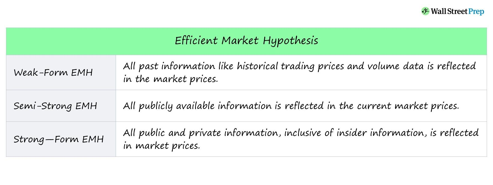

## Table of Contents

## What is the Efficient Market Hypothesis (EMH)?

The Efficient Market Hypothesis (EMH) is a theory in finance that says it's hard to beat the stock market because all the information that could affect stock prices is already included in the prices. This means that if you hear news about a company, the stock price has already changed to reflect that news. The idea is that there are so many people buying and selling stocks, and they are all trying to use the same information, that it's very difficult for any one person to get an advantage.

There are three different versions of the EMH. The first one, called the weak form, says that past stock prices can't help you predict future prices. The second one, the semi-strong form, says that all public information is already in the stock prices. The third one, the strong form, says that even private information can't give you an edge because it will quickly become public. Most people believe in the weak or semi-strong forms, which means that trying to pick stocks based on past performance or public news might not work very well. Instead, they suggest that it's better to just invest in a broad mix of stocks, like in an index fund.

## What are the three forms of the Efficient Market Hypothesis?

The Efficient Market Hypothesis (EMH) has three forms: weak, semi-strong, and strong. The weak form says that you can't use past stock prices to predict what will happen next. It means that looking at charts and patterns from the past won't help you make money in the future because all that information is already in the current price.

The semi-strong form of EMH says that all public information, like news and financial reports, is already included in stock prices. This means that if a company announces good news, the stock price will go up right away, so you can't make money by acting on that news after it's public. 

The strong form of EMH goes even further. It says that even if you have private or insider information, you still can't beat the market because that information will quickly become public and get reflected in the stock price. Most people believe in the weak or semi-strong forms, suggesting that it's hard to beat the market by picking individual stocks, and it might be better to invest in a broad mix of stocks, like in an index fund.

## What is the Weak Form of EMH and how does it relate to technical analysis?

The Weak Form of the Efficient Market Hypothesis (EMH) says that you can't use past stock prices to predict what will happen next. This means that looking at old stock prices and trying to find patterns won't help you make money in the future. According to the Weak Form, all the information from past prices is already included in the current price of a stock.

This idea is important when we talk about technical analysis. Technical analysis is when people look at charts and graphs of past stock prices to try and guess where the price will go next. If the Weak Form of EMH is true, then technical analysis won't work because the past prices don't give any new information that can help you predict the future. So, people who believe in the Weak Form think that trying to use technical analysis to beat the market is a waste of time.

## What is the Semi-Strong Form of EMH and how does it impact fundamental analysis?

The Semi-Strong Form of the Efficient Market Hypothesis (EMH) says that all public information is already included in stock prices. This means that when a company releases news, like a good earnings report or a new product, the stock price changes right away to reflect that news. So, if you hear about it after it's public, you can't make money from it because the price has already adjusted.

This idea affects fundamental analysis, which is when people look at a company's financials, management, and market conditions to decide if its stock is a good buy. If the Semi-Strong Form is true, then by the time you finish your analysis and decide to buy the stock, the price will have already gone up to match the new information. This means that trying to pick stocks based on public information might not help you beat the market, and it might be better to invest in a broad mix of stocks, like an index fund.

## What is the Strong Form of EMH and what does it imply about insider information?

The Strong Form of the Efficient Market Hypothesis (EMH) says that all information, even private or insider information, is already included in stock prices. This means that if someone knows something secret about a company, like a big new deal that's about to happen, the stock price already shows that information. According to the Strong Form, you can't use this secret information to make money because the price will change as soon as the information becomes public.

This idea is important because it means that even people with insider information can't beat the market. If the Strong Form is true, then it's impossible to get an advantage over other investors, no matter what you know. Most people don't believe in the Strong Form because they think insider information can give someone an edge before the news gets out. But if the Strong Form were true, it would mean that the best way to invest is still to buy a broad mix of stocks, like in an index fund, because trying to use any information, even secret information, won't help you do better than the market.

## How can the Weak Form of EMH be tested empirically?

To test the Weak Form of the Efficient Market Hypothesis (EMH), researchers look at past stock prices to see if they can predict future prices. They do this by using different ways to study the data, like looking at how stock prices move over time or using math formulas to see if there are any patterns. If they find that past prices can help predict future prices, then the Weak Form of EMH might not be true. But if they can't find any useful patterns, it supports the idea that past prices don't help in predicting the future, which is what the Weak Form says.

One common way to test the Weak Form is by using something called a "serial correlation test." This test checks if today's stock price is related to yesterday's price or prices from even further back. If there's no connection, it means past prices don't help predict future prices, which supports the Weak Form. Another way is to see if people who use technical analysis, like looking at charts and patterns, can make more money than people who just pick stocks randomly. If technical analysts can't do better than random picks, it suggests that the Weak Form might be right.

## What types of events are considered in the Semi-Strong Form of EMH?

The Semi-Strong Form of the Efficient Market Hypothesis says that all information you can find in the news, company reports, and other public places is already in the stock prices. This means if a company announces good news like higher profits or a new product, the stock price changes right away to show that news. So, if you hear about it after it's public, you can't make money from it because the price has already changed.

Events like earnings announcements, mergers and acquisitions, new product launches, changes in management, and economic reports are all considered in the Semi-Strong Form. If this form is true, then by the time you read about these events in the news or see them in a company's report, the stock price will have already moved to match the new information. This makes it hard to use this public information to beat the market because everyone else knows it too.

## Can you explain the implications of the Strong Form of EMH for market regulation?

The Strong Form of the Efficient Market Hypothesis says that even secret information, like insider information, is already in stock prices. This means that if someone knows something special about a company, the stock price already shows that information. If this is true, it means that rules to stop people from using secret information to make money might not be needed. This is because the stock price changes as soon as the secret information becomes public, so no one can use it to get an advantage.

But, most people don't believe the Strong Form is true. They think that secret information can give someone an edge before everyone else knows about it. Because of this, there are still rules to stop people from using insider information. These rules are important to keep the market fair and to make sure everyone has the same chance to make money. So, even if the Strong Form were true, these rules would still be in place to protect investors and keep the market honest.

## What are some common criticisms of the Efficient Market Hypothesis?

Some people don't agree with the Efficient Market Hypothesis (EMH) because they think it's too simple. They say that not all information gets into stock prices right away. For example, some news might take time to affect prices, or some investors might not see the news at all. Also, people can make mistakes or be influenced by their feelings, which can make stock prices go up or down in ways that don't make sense. This means that the market might not always be as smart as the EMH says it is.

Another big criticism is that some people can still make more money than others by picking the right stocks. For example, some investors, like Warren Buffett, have done very well by choosing certain companies to invest in. This suggests that it's possible to beat the market if you know what you're doing. Critics also point out that there are times when the market seems to overreact or underreact to news, which goes against what the EMH says about how quickly and correctly prices should change.

## How do behavioral finance theories challenge the assumptions of EMH?

Behavioral finance theories challenge the Efficient Market Hypothesis (EMH) by showing that people don't always act logically when they invest. EMH says that all information is quickly included in stock prices because people are smart and always make the best choices. But behavioral finance says that people often make mistakes because of their feelings or because they follow what others are doing. For example, people might buy a stock just because it's going up, even if there's no good reason for it. This can cause stock prices to go up or down in ways that don't match what the EMH says should happen.

Another way behavioral finance challenges EMH is by showing that people have biases that affect their decisions. For instance, people might hold onto losing stocks too long because they don't want to admit they made a mistake, or they might be too confident in their own choices. These biases can lead to stock prices that don't reflect all the information out there. So, while EMH says the market is always right, behavioral finance suggests that it's often wrong because people don't always make rational choices.

## What are some real-world examples where markets have deviated from the predictions of EMH?

One big example where markets didn't follow the Efficient Market Hypothesis was during the dot-com bubble in the late 1990s and early 2000s. Back then, people got really excited about internet companies, and their stock prices went way up, even if the companies weren't making any money. People were buying these stocks just because they thought they would keep going up, not because they thought the companies were worth that much. When the bubble burst, the prices crashed, showing that the market wasn't as smart as the EMH said it should be.

Another example is the 2008 financial crisis. Before the crisis, many people thought that housing prices would keep going up, so they bought a lot of houses and took out big loans. Banks and investors also thought this was a good idea and gave out more loans. But when housing prices started to fall, it caused a huge mess. The market didn't see this coming, even though there were signs that things were going wrong. This shows that markets can make big mistakes, which goes against what the EMH says about how quickly and correctly prices should change.

## How do advances in technology and data analytics affect the validity of the different forms of EMH?

Advances in technology and data analytics have made it easier for people to get information and analyze it quickly. This might make the Semi-Strong Form of the Efficient Market Hypothesis more true because news and reports can spread fast. People can use computers and the internet to find out about a company's earnings or new products right away, and this information gets into stock prices faster than before. But, it also means that if some people have better technology or data, they might be able to use it to beat the market, which would go against what the EMH says.

On the other hand, technology and data analytics can also challenge the Weak Form of EMH. With more powerful tools, some people might be able to find patterns in past stock prices that others can't see. If they can use these patterns to predict what will happen next, it would mean that the Weak Form isn't true because past prices can help predict the future. So, while technology might make the market more efficient in some ways, it can also create new ways for people to try and beat the market, which questions the validity of the EMH.

## Is there Weak Form Efficiency?

Weak form efficiency is a subset of the Efficient Market Hypothesis (EMH) which maintains that stock prices already incorporate and reflect all past trading information. This classification implies that the future movements of stock prices cannot be predicted by analyzing historical price data alone. Essentially, patterns or trends that might have existed in the past do not provide consistent or actionable predictions for future price behavior.

Under the assumption of weak form efficiency, technical analysis, which relies heavily on historical data and price patterns to forecast future movements, becomes largely ineffective. Technical indicators and chart patterns, such as moving averages or head-and-shoulders patterns, are not expected to yield returns superior to those of a basic buy-and-hold strategy. This is because any useful information from past public trading data has already been absorbed into current prices, eliminating any potential edge that an investor or trader might think they have.

However, the weak form of EMH does not preclude the use of fundamental analysis as a potentially viable method for identifying mispriced stocks. Since weak form efficiency only asserts that all past market data is reflected in price, it suggests that other forms of information, particularly new or qualitative data not yet assimilated into stock prices, could offer investment opportunities. Investors and analysts engaged in fundamental analysis study aspects such as a company’s earnings, industry position, management quality, and economic conditions to identify stocks that may be undervalued relative to their intrinsic value.

Mathematically, if $P_t$ represents the stock price at time $t$, weak form efficiency dictates that:

$$
E(P_{t+1} | P_t, P_{t-1}, ..., P_0) = P_t
$$

where $E$ denotes the expected value. This equation signifies that the expected price at time $t+1$ is equal to the price at time $t$, given the information set available from past prices. Thus, the prediction of future stock prices based purely on historical prices is regarded as no more accurate than random chance.

In practice, many empirical studies have been conducted to test the weak form efficiency of financial markets. While some have shown that markets like the New York Stock Exchange appear to conform to weak form efficiency, others have identified anomalies that suggest deviations, indicating that the degree of market efficiency may vary across different time periods and market conditions. Nonetheless, the weak form of EMH remains a crucial starting point in understanding market behaviors and the limitations of relying solely on historical data for trading.

## What are Market Anomalies?

Market anomalies refer to instances where stock returns deviate from the expected outcomes predicted by the Efficient Market Hypothesis (EMH). These anomalies challenge the core assertion of EMH that stock prices always reflect all available information, thereby providing opportunities for investors to achieve abnormal returns.

One of the most well-known anomalies is the January effect, where stock prices, particularly those of small-cap stocks, tend to increase in January more than in other months. This effect suggests a predictable pattern that could be exploited for higher returns, contradicting the EMH’s proposition of market efficiency. Researchers and traders hypothesize various reasons for the January effect, including tax-loss harvesting in December followed by reinvestment in January, or institutional investors rebalancing their portfolios at the start of the year.

Market anomalies extend beyond calendar effects. Other examples include the overreaction and underreaction anomalies, where investors either overreact to news causing temporary stock mispricing or underreact, leading to delayed price adjustments. Additionally, the small-cap effect describes how smaller companies often yield higher returns compared to their larger counterparts, possibly due to perceived higher risk or less analyst coverage.

These anomalies are significant because they suggest the possibility of systematic strategies to predict and capitalize on stock mispricing. Quantitative approaches, such as [factor](/wiki/factor-investing) models, are often employed to identify and exploit these patterns. For instance, a common model used is the Fama-French three-factor model, which expands on the Capital Asset Pricing Model (CAPM) by adding size risk and value risk factors to the market risk factor:

$$
R_i - R_f = \alpha + \beta(R_m - R_f) + sSMB + hHML + \epsilon
$$

where:
- $R_i$ is the return on the portfolio,
- $R_f$ is the risk-free rate,
- $R_m$ is the return on the market portfolio,
- $SMB$ (Small Minus Big) captures size effect,
- $HML$ (High Minus Low) captures value effect,
- $\alpha$ represents the stock's alpha (abnormal returns),
- $\beta, s,$ and $h$ are the coefficients for each factor,
- $\epsilon$ is the error term.

Despite their potential for strategic exploitation, the existence of market anomalies does not necessarily disprove the EMH. Some proponents argue that once an anomaly is identified and widely recognized, it may be arbitraged away, leading to market adjustments that restore efficiency. However, the continuous emergence of new anomalies underscores the intricate dynamics of financial markets and indicates that while markets strive toward efficiency, imperfections persist—offering a lucrative frontier for traders and algorithmic systems designed to detect and act on these opportunities.

## References & Further Reading

[1]: Fama, E. F. (1970). ["Efficient Capital Markets: A Review of Theory and Empirical Work."](https://www.jstor.org/stable/2325486) The Journal of Finance, 25(2), 383–417.

[2]: Malkiel, B. G. (2003). ["The Efficient Market Hypothesis and Its Critics."](https://www.princeton.edu/~ceps/workingpapers/91malkiel.pdf) Journal of Economic Perspectives, 17(1), 59-82.

[3]: Lo, A. W., & MacKinlay, A. C. (1999). ["A Non-Random Walk Down Wall Street"](https://www.jstor.org/stable/j.ctt7tccx). Princeton University Press.

[4]: Shleifer, A. (2000). ["Inefficient Markets: An Introduction to Behavioral Finance."](https://academic.oup.com/book/27761) Oxford University Press.

[5]: Jensen, M. C. (1978). ["Some Anomalous Evidence Regarding Market Efficiency."](https://www.sciencedirect.com/science/article/pii/0304405X78900259) Journal of Financial Economics, 6(2-3), 95–101.

[6]: Thaler, R. H. (1987). ["Anomalies: The January Effect."](https://www.aeaweb.org/articles?id=10.1257/jep.1.1.197) Journal of Economic Perspectives, 1(1), 197-201.

[7]: Jegadeesh, N., & Titman, S. (1993). ["Returns to Buying Winners and Selling Losers: Implications for Stock Market Efficiency."](https://www.bauer.uh.edu/rsusmel/phd/jegadeesh-titman93.pdf) The Journal of Finance, 48(1), 65–91.

[8]: Basu, S. (1977). ["Investment Performance of Common Stocks in Relation to Their Price-Earnings Ratios: A Test of the Efficient Market Hypothesis."](https://onlinelibrary.wiley.com/doi/pdf/10.1111/j.1540-6261.1977.tb01979.x) The Journal of Finance, 32(3), 663–682.

[9]: Barberis, N., & Thaler, R. (2003). ["A Survey of Behavioral Finance."](https://www.nber.org/papers/w9222) In Handbook of the Economics of Finance.