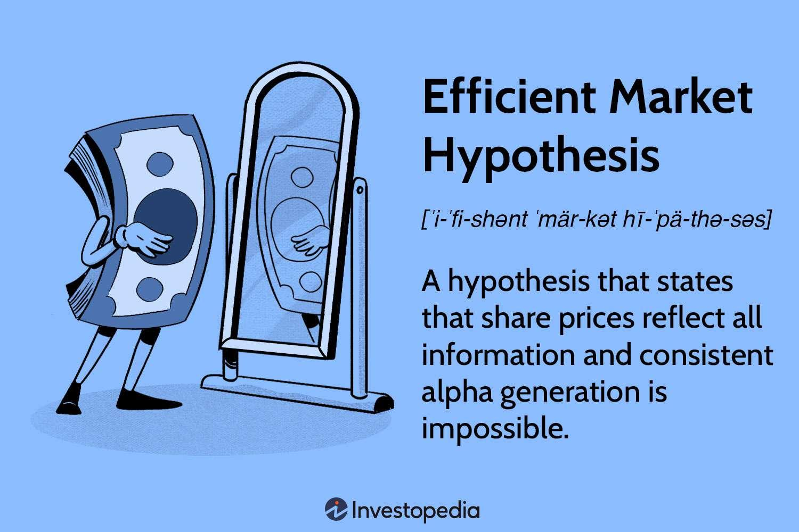

The concept of market efficiency is pivotal for understanding financial markets and trading activities as it affects how assets are priced and traded globally. At the core of this concept is the Efficient Market Hypothesis (EMH), a theory which posits that asset prices fully reflect all available information. This implies that, in an efficient market, it is impossible to consistently achieve higher-than-average returns, since any new information relevant to asset prices is rapidly and accurately integrated into those prices.

EMH is categorized into three forms, each with a different portrayal of market efficiency. These forms—weak, semi-strong, and strong—vary based on the types of information they consider to be reflected in market prices. The weak form suggests markets are efficient with respect to historical trading data. The semi-strong form incorporates all public information, asserting that prices adjust rapidly to reflect this data. The strong form takes a more inclusive approach, proposing that all information, both public and private, is fully embedded in stock prices, thereby negating any informational advantage, including insider knowledge.



Algorithmic trading and technological advancements have added layers of complexity to market dynamics, sparking renewed discussions concerning market efficiency. Algorithmic trading uses complex models and rapid data processing to inform trading decisions, which theoretically should enhance market efficiency by diminishing reaction times to new data. However, such technologies can also prompt market volatility, evidenced by sudden price swings often associated with high-frequency trading.

Within this discussion, it is crucial to consider critiques of the EMH and the occurrence of market anomalies, which question the hypothesis's validity. Historical events, such as market bubbles and crashes, as well as inefficiencies arising from psychological biases and information asymmetries, often counter the notion of perfectly efficient markets. This article will explore these challenges and discuss their implications on trading and investment strategies.

In modern finance, EMH continues to influence investment strategies, including the prominence of passive investing via index funds and ETFs. Despite criticisms and evidence of market inefficiencies, the hypothesis remains a cornerstone for financial regulations and corporate finance decisions. With the advent of machine learning and artificial intelligence, the boundaries of market efficiency are continuously tested, providing fresh perspectives on asset pricing methodologies. Understanding the interplay between market efficiency and emerging technologies is vital for navigating today's dynamic financial landscape.

## Table of Contents

## Understanding Efficient Market Hypothesis (EMH)

The Efficient Market Hypothesis (EMH) presents a theoretical framework suggesting that it is challenging, if not impossible, to achieve returns consistently above the average market return due to the efficient nature of financial markets. Fundamentally, EMH posits that asset prices fully reflect all available information, thus making it difficult for investors to capitalize on arbitrage opportunities.

EMH is categorized into three forms based on the extent of information reflected in asset prices: weak, semi-strong, and strong.

1. **Weak Form EMH**: This form asserts that all past trading information, including historical prices and volumes, is already incorporated into current market prices. As a result, technical analysis, which relies on past prices to predict future price movements, is unlikely to provide a consistent advantage for investors. This form of efficiency assumes that price movements are random and follow a "random walk" model.

2. **Semi-Strong Form EMH**: Extending beyond past market data, the semi-strong form posits that all publicly available information is factored into stock prices. This includes financial statements, news releases, and macroeconomic indicators. Thus, any new public information is rapidly assimilated by the market, negating the potential for investors to benefit from such information. Empirical tests often explore the speed at which stock prices adjust to new public information, providing insight into this form of market efficiency.

3. **Strong Form EMH**: The most stringent version, strong form efficiency, claims that all information, both public and private (including insider information), is fully reflected in stock prices. Therefore, even those with privileged access to insider data cannot achieve superior returns in a strongly efficient market. This form of EMH has significant implications for regulatory practices concerning insider trading.

While the EMH provides a structured understanding of market behavior, its practical application and the degree of market efficiency in reality remain subjects of debate among theorists and practitioners alike. Nonetheless, EMH continues to serve as a foundational concept in financial economics, influencing investment strategies and regulatory frameworks.

## Critiques and Challenges to EMH

The Efficient Market Hypothesis (EMH) posits that asset prices fully reflect all available information, making it ostensibly impossible to consistently achieve above-average returns. However, this hypothesis has faced significant scrutiny due to various market phenomena and analytical perspectives that challenge its validity.

Critics of EMH often point to anomalies such as market bubbles and events like the 1987 stock market crash, where prices experienced dramatic shifts that could not be justified by new information alone. A market bubble occurs when asset prices rise significantly over their intrinsic value, due to investor behavior rather than fundamental data. The dot-com bubble of the late 1990s is often cited as an example where excessive investor enthusiasm led to inflated stock prices, contradicting the premise that prices should always reflect the underlying financial conditions of assets.

Behavioral finance further critiques EMH by emphasizing the psychological factors influencing investor decisions. Unlike EMH, which assumes investors act rationally, behavioral finance introduces concepts such as herd behavior, overconfidence, and loss aversion as reasons why markets can systematically deviate from efficiency. For instance, herd behavior might cause investors to buy or sell en masse based on the actions of others, independent of individual stock valuations. Such actions potentially lead to mispricings and contribute to market [volatility](/wiki/volatility-trading-strategies).

EMH also assumes homogeneous interpretations of information, yet it fails to accommodate the varying perceptions and analytical methods employed by investors in evaluating stock values. Different investors apply distinct models and assumptions, leading to diverse interpretations and actions even when presented with identical information. This variability can contribute to price divergences, which speaks to inefficiencies within the market.

Notable examples of consistent market outperformance, such as that by Warren Buffett, present a direct challenge to EMH. Buffett, through his strategy of value investing and rigorous analysis, has managed to achieve returns well above market averages for extended periods. This success implies that there may be opportunities to exploit inefficiencies, which contradicts the assertion of EMH that such large-scale, consistent outperformance is impossible if markets are truly efficient.

These critiques raise fundamental questions about the practical validity of EMH. While efficient pricing remains an ideal framework, real-world deviations highlight the complexities and dynamic nature of financial markets, suggesting that opportunities to exploit market inefficiencies may exist despite the theoretical constraints posited by EMH.

## Market Inefficiencies and Anomalies

Market inefficiencies present a significant challenge to the Efficient Market Hypothesis (EMH), which posits that asset prices fully reflect all available information, thus precluding any consistent opportunities to earn abnormal returns. However, various factors contribute to market inefficiencies, casting doubt on the absolute validity of EMH.

### Information Asymmetries
Information asymmetries occur when one market participant possesses more or better information than another. This can lead to mispriced assets, as the less informed investors may not accurately assess an asset's value. For instance, a company insider might possess non-public knowledge that, if disclosed, could significantly alter the company's stock price. Under the strong form of EMH, this would not pose a problem as all information, public and private, would purportedly be reflected in stock prices, yet real-world occurrences often contradict this theory.

### Transaction Costs
Transaction costs refer to the expenses incurred in buying and selling assets, including broker fees, taxes, and other costs associated with the trade. These costs can prevent prices from reflecting all available information, particularly for smaller investors, who may find that the costs of trading outweigh potential gains from [arbitrage](/wiki/arbitrage) opportunities. As a result, discrepancies in asset prices may persist longer than the EMH would suggest.

### Emotional Biases
Investor psychology and emotional biases such as overconfidence, fear, and herd behavior can influence trading decisions, leading to irrational market movements that do not align with EMH predictions. Behavioral finance studies illustrate how cognitive biases result in deviations from purely rational decision-making, causing asset prices to sometimes diverge from their intrinsic value.

### The January Effect
One notable market anomaly is the January Effect, the tendency for stock prices to rise in January more than in any other month. This pattern challenges the idea of market efficiency as it suggests a predictable price movement that occurs not due to new information but rather due to behavioral and institutional practices, such as tax-loss harvesting in December.

### Momentum Investing
Another phenomenon that questions market efficiency is [momentum](/wiki/momentum) investing, which exploits the tendency of assets that have performed well in the past to continue performing well in the short term. This contradicts the weak form of EMH, as it implies the existence of exploitable patterns based solely on past price movements.

### Implications
These market inefficiencies and anomalies imply that it may be possible to achieve abnormal returns, challenging the core premise of the EMH. While some inefficiencies may resolve quickly as market participants act on them, others persist, providing opportunities for investors who can identify and exploit these deviations. Understanding these inefficiencies is crucial for developing trading strategies that can capitalize on market imperfections. 

Despite the arguments for market efficiency, these anomalies highlight the complex nature of financial markets, suggesting that a pure application of EMH may not fully capture the intricacies involved.

## Impact of Algorithmic Trading on Market Efficiency

Algorithmic trading has become a significant force in modern financial markets, utilizing sophisticated algorithms and high-speed data processing to execute trades at unprecedented speeds and scales. It relies on computer algorithms that analyze vast amounts of data to identify and act on market signals, often quicker than human traders can perceive them. This approach can, theoretically, enhance market efficiency, allowing markets to integrate information more rapidly into asset prices.

Proponents of [algorithmic trading](/wiki/algorithmic-trading) argue that it sharpens market efficiency by narrowing bid-ask spreads and increasing [liquidity](/wiki/liquidity-risk-premium), thereby enabling smoother price adjustments to new information. By minimizing lag times, algorithmic trading ensures that markets react swiftly to fresh data, aligning with the semi-strong form of the Efficient Market Hypothesis (EMH) where all publicly available information is reflected in asset prices. For example, automated systems can utilize natural language processing to scan news feeds and execute trades based on sentiment analysis. Such processes aid in the reflection of new information in market prices almost instantaneously.

Despite these beneficial aspects, algorithmic trading also presents challenges, notably in terms of market stability. High-frequency trading ([HFT](/wiki/high-frequency-trading-strategies)), a subset of algorithmic trading, can exacerbate market volatility due to its propensity to engage in large volumes of trades within fractions of seconds. This can lead to what are known as "flash crashes"—sudden, sharp declines in market prices. An infamous instance occurred on May 6, 2010, when the U.S. stock market experienced a rapid crash and rebound within minutes, raising concerns about the fragile nature of market structures dominated by algorithms. The algorithms react to orders and rapid price changes, often resulting in a cascading effect where automated responses can amplify swings in security prices.

Furthermore, some strategies employed in algorithmic trading, such as momentum trading, can contribute to herding behavior, where large numbers of traders replicate the same trades, adding to volatility and speculative bubbles. 

In summary, while algorithmic trading holds the potential to bolster market efficiency through the swift integration of information, it simultaneously introduces risks associated with heightened volatility and systemic market disruptions. Monitoring and adapting regulatory frameworks to accommodate and mitigate these risks remain essential tasks for financial regulators worldwide.

## The Role of EMH in Modern Finance

The Efficient Market Hypothesis (EMH) has played a pivotal role in shaping modern finance, particularly influencing investment strategies like passive investing through index funds and Exchange Traded Funds (ETFs). This approach is grounded in the belief that markets are efficient, thus reducing the likelihood of consistently outperforming market averages. As a result, passive investing, which seeks to replicate market indices, has gained popularity due to its cost-effectiveness and alignment with the principles of EMH.

Despite various criticisms, EMH continues to impact financial regulations and corporate finance practices. Financial regulators often use EMH as a theoretical foundation to ensure transparency and the fair dissemination of information in financial markets. This approach is crucial for maintaining investor confidence and economic stability, primarily when regulations hinge on the assumption that markets process information efficiently.

In recent years, advancements in [machine learning](/wiki/machine-learning) and [artificial intelligence](/wiki/ai-artificial-intelligence) (AI) have further tested the tenets of the EMH. These technologies enable sophisticated data analysis and pattern recognition, which can identify price inefficiencies and potential arbitrage opportunities. Machine learning algorithms can process vast amounts of financial data more quickly and accurately than humans, challenging the notion that markets are fully efficient. For instance, AI-driven strategies may uncover temporal inefficiencies or predict market movements not reflected in current prices.

Python, a popular programming language for executing machine learning models, can be employed to explore market efficiency testing. For example, a basic implementation using the Scikit-learn library for linear regression may help evaluate whether certain market variables significantly predict asset prices:

```python
import numpy as np
from sklearn.model_selection import train_test_split
from sklearn.linear_model import LinearRegression
from sklearn.metrics import mean_squared_error

# Generate synthetic financial data
np.random.seed(0)
X = np.random.rand(100, 1)  # Predictor variables (e.g., past stock returns)
y = 3 * X.squeeze() + 2 + np.random.randn(100) * 0.5  # Simulated asset prices

# Split data into training and test sets
X_train, X_test, y_train, y_test = train_test_split(X, y, test_size=0.2, random_state=42)

# Train linear regression model
model = LinearRegression().fit(X_train, y_train)

# Predict and evaluate model
y_pred = model.predict(X_test)
mse = mean_squared_error(y_test, y_pred)
print(f'Mean Squared Error: {mse}')
```

This basic model tests the relationship between historical returns and future prices, offering insights into whether certain patterns persist, potentially suggesting inefficiencies.

In conclusion, while EMH provides a robust foundation for understanding market behavior, the integration of AI and machine learning represents a significant evolution in finance. These technologies continue to challenge traditional notions of market efficiency by potentially revealing patterns and anomalies previously unexplored, signifying an ongoing dialogue between established economic theories and technological innovation.

## Conclusion

The Efficient Market Hypothesis (EMH) provides a foundational framework for understanding how market prices reflect information. Despite its broad acceptance, the hypothesis does not unequivocally encapsulate the complexities and anomalies evident in real-world financial markets. One of the critical insights is recognizing that markets are not always perfectly efficient, and anomalies such as market bubbles and crashes reveal persistent inefficiencies.

Investors must understand the limitations of EMH to navigate the often unpredictable currents of financial markets. The hypothesis asserts that it is challenging to consistently achieve returns exceeding average market gains. However, the presence of anomalies and market inefficiencies suggests that opportunities for abnormal returns do exist. This understanding is crucial for formulating investment strategies that can potentially exploit these inefficiencies.

Technological innovations, particularly in algorithmic trading, have intensified scrutiny of market efficiency. These advancements necessitate continuous learning and adaptation, as they have introduced both challenges and opportunities within financial markets. The rapid processing of large datasets and complex computational models can either enhance or destabilize market efficiency. As such, being agile in response to these technological shifts is of paramount importance.

Investors and financial professionals should prioritize ongoing education and embrace technological advancements to proficiently capitalize on emerging market opportunities. This dynamic approach is vital as the financial landscape evolves, challenging traditional assumptions of market behavior and testing the boundaries set by EMH. Understanding these dynamics equips investors with the tools and insights necessary to adeptly manage their portfolios in an ever-changing environment.

## References & Further Reading

[1]: Fama, E. F. (1970). ["Efficient Capital Markets: A Review of Theory and Empirical Work."](https://www.jstor.org/stable/2325486) Journal of Finance, 25(2), 383-417.

[2]: Lo, A. W. (2005). ["Reconciling efficient markets with behavioral finance: The adaptive markets hypothesis."](https://papers.ssrn.com/sol3/papers.cfm?abstract_id=1702447) Journal of Investment Consulting, 7(2), 21-44.

[3]: Malkiel, B. G. (2003). ["The Efficient Market Hypothesis and Its Critics."](https://www.princeton.edu/~ceps/workingpapers/91malkiel.pdf) Journal of Economic Perspectives, 17(1), 59-82.

[4]: Shiller, R. J. (2003). ["From Efficient Markets Theory to Behavioral Finance."](https://www.jstor.org/stable/3216841) Journal of Economic Perspectives, 17(1), 83-104.

[5]: Thaler, R. H. (1993). ["Advances in Behavioral Finance,"](https://psycnet.apa.org/record/1993-98595-000) Volume I. Princeton University Press.

[6]: Chan, E. P. (2009). ["Quantitative Trading: How to Build Your Own Algorithmic Trading Business."](https://github.com/ftvision/quant_trading_echan_book) Wiley.

[7]: Jansen, S. (2020). ["Machine Learning for Algorithmic Trading."](https://github.com/stefan-jansen/machine-learning-for-trading) Packt Publishing.

[8]: Patel, S. A., & Sharma, D. (2019). ["Market Anomalies and Behavioral Finance."](https://www.cambridge.org/core/journals/behavioural-public-policy/article/behavioral-finance-impacts-on-us-stock-market-volatility-an-analysis-of-market-anomalies/D1CEF34141D03D8BECB2AE42467166B3) In Pandian, D. M.: Behavioral Finance, 141-162. Academic Press.