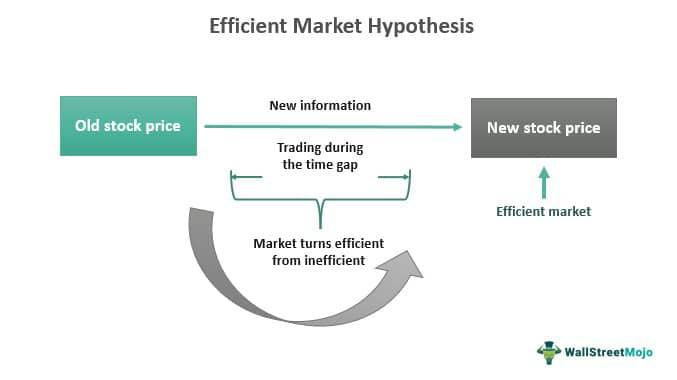

The Efficient Market Hypothesis (EMH) is a pivotal concept in financial economics, positing that at any particular time, asset prices fully incorporate all available information. This hypothesis was introduced by Eugene Fama in the 1970s and has since garnered substantial research interest and debate within academic and professional circles. At its core, the EMH is grounded in the notion of market efficiency, which suggests that it is infeasible to consistently achieve returns that exceed the average market returns when adjusted for risk. Essentially, under EMH, the likelihood of outperforming the market through expert stock selection or market timing is nullified because asset prices are always reflective of available data.

This article endeavors to critically analyze the EMH by juxtaposing its foundational principles with the burgeoning impact of algorithmic trading. Algorithmic trading, which automates transactions based on pre-set criteria, has reshaped market dynamics and has implications for the validity of market efficiency as proposed by EMH. We aim to explore both endorsements and critiques of the EMH, assessing whether algorithmic trading provides new insights or challenges to longstanding financial theories. Through this examination, we seek to offer a comprehensive perspective on how modern trading practices interact with established economic hypotheses.

## Table of Contents

## Understanding the Efficient Market Hypothesis

The Efficient Market Hypothesis (EMH) is categorized into three distinct forms: weak, semi-strong, and strong. Each form represents a varying degree of market information integration, highlighting the extent to which different types of information are reflected in asset prices.

The weak form of EMH asserts that current stock prices incorporate all past trading data. This includes historical prices, volumes, and other market statistics, leading to the conclusion that technical analysis, which seeks to predict future stock prices based on historical data patterns, cannot consistently yield excess returns. The underlying rationale is that any patterns or trends detected from past data are already embedded in current prices, negating any predictive advantage. This concept can be illustrated through the random walk theory, which suggests that stock price movements are unpredictable and follow a path consistent with a random walk.

In its semi-strong form, EMH proposes that stock prices quickly adjust to reflect all publicly available information. This encompasses not only historical trading data but also public news, corporate announcements, economic indicators, and more. Thus, neither technical analysis nor fundamental analysis, which involves evaluating a company's intrinsic value based on financial statements and economic factors, can consistently produce excess returns. The semi-strong form emphasizes that any new public information is rapidly assimilated into stock prices, leaving no room for systematic exploitation by investors.

The strong form of EMH takes this integration of information to its most comprehensive level, positing that stock prices reflect all information, both public and private. This implies that even insider information, which is non-public and could potentially offer considerable advantage in predicting price movements, is already reflected in the current stock prices. Consequently, no investor, regardless of their access to private data, can achieve consistently superior returns. The strong form suggests a perfectly efficient market environment where all information asymmetries are nullified by the immediate adjustment of prices.

Together, these three forms of EMH provide a framework for understanding the efficiency of financial markets and challenge traditional methods of analysis and prediction within the industry.

## Market Efficiency: The Core Idea

Market efficiency refers to the degree to which asset prices reflect all available information, ensuring optimal resource allocation and influencing investor behavior. At its core, market efficiency is rooted in precise price discovery, where prices of securities accurately represent their intrinsic values based on available data. This equilibrium in pricing aids in the optimal allocation of resources across the economy.

Several factors contribute to achieving market efficiency. Information availability is paramount; the quicker and more comprehensively information is disseminated to all market participants, the more effectively assets reflect their true value. Rational investor behavior is also essential, assuming that investors act on available information sensibly, without biases. Market structure impacts efficiency, where competitive and transparent markets with low transaction costs facilitate an environment conducive to accurate pricing.

Indicators of market efficiency can be observed through various financial theories and market behaviors. The random walk theory suggests that price changes are unpredictable and follow a random path, making it impossible to gain excess returns through market timing or speculation. This theory aligns with the weak form of the Efficient Market Hypothesis, which assumes all past trading information is already incorporated into current pricing.

Rapid price adjustments to new information are another sign of an efficient market. When new, relevant information becomes available, asset prices should adjust almost instantaneously to reflect this update. This responsiveness is indicative of semi-strong form efficiency, where publicly available information is quickly integrated into stock prices, negating any advantage from [fundamental analysis](/wiki/fundamental-analysis).

Lastly, the presence of minimal lasting [arbitrage](/wiki/arbitrage) opportunities signifies an efficient market. Arbitrageurs play a crucial role in correcting mispricings in the market; however, in a fully efficient market, these opportunities are rare and short-lived. The constant actions of arbitrageurs swiftly eliminate discrepancies, aligning asset prices with their true values.

In summary, market efficiency is the hallmark of a well-functioning financial system. It hinges on effective information dissemination, rational actions by investors, and a supportive market structure, manifesting through random price movements, rapid incorporation of new information, and negligible enduring arbitrage.

## Algorithmic Trading: Revolutionizing Market Dynamics

Algorithmic trading involves the use of advanced computational algorithms to execute trades in financial markets. These algorithms are designed based on predetermined criteria, which can include timing, price, and [volume](/wiki/volume-trading-strategy), among other variables. This technological innovation has significantly reshaped market dynamics by enhancing efficiency in several ways. First, [algorithmic trading](/wiki/algorithmic-trading) enables faster trade executions compared to traditional manual trading methods. This speed is crucial for taking advantage of fleeting market opportunities and minimizing risks associated with time delays.

Moreover, algorithmic trading reduces human error by relying on data and statistical models to make decisions, which improves the accuracy and reliability of trades. The automation of trades also contributes to greater market [liquidity](/wiki/liquidity-risk-premium). With algorithms processing large volumes of trades rapidly, markets can benefit from increased activity and tighter bid-ask spreads, resulting in more favorable conditions for all market participants.

Despite these advantages, algorithmic trading introduces certain risks. One of the primary concerns is the potential increase in market [volatility](/wiki/volatility-trading-strategies). Algorithms can react to market data in milliseconds, and in times of market stress, this may lead to rapid and sizable price movements. A notable example of such an event is the Flash Crash of May 2010, when algorithmic trading contributed to a dramatic and rapid decline in U.S. stock indices, followed by a swift recovery. During this incident, high-frequency trading algorithms exacerbated the market downturn, underscoring the systemic threats posed by algorithmic interventions.

The potential for systemic risks requires market participants and regulators to closely monitor and adapt to these technological advancements. Efforts include implementing regulatory measures designed to ensure stability and mitigate adverse effects, such as circuit breakers and thresholds for trade halts. As algorithmic trading continues to evolve, maintaining a balance between innovation and market stability remains a critical focus for the financial industry.

## Critiques of the Efficient Market Hypothesis

The Efficient Market Hypothesis (EMH) has been a subject of vigorous debate, and its critiques are primarily rooted in behavioral economics, empirical anomalies, and historical financial events. Behavioral economics challenges the EMH by emphasizing that investors are not always rational actors. Instead, they are susceptible to psychological biases and cognitive errors which can lead to irrational decisions. This irrationality is manifested in various behavioral finance theories, such as the prospect theory, that argue individuals perceive the value of gains and losses differently, contributing to market inefficiencies.

Empirical anomalies further challenge the assumptions of the EMH. The January effect is a well-documented market anomaly where stock prices, particularly those of small-cap companies, tend to rise in January more than in any other month. This contradicts the EMH, as it suggests that predictable patterns can be leveraged for above-average returns. Similarly, the [momentum](/wiki/momentum) effect contradicts EMH's presumption of randomness in price movements. The momentum effect occurs when stocks that have performed well in the past continue to perform well in the future, and conversely for those with poor performance. These patterns of performance challenge the notion that stock prices are reflective of all available information at any point in time.

Additionally, historical financial crises have exposed limitations in the EMH's explanatory power. The dot-com bubble of the late 1990s and early 2000s exemplifies how irrational exuberance can lead to asset price inflation disconnected from intrinsic values. During this period, speculative investments drove technology stock prices to unsustainable levels, culminating in a dramatic market correction. Similarly, the 2008 financial crisis illustrated severe mispricings and inefficiencies within financial markets. Factors such as the overvaluation of mortgage-backed securities and systemic risks inherent in derivative products diverged from EMH's assumption of fully informed, rational market actions.

In conclusion, the critiques of the EMH underscore the complexity of financial markets and the roles of investor psychology and systemic anomalies. These factors highlight the need for a more nuanced understanding of market dynamics beyond the traditional EMH framework.

## Reconciling EMH with Algorithmic Trading

Algorithmic trading both supports and challenges the Efficient Market Hypothesis (EMH) by promoting swift market adjustments and raising concerns regarding market inefficiencies. On one side, algorithmic trading enhances market efficiency by utilizing sophisticated algorithms to analyze real-time data, allowing for rapid incorporation of new information into stock prices. Consequently, this automation aligns with the EMH premise that financial markets tend to reflect all available information as efficiently as possible.

However, certain incidents highlight the potential for algorithmic trading to disrupt market efficiencies. Notable events, such as the Flash Crash of May 2010, illustrate how high-frequency trades can amplify price movements, leading to significant volatility and temporary deviations from market efficiency. These occurrences suggest that while algorithmic trading generally supports EMH by facilitating quicker price discovery, it can occasionally generate conditions that contradict the hypothesis.

The adaptive responsiveness of financial markets to algorithmic trading advances highlights a nuanced perspective on its challenges and contributions to market efficiency. The interplay between rapid technological advances and the inherent unpredictability of financial markets engenders both opportunities and risks. As algorithms become increasingly sophisticated, their ability to forecast short-term price movements improves. Yet, this same sophistication can result in more complex interactions and unpredictable market behaviors that challenge traditional notions of efficiency.

To address these challenges, emerging regulatory measures aim to balance innovation with market stability, seeking to mitigate algorithmic trading's adverse effects. Implementing circuit breakers and stringent oversight of high-frequency trading practices are examples of regulatory strategies designed to curtail excessive market volatility. By enforcing such measures, regulators aspire to preserve the benefits of algorithmic trading—enhanced liquidity, reduced transaction costs, and improved price efficiency—while minimizing risks that may lead to market disruptions.

On the whole, reconciling the EMH with algorithmic trading necessitates a dynamic understanding of how technological innovation influences financial markets' efficiency. Market participants are encouraged to consider both EMH principles and the evolving impact of algorithmic techniques to make informed investment decisions.

## Conclusion

The Efficient Market Hypothesis (EMH) has long provided a critical framework for understanding market behavior, offering insights into the notion that asset prices reflect all available information. However, algorithmic trading, with its rapid technological advancements, is reshaping the concept of market efficiency. Unlike traditional trading, which depends heavily on human intuition and decision-making, algorithmic trading utilizes predetermined criteria and computational models to execute trades with remarkable speed and precision. This advancement has led to an environment where asset prices can adjust more quickly and accurately to new information, theoretically enhancing market efficiency.

Nevertheless, the sophistication of algorithmic trading systems requires an ongoing reassessment of traditional market efficiency concepts. As these systems become more advanced, they bring unique challenges, such as increased market volatility and potential systemic risks. The intricacies of these high-frequency trades and the massive data volumes they generate necessitate a deeper understanding and continuous monitoring to ensure that they do not inadvertently disrupt market stability.

For market participants, it is essential to harmonize the foundational principles of EMH with the dynamic nature of algorithmic trading effects. By integrating these principles, investors and financial analysts can make more informed decisions, recognizing both the opportunities and challenges presented by these sophisticated trading systems. The interplay between EMH and algorithmic trading represents a complex, evolving landscape in financial markets, demanding a nuanced approach that balances traditional theories with modern technological advancements.

## References & Further Reading

[1]: Fama, Eugene F. (1970). ["Efficient Capital Markets: A Review of Theory and Empirical Work."](https://www.jstor.org/stable/2325486) Journal of Finance, 25(2), 383-417.

[2]: Malkiel, Burton G. (2003). ["The Efficient Market Hypothesis and Its Critics."](https://www.princeton.edu/~ceps/workingpapers/91malkiel.pdf) Journal of Economic Perspectives, 17(1), 59-82.

[3]: Lo, Andrew W. (2004). ["The Adaptive Markets Hypothesis: Market Efficiency from an Evolutionary Perspective."](https://papers.ssrn.com/sol3/papers.cfm?abstract_id=602222) Journal of Portfolio Management, 30(5), 15-29.

[4]: Aldridge, Irene. (2010). ["High-Frequency Trading: A Practical Guide to Algorithmic Strategies and Trading Systems."](https://www.ahmetbeyefendi.com/wp-content/uploads/2020/07/High-Frequency-Trading-Irene-Aldridge.pdf) Wiley Finance.

[5]: O'Hara, Maureen. (2015). ["High Frequency Market Microstructure."](https://www.sciencedirect.com/science/article/pii/S0304405X15000045) Journal of Financial Economics, 116(2), 257-270.

[6]: Thaler, Richard H. (1999). ["The End of Behavioral Finance."](https://www.researchgate.net/publication/2593983_The_End_of_Behavioral_Finance) Financial Analysts Journal, 55(6), 12-17.

[7]: Shiller, Robert J. (2003). ["From Efficient Markets Theory to Behavioral Finance."](https://www.aeaweb.org/articles?id=10.1257/089533003321164967) Journal of Economic Perspectives, 17(1), 83-104.

[8]: Chan, Ernest P. (2009). ["Quantitative Trading: How to Build Your Own Algorithmic Trading Business."](https://github.com/ftvision/quant_trading_echan_book) Wiley Trading. 

[9]: Barberis, Nicholas, and Richard Thaler. (2003). ["A Survey of Behavioral Finance."](https://www.nber.org/papers/w9222)01027-6) Handbook of the Economics of Finance.