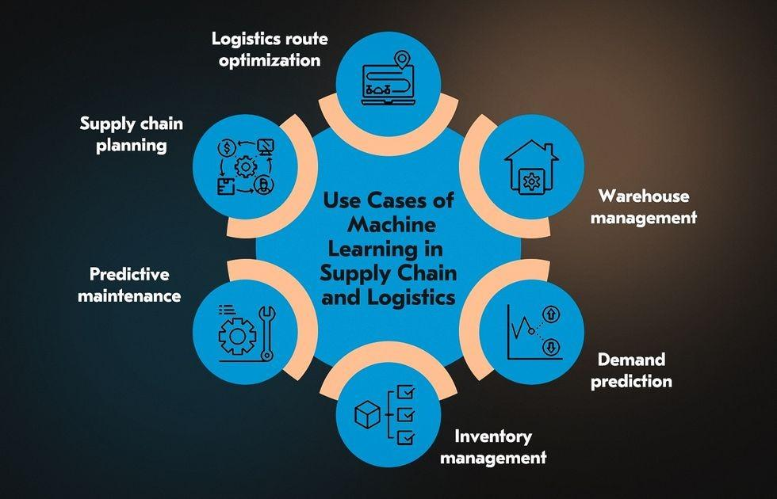

## Table of Contents

## What is efficient planning in the context of machine learning?

Efficient planning in the context of machine learning refers to the process of optimizing the steps and resources needed to train and deploy machine learning models effectively. This involves choosing the right algorithms, managing data efficiently, and ensuring that computational resources are used in the best possible way. The goal is to reduce the time and cost associated with developing machine learning solutions while maintaining or improving the model's performance.

One key aspect of efficient planning is the selection and tuning of algorithms. For instance, if a problem can be solved with a simpler model like linear regression rather than a more complex one like a deep neural network, the simpler model should be preferred to save on computational resources. Additionally, techniques like cross-validation can be used to fine-tune model parameters without overfitting, ensuring that the model generalizes well to new data. Efficient planning also involves data management, where strategies like data preprocessing and feature selection help in reducing the dataset size and improving model training speed.

Another important element is the use of appropriate computational resources. This can mean choosing the right hardware, such as GPUs for deep learning tasks, or utilizing cloud computing services to scale resources as needed. Efficient planning also includes the use of software tools and frameworks that streamline the machine learning workflow, such as TensorFlow or PyTorch, which can significantly reduce the time spent on coding and debugging. By carefully planning these aspects, machine learning practitioners can achieve better results with less effort and resources.

## How does efficient planning differ from traditional planning methods?

Efficient planning in [machine learning](/wiki/machine-learning) focuses on using resources wisely to get the best results quickly. It's about choosing the right tools and methods to make the process smoother and faster. For example, instead of using a complicated model that takes a lot of time to train, efficient planning might suggest using a simpler model that works almost as well but trains much faster. This approach also looks at how to manage data better, like cleaning it up or [picking](/wiki/asset-class-picking) only the most important parts to use, which can speed up the whole process.

Traditional planning methods, on the other hand, might not focus as much on speed and efficiency. They often follow a more step-by-step approach, where each part of the process is done in a set order, without always thinking about how to do things faster or with less resources. For example, traditional planning might always use the same model for a certain type of problem, even if a different model could work better and faster. This can lead to longer development times and higher costs, because the focus is more on following a standard procedure rather than optimizing the process.

In summary, efficient planning in machine learning is all about being smart with resources and time, while traditional planning sticks to a more rigid, step-by-step approach. Efficient planning tries to find the quickest and most effective way to solve a problem, while traditional methods might take longer but follow a tried-and-true path.

## What is the basic concept behind Prioritized Sweeping?

Prioritized Sweeping is a way to make learning faster in [reinforcement learning](/wiki/reinforcement-learning). It focuses on updating the parts of the model that are most important first. Imagine you're trying to find the best path in a maze. Instead of checking every single path, you start with the paths that seem most promising or have the biggest impact on your overall understanding of the maze. This method helps the computer learn more quickly by spending more time on the most useful information.

In Prioritized Sweeping, the algorithm keeps a list of states and their expected rewards. It then sorts this list based on how much the expected reward might change if updated. The states with the biggest potential changes are looked at first. This is like prioritizing your homework based on which subjects you need to improve the most. By focusing on these high-priority states, the algorithm can improve its predictions more efficiently, leading to faster and better learning overall.

## Can you explain the algorithm of Prioritized Sweeping in simple terms?

Prioritized Sweeping is like a smart way to learn faster in reinforcement learning. Imagine you're trying to find the best way to get through a maze. Instead of checking every single path, you start with the paths that seem most important or could change your understanding of the maze a lot. This method helps the computer learn more quickly by focusing on the most useful information first. In Prioritized Sweeping, the algorithm keeps a list of all the places (states) it knows about and how good it thinks they are (expected rewards). It then sorts this list based on how much the expected reward might change if it looked at that place again. The places with the biggest potential changes are looked at first.

Here's how it works in simple steps: The algorithm starts by updating the place it's currently in. It then looks at all the other places that could lead to this current place and figures out how much their expected rewards might change. If a change is big enough, that place gets added to a priority list. The algorithm then picks the place with the highest priority from this list and updates it. This process keeps going, always focusing on the places that could make the biggest difference to what the algorithm knows. By doing this, the computer can learn the best paths through the maze much faster than if it tried to check every path equally.

## What are the key components needed to implement Prioritized Sweeping?

To implement Prioritized Sweeping, you need a few key parts. First, you need a way to keep track of all the places (states) in your problem and how good you think they are (expected rewards). This is often done with a data structure like a priority queue, where each state is ranked based on how much its expected reward might change if you look at it again. You also need a way to figure out how much these expected rewards could change, which usually involves calculating the difference between the old and new expected rewards for each state. This calculation is important because it helps you decide which states to look at first.

Second, you need a main loop that keeps the algorithm running. In this loop, you update the current state and then check all the other states that could lead to this one. If the change in expected reward for any of these states is big enough, you add it to your priority queue. The algorithm then picks the state with the highest priority from this queue and updates it. This process repeats, always focusing on the states that could make the biggest difference to what the algorithm knows. By doing this, the computer can learn the best paths through the problem much faster than if it tried to check every path equally.

## How does Prioritized Sweeping improve the efficiency of planning in reinforcement learning?

Prioritized Sweeping improves the efficiency of planning in reinforcement learning by focusing on the most important parts of the problem first. Imagine you're trying to find the best way to get through a maze. Instead of checking every single path, you start with the paths that seem most promising or could change your understanding of the maze a lot. This method helps the computer learn more quickly by spending more time on the most useful information. In Prioritized Sweeping, the algorithm keeps a list of all the places (states) it knows about and how good it thinks they are (expected rewards). It then sorts this list based on how much the expected reward might change if it looked at that place again. The places with the biggest potential changes are looked at first, making the learning process faster and more efficient.

The key to Prioritized Sweeping is its ability to prioritize updates based on their potential impact. When the algorithm updates the current state, it also looks at all the other states that could lead to this one and calculates how much their expected rewards might change. If a change is big enough, that state gets added to a priority list. The algorithm then picks the state with the highest priority from this list and updates it. This process keeps going, always focusing on the states that could make the biggest difference to what the algorithm knows. By doing this, the computer can learn the best paths through the problem much faster than if it tried to check every path equally. This focus on high-impact updates means that Prioritized Sweeping can significantly reduce the time and computational resources needed to learn an effective policy.

## What are the practical applications of efficient planning using Prioritized Sweeping?

Efficient planning using Prioritized Sweeping has practical applications in many areas, especially in robotics and game AI. In robotics, this method helps robots learn to navigate complex environments faster. Imagine a robot trying to find the best way to move through a crowded room. Instead of trying every possible path, the robot can focus on the paths that seem most promising or could change its understanding of the room a lot. This makes the robot learn quicker and use less power, which is important for real-world applications where time and energy are limited.

In game AI, Prioritized Sweeping can be used to make computer-controlled characters smarter and more responsive. For example, in a video game where a computer player needs to find the best strategy to beat an opponent, this method helps the game AI focus on the moves that could make the biggest difference in the game. By prioritizing these moves, the AI can learn effective strategies faster, making the game more challenging and enjoyable for players. This approach not only improves the performance of the AI but also enhances the overall gaming experience by making the computer opponents more realistic and competitive.

## How can one evaluate the performance of a planning algorithm like Prioritized Sweeping?

Evaluating the performance of a planning algorithm like Prioritized Sweeping involves looking at how quickly and effectively it can find the best path or solution in a given problem. One common way to measure this is by counting the number of steps or updates the algorithm needs to reach a good solution. For example, if Prioritized Sweeping can find the best path through a maze in fewer steps than other methods, it's considered more efficient. Another important measure is the quality of the solution it finds. You can compare the total reward or score that the algorithm achieves with the best possible score in the problem. If Prioritized Sweeping gets close to the best possible score more often, it shows that it's not just fast but also effective.

Another way to evaluate Prioritized Sweeping is by looking at how well it uses resources like time and memory. You can measure the time it takes for the algorithm to run and see if it's faster than other methods. Memory usage is also important because if an algorithm uses less memory, it can be run on devices with limited resources, like robots or mobile devices. To get a complete picture, you might also run the algorithm on different problems and see how it performs across various scenarios. This helps you understand if Prioritized Sweeping is good in many situations or just in specific ones. By looking at these different measures, you can get a good idea of how well Prioritized Sweeping works in practice.

## What are the common challenges faced when implementing Prioritized Sweeping?

One common challenge when implementing Prioritized Sweeping is managing the priority queue efficiently. The algorithm needs to quickly add and remove states based on their potential impact on the expected rewards. If the priority queue is not managed well, it can slow down the whole process, making the algorithm less efficient. Another challenge is deciding what counts as a "big enough" change in expected reward to add a state to the priority queue. If the threshold is too high, important states might be missed, leading to slower learning. If it's too low, the priority queue might get filled with less important states, which can also slow things down.

Another challenge is the computational cost of calculating the changes in expected rewards for all related states. This can be especially hard in problems with a lot of states or complex reward structures. The algorithm needs to balance the accuracy of these calculations with the time it takes to do them. If the calculations are too detailed, they might take too long, but if they're too simple, the algorithm might miss important updates. Finding the right balance is key to making Prioritized Sweeping work well in practice.

## How can Prioritized Sweeping be optimized for different types of environments?

To optimize Prioritized Sweeping for different types of environments, it's important to adjust how the algorithm decides which states to update first. In environments where changes in the expected rewards are small but frequent, you might need to lower the threshold for what counts as a "big enough" change. This way, the algorithm can catch more of these smaller changes and learn faster. On the other hand, in environments where big changes happen less often, you might want to set a higher threshold to focus on the most impactful updates. By tweaking this threshold, you can make Prioritized Sweeping work better in different situations.

Another way to optimize Prioritized Sweeping is by changing how the priority queue is managed. In environments with a lot of states, using a more efficient data structure like a binary heap can speed up the process of adding and removing states. This is important because if the priority queue is slow, the whole algorithm can become less efficient. Additionally, you can use different methods to calculate the changes in expected rewards based on the environment. For example, in environments where the reward structure is simple, you might use a straightforward calculation. But in more complex environments, you might need a more detailed calculation to capture all the important changes. By adjusting these aspects, you can make Prioritized Sweeping more effective across different types of environments.

## What are some advanced techniques that can be combined with Prioritized Sweeping to enhance planning efficiency?

One advanced technique that can be combined with Prioritized Sweeping to enhance planning efficiency is the use of function approximation. Instead of keeping a separate value for each state, function approximation uses a single function to estimate the value of all states. This can be particularly useful in environments with a large number of states, as it reduces the memory needed and speeds up the learning process. For example, you could use a [neural network](/wiki/neural-network) to approximate the value function. By combining this with Prioritized Sweeping, the algorithm can focus on updating the most important parts of the function, making learning even faster and more efficient.

Another technique is the use of experience replay, which involves storing past experiences in a buffer and reusing them for learning. When combined with Prioritized Sweeping, experience replay allows the algorithm to revisit and update states that were important in the past but might have been overlooked initially. This can help the algorithm learn from rare but significant events more effectively. By prioritizing these experiences based on their potential impact, Prioritized Sweeping can make better use of the stored data, leading to more robust and efficient planning.

## Can you discuss any recent research developments or future directions in efficient planning with Prioritized Sweeping?

Recent research in efficient planning with Prioritized Sweeping has focused on integrating it with [deep learning](/wiki/deep-learning) techniques. One promising direction is the use of deep Q-networks (DQNs) to improve the scalability of Prioritized Sweeping. By using neural networks to approximate the value function, researchers have been able to handle larger and more complex state spaces. For example, a study published in the Journal of Machine Learning Research showed that combining Prioritized Sweeping with DQNs can significantly speed up learning in environments with continuous state spaces. This approach helps the algorithm prioritize updates more effectively, leading to faster convergence to optimal policies.

Future directions in this field include exploring ways to make Prioritized Sweeping more adaptive to changing environments. Researchers are working on algorithms that can dynamically adjust the priority thresholds based on the observed changes in the environment. This could make the planning process more robust and efficient in real-world scenarios where conditions are constantly changing. Another area of interest is the integration of Prioritized Sweeping with multi-agent systems, where multiple [agents](/wiki/agents) need to learn and plan simultaneously. By prioritizing updates across different agents, the overall system can achieve better coordination and faster learning, opening up new possibilities for applications in robotics and autonomous systems.