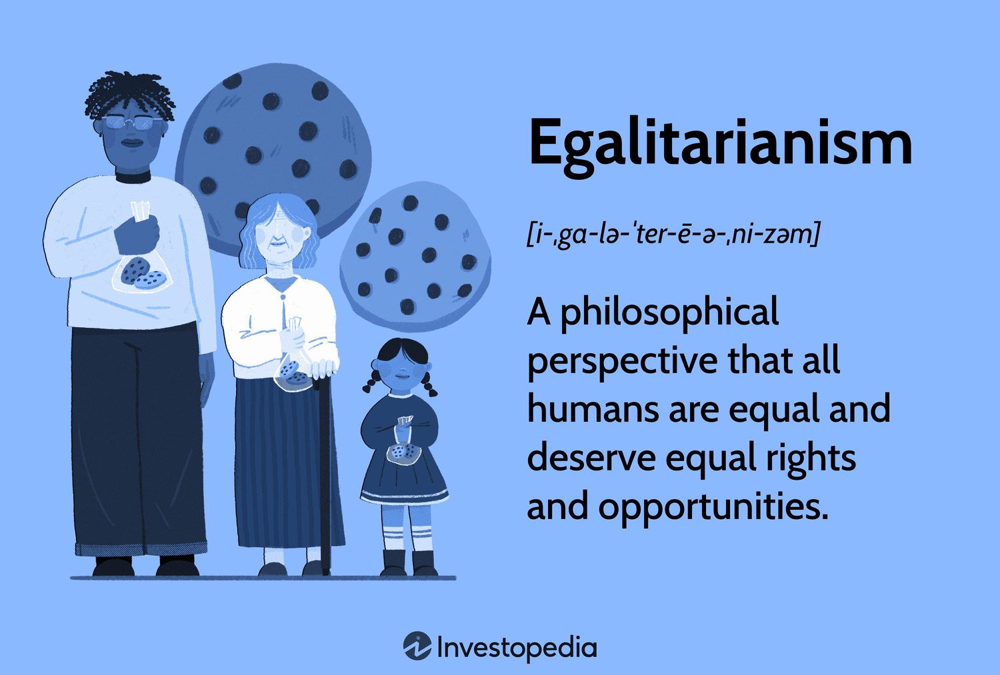

## Table of Contents

## What is egalitarianism?

Egalitarianism is the belief that everyone should be treated equally and have the same opportunities. It means that no one should be favored or discriminated against because of things like their race, gender, or how much money they have. People who believe in egalitarianism think that fairness is very important and that society should work to make sure everyone has a fair chance in life.

In practice, egalitarianism can show up in different ways. For example, it might mean supporting policies that help reduce the gap between rich and poor people, like providing free education or healthcare to everyone. Egalitarians also often support laws that protect people from being treated unfairly at work or in public places. The main idea is to create a world where everyone can live well and have the same chances to succeed, no matter who they are.

## How does egalitarianism differ from other political philosophies?

Egalitarianism is different from other political philosophies because it focuses on making sure everyone is treated the same and has the same opportunities. Other philosophies might care more about other things. For example, libertarianism is all about having as much freedom as possible, even if that means some people might end up with more than others. Egalitarians would say that fairness is more important than just having freedom.

Another philosophy that's different from egalitarianism is meritocracy. Meritocracy believes that people should be rewarded based on how hard they work or how talented they are. So, if someone works harder or is smarter, they should get more. Egalitarians might not like this because they think everyone should start with the same chances, no matter how hard they work or how talented they are. They believe that just giving everyone the same opportunities is more important than rewarding hard work or talent.

In short, while egalitarianism is about making sure everyone is equal and has the same opportunities, other philosophies like libertarianism and meritocracy focus on different things, like freedom or rewarding hard work and talent. Egalitarians think that fairness and equality should come first, even if it means some people might not get as much freedom or rewards as they would in other systems.

## What are the main types of egalitarianism?

There are mainly two types of egalitarianism: economic egalitarianism and social egalitarianism. Economic egalitarianism is about making sure that everyone has the same amount of money and resources. People who believe in this type of egalitarianism think that it's not fair for some people to have a lot more money than others. They support things like high taxes on rich people and giving money to poor people to make things more equal.

Social egalitarianism is about making sure that everyone is treated the same in society, no matter who they are. This means that no one should be looked down on or treated differently because of their race, gender, or where they come from. People who believe in social egalitarianism support laws and rules that stop people from being discriminated against. They want to make sure everyone has the same chances to go to school, get a job, and live a good life.

Both types of egalitarianism want to make the world a fairer place, but they focus on different things. Economic egalitarianism is all about money and resources, while social egalitarianism is about how people are treated in society. Together, they try to make sure everyone has an equal shot at a good life.

## What is economic egalitarianism and how is it implemented?

Economic egalitarianism is the idea that everyone should have the same amount of money and resources. People who believe in this think it's not fair for some people to be rich while others are poor. They want to make sure that everyone has enough money to live a good life and that no one has too much more than anyone else.

To make economic egalitarianism happen, governments can do things like taxing rich people more and using that money to help poor people. This can mean giving money directly to people who need it, or it can mean providing free services like healthcare and education to everyone. By doing these things, the government tries to make sure that everyone has the same chances and that the gap between rich and poor gets smaller.

## Can you explain the concept of political egalitarianism?

Political egalitarianism is the idea that everyone should have the same political power and rights. This means that no one should be left out of the political process because of who they are or where they come from. People who believe in political egalitarianism think that it's really important for everyone to have a say in how the country is run. They want to make sure that everyone can vote, run for office, and have their voices heard in government.

To make political egalitarianism happen, governments can do things like making sure everyone can vote easily, no matter if they are rich or poor, young or old. They can also work to stop any rules or practices that might keep some people from being involved in politics. By doing these things, governments try to make sure that everyone has an equal chance to take part in the political system and help decide what happens in their country.

## What is social egalitarianism and why is it important?

Social egalitarianism is the idea that everyone should be treated the same in society, no matter who they are. It means that no one should be looked down on or treated differently because of their race, gender, or where they come from. People who believe in social egalitarianism want to make sure that everyone has the same chances to go to school, get a job, and live a good life. They support laws and rules that stop people from being discriminated against.

Social egalitarianism is important because it helps make society fairer. When everyone is treated the same, it means that everyone has a chance to succeed and be happy. If some people are treated differently just because of who they are, it can make them feel left out and stop them from doing well. By making sure everyone is treated equally, social egalitarianism helps create a world where everyone can live well and have the same opportunities.

## How does legal egalitarianism work in practice?

Legal egalitarianism means that everyone should be treated the same under the law. This idea says that no one should get special treatment because of who they are. For example, everyone should have the same rights and protections, no matter their race, gender, or how much money they have. In practice, this means making laws that stop people from being treated unfairly. It also means making sure that everyone can use the legal system the same way, like being able to go to court if they need to.

To make legal egalitarianism work, governments can do things like passing laws against discrimination. They can also make sure that everyone can afford a lawyer if they need one, so that rich and poor people have the same chance in court. By doing these things, governments try to make the legal system fair for everyone. This helps make sure that everyone has the same rights and protections, which is important for a fair society.

## What are the criticisms of egalitarianism from various perspectives?

Some people who don't like egalitarianism think it's not fair to take money from rich people and give it to poor people. They believe that everyone should be able to keep what they earn, and that if someone works hard and does well, they should be able to keep their money. These people say that if the government takes too much money from rich people, it might make them not want to work as hard. They also think that giving money to poor people might make them not want to work, because they could just live off the money they get from the government.

Another criticism of egalitarianism comes from people who think that it's not right to treat everyone the same, because people are different. They believe that some people are smarter or work harder than others, and that they should be rewarded for that. These people might support a system where people who do better get more, instead of everyone getting the same. They think that trying to make everyone equal can stop people from trying their best, because they know they won't get anything extra for doing well.

Overall, critics of egalitarianism worry that trying to make everyone equal might hurt the economy and make people less motivated to work hard. They believe that letting people keep what they earn and rewarding hard work and talent is better for society.

## How do different cultures interpret and implement egalitarian principles?

Different cultures have their own ways of understanding and using egalitarian principles. In some places, like in Scandinavian countries such as Norway and Sweden, people really believe in economic egalitarianism. They have high taxes on rich people and use that money to give everyone free healthcare and education. They think it's important for everyone to have the same chances in life, no matter how much money their family has. This makes the gap between rich and poor smaller, and most people in these countries think this is a good thing.

In other places, like the United States, people might focus more on social egalitarianism. They have laws that say everyone should be treated the same, no matter their race or gender. But, they might not agree as much on economic egalitarianism. Some people in the U.S. think that if you work hard and do well, you should be able to keep most of your money. They worry that taking too much money from rich people to give to poor people could make people less motivated to work hard. So, while they want everyone to have the same rights, they might not want everyone to have the same amount of money.

In some traditional societies, like certain indigenous groups, egalitarianism can be seen in how they share resources. For example, in some Native American tribes, everyone in the community shares food and other things they need. They believe that helping each other and making sure everyone has enough is more important than anyone having more than others. This way of living shows a strong belief in both economic and social egalitarianism, where everyone is treated the same and everyone gets what they need.

## What are the historical origins of egalitarian thought?

Egalitarian thought has been around for a long time. It started with people who believed that everyone should be treated the same, no matter who they are. One of the earliest examples of this was in ancient Greece, where some philosophers like Plato and Aristotle talked about ideas of equality. They thought about how society should be fair and how everyone should have a chance to do well. Later, in the Enlightenment period in the 17th and 18th centuries, thinkers like John Locke and Jean-Jacques Rousseau wrote a lot about equality. They believed that all people are born equal and should have the same rights. These ideas helped shape many of the democratic and egalitarian movements we see today.

Over time, different groups and movements have taken up egalitarian ideas. In the 19th and 20th centuries, socialists and communists pushed for economic egalitarianism. They wanted to make sure everyone had the same amount of money and resources. At the same time, civil rights movements fought for social egalitarianism, wanting to make sure everyone was treated the same no matter their race or gender. These movements were influenced by the earlier ideas from philosophers and helped spread egalitarian thought around the world. Today, many countries and societies still work to make egalitarian ideas a reality, trying to create a world where everyone has the same chances and is treated fairly.

## How has the concept of egalitarianism evolved over time?

The idea of egalitarianism, which means treating everyone the same and giving everyone the same chances, has changed a lot over time. It started a long time ago with thinkers like Plato and Aristotle in ancient Greece. They talked about how society should be fair and everyone should have the same opportunities. Later, during the Enlightenment in the 17th and 18th centuries, people like John Locke and Jean-Jacques Rousseau wrote about how all people are born equal and should have the same rights. These early ideas helped shape the way people thought about equality and fairness.

As time went on, the idea of egalitarianism grew and changed. In the 19th and 20th centuries, groups like socialists and communists focused on economic egalitarianism. They wanted to make sure everyone had the same amount of money and resources, so they pushed for things like high taxes on rich people and free services for everyone. At the same time, civil rights movements worked on social egalitarianism, fighting to make sure everyone was treated the same no matter their race or gender. Today, many countries still try to make egalitarian ideas a reality by passing laws and creating programs that help make society more fair and equal for everyone.

## What are the current debates and future directions in egalitarian theory?

Right now, people are talking a lot about how to make sure everyone is treated the same and has the same chances. One big debate is about how much the government should do to help make things equal. Some people think the government should do a lot, like taxing rich people more and giving that money to poor people to make sure everyone has enough. Others worry that if the government does too much, it might make people not want to work hard because they know they'll get help no matter what. They think it's better to let people keep what they earn and reward those who work harder or are smarter.

Another debate is about how to balance equality with other important things, like freedom. Some people say that trying to make everyone equal can take away people's freedom to do what they want with their money and their lives. They believe that it's more important to let people be free, even if it means some people might end up with more than others. On the other hand, those who support egalitarianism argue that fairness is more important than just having freedom. They think that everyone should have the same chances and rights, and that the government should do what it can to make that happen.

Looking to the future, egalitarian theory might focus more on new ways to make society fair. This could mean using technology to help make sure everyone has the same opportunities, like providing online education to people in poor areas. It might also mean thinking about how to make sure everyone is treated the same in the workplace and in public life, no matter who they are. As the world changes, egalitarians will keep working to find new ways to make sure everyone has a fair shot at a good life.

## References & Further Reading

[1]: Rousseau, J. J. (1762). ["The Social Contract."](https://www.earlymoderntexts.com/assets/pdfs/rousseau1762.pdf) Penguin Classics.

[2]: Rawls, J. (1971). ["A Theory of Justice."](https://www.jstor.org/stable/j.ctvkjb25m) Harvard University Press.

[3]: Sen, A. (1999). ["Development as Freedom."](http://www.c3l.uni-oldenburg.de/cde/OMDE625/Sen/Sen-intro.pdf) Oxford University Press.

[4]: Piketty, T. (2014). ["Capital in the Twenty-First Century."](https://www.jstor.org/stable/j.ctt6wpqbc) Harvard University Press.

[5]: Nozick, R. (1974). ["Anarchy, State, and Utopia."](https://www.jstor.org/stable/656974) Basic Books.

[6]: Dahl, R. A. (2006). ["On Political Equality."](https://www.jstor.org/stable/j.ctt1npjxz) Yale University Press.

[7]: Butler, J. (2004). ["Undoing Gender."](https://www.taylorfrancis.com/books/mono/10.4324/9780203499627/undoing-gender-judith-butler) Routledge.