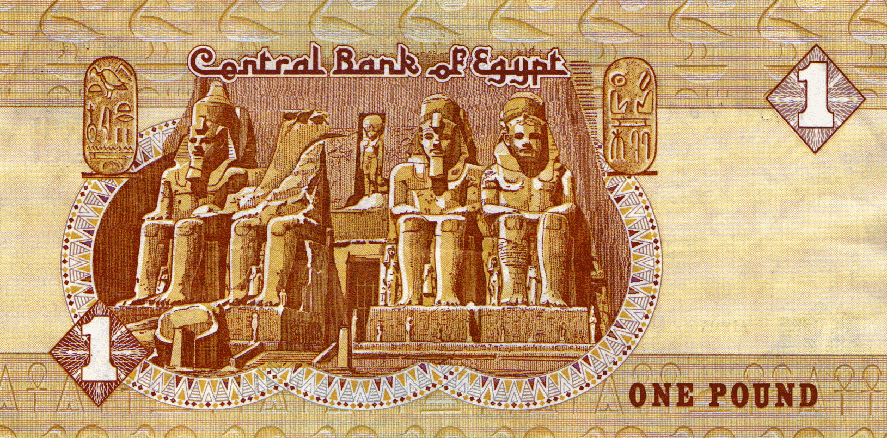

The Egyptian Pound (EGP) is the official currency of Egypt, serving as a foundational element of the nation's economic landscape. It holds significant importance not only domestically but also in the context of global financial markets. Understanding the dynamics of the EGP is crucial for investors and traders, particularly as Egypt's economy experiences rapid changes and growth. This currency's behavior can provide insights into the broader economic trends and challenges facing the country.

Recent years have witnessed substantial shifts in Egypt's economy, driven by factors such as economic reforms, changes in monetary policy, and external influences. The Egyptian government has undertaken measures to stabilize and strengthen the economy, impacting the EGP's performance. For investors, these shifts represent both opportunities and challenges, highlighting the need for a nuanced understanding of Egypt's economic trajectory and its currency.



Algorithmic trading, a key technological innovation, has introduced new dimensions to currency trading, including for the EGP. This form of trading leverages computer algorithms to execute trades at unprecedented speed and precision, capitalizing on small price discrepancies in the market. Algorithmic trading systems analyze vast amounts of data to identify trends and execute trades, potentially enhancing profitability for currency traders. It represents a significant evolution in trading strategies, offering novel approaches to navigating the complexities of global currency markets.

This article examines the environment of Egyptian Pound trading, focusing on the significance of algorithmic trading strategies and their implications for Egypt's financial system. By exploring these components, traders and investors can gain a clearer understanding of the opportunities and risks associated with the EGP, equipping them to make informed decisions in an ever-evolving economic landscape.

## Table of Contents

## Understanding the Egyptian Pound

The Egyptian Pound (EGP), recognized as the official currency of Egypt, has a long-standing historical significance dating back to its inception in 1834 when it succeeded the Egyptian piastre. Initially, the EGP was pegged to precious metals, a practice common in global currencies during the 19th century, which provided a stable foundation by linking it directly to the tangible values of gold and silver.

Throughout its history, the EGP has experienced multiple shifts in monetary policies that mirror Egypt's economic evolution. For a significant period, the EGP operated under a managed float system, allowing the currency to fluctuate within a set range against a basket of currencies. This system provided some degree of stability while enabling adjustments based on economic conditions.

In a significant policy shift in 2016, Egypt transitioned to a free-floating currency system. This move aimed to enhance the transparency and flexibility of the EGP, aligning it more closely with market-driven principles and addressing economic challenges such as inflation and foreign exchange shortages. The floatation was a pivotal response to ensure the currency's resilience and competitiveness on the global stage.

Despite periodic fluctuations against major currencies like the US Dollar, recent trends indicate a degree of resilience in the EGP. Factors contributing to this strength include Egypt's strategic economic reforms, diversification efforts, and partnerships that have boosted investor confidence. Moreover, the government's focus on structural reforms and fiscal consolidation has played a critical role in stabilizing the currency amidst external economic pressures.

In summary, the Egyptian Pound's trajectory reflects both historical precedence and modern economic strategies that collectively bolster its standing in international markets. As Egypt embraces further economic reforms, the EGP's performance is anticipated to continue benefiting from increased stability and resilience.

## The Role of Egypt's Economy in Currency Stability

Egypt's economy is significantly influenced by three major sectors: agriculture, petroleum, and tourism. These sectors not only contribute substantially to the Gross Domestic Product (GDP) but also play a vital role in the stability of the Egyptian Pound (EGP). Agriculture remains a cornerstone of Egypt's economy, employing a significant percentage of the workforce and contributing to both domestic food security and export revenues. The petroleum industry is another critical sector, with Egypt being a notable producer and exporter of oil and natural gas, which bolsters export earnings and foreign currency reserves. Meanwhile, tourism, though variable, is a substantial source of foreign exchange, providing significant employment and revenue, especially when political stability is perceived.

However, these economic foundations have been challenged by several factors. Inflation has been a persistent issue, driven by both domestic factors, such as increased demand and supply chain disruptions, and external influences, including oil price [volatility](/wiki/volatility-trading-strategies) and fluctuating global demand. The COVID-19 pandemic further exacerbated these challenges, leading to decreased tourism revenues and disruptions in both agricultural production and the petroleum supply chain.

Moreover, geopolitical conflicts in the Middle East have historically impacted Egypt's economy and, by extension, the EGP. Such conflicts can lead to instability in oil prices, variations in foreign investment, and shifts in tourism patterns, affecting overall economic stability. These factors collectively influence the strength and stability of the EGP, as fluctuations in core sectors translate into varying currency demand and supply dynamics.

Understanding these economic variables is crucial for comprehending the trading dynamics of the EGP. Traders and investors monitor these sectors closely, as changes in agricultural output, oil prices, or tourism flows can result in significant shifts in the EGP’s value. Consequently, these economic underpinnings are integral for predicting currency movements and strategizing in the EGP market.

## The Rise of Algorithmic Trading in Currency Markets

Algorithmic trading, a method that employs computer algorithms for executing trading processes, has significantly transformed currency markets by boosting efficiency and speed. This trading method analyzes market data, identifies trading opportunities, and executes trades faster than human traders. The efficiency of [algorithmic trading](/wiki/algorithmic-trading) is largely attributed to its ability to execute complex calculations in real-time and its capacity to process vast amounts of data swiftly, facilitating timely decision-making.

In currency markets, algorithmic trading enables operations across multiple exchanges simultaneously, exploiting market inefficiencies. These inefficiencies may arise from various factors such as differences in supply and demand, currency mispricings, or latency in information dissemination. By scanning multiple markets instantaneously, algorithmic systems can identify and act on [arbitrage](/wiki/arbitrage) opportunities—situations where a currency is priced differently on two separate exchanges. For instance, if the Egyptian Pound (EGP) is undervalued on one platform compared to another, an algorithm can execute buy orders on the cheaper exchange and sell orders on the pricier one, locking in a profit from the differential.

The progression in algorithmic models also accommodates more sophisticated trading strategies, such as high-frequency trading, which relies on rapid execution speeds and ultra-short investment horizons to exploit minute price movements. The ability of algorithms to operate at such high speeds offers a competitive edge in currency trading, where prices can fluctuate in fractions of a second.

Traders interested in the EGP are increasingly adopting algorithmic models to optimize their trading strategies. The Egyptian Pound, like other emerging market currencies, can exhibit higher volatility, presenting both risks and opportunities for traders. Algorithmic trading models are capable of mitigating some risks by automatically executing predefined strategies based on real-time data analysis, reducing the emotional and cognitive biases that often plague human traders.

Moreover, [machine learning](/wiki/machine-learning)—a subset of [artificial intelligence](/wiki/ai-artificial-intelligence)—is being integrated into algorithmic trading to enhance model accuracy and adaptability. Machine learning algorithms use historical data to learn and predict future price movements, making them invaluable in dynamic markets like foreign exchange. These systems can continuously improve by adapting to new patterns and trends in the market data, offering robust solutions to currency traders.

In summary, algorithmic trading has ushered in a new era of efficiency and opportunity in currency markets. By leveraging high-speed data processing and advanced modeling techniques, traders of the Egyptian Pound and other currencies can capitalize on market inefficiencies to optimize their investment strategies. As technology continues to evolve, the impact of algorithmic trading on currency markets, including the EGP, is poised to grow, offering traders continually evolving tools and methodologies.

## Trading the EGP: Strategies and Considerations

To trade the Egyptian Pound (EGP), enlisting the services of a [forex](/wiki/forex-system) broker is essential, as these brokers provide platforms specifically designed for currency [pair trading](/wiki/pair-trading). These platforms facilitate the execution of trades by offering access to real-time data, analytical tools, and the ability to trade directly on the forex market. Popular strategies for trading the EGP include [day trading](/wiki/day-trading-spy), swing trading, and position trading, each offering distinct risk and reward profiles.

Day trading involves buying and selling currency pairs within the same trading day, capitalizing on small price movements. Traders employing this strategy typically rely on technical analysis and use tools such as moving averages, candlestick patterns, and [volume](/wiki/volume-trading-strategy) indicators to make rapid decisions. This strategy requires constant monitoring of the market and quick reflexes to respond to market changes.

Swing trading, on the other hand, involves holding positions for several days to weeks, aiming to capture larger price movements or "swings." Traders using this strategy often rely on a combination of technical and [fundamental analysis](/wiki/fundamental-analysis) to identify potential trading opportunities. Technical indicators such as the Relative Strength Index (RSI) and Moving Average Convergence Divergence (MACD) are commonly used to assess market sentiment and trends.

Position trading is a longer-term strategy where positions are held for weeks, months, or even years. This approach requires a thorough analysis of economic indicators and geopolitical events that could affect the EGP's value. Traders utilizing this strategy often focus on macroeconomic trends, including interest rates, inflation, and employment figures, to inform their decisions.

Monitoring economic indicators and geopolitical news is crucial when trading the EGP, as these factors significantly influence currency valuations. For instance, changes in Egypt's [interest rate](/wiki/interest-rate-trading-strategies) policies, inflation rates, and trade balance can impact the EGP's strength. Additionally, geopolitical events, such as regional conflicts or changes in government policies, can cause sudden currency fluctuations. Therefore, traders must stay informed and adapt their strategies accordingly to navigate the dynamic forex market effectively.

## Algorithmic Trading Strategies for the Egyptian Pound

Algorithmic trading has emerged as a sophisticated approach in trading the Egyptian Pound (EGP), utilizing advanced strategies to leverage market opportunities. Among the popular strategies are mean reversion, [trend following](/wiki/trend-following), and arbitrage.

Mean reversion strategies are grounded in the statistical premise that currency prices, including those of the EGP, will revert to their long-term mean or average over time. Traders employing this strategy identify entry and [exit](/wiki/exit-strategy) points based on the deviation of the current price from its historical mean. For instance, if the EGP deviates significantly from its average price range, algorithms may initiate trades anticipating a return to the mean. Such strategies can be mathematically represented by:

$$
P_t = \mu + \epsilon_t
$$

where $P_t$ is the current price, $\mu$ is the mean price, and $\epsilon_t$ represents the price deviation, assumed to be normally distributed.

Trend following strategies, on the other hand, capitalize on the [momentum](/wiki/momentum) of the EGP price movements. Traders develop algorithms that detect and follow trends, initiating buy orders in a rising market and sell orders in a declining one. The strategy relies on technical indicators such as moving averages or the Moving Average Convergence Divergence (MACD). An example of a simple moving average crossover strategy can be coded as follows in Python:

```python
def generate_signals(prices, short_window=20, long_window=50):
    signals = pd.DataFrame(index=prices.index)
    signals['price'] = prices
    signals['short_mavg'] = prices.rolling(window=short_window, min_periods=1).mean()
    signals['long_mavg'] = prices.rolling(window=long_window, min_periods=1).mean()
    signals['signal'] = 0.0
    signals['signal'][short_window:] = np.where(signals['short_mavg'][short_window:] > signals['long_mavg'][short_window:], 1.0, 0.0) 
    signals['positions'] = signals['signal'].diff()
    return signals
```

Arbitrage strategies seek to exploit price discrepancies across different markets or exchanges where the EGP is traded. This involves buying the EGP at a lower price in one market and simultaneously selling it at a higher price in another, thus locking in a profit. For arbitrage to be effective, the execution must be swift, and transaction costs must be low.

Backtesting is an essential process in the development of these algorithmic strategies. It involves applying a trading strategy to historical data to assess its viability. Continuous optimization of algorithms ensures that they remain robust in varying market conditions. This iterative process may involve adjusting parameters to improve performance without overfitting to historical data.

Risk management is also critical when trading currencies algorithmically, including the EGP. This involves setting risk parameters, such as stop-loss levels, and adjusting trade sizes to manage potential drawdowns and losses.

By integrating these strategies effectively, traders can potentially enhance their profits while navigating the complexities of the foreign exchange market involving the Egyptian Pound. However, success is contingent upon a deep understanding of both the technical aspects of algorithmic trading and the macroeconomic factors influencing currency values.

## Future Prospects for EGP Trading and Algorithmic Strategies

As technology advances, the application of artificial intelligence (AI) and machine learning (ML) in currency trading is expected to increase. These technologies can enhance the precision of algorithmic trading by analyzing vast datasets more effectively than traditional methods. AI and ML can optimize trading algorithms, identify patterns, and predict market movements, thus offering a competitive edge in trading the Egyptian Pound (EGP). Machine learning models, for instance, can adapt to new market conditions dynamically, learning from historical data to improve accuracy in forecasting currency trends.

The use of AI in trading also facilitates the development of more sophisticated risk management techniques. For instance, machine learning algorithms can more accurately assess risk by analyzing factors such as market volatility and macroeconomic indicators. This enhanced capability allows traders to implement more effective hedging strategies and minimize potential losses.

The evolving regulatory landscape in Egypt is another significant [factor](/wiki/factor-investing) that will influence trading opportunities and strategies. Egypt's government has been progressively reforming financial regulations to attract foreign investment and increase market transparency. These reforms include modernizing trading infrastructure and legal frameworks, which could lead to increased participation in EGP trading. However, traders must stay informed about regulatory changes, as these can impact both the availability of trading products and the implementation of algorithmic strategies.

Understanding the growing connections between Egypt's economy and international currency markets is crucial for anticipating future trends. Egypt's economy is increasingly integrated with global markets, with the EGP influenced by international trade dynamics, foreign investment flows, and geopolitical factors. Currency traders must consider these elements when developing strategies to trade the EGP, as global events can have direct and indirect impacts on its value.

Moreover, the continued expansion of digital finance, including the development of Central Bank Digital Currencies (CBDCs), could reshape the forex market landscape. Egypt's interest in exploring digital currency options may introduce new trading instruments and platforms. Traders and investors should monitor these developments, as they can significantly impact trading strategies and market [liquidity](/wiki/liquidity-risk-premium).

In summary, the future of EGP trading is poised for transformation driven by advancements in AI and machine learning, an evolving regulatory environment, and the increasing global integration of Egypt's economy. Traders who leverage these trends will be better positioned to capitalize on emerging opportunities in the forex market.

## Conclusion

The Egyptian Pound (EGP) presents significant opportunities for traders, largely due to the transformative impact of algorithmic trading in the currency markets. As Egypt's economy undergoes expansion and its financial markets mature, the prominence of the EGP in global trading networks is set to grow. This evolution is driven by technological advancements that enable more sophisticated trading strategies, allowing for enhanced market efficiency and the potential for increased returns.

For traders looking to capitalize on EGP market opportunities, maintaining up-to-date knowledge and employing advanced trading strategies are essential. Algorithmic trading, leveraging models such as mean reversion and trend following, provides a framework to exploit these opportunities by efficiently analyzing market data and executing trades with precision.

Moreover, the integration of artificial intelligence and machine learning techniques into algorithmic trading is likely to further optimize performance. These technologies can improve predictive accuracy, allowing traders to better anticipate market shifts and act accordingly. In this dynamic environment, risk management becomes paramount, ensuring that traders can navigate market volatilities without incurring substantial losses.

As Egypt continues to solidify its economic foundations and integrate further with international markets, the strategic positioning within the EGP trading sphere will be increasingly crucial. By staying informed and adeptly utilizing cutting-edge technologies, traders can effectively harness the potential of the EGP, reinforcing its role as a compelling element within the global currency landscape.

## References & Further Reading

[1]: Bergstra, J., Bardenet, R., Bengio, Y., & Kégl, B. (2011). ["Algorithms for Hyper-Parameter Optimization."](https://dl.acm.org/doi/10.5555/2986459.2986743) Advances in Neural Information Processing Systems 24.

[2]: ["Advances in Financial Machine Learning"](https://www.amazon.com/Advances-Financial-Machine-Learning-Marcos/dp/1119482089) by Marcos Lopez de Prado

[3]: ["Evidence-Based Technical Analysis: Applying the Scientific Method and Statistical Inference to Trading Signals"](https://www.amazon.com/Evidence-Based-Technical-Analysis-Scientific-Statistical/dp/0470008741) by David Aronson

[4]: ["Machine Learning for Algorithmic Trading"](https://github.com/stefan-jansen/machine-learning-for-trading) by Stefan Jansen

[5]: ["Quantitative Trading: How to Build Your Own Algorithmic Trading Business"](https://www.amazon.com/Quantitative-Trading-Build-Algorithmic-Business/dp/1119800064) by Ernest P. Chan