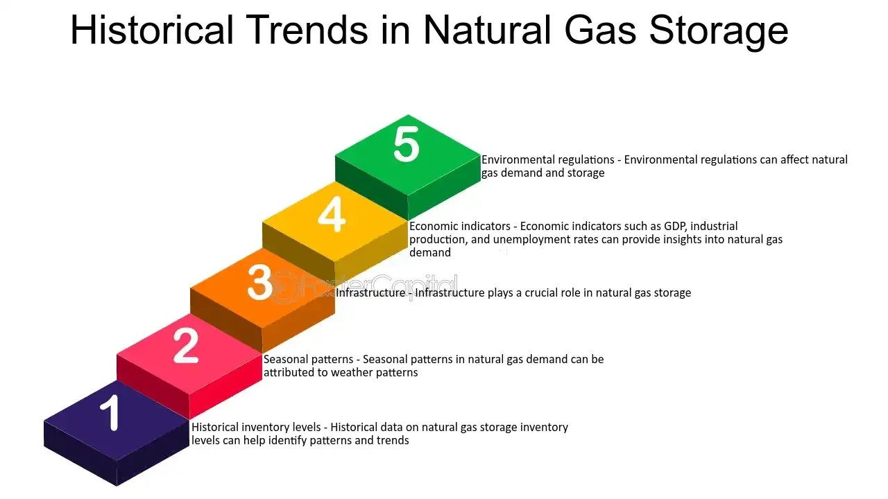

## Table of Contents

## What is the EIA Natural Gas Storage Indicator?

The EIA Natural Gas Storage Indicator is a report released weekly by the U.S. Energy Information Administration (EIA). It tells us how much natural gas is stored in underground facilities across the United States. This report is important because it helps people in the energy industry understand if there is more or less natural gas available than expected. The report comes out every Thursday at 10:30 AM Eastern Time.

The information in the EIA Natural Gas Storage Indicator can affect the price of natural gas. If the report shows that there is more natural gas stored than people thought, the price might go down because there is more supply. On the other hand, if the report shows less natural gas stored than expected, the price might go up because there is less supply. Traders, investors, and energy companies all watch this report closely to make decisions about buying and selling natural gas.

## How often is the EIA Natural Gas Storage report released?

The EIA Natural Gas Storage report comes out every week. It is released by the U.S. Energy Information Administration, or EIA for short. You can find the report every Thursday at 10:30 AM Eastern Time.

This report is important because it tells us how much natural gas is stored underground in the United States. People in the energy industry use this information to understand if there is more or less natural gas available than they expected. This can affect the price of natural gas, so many people pay close attention to the report.

## What information does the EIA Natural Gas Storage report provide?

The EIA Natural Gas Storage report tells us how much natural gas is stored in underground places in the United States. It comes out every Thursday at 10:30 AM Eastern Time. This report is important because it shows if there is more or less natural gas stored than people expected. The report includes numbers for the current week, the week before, and the same week from the year before. This helps us see how storage levels are changing over time.

People in the energy industry, like traders and companies, watch this report closely. They use it to make decisions about buying and selling natural gas. If the report shows more natural gas stored than expected, the price might go down because there is more supply. If it shows less natural gas stored than expected, the price might go up because there is less supply. So, this report can affect how much people pay for natural gas.

## How is natural gas storage data collected and reported by the EIA?

The EIA collects natural gas storage data by asking companies that store natural gas in underground places to report their numbers. These companies send their data to the EIA every week. The EIA then checks the data to make sure it's correct and adds it all up to find out the total amount of natural gas stored in the United States.

Once the EIA has all the data, they put it into a report called the Weekly Natural Gas Storage Report. This report comes out every Thursday at 10:30 AM Eastern Time. The report shows how much natural gas is stored now, how much was stored the week before, and how much was stored the same week last year. This helps everyone see if the amount of natural gas in storage is going up or down over time.

## What are the different types of natural gas storage facilities mentioned in the EIA report?

The EIA report talks about three main types of natural gas storage facilities: depleted gas reservoirs, aquifers, and salt caverns. Depleted gas reservoirs are old natural gas fields that are no longer used for production. They are good for storing natural gas because they already have the underground space and the right kind of rock to hold the gas. Aquifers are underground layers of water-bearing rock. They can be used to store natural gas, but they need more work to get ready because they aren't naturally set up for gas storage like depleted reservoirs.

Salt caverns are another type of storage facility. They are made by dissolving salt deposits underground with water to create big caverns. Salt caverns are very useful because they can quickly release the natural gas when it's needed. Each type of storage facility has its own advantages and is used based on how fast the gas needs to be put in or taken out, and how much gas needs to be stored. The EIA report includes data from all these types of storage facilities to give a complete picture of natural gas storage in the United States.

## How does the EIA Natural Gas Storage report influence natural gas prices?

The EIA Natural Gas Storage report can change the price of natural gas because it tells everyone how much natural gas is stored underground in the United States. If the report shows more natural gas stored than people expected, it means there is a bigger supply of natural gas. When there is more supply, the price of natural gas usually goes down. This is because more people can buy the gas, so sellers might lower their prices to sell it all.

On the other hand, if the report shows less natural gas stored than expected, it means there is less supply. When there is less supply, the price of natural gas usually goes up. This happens because more people want to buy the gas than there is available, so sellers can charge more. Traders, investors, and energy companies watch the EIA report closely to make decisions about buying and selling natural gas based on these changes in supply and demand.

## Can you explain the significance of the 'working gas' in the EIA report?

The 'working gas' in the EIA report is really important. It's the amount of natural gas that can be taken out of storage and used by people and businesses. Think of it like the gas that's ready to go when you need it. The EIA report tells us how much working gas is in storage, which helps everyone know if there's enough gas to meet the demand.

Changes in the amount of working gas can affect the price of natural gas. If the report shows there's more working gas than expected, it means there's a lot of gas available, so prices might go down. But if there's less working gas than people thought, it means there might not be enough to go around, so prices could go up. That's why everyone in the energy industry pays close attention to the working gas numbers in the EIA report.

## What historical trends can be observed from the EIA Natural Gas Storage data?

Looking at the EIA Natural Gas Storage data over time, we can see some clear patterns. One big trend is that natural gas storage levels usually go up in the summer and down in the winter. This happens because people use less gas for heating in the summer, so companies store more gas then. When winter comes, people use more gas to keep their homes warm, so the storage levels drop. Another trend is that over the years, the total amount of working gas in storage has been growing. This is because the demand for natural gas has been increasing, and more storage facilities have been built to keep up with that demand.

Another interesting thing to notice from the historical data is how natural gas storage can be affected by big events or changes in the economy. For example, during really cold winters, the storage levels might drop a lot more than usual because everyone is using more gas to stay warm. Also, if there's a big change in the price of natural gas, it can affect how much gas companies decide to store. If prices are low, they might store more gas to sell later when prices go up. If prices are high, they might not store as much because it's expensive. By looking at these trends, we can better understand how natural gas storage works and what might happen in the future.

## How do market analysts use the EIA Natural Gas Storage report to make predictions?

Market analysts use the EIA Natural Gas Storage report to make predictions about the future price of natural gas. They look at how much natural gas is stored compared to what people expected. If the report shows more gas stored than expected, analysts might predict that prices will go down because there's more supply. On the other hand, if there's less gas stored than expected, they might predict that prices will go up because there's less supply. They also compare the current storage levels to past years to see if there are any big differences that might affect the market.

Analysts also pay attention to trends in the EIA report. They look at how storage levels change over time, especially from summer to winter. If storage levels are higher than usual in the summer, they might predict that prices will stay low or even drop more in the future. If storage levels are lower than usual going into winter, they might predict higher prices because people will need more gas for heating. By looking at these trends and comparing them to other factors like weather forecasts and economic conditions, analysts can make more accurate predictions about where natural gas prices might be headed.

## What are some of the challenges faced in accurately forecasting natural gas storage levels?

Forecasting natural gas storage levels can be tricky because many things can change quickly. One big challenge is the weather. If it's suddenly very cold, people use more gas to heat their homes, so storage levels might drop faster than expected. On the other hand, if it's warmer than usual, people might not use as much gas, and storage levels could stay high. Weather forecasts can help, but they're not always right, which makes it hard to predict exactly how much gas will be used.

Another challenge is the economy. If the economy is doing well, factories and businesses might use more natural gas, which can affect storage levels. But if the economy slows down, they might use less. Also, the price of natural gas can change how much companies decide to store. If prices are low, companies might store more gas to sell later when prices go up. If prices are high, they might store less because it's expensive. All these factors make it hard to guess what the storage levels will be in the future.

Lastly, unexpected events can throw off predictions. For example, if there's a problem with a storage facility or a pipeline, it can change how much gas is stored or moved around. Also, changes in laws or government policies about energy can affect how much gas is stored. All these things together make it really tough for analysts to predict natural gas storage levels accurately.

## How has the methodology of the EIA Natural Gas Storage report evolved over time?

The EIA Natural Gas Storage report has changed a bit over the years to make it better and more accurate. At first, the EIA just asked companies to report how much gas they had stored. But they found out that not all companies were reporting their numbers the same way. So, the EIA started to work more closely with these companies to make sure everyone was using the same rules when they sent in their data. This helped make the numbers more reliable and easier to understand.

Another big change was how the EIA started to include more details in the report. They added information about different types of storage places, like depleted gas reservoirs, aquifers, and salt caverns. This gave people a better idea of where the gas was being stored and how it was being used. The EIA also started to release the report at a set time every week, which helped everyone in the energy industry plan better. These changes made the report more useful for people trying to understand and predict natural gas storage levels.

## What are the implications of the EIA Natural Gas Storage data for long-term energy policy and planning?

The EIA Natural Gas Storage data is really important for people who make long-term energy plans and policies. It helps them see how much natural gas we have stored and how it changes over time. This information is key for deciding if we need to build more storage places or find other ways to make sure we have enough gas for the future. If the data shows that storage levels are always low in the winter, for example, policy makers might decide to encourage more storage or look for other energy sources to use during those times.

Also, the EIA data can show trends that help plan for the future. If the data shows that we're using more and more natural gas each year, policy makers might need to think about how to meet that growing demand. They might make rules to help build more pipelines or storage facilities, or they might push for using other kinds of energy to take some of the pressure off natural gas. By looking at the EIA Natural Gas Storage data over many years, people can make smarter choices about how to keep our energy supply stable and reliable in the long run.

## References & Further Reading

[1]: U.S. Energy Information Administration (EIA). ["Natural Gas Storage Report."](https://ir.eia.gov/ngs/ngs.html)

[2]: International Energy Agency (IEA). ["Natural Gas Information."](https://www.iea.org/data-and-statistics/data-product/natural-gas-information)

[3]: Hasbrouck, J. (2007). ["Empirical Market Microstructure: The Institutions, Economics, and Econometrics of Securities Trading."](https://archive.org/details/empiricalmarketm0000hasb)

[4]: Aldridge, I. (2013). ["High-Frequency Trading: A Practical Guide to Algorithmic Strategies and Trading Systems."](https://www.amazon.com/High-Frequency-Trading-Practical-Algorithmic-Strategies/dp/1118343506)

[5]: Harris, L. (2003). ["Trading and Exchanges: Market Microstructure for Practitioners."](https://www.amazon.com/Trading-Exchanges-Market-Microstructure-Practitioners/dp/0195144708)

[6]: U.S. Energy Information Administration (EIA). ["Annual Energy Outlook."](https://www.eia.gov/outlooks/aeo/)

[7]: Lopez de Prado, M. (2018). ["Advances in Financial Machine Learning."](https://www.amazon.com/Advances-Financial-Machine-Learning-Marcos/dp/1119482089)

[8]: Tsay, R. S. (2010). ["Analysis of Financial Time Series."](https://onlinelibrary.wiley.com/doi/book/10.1002/9780470644560)