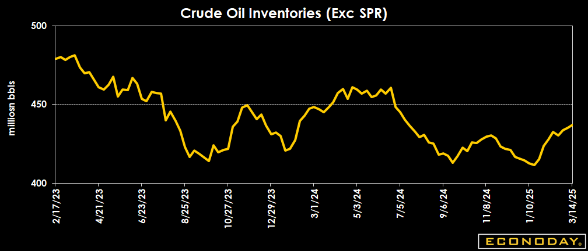

## Table of Contents

## What is the EIA Petroleum Status Report?

The EIA Petroleum Status Report is a weekly report published by the U.S. Energy Information Administration (EIA). It gives important information about the supply and demand of petroleum products in the United States. The report includes data on the levels of crude oil, gasoline, and distillate fuel stocks, as well as refinery usage and production rates. This information is crucial for people who work in the energy industry, like traders and analysts, because it helps them understand the current state of the market and make smart decisions.

The report comes out every Wednesday at 10:30 AM Eastern Time. It covers the data from the previous week, ending on the Friday before the report is released. Many people in the energy industry watch this report closely because the numbers can cause big changes in oil and gasoline prices. For example, if the report shows that there is less crude oil in storage than expected, oil prices might go up because people think there might not be enough oil to meet demand. On the other hand, if the report shows more oil in storage than expected, prices might go down because people think there is plenty of oil available.

## Who publishes the EIA Petroleum Status Report?

The EIA Petroleum Status Report is published by the U.S. Energy Information Administration (EIA). The EIA is part of the U.S. Department of Energy and is responsible for collecting, analyzing, and sharing energy data.

The report comes out every week on Wednesday at 10:30 AM Eastern Time. It gives information about how much [crude oil](/wiki/crude-oil), gasoline, and other fuel products are stored in the United States. This helps people in the energy industry understand the market and make decisions.

## How often is the EIA Petroleum Status Report released?

The EIA Petroleum Status Report comes out every week. It is released by the U.S. Energy Information Administration (EIA), which is part of the U.S. Department of Energy. The report is published every Wednesday at 10:30 AM Eastern Time.

The report gives information about the amount of crude oil, gasoline, and other fuel products stored in the United States. It covers the data from the week ending on the Friday before the report is released. People in the energy industry use this report to understand the market and make decisions about buying and selling oil and other fuels.

## What types of petroleum products are covered in the report?

The EIA Petroleum Status Report covers different types of petroleum products. It mainly talks about crude oil, which is the oil that comes straight from the ground. The report also includes information about gasoline, which is what we use in our cars. Another important product it covers is distillate fuel, which includes things like diesel fuel and heating oil.

These products are important because they help us understand how much oil and fuel we have in the United States. The report tells us about the levels of these products in storage, how much is being used in refineries, and how much is being produced. This information is useful for people who work in the energy industry because it helps them see if there is enough oil and fuel to meet our needs.

## How does the report impact oil and gas markets?

The EIA Petroleum Status Report has a big impact on oil and gas markets because it tells everyone how much oil and fuel we have in the United States. When the report shows that there is less oil or fuel in storage than people expected, it can make prices go up. This happens because people start to worry that there might not be enough oil to meet everyone's needs. On the other hand, if the report shows more oil or fuel in storage than expected, prices might go down. People feel more relaxed because they think there is plenty of oil available.

Traders and analysts in the energy industry watch this report closely every week. They use the information to make decisions about buying and selling oil and fuel. If the report shows a big change in the amount of oil or fuel, it can cause a lot of excitement in the market. This can lead to quick changes in prices as everyone tries to react to the new information. So, the EIA Petroleum Status Report is really important for understanding and predicting what will happen in the oil and gas markets.

## What are the key data points included in the EIA Petroleum Status Report?

The EIA Petroleum Status Report includes several key data points that help people understand the supply and demand of petroleum products in the United States. One of the main pieces of information is the level of crude oil in storage. This tells us how much oil is available. The report also includes data on the amount of gasoline in storage, which is important because it's what we use in our cars. Another key data point is the level of distillate fuel, like diesel and heating oil, which is used for different purposes.

In addition to storage levels, the report also covers refinery usage and production rates. This tells us how much oil is being turned into useful products like gasoline and diesel. The report also gives information about how much of these products are being made each week. All of these data points together help people in the energy industry see if there is enough oil and fuel to meet everyone's needs. They use this information to make decisions about buying and selling oil and fuel products.

## How can one access the EIA Petroleum Status Report?

You can access the EIA Petroleum Status Report on the U.S. Energy Information Administration's (EIA) website. Just go to their website and look for the section called "Petroleum & Other Liquids." There, you will find the weekly report, which is released every Wednesday at 10:30 AM Eastern Time. You can read the report online or download it as a PDF file to keep for later.

The report is free for anyone to use. It gives important information about the amount of crude oil, gasoline, and other fuels stored in the United States. This helps people understand how much oil and fuel we have and if there is enough to meet our needs. If you want to stay updated on the latest data, you can also sign up for email alerts on the EIA website to get notified when a new report is released.

## What is the significance of the inventory levels reported in the EIA Petroleum Status Report?

The inventory levels reported in the EIA Petroleum Status Report are really important because they tell us how much crude oil, gasoline, and other fuels are stored in the United States. When the report shows that there is less oil or fuel in storage than people expected, it can make prices go up. This happens because people start to worry that there might not be enough oil to meet everyone's needs. On the other hand, if the report shows more oil or fuel in storage than expected, prices might go down. People feel more relaxed because they think there is plenty of oil available.

These inventory levels help traders and analysts in the energy industry make smart decisions about buying and selling oil and fuel. If the report shows a big change in the amount of oil or fuel, it can cause a lot of excitement in the market. This can lead to quick changes in prices as everyone tries to react to the new information. So, the inventory levels in the EIA Petroleum Status Report are a big deal for understanding and predicting what will happen in the oil and gas markets.

## How do analysts interpret changes in the EIA Petroleum Status Report data?

Analysts look at the EIA Petroleum Status Report to understand what's happening in the oil and gas markets. When they see that the inventory levels of crude oil, gasoline, or other fuels are lower than expected, they might think that there's not enough supply to meet demand. This can make them predict that prices will go up because people will be willing to pay more for the limited amount of oil or fuel available. On the other hand, if the inventory levels are higher than expected, analysts might think there's too much supply. This can lead them to predict that prices will go down because there's plenty of oil or fuel to go around.

Changes in refinery usage and production rates also give analysts important clues. If refineries are working more and producing more gasoline or diesel, it might mean that demand for these products is going up. This could push prices higher. But if refineries are working less and producing less, it might mean that demand is going down, which could lead to lower prices. By looking at all these pieces of information together, analysts can get a good picture of the market and make smart guesses about where prices might be headed next.

## What are the common criticisms or limitations of the EIA Petroleum Status Report?

Some people say that the EIA Petroleum Status Report can be hard to understand because it has a lot of numbers and details. They think it might be too complicated for someone who is not an expert in the energy industry. Another criticism is that the report only gives information about what happened in the past week. It does not tell us what will happen in the future, so it can be hard to use it to make predictions about what prices will do next. 

Also, the report sometimes has to change its numbers if it finds out that the first numbers were not correct. This can make people unsure about how accurate the report is. Another limitation is that the EIA Petroleum Status Report only talks about the United States. It does not give information about what is happening with oil and fuel in other countries. This means it might not give a full picture of the global oil market.

## How does the EIA Petroleum Status Report compare to other energy reports?

The EIA Petroleum Status Report is different from other energy reports because it focuses only on the United States and comes out every week. Other reports, like the International Energy Agency's (IEA) Oil Market Report, look at the global oil market and are released monthly. The EIA report gives detailed numbers about how much oil, gasoline, and other fuels are stored in the U.S., while the IEA report talks about what's happening with oil around the world. This makes the EIA report really useful for people who need to know what's going on in the U.S. market quickly, but it might not be as helpful for understanding the bigger picture of the global oil market.

Another report that people often compare to the EIA Petroleum Status Report is the American Petroleum Institute's (API) Weekly Statistical Bulletin. The API report also comes out every week, but it is released a day earlier than the EIA report. The API report is based on data from oil companies, while the EIA report uses data from the government. Sometimes, the numbers in these two reports are different, which can cause confusion. But both reports are important for people in the energy industry because they help them understand what's happening with oil and fuel supplies in the United States.

## What advanced statistical methods can be used to analyze the data from the EIA Petroleum Status Report?

Advanced statistical methods can help us understand the data from the EIA Petroleum Status Report better. One way is to use time series analysis, which looks at how inventory levels, refinery usage, and production rates change over time. By using this method, we can find patterns and trends in the data. For example, we can see if there are certain times of the year when oil and fuel levels go up or down. We can also use forecasting models with time series analysis to predict what might happen next week or next month based on past data.

Another useful method is regression analysis, which helps us see how different factors affect oil and fuel prices. For example, we can look at how changes in inventory levels or refinery usage might lead to changes in prices. By using regression analysis, we can figure out which factors are most important for predicting prices. This can help traders and analysts make better decisions about buying and selling oil and fuel. Additionally, [machine learning](/wiki/machine-learning) techniques, like neural networks, can be used to find complex patterns in the data that might be hard to see with simpler methods. These techniques can help us understand the data even better and make more accurate predictions.

## References & Further Reading

[1]: ["EIA Weekly Petroleum Status Report"](https://www.eia.gov/petroleum/supply/weekly/) - U.S. Energy Information Administration

[2]: Ullrich, C. (2009). ["The Role of Algorithmic Trading in Stock Exchanges"](https://openresearch-repository.anu.edu.au/bitstreams/161dc25b-ff18-4b2c-8d44-879151c231d5/download) - Social Science Research Network

[3]: Lopez de Prado, M. (2018). ["Advances in Financial Machine Learning"](https://www.amazon.com/Advances-Financial-Machine-Learning-Marcos/dp/1119482089) - Wiley

[4]: Aronson, D. R. (2006). ["Evidence-Based Technical Analysis: Applying the Scientific Method and Statistical Inference to Trading Signals"](https://www.amazon.com/Evidence-Based-Technical-Analysis-Scientific-Statistical/dp/0470008741) - John Wiley & Sons

[5]: Chan, E. P. (2008). ["Quantitative Trading: How to Build Your Own Algorithmic Trading Business"](https://github.com/ftvision/quant_trading_echan_book) - John Wiley & Sons

[6]: ["API Weekly Statistical Bulletin"](https://www.api.org/products-and-services/statistics/api-weekly-statistical-bulletin/) - American Petroleum Institute