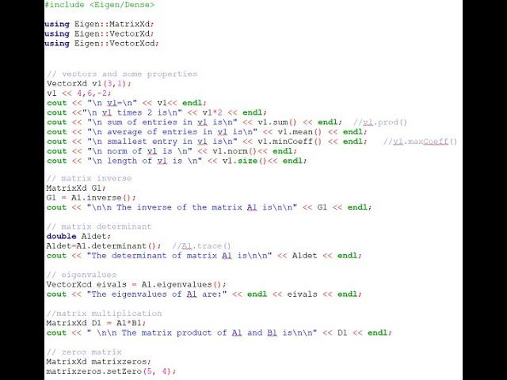

## Table of Contents

## What is the Eigen library and why is it used in C++?

Eigen is a high-level C++ library that is used for linear algebra, matrix and vector operations. It is designed to be fast, reliable, and easy to use. People use Eigen in C++ because it helps them do math operations on computers more easily, without having to write a lot of complicated code themselves.

Eigen is popular in many fields like robotics, computer graphics, and scientific computing. It can handle big calculations quickly and works well with other C++ libraries. This makes it a good choice for developers who need to perform complex math in their programs.

## How do you install the Eigen library?

To install the Eigen library, you first need to download it from its official website. Go to the Eigen website and find the download section. You can choose to download the latest stable version or a specific version that you need. Once you download the file, it will be a compressed folder. Unzip this folder to a location on your computer where you want to keep the Eigen library.

After unzipping the folder, you need to tell your C++ project where to find Eigen. This is called setting up the include path. In your C++ project, you need to add the path to the Eigen folder that you unzipped. This tells your project to look in that folder for the Eigen files when you use them in your code. Once you've set up the include path, you can start using Eigen in your C++ programs by including the necessary headers at the top of your code files.

## What are the basic data types and structures in Eigen?

In Eigen, the basic data types are matrices and vectors. A matrix is like a table of numbers arranged in rows and columns. You can think of it as a grid where you can store and do math with numbers. A vector is a special type of matrix that has only one row or one column. It's like a list of numbers that you can use in calculations. Eigen makes it easy to create and work with matrices and vectors of different sizes.

Eigen also has other useful structures. One of them is the `Array` class, which is similar to a matrix but has different ways to do calculations. Arrays are handy when you need to do math operations on each element individually. Another important structure is the `Quaternion` class, which is used to represent rotations in 3D space. This is useful in areas like robotics and computer graphics where you need to move and rotate objects. Eigen's structures help make complex math easier to handle in your programs.

## How do you perform basic matrix operations using Eigen?

In Eigen, you can do basic matrix operations like adding, subtracting, multiplying, and finding the inverse of matrices. To add or subtract matrices, you just use the `+` and `-` symbols between two matrices. For example, if you have two matrices `A` and `B`, you can add them with `A + B` and subtract with `A - B`. The matrices must be the same size for this to work. To multiply matrices, you use the `*` symbol. If you have matrices `A` and `B`, you can multiply them with `A * B`. The number of columns in `A` must match the number of rows in `B` for the multiplication to be possible.

Finding the inverse of a matrix is also easy in Eigen. If you have a square matrix `A`, you can get its inverse with `A.inverse()`. This works if the matrix is invertible, meaning it's not singular. To find the transpose of a matrix, which flips the rows and columns, you use `A.transpose()`. These operations help you solve equations and do other math tasks in your programs. Eigen's simple syntax makes these operations straightforward to use, even if you're not a math expert.

## What are the differences between dynamic and fixed-size matrices in Eigen?

In Eigen, you can use dynamic-size matrices or fixed-size matrices. Dynamic-size matrices are flexible because you can change their size while your program is running. You create them by giving a variable for the number of rows and columns, like `MatrixXd A(rows, cols)`. This is good when you don't know the size of your matrix ahead of time or if it might change. However, dynamic-size matrices can be slower and use more memory because the computer needs to keep track of the size and possibly move data around.

Fixed-size matrices, on the other hand, have a size that you set when you create them, and it can't change. You make them by giving specific numbers for rows and columns, like `Matrix3d A`. This means you need to know the size before you start your program. Fixed-size matrices are faster and use less memory because the computer knows exactly how much space to use and doesn't need to adjust it. They're good when you're sure the size of your matrix won't change, like in many math problems where the size is always the same.

Choosing between dynamic and fixed-size matrices depends on what you need in your program. If you need flexibility and don't mind a bit more memory use and slower performance, go with dynamic-size. If you want speed and less memory use and know the size won't change, fixed-size is better. Both types help you do math in your programs, but they work a bit differently.

## How can you optimize performance when using Eigen?

To make your program run faster when using Eigen, you can use fixed-size matrices instead of dynamic-size ones. Fixed-size matrices are quicker because the computer knows exactly how much space they need, so it doesn't have to keep track of the size or move data around. Also, try to use the right data type for your numbers. If you're working with small numbers, use `float` instead of `double` because `float` uses less memory and can make calculations faster.

Another way to boost performance is by using Eigen's special math operations. Eigen has built-in functions like `noalias()` that can speed up matrix multiplication by avoiding extra copies of data. You can also use `Eigen::Matrix` instead of `std::vector` for better performance in math operations. Remember to compile your code with optimization turned on, like using the `-O3` flag in GCC, to help the computer run your program as fast as possible.

## What advanced features does Eigen offer for linear algebra?

Eigen has many advanced features that help with linear algebra. One of these is the ability to find eigenvalues and eigenvectors. Eigenvalues and eigenvectors are important in understanding how a matrix stretches or rotates space. Eigen makes it easy to find them with functions like `eigenvalues()` and `eigenvectors()`. This is useful in areas like physics and engineering where you need to know how systems behave over time. Eigen also supports solving linear systems of equations. You can use functions like `solve()` to find the solution to equations like Ax = b, where A is a matrix and x and b are vectors. This is handy in many fields where you need to solve complex math problems.

Another advanced feature is the ability to do decompositions. Decompositions break down a matrix into simpler parts, which can make it easier to work with. Eigen supports different types of decompositions like LU, Cholesky, QR, and SVD. Each type is good for different kinds of problems. For example, the Cholesky decomposition is great for symmetric positive-definite matrices, which are common in optimization problems. Eigen also has tools for geometry, like the `Transform` class, which helps you move and rotate objects in 3D space. This is useful in robotics and computer graphics where you need to simulate how objects move. These advanced features make Eigen a powerful tool for anyone working with linear algebra in their programs.

## How do you handle sparse matrices in Eigen?

In Eigen, you can work with sparse matrices, which are matrices where most of the numbers are zero. This is helpful when you want to save memory and make calculations faster. To use a sparse matrix, you create it with `SparseMatrix` instead of `Matrix`. You can set the size of the sparse matrix and add values to it using the `insert()` or `coeffRef()` functions. Eigen stores only the non-zero numbers, so it uses less memory than a regular matrix.

Eigen has special ways to do math with sparse matrices. You can add, subtract, and multiply them just like regular matrices, but Eigen uses smart methods to make these operations quick. There are also functions like `solve()` that can solve equations with sparse matrices. This is useful in many areas like engineering and science where you need to solve big math problems without using too much memory or time.

## What are Eigen's capabilities for geometric transformations?

Eigen has special tools for working with shapes and movements in 3D space, which is called geometric transformations. You can use the `Transform` class to move, rotate, and scale objects. This class helps you do things like moving a robot arm or spinning a 3D model in a video game. It makes these movements easy to handle because it keeps track of where the object is and how it's moving. You can also use `Quaternion` to represent rotations, which is good for smooth and accurate turning of objects in 3D.

Another useful part of Eigen for geometric transformations is the `AngleAxis` class. This class lets you rotate an object around a specific point by a certain angle. It's like turning a toy around a stick, where the stick is the axis and the angle is how much you turn it. Eigen also has tools like `Scaling` and `Translation` to make objects bigger or smaller and move them from one place to another. These tools together help you control how objects move and change in 3D space, making it easier to work on projects like robotics, computer graphics, and virtual reality.

## How does Eigen integrate with other C++ libraries and frameworks?

Eigen works well with other C++ libraries and frameworks. It's easy to use Eigen with popular libraries like Boost, which is good for things like threading and file systems. You can also use Eigen with Qt, which is great for making graphical user interfaces. Eigen's simple design makes it easy to add to your projects without causing problems with other libraries. This means you can use Eigen's math power in many different kinds of programs, from games to scientific research.

Another way Eigen integrates with other tools is through its compatibility with C++ standard libraries. For example, you can use Eigen with the Standard Template Library (STL) to work with containers like vectors and maps. This makes it easy to move data between Eigen and other parts of your program. Eigen also works well with frameworks like ROS (Robot Operating System), which is used a lot in robotics. By using Eigen with these other tools, you can build powerful applications that need to do a lot of math quickly and accurately.

## What are some common pitfalls and how can they be avoided when using Eigen?

When using Eigen, one common pitfall is not setting the right size for your matrices and vectors. If you use dynamic-size matrices, you need to remember to set their size before using them, or you might get errors. To avoid this, always make sure to set the size of your matrices and vectors with `resize()` or `setZero()` before doing calculations. Another mistake people make is mixing different types of matrices, like trying to add a fixed-size matrix to a dynamic-size one. To prevent this, keep track of your matrix types and make sure they match before doing operations.

Another issue is not using Eigen's built-in functions to speed up your code. Eigen has special functions like `noalias()` that can make calculations faster, but people sometimes forget to use them. To get the best performance, learn about these functions and use them when you can. Also, some people don't compile their code with optimization flags, which can make Eigen run slower. To fix this, always compile your code with optimization turned on, like using the `-O3` flag in GCC. By being careful with these things, you can avoid common problems and make your programs work better with Eigen.

## How can you contribute to the Eigen project or report issues?

If you want to help with the Eigen project, you can start by joining their community. You can do this by signing up on their mailing list or joining their forum. Once you're part of the community, you can share your ideas, ask questions, and even suggest new features. If you know how to code, you can also look at their code on GitHub. There, you can fix bugs, add new parts, or improve what's already there. Just make sure to follow their rules for contributing, like writing clear code and explaining what you changed.

If you find a problem with Eigen, you should report it so it can be fixed. The best way to do this is by using their issue tracker on GitHub. When you report an issue, give as much detail as you can. Say what version of Eigen you're using, what you were trying to do, and what went wrong. If you can, include a small example of code that shows the problem. This helps the people who work on Eigen understand and fix the issue faster. By reporting problems and helping out, you can make Eigen better for everyone who uses it.

## How are matrix computations used in trading algorithms?

Matrices play a crucial role in financial modeling and simulations, providing a framework for handling complex numerical computations required in [algorithmic trading](/wiki/algorithmic-trading). They facilitate the representation and manipulation of large datasets, enabling traders to extract insights and make informed decisions.

In financial modeling, covariance matrices are essential for assessing the risk and [volatility](/wiki/volatility-trading-strategies) of asset returns. A covariance matrix captures the variance and covariance between different asset returns in a portfolio, allowing traders to analyze the correlation structure among assets. This analysis is paramount for constructing diversified portfolios and implementing risk management strategies. For example, the covariance matrix $\Sigma$ is used in Markowitz's portfolio optimization problem to determine the weights of assets that minimize the portfolio variance:

$$
\Sigma = \begin{bmatrix} 
\sigma_{11} & \sigma_{12} & \cdots & \sigma_{1n} \\ 
\sigma_{21} & \sigma_{22} & \cdots & \sigma_{2n} \\ 
\vdots & \vdots & \ddots & \vdots \\ 
\sigma_{n1} & \sigma_{n2} & \cdots & \sigma_{nn} 
\end{bmatrix}
$$

where $\sigma_{ij}$ represents the covariance between asset $i$ and asset $j$.

Optimization problems in trading algorithms frequently involve matrices to solve linear equations or inequalities that represent constraints and objectives. One common example is the mean-variance optimization, where the goal is to optimize the expected return of a portfolio for a given level of risk. These problems require efficient matrix computations for solving systems described by linear equations.

Real-time computation is crucial in processing large datasets and rebalancing portfolios, particularly in high-frequency trading environments. Algorithmic trading systems constantly analyze incoming data streams, requiring prompt matrix operations to update strategies and rebalance assets based on the latest market conditions. For instance, the matrix representation of a financial model enables rapid recalculation of portfolio weights or risk metrics as new data arrives, supporting timely execution of trades.

In summary, matrix operations are integral to the functioning of trading algorithms, from risk evaluation through covariance matrices to optimization of asset portfolios. The ability to perform these computations in real-time is essential for maintaining competitive advantage and effectiveness in dynamic financial markets.

## References & Further Reading

[1]: ["Algorithmic Trading and DMA: An Introduction to Direct Access Trading Strategies"](https://www.amazon.com/Algorithmic-Trading-DMA-introduction-strategies/dp/0956399207) by Barry Johnson

[2]: ["Inside the Black Box: A Simple Guide to Quantitative and High-Frequency Trading"](https://www.amazon.com/Inside-Black-Box-Quantitative-Frequency/dp/1118362411) by Rishi K. Narang

[3]: [Eigen C++ Matrix Library - Official documentation](https://eigen.tuxfamily.org/index.php?title=Main_Page)

[4]: [Armadillo C++ Linear Algebra Library - Official documentation](https://arma.sourceforge.net/)

[5]: [Blaze C++ High-Performance Math Library - Official documentation](https://github.com/dendisuhubdy/blaze)

[6]: Lo, A. W., & MacKinlay, A. C. (1990). ["An Econometric Analysis of Nonsynchronous Trading"](https://www.sciencedirect.com/science/article/pii/030440769090098E). Journal of Econometrics, 45(1-2), 181-211.

[7]: ["Numerical Recipes: The Art of Scientific Computing"](https://assets.cambridge.org/97805218/80688/frontmatter/9780521880688_frontmatter.pdf) by William H. Press et al.

[8]: ["Efficient Numerical Methods for Quantitative Finance"](https://wwwf.imperial.ac.uk/~ajacquie/IC_Num_Methods/IC_Num_Methods_Docs/NMImperial.pdf) by Leif Andersen

[9]: ["Statistical Arbitrage in the U.S. Equities Market"](https://math.nyu.edu/faculty/avellane/AvellanedaLeeStatArb071108.pdf) by Andrew W. Lo