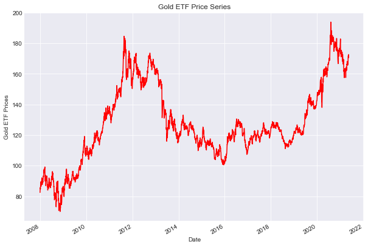

Algorithmic trading, also known as algo trading, refers to the use of computer algorithms to execute trading strategies at speeds and frequencies that are beyond human capabilities. This method of trading has become integral to modern financial markets, significantly increasing in both volume and complexity. The primary benefit of algorithmic trading lies in its ability to process vast quantities of market data swiftly and execute orders at optimal prices, leading to increased market efficiency and liquidity.

C++ has emerged as a critical language within financial technology, particularly in high-frequency trading (HFT) environments. The language's strengths—performance, direct memory access, and the ability to fine-tune system behavior—make it an ideal choice for developing software used in executing split-second trades. C++ offers a level of control over computational aspects that high-frequency trading systems demand, enabling the construction of systems that can respond in milliseconds.

Matrix operations hold a fundamental role in algorithmic trading, especially in financial modeling and simulations. They are employed in a variety of domains such as quantitative analysis, risk management, and portfolio optimization. For example, covariance matrices are used to model the volatility and correlation between different financial assets, which is crucial when determining optimal asset allocations. Further, matrices facilitate optimization problems where the goal is to maximize returns or minimize risk under certain constraints.

The purpose of this article is to explore the tangible benefits of employing C++ matrix libraries in algorithmic trading. C++ matrix libraries offer optimized data structures and algorithms that harness the power of efficient matrix computations, significantly enhancing computational performance. These libraries improve the execution speed and accuracy of trading algorithms, which are paramount in high-load environments where timeliness can directly influence profitability. By integrating advanced computational tools in algorithmic trading, financial institutions can develop more sophisticated models and strategies, leading to better decision-making processes and competitive advantages in financial markets.

## Table of Contents

## Understanding Algorithmic Trading

Algorithmic trading, often referred to as algo trading, involves using computer programs to execute trading orders based on predefined criteria without human intervention. This approach leverages mathematical models and algorithms to make decisions, offering the capability to analyze vast datasets with precision and speed. The primary objective is to take advantage of unnoticeable market opportunities that are not easily discernible to human traders.

Speed and efficiency are paramount in algorithmic trading. In financial markets, where prices move rapidly, the ability of an algorithmic system to react within milliseconds can significantly impact the profitability of a trade. For instance, variations in stock prices can occur in the blink of an eye, making the latency in executing trades a critical [factor](/wiki/factor-investing). High-frequency trading (HFT), a subset of algorithmic trading, exemplifies this with its focus on transactions that occur in fractions of a second, highlighting the necessity for optimization in computations.

Numerous strategies are deployed within [algorithmic trading](/wiki/algorithmic-trading). Statistical [arbitrage](/wiki/arbitrage), for example, involves identifying and exploiting inefficiencies between related financial instruments. This strategy relies heavily on statistical and mathematical models to assess price discrepancies. Another widely used technique is [trend following](/wiki/trend-following), which involves making trading decisions based on the [momentum](/wiki/momentum) of market prices. Such strategies are deeply rooted in quantitative analysis, often requiring complex numerical computations.

Algorithmic trading also encounters several challenges that necessitate optimized matrix computations. One such challenge is the real-time processing of large volumes of data, which require efficient matrix operations to model and analyze. For instance, constructing covariance matrices to assess asset correlations or performing optimization problems to determine the best portfolio allocation are tasks that can benefit from optimized matrix calculations. The accuracy and stability of these computations are vital, as errors or delays can lead to significant financial losses.

To surmount these challenges, algorithmic trading systems often rely on high-performance computing techniques and libraries that enhance the precision and speed of data processing. It is essential to ensure that these systems can handle the computational load while maintaining the integrity and accuracy of the trading algorithms being executed.

## The Role of C++ in Algorithmic Trading

C++ is widely regarded as a preferred language in the domain of algorithmic trading, primarily due to its exceptional performance, control, and reliability. These attributes are particularly advantageous in high-frequency trading environments where milliseconds can equate to substantial financial gains or losses.

**Performance**: C++ provides unparalleled performance benefits, largely due to its ability to execute low-level operations efficiently. The language supports fine-tuned memory management, allowing developers to optimize their code for speed and resource usage. Additionally, C++ is compiled directly to machine code, enabling high-speed execution compared to interpreted languages.

**Control**: C++ offers the granularity needed to control various aspects of application execution. This control extends to memory management, data types, and system resources, providing the flexibility necessary to create highly specialized trading algorithms with specific performance criteria. For instance, developers can manage caching and inline functions to ensure that latency is minimized.

**Reliability**: With its robust standard library and strict type checking, C++ facilitates the development of reliable systems. The strong emphasis on type safety helps minimize errors that might occur during runtime, which is crucial in financial applications where errors can lead to significant monetary implications.

Several successful trading systems exemplify the effective use of C++. A notable example includes the development of trading platforms for options and futures markets where execution speed is imperative. These systems often employ C++ to process vast amounts of data and execute trades based on intricate mathematical models and algorithms.

In algorithmic trading, numerical computations are vital for developing trading algorithms that require real-time data processing and analysis. These computations often involve linear algebra operations such as matrix multiplications, eigenvalue decompositions, and solving systems of linear equations. Efficient numerical computation is crucial to handle the large-scale data inherent in financial markets.

For example, covariance matrices are regularly used in quantitative finance to assess risk and optimize portfolios. Efficient implementation of these calculations in C++ can significantly impact the performance of trading algorithms, as latency constraints demand rapid processing times.

C++'s suitability for handling such computational demands is enhanced by its ability to interface seamlessly with specialized numerical libraries, many of which provide optimized implementations for matrix operations and other complex calculations required in financial modeling. This capability ensures that algorithms maintain high throughput levels, essential for maintaining competitive advantage in financial markets.

## Matrix Computations in Trading Algorithms

Matrices play a crucial role in financial modeling and simulations, providing a framework for handling complex numerical computations required in algorithmic trading. They facilitate the representation and manipulation of large datasets, enabling traders to extract insights and make informed decisions.

In financial modeling, covariance matrices are essential for assessing the risk and [volatility](/wiki/volatility-trading-strategies) of asset returns. A covariance matrix captures the variance and covariance between different asset returns in a portfolio, allowing traders to analyze the correlation structure among assets. This analysis is paramount for constructing diversified portfolios and implementing risk management strategies. For example, the covariance matrix $\Sigma$ is used in Markowitz's portfolio optimization problem to determine the weights of assets that minimize the portfolio variance:

$$
\Sigma = \begin{bmatrix} 
\sigma_{11} & \sigma_{12} & \cdots & \sigma_{1n} \\ 
\sigma_{21} & \sigma_{22} & \cdots & \sigma_{2n} \\ 
\vdots & \vdots & \ddots & \vdots \\ 
\sigma_{n1} & \sigma_{n2} & \cdots & \sigma_{nn} 
\end{bmatrix}
$$

where $\sigma_{ij}$ represents the covariance between asset $i$ and asset $j$.

Optimization problems in trading algorithms frequently involve matrices to solve linear equations or inequalities that represent constraints and objectives. One common example is the mean-variance optimization, where the goal is to optimize the expected return of a portfolio for a given level of risk. These problems require efficient matrix computations for solving systems described by linear equations.

Real-time computation is crucial in processing large datasets and rebalancing portfolios, particularly in high-frequency trading environments. Algorithmic trading systems constantly analyze incoming data streams, requiring prompt matrix operations to update strategies and rebalance assets based on the latest market conditions. For instance, the matrix representation of a financial model enables rapid recalculation of portfolio weights or risk metrics as new data arrives, supporting timely execution of trades.

In summary, matrix operations are integral to the functioning of trading algorithms, from risk evaluation through covariance matrices to optimization of asset portfolios. The ability to perform these computations in real-time is essential for maintaining competitive advantage and effectiveness in dynamic financial markets.

## Overview of Popular C++ Matrix Libraries

C++ matrix libraries play a crucial role in financial applications, particularly in algorithmic trading where real-time data processing and numerical computations are essential. The most prominent libraries include Eigen, Armadillo, and Blaze, each offering unique advantages in terms of performance, ease of use, and feature sets.

**Eigen** is highly regarded for its versatility and ease of use, making it a popular choice for both beginners and experienced developers. It provides high-level APIs for dense, sparse, and matrix factorizations, which are essential for financial modeling and simulations. Eigen is known for its template-based expression templates, which optimize expression evaluation at compile time, leading to significant performance improvements. Its applicability spans various use cases in financial applications, such as constructing covariance matrices for portfolio optimization and performing fast linear algebra operations involved in risk management.

**Armadillo** is another popular C++ library, especially favored for its balance between performance and simplicity. It is designed with a syntax similar to MATLAB, which eases the transition for users familiar with MATLAB environments. Armadillo leverages optimized BLAS and LAPACK libraries, thus enhancing computational speed for operations important in financial models, such as solving linear systems and performing eigen decompositions. It is particularly useful in applications requiring complex-number computations and the execution of statistical methods, such as time series analysis in market prediction models.

**Blaze** distinguishes itself with high-performance capabilities specifically tailored for high-performance computing environments. Blaze utilizes an intuitive API for compiling efficient computational kernels and supports parallel execution, making it highly suitable for handling large financial datasets in real-time. Its features include optimized arithmetic operations and seamless integration with multi-threading libraries such as OpenMP and MPI. Blaze's ability to perform quick matrix multiplications and advanced matrix transformations makes it highly suitable for scenarios like high-frequency trading (HFT), where speed is a critical factor.

When comparing these libraries, several factors come into play. **Performance** is paramount in algorithmic trading; Blaze generally excels in environments where multi-threading and large-scale parallel computations are needed. **Ease of use** might favor Eigen or Armadillo, particularly when users appreciate readable and straightforward syntax or are transitioning from MATLAB. In terms of **features**, each library has its strengths: Eigen for a comprehensive suite of linear algebra operations suitable for complex matrices, Armadillo for built-in functions optimized for scientific computations, and Blaze for real-time processing and parallelism.

In practical financial applications, these libraries support diverse needs. Eigen and Armadillo enable rapid development of analytical models for predictive analysis. Blaze's robustness is advantageous for executing computationally intensive simulations and real-time algorithmic trading strategies that require quick adjustments based on live data. Choosing the appropriate library thus depends on specific requirements such as computational efficiency, ease of integration, and the complexity of the algorithms being implemented.

## Advantages of Using C++ Matrix Libraries

C++ matrix libraries offer significant performance benefits in algorithmic trading, primarily due to their ability to conduct optimized numerical computations essential for complex trading strategies. The execution of trading algorithms, especially in high-frequency trading ([HFT](/wiki/high-frequency-trading-strategies)) environments, demands rapid processing of large datasets and efficient computation of intricate mathematical models. Leveraging specialized C++ matrix libraries, such as Eigen, Armadillo, and Blaze, can markedly enhance these operations.

The performance of these libraries stems from their utilization of advanced computational routines and optimization techniques that exploit modern CPU architectures, such as vectorization and multi-threading. By optimizing linear algebra calculations, they improve computational efficiency and speed, essential for real-time decision-making in high-load trading environments. For instance, matrix operations like eigenvalue decompositions, singular value decompositions, or large-scale matrix multiplications, which are prevalent in financial computations, are executed with greater efficiency.

In predictive modeling and data analysis, the accurate and swift computation of statistical measures is critical. Matrix libraries facilitate the computation of covariance matrices and other statistical metrics used in risk assessment and portfolio optimization. Efficient manipulation of these matrices aids in regression analyses, time series forecasting, and advanced econometric modeling, providing traders with timely insights and enhancing prediction accuracy.

A case study highlighting improved trading strategy performance can be seen in a system which integrated the Eigen library to perform rapid and repeated recalculations of covariance matrices. This approach allowed the system to swiftly adapt to changing market conditions, improving its ability to monetize on [statistical arbitrage](/wiki/statistical-arbitrage) opportunities. By reducing computation time, the algorithm could react to market signals with a precision that less optimized systems could not achieve.

In summary, C++ matrix libraries significantly contribute to the development and execution of sophisticated trading algorithms by providing powerful tools for numerical computation. These optimizations not only facilitate faster processing but also enable more complex models to be utilized in trading, leading to improved performance and potentially greater returns in financial markets.

## Challenges and Considerations

Integrating C++ matrix libraries into existing trading systems poses several challenges, primarily related to compatibility and system architecture. One key issue is ensuring that these libraries work seamlessly with current software stacks often composed of components written in different languages such as Python or Java. This may require wrappers or binding tools (e.g., SWIG or pybind11) to bridge between C++ and other languages, which can introduce additional layers of complexity and potential performance bottlenecks.

Numerical stability, accuracy, and precision are critical considerations in financial computations since even minor discrepancies can lead to significant financial consequences. C++ matrix libraries, while powerful, can exhibit variations in numerical precision depending on the underlying algorithms and hardware architecture. It is crucial to select libraries that offer robust controls for precision and error handling. Developers should conduct thorough testing to ensure that numerical outputs maintain stability under various data scenarios and market conditions.

Maintaining and scaling algorithmic trading systems that utilize C++ matrix libraries requires careful attention to software architecture and code organization. It is essential to implement modular code practices, allowing for flexibility in upgrading or swapping out libraries without disrupting the entire system. Employing version control systems and automated testing suites can help ensure that changes in matrix libraries do not introduce unforeseen bugs or performance issues. Ensuring scalability also involves stress testing the system to handle increasing volumes of data and transactions, leveraging parallel computing techniques where applicable.

For continued scalability, developers should consider adopting an architecture that supports distributed computing, such as using clusters or cloud-based services, which can efficiently manage large-scale computations. Additionally, leveraging modern C++ features, such as template metaprogramming and smart pointers, can enhance code efficiency and safety, reducing the risk of memory-related issues that could compromise system reliability.

## Conclusion

C++ matrix libraries play a crucial role in the efficiencies achieved in algorithmic trading by delivering optimized performance, particularly in high-frequency trading environments. These libraries offer robust tools for handling complex numerical computations efficiently, which is essential for executing trading strategies that rely on real-time data processing and prediction accuracy. Key benefits include significantly enhanced computational speed and efficiency, critical factors in a market where milliseconds count. The use of libraries like Eigen, Armadillo, and Blaze in trading algorithms enables traders to perform sophisticated matrix operations—essential for tasks such as risk management and portfolio optimization—swiftly and accurately.

Looking to the future, matrix computations hold promising prospects for further enhancing algorithmic trading strategies. As financial markets become more sophisticated, the demand for advanced computational tools will intensify. Innovations in C++ matrix libraries, potentially incorporating [machine learning](/wiki/machine-learning) algorithms, are likely to drive the next wave of efficient trading systems. These libraries could facilitate deeper data analysis and more accurate predictive modeling, helping traders to capitalize on new market opportunities with precision.

Incorporating advanced computational tools such as these into financial technology carries significant advantages beyond speed and accuracy. It also opens the door to innovation in trading strategies, offering more flexibility and control over the trading process. Future developments in this field are poised to transform algorithmic trading strategies further, making them more robust, adaptable, and efficient, thereby pushing the boundaries of what's achievable in financial markets.

## References

- "Algorithmic Trading and DMA" by Barry Johnson, provides a comprehensive look at algorithmic trading techniques and market infrastructure.
- "Inside the Black Box: A Simple Guide to Quantitative and High-Frequency Trading" by Rishi K. Narang, offers insights into the functioning of quantitative trading strategies and the technological advancements involved.
- Eigen C++ Matrix Library - Official documentation: http://eigen.tuxfamily.org/dox/
- Armadillo C++ Linear Algebra Library - Official documentation: http://arma.sourceforge.net/docs.html
- Blaze C++ High-Performance Math Library - Official documentation: https://bitbucket.org/blaze-lib/blaze/wiki/Home
- Article "The Importance of Being Speedy" from Algorithmic Trading Review (2019), which discusses the critical role of execution speed in trading strategies.
- "Statistical Arbitrage in the U.S. Equities Market" by Andrew W. Lo, a paper exploring statistical arbitrage strategies.
- "Efficient Numerical Methods for Quantitative Finance" by Leif Andersen, a resource touching on the role of numerical computation in financial modeling.
- Bloomberg Professional Services, offering real-time market data and analytics, providing context on the need for real-time computation.
- "Numerical Recipes: The Art of Scientific Computing" by William H. Press et al., an authoritative text on numerical methods implementation in C++.

## References & Further Reading

[1]: ["Algorithmic Trading and DMA: An Introduction to Direct Access Trading Strategies"](https://www.amazon.com/Algorithmic-Trading-DMA-introduction-strategies/dp/0956399207) by Barry Johnson

[2]: ["Inside the Black Box: A Simple Guide to Quantitative and High-Frequency Trading"](https://www.amazon.com/Inside-Black-Box-Quantitative-Frequency/dp/1118362411) by Rishi K. Narang

[3]: [Eigen C++ Matrix Library - Official documentation](https://eigen.tuxfamily.org/index.php?title=Main_Page)

[4]: [Armadillo C++ Linear Algebra Library - Official documentation](https://arma.sourceforge.net/)

[5]: [Blaze C++ High-Performance Math Library - Official documentation](https://github.com/dendisuhubdy/blaze)

[6]: Lo, A. W., & MacKinlay, A. C. (1990). ["An Econometric Analysis of Nonsynchronous Trading"](https://www.sciencedirect.com/science/article/pii/030440769090098E). Journal of Econometrics, 45(1-2), 181-211.

[7]: ["Numerical Recipes: The Art of Scientific Computing"](https://assets.cambridge.org/97805218/80688/frontmatter/9780521880688_frontmatter.pdf) by William H. Press et al.

[8]: ["Efficient Numerical Methods for Quantitative Finance"](https://wwwf.imperial.ac.uk/~ajacquie/IC_Num_Methods/IC_Num_Methods_Docs/NMImperial.pdf) by Leif Andersen

[9]: ["Statistical Arbitrage in the U.S. Equities Market"](https://math.nyu.edu/faculty/avellane/AvellanedaLeeStatArb071108.pdf) by Andrew W. Lo