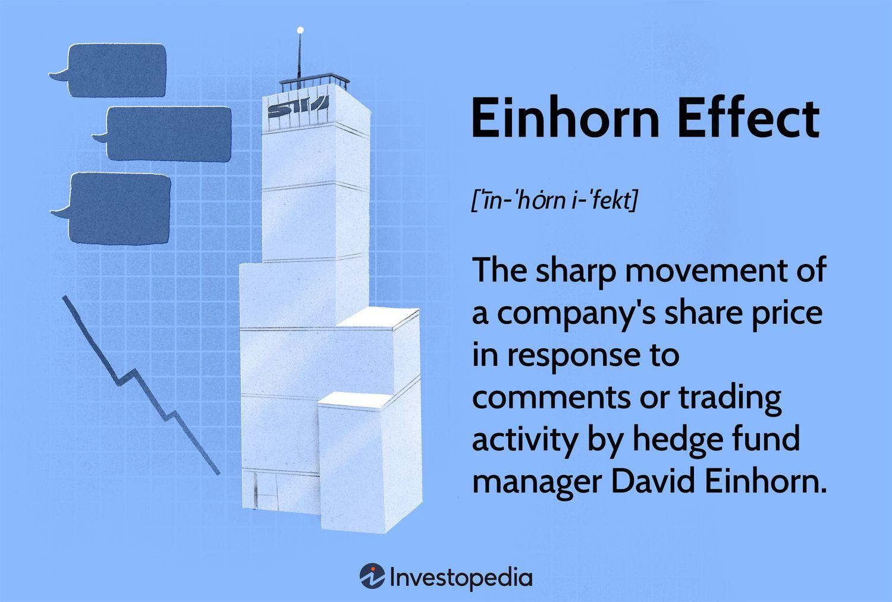

In today's ever-evolving financial landscape, investment strategies hold unprecedented significance as they are pivotal in determining the success and sustainability of investments. The dynamic nature of markets, driven by countless factors including geopolitical events, economic indicators, and technological advancements, necessitates sophisticated strategies to navigate effectively. Among the myriad of influential figures in the investment world, David Einhorn stands out as a prominent hedge fund manager whose strategic decisions have left a considerable mark on market movements, a phenomenon often referred to as the 'Einhorn Effect'.

David Einhorn, founder and president of Greenlight Capital, is renowned for his keen investment acumen and his ability to influence markets through both his trades and public commentary. His strategies often involve identifying undervalued stocks and exploiting inefficiencies in the market, occasionally engaging in activism to unlock shareholder value. The 'Einhorn Effect' is characterized by the immediate market responses following his investment actions or statements, manifesting in significant stock price movements and alterations in investor perceptions. This effect underscores the importance of strategic influence in modern investment practices.



Parallel to the influence of individual investors like Einhorn, the rise of algorithmic trading (algo trading) has become a defining element in financial markets. Algo trading, which utilizes computer algorithms to execute trades at high speeds and volumes, has dramatically reshaped investment strategies. This technological advancement allows for the processing of vast amounts of data to identify and exploit market trends, offering a competitive edge in terms of efficiency and execution speed. The interplay between traditional investment strategies, like those of Einhorn, and modern algorithmic methods creates a complex landscape where human judgment and machine precision coexist and compete.

Understanding the interaction between Einhorn's strategies and modern market dynamics, including the 'Einhorn Effect' and algorithmic trading, requires a nuanced appreciation of both the historical context and the current technological environment. Einhorn's approach, combined with the accelerating influence of technology, exemplifies the dual forces shaping contemporary investment strategies: the discretion and insight of human strategy alongside the speed and data-driven capabilities of machines. This convergence presents both challenges and opportunities for investors seeking to navigate today's intricate and fast-paced financial markets.

## Table of Contents

## Understanding David Einhorn and Greenlight Capital

David Einhorn is a well-regarded figure in the world of finance, known for his significant influence as a hedge fund manager. Born on November 20, 1968, Einhorn founded Greenlight Capital in 1996 after gaining experience in finance at Donaldson, Lufkin & Jenrette and other firms. Greenlight Capital, under Einhorn's leadership, quickly made a name for itself as a long-short value-oriented hedge fund. Einhorn's sharp analytical skills and his ability to identify both undervalued and overvalued securities have been central to the fund's strategy.

Einhorn's investment philosophy is fundamentally rooted in value investing, focusing on finding securities that are perceived to be mispriced by the market. His approach involves detailed research and a contrarian mindset, often taking sizable stakes in companies he believes are either undervalued or overvalued. This philosophy was famously demonstrated in his short position against Lehman Brothers prior to its collapse in 2008. Einhorn publicly criticized the bank's accounting practices, which not only led to significant profits for Greenlight Capital but also enhanced his reputation as a prescient and outspoken investor.

However, Einhorn's career has not been without setbacks. Some of Greenlight Capital's recent challenges include failed investments in companies such as SunEdison and Micron Technology, which have led to substantial fund losses. Despite these failures, Einhorn's overall track record features notable successes that underscore his analytical prowess and strategic insight.

A pivotal aspect of Einhorn's influence is encapsulated in what is termed the 'Einhorn Effect.' This phenomenon occurs when Einhorn's trades or public statements significantly impact stock prices. An example of this effect was evident in 2002 when Einhorn accused Allied Capital of accounting irregularities, leading to a prolonged and public battle that caused considerable [volatility](/wiki/volatility-trading-strategies) in Allied's stock price. Similarly, Einhorn's public bet against Green Mountain Coffee Roasters in 2011 resulted in an immediate stock price decline, demonstrating the weight his opinions [carry](/wiki/carry-trading) in financial markets.

The historical context of the 'Einhorn Effect' highlights its significance in influencing market dynamics. Einhorn's analyses and declarations are closely watched by investors, who often treat his decisions as signals regarding a company's health and future performance. This attention is not only a testament to Einhorn's reputation but also an indicator of the increasingly interconnected nature of financial communications and market responses. Such influence underscores the power individual investors can exert when they possess a combination of strong analytical acumen and a track record of accurately identifying market opportunities and risks.

## The Einhorn Effect: Detailed Exploration

The Einhorn Effect refers to the pronounced influence that [hedge fund](/wiki/hedge-fund-trading-strategies) manager David Einhorn can have on stock prices and market perceptions through his trades and public statements. This phenomenon arises when Einhorn discloses his short positions or critiques a company's fundamentals, often leading to significant movements in the stock's value.

A notable example of the Einhorn Effect is Einhorn's involvement with Allied Capital. In 2002, Einhorn raised concerns over the company's accounting practices, suggesting they were misleading to investors. This public criticism initiated a regulatory investigation and led to a substantial decline in Allied Capital’s stock price. Similarly, Einhorn famously shorted Lehman Brothers before the 2008 financial crisis, publicly voicing his belief that the company was misleading investors about its financial health. As a result, Lehman's stock value plummeted, contributing to its ultimate bankruptcy.

Another case showcasing the Einhorn Effect occurred with Chipotle Mexican Grill. In 2012, Einhorn shorted Chipotle, citing increased competition and the company's high valuation. His announcement led to a notable drop in Chipotle's stock price, illustrating his ability to sway investor sentiment.

The profound impact of Einhorn’s opinions and trades on stock prices can be attributed to several factors. Primarily, Einhorn is regarded as a highly knowledgeable and successful investor with a keen analytical ability to identify weaknesses in a company’s financial health. His reputation lends credibility to his forecasts, prompting investors to re-evaluate their positions based on his assessments. Additionally, Einhorn’s public critiques often draw media attention, amplifying the scrutiny on targeted companies and influencing investor behavior at a larger scale.

The Einhorn Effect underscores the power prominent investors wield in financial markets, where their insights and actions can trigger waves of buying or selling activity, leading to sharp fluctuations in stock prices. As such, market participants often closely monitor Einhorn’s statements and portfolio changes, understanding that his analysis can reveal significant insights into a company’s valuation and prospects.

## Algorithmic Trading and Its Interplay with the Einhorn Effect

Algorithmic trading, often referred to as algo trading, employs computer algorithms to execute trading orders at optimal conditions, leveraging various market variables such as price, timing, and [volume](/wiki/volume-trading-strategy). This trading methodology has gained significant traction in the financial markets due to its potential for executing intricate strategies with precision and speed unattainable by human traders. The burgeoning importance of [algorithmic trading](/wiki/algorithmic-trading) is evident in its substantial contribution to trading volume across major stock exchanges globally. According to a report published by the Bank for International Settlements, algorithmic trading accounted for more than 60% of equity trades in the United States by 2020.

The interaction between algorithmic trading and the Einhorn Effect presents a unique layer of complexity in market dynamics. The Einhorn Effect, where David Einhorn’s investment decisions and public statements can cause substantial stock price movements, presents both risks and opportunities for traders leveraging algorithms. On the one hand, algo trading algorithms that can quickly identify and react to such market-moving signals might amplify the Einhorn Effect. High-frequency trading algorithms, for example, could swiftly incorporate Einhorn's trading moves or announcements into their models, potentially leading to more rapid and pronounced short-term price swings.

Conversely, algorithmic trading might also dampen the Einhorn Effect under certain conditions. Sophisticated algorithms equipped with sentiment analysis capabilities can gauge market reactions to Einhorn’s comments and trades, predicting and counterbalancing the anticipated price movements. Such algorithms could place trades that neutralize the impact of Einhorn’s actions, thereby stabilizing affected stocks. For instance, if an algorithm anticipates a sell-off following an Einhorn short position in a company, it might strategically enter buy orders to capitalize on an expected price recovery once the initial negative impact subsides.

The challenges algorithmic trading introduces to traditional hedge fund strategies, such as those employed by Einhorn, are significant. The speed and efficiency of algo trading mean that any informational advantage gained by hedge fund managers could be rapidly eroded as algorithms assimilate and act on new data quicker than traditional methods. This scenario necessitates that hedge funds continuously innovate and integrate technology to maintain a competitive edge. Despite these challenges, algorithmic trading also offers opportunities for hedge funds, like Greenlight Capital, to enhance their strategy implementation. By using algorithms for tasks such as risk management, portfolio rebalancing, and back-testing investment hypotheses, hedge funds can streamline operations and potentially improve returns.

In conclusion, algorithmic trading significantly alters the landscape of financial markets, modifying how the Einhorn Effect impacts stock prices and challenging traditional hedge fund methods. The interplay between these forces highlights the necessity for adaptability and technological integration in modern investment strategies. As financial markets continue to evolve with advances in technology, understanding and harnessing the interaction between algorithmic trading and influential market participants become crucial for achieving strategic investment objectives.

## Einhorn's Investment Strategies in the Age of Algo Trading

David Einhorn, the renowned hedge fund manager, has had to navigate the challenges posed by the rise of algorithmic trading (algo trading). His investment firm, Greenlight Capital, has traditionally been known for a fundamental, value-oriented approach. However, the landscape of trading has shifted dramatically with the advent and growth of algorithmic trading, which now accounts for a significant portion of market activity.

### Adaptation to Algo Trading

Einhorn has recognized the necessity of adapting investment strategies to remain competitive. Algo trading, which relies on computer algorithms to execute trades at high speed and volume, has created a market environment where price discovery is increasingly driven by data and analytics rather than traditional [fundamental analysis](/wiki/fundamental-analysis). To maintain an edge, Einhorn has integrated data analytics into his investment process. This involves leveraging statistical models and [machine learning](/wiki/machine-learning) to identify potential investment opportunities that align with his value-investing philosophy.

In adapting to this new paradigm, Greenlight Capital has strategically pivoted away from some traditional approaches. For instance, they have shortened their response times to market fluctuations, ensuring they remain agile in a fast-moving environment influenced by algorithmic transactions. Einhorn’s team employs advanced quantitative tools to supplement their foundational analysis, allowing them to process vast amounts of information quickly and more accurately predict market movements influenced by algorithmic patterns.

### Recent Performance and Strategic Pivots

Greenlight Capital's recent performance reflects Einhorn’s challenges and adaptations in this algorithm-driven market. Between 2010 and 2020, the fund experienced varied performance, with some years resulting in significant losses. This led to strategic re-evaluations, where Einhorn reoriented the fund’s portfolio to sectors less dominated by algorithmic trading's high volatility and unpredictable price movements. By investing in under-recognized stocks with strong fundamentals, Greenlight Capital looks to capitalize on long-term growth potential often overlooked by algorithms focused on short-term price signals.

Despite these strategic shifts, Greenlight Capital has faced continued scrutiny on its performance, necessitating ongoing innovation in its investment strategy. Einhorn has focused on transparency and communication with investors, emphasizing the long-term value prospects in their portfolio choices, even amidst broader market fluctuations.

### Implications in a Passive and Algorithm-Driven Market

Einhorn's adaptations highlight the dual need for traditional hedge fund managers to incorporate technological advancements while staying true to their core investment philosophies. In a market increasingly dominated by passive investments and algorithmic trading, active managers like Einhorn must differentiate themselves by leveraging insights that machines might overlook. This can include qualitative assessments of management teams, an understanding of macroeconomic factors, and behavioral finance insights—areas where human judgment still maintains an advantage over machine algorithms.

However, the implications of these strategies extend beyond simple adaptation. The rise of algo trading challenges the efficacy of classical market theories, such as efficient market hypothesis, by introducing layers of complexity unforeseen in traditional manual trading environments. For Einhorn, this means that identifying intrinsic value and maintaining conviction in market positions is more paramount than ever. As markets evolve, the ability of hedge fund managers to blend foundational investment approaches with advanced technological tools will likely determine their success in an increasingly competitive arena.

In conclusion, David Einhorn's strategic adaptations to the rise of algo trading underscore the ongoing evolution of investment strategies. His efforts to incorporate data analytics while adhering to value-based principles reflect a broader trend amongst hedge fund managers striving to navigate an algorithm-driven market landscape.

## The Broader Impact on Investment Practices

The impact of the Einhorn Effect and algorithmic trading on contemporary investment practices is multifaceted, influencing both how investors engage with markets and how they structure their strategies to mitigate risks and seize opportunities. These phenomena have redefined investment paradigms, necessitating a thorough evaluation of their implications.

The Einhorn Effect—where David Einhorn's public disclosures and trading activities can lead to significant stock price movements—demonstrates the power of information and perception in financial markets. This emphasizes the importance of sentiment analysis and the need for investors to remain aware of influential market participants. Investors and fund managers can leverage this effect by closely monitoring high-profile analysts and incorporating this insight into their models. For instance, using sentiment analysis tools and machine learning algorithms, one can quantify the potential impact of a significant investor's position or announcement on stock prices, thus enabling well-timed decision-making.

Conversely, algorithmic trading, characterized by high-speed transactions based on pre-defined criteria, has grown to dominate trading volumes in many markets. The intricacies of algorithms can sometimes amplify the Einhorn Effect, particularly when trading systems programmed to recognize significant market moves react to stocks affected by Einhorn's activities. Investors seeking to protect against unwanted volatility need to enhance their risk management systems and may employ strategies like diversification, stop-loss orders, and the use of volatility-based metrics to shield their portfolios.

To illustrate, consider a simplified Python example of an algorithm designed to dynamically assess market sentiment influenced by significant traders:

```python
import requests
from textblob import TextBlob
import time

def fetch_latest_news(symbol):
    # This function would ideally fetch news related to a particular stock symbol
    # For the sake of example, it returns a dummy headline
    return "David Einhorn suggests undervaluation of XYZ stock"

def sentiment_analysis(headline):
    # Analyze the sentiment of the headline
    analysis = TextBlob(headline)
    return analysis.sentiment.polarity

while True:
    news = fetch_latest_news("XYZ")
    sentiment_score = sentiment_analysis(news)
    if sentiment_score > 0.5:
        print(f"Positive sentiment detected for XYZ: {sentiment_score}")
        # Execute a buy strategy
    elif sentiment_score < -0.5:
        print(f"Negative sentiment detected for XYZ: {sentiment_score}")
        # Execute a sell strategy
    time.sleep(60)  # check every minute
```

This approach exemplifies how technology can be harnessed to manage risks associated with high-profile market influencers.

Looking forward, investment strategies are poised to become increasingly sophisticated in response to ongoing technological advancements and the dynamic nature of modern markets. Factors such as big data and machine learning will further refine investment models, offering more nuanced insights and forecasts. Strategies will likely shift towards hybrid models that incorporate traditional human expertise and algorithmic precision. The future will demand adaptability from all market participants, where agility in strategy formulation and execution will be key to thriving in unpredictable environments.

Overall, the integration of the Einhorn Effect and algorithmic trading into investment practices necessitates a balance between reactivity and proactivity. Investors must continuously evolve their strategies, integrating new technologies and methodologies to maintain a competitive edge in a fluctuating financial ecosystem.

## Conclusion

David Einhorn’s strategies, marked by a combination of rigorous analysis, decisive action, and media influence, have made him a standout figure in the financial sector. The Einhorn Effect, where his trades and opinions can significantly sway market prices, underscores his influential position. In today's market, characterized by rapid technological advancements and the prevalence of algorithmic trading, the core aspects of Einhorn's approach—thorough due diligence, strategic short-selling, and leveraging public discourse—remain crucial. These strategies showcase the power of individual investment philosophies and their potential to impact broader market dynamics.

The adaptability exhibited by Einhorn and Greenlight Capital is vital in navigating the complexities of modern financial markets. Investors are increasingly faced with the dual challenge of competing with algorithmic trading and responding to influential market players like Einhorn. Embracing innovation, whether through data-driven analysis or new trading platforms, has become essential to maintain a competitive edge.

As emerging technologies continue to redefine market structures, investors are encouraged to recognize the role of such innovations in shaping their own strategies. By understanding and potentially incorporating advancements like machine learning, [artificial intelligence](/wiki/ai-artificial-intelligence), and systematic trading models, individuals and fund managers alike can better position themselves to harness market opportunities. Furthermore, remaining aware of the impact that leading investors and their strategies can have, offers a means to either collaborate with or prepare against such market forces.

In conclusion, David Einhorn's work encapsulates the importance of strategic insight and flexibility within the evolving landscape of finance. Investors aiming for long-term success must not only adopt sound investment principles but also continuously adapt to the ever-shifting dynamics of global markets.

## References & Further Reading

[1]: Bergstra, J., Bardenet, R., Bengio, Y., & Kégl, B. (2011). ["Algorithms for Hyper-Parameter Optimization."](https://papers.nips.cc/paper/4443-algorithms-for-hyper-parameter-optimization) Advances in Neural Information Processing Systems 24.

[2]: ["Advances in Financial Machine Learning"](https://www.amazon.com/Advances-Financial-Machine-Learning-Marcos/dp/1119482089) by Marcos Lopez de Prado

[3]: ["Evidence-Based Technical Analysis: Applying the Scientific Method and Statistical Inference to Trading Signals"](https://www.amazon.com/Evidence-Based-Technical-Analysis-Scientific-Statistical/dp/0470008741) by David Aronson

[4]: ["Machine Learning for Algorithmic Trading"](https://github.com/stefan-jansen/machine-learning-for-trading) by Stefan Jansen

[5]: ["Quantitative Trading: How to Build Your Own Algorithmic Trading Business"](https://www.amazon.com/Quantitative-Trading-Build-Algorithmic-Business/dp/1119800064) by Ernest P. Chan