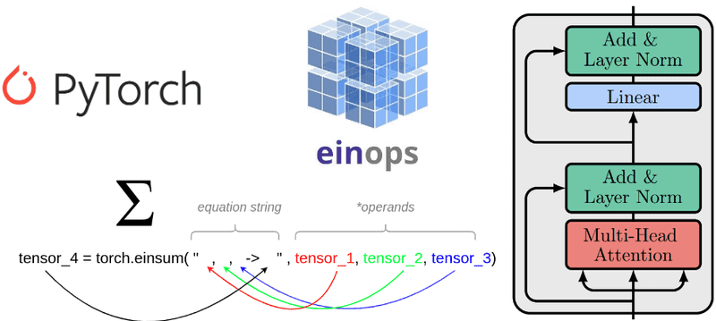

## Table of Contents

## What is Einsum notation and why is it used in machine learning?

Einsum notation, short for Einstein summation, is a way to describe operations on arrays that involve sums of products. It's named after Albert Einstein, who used a similar notation in his work on general relativity. In simple terms, Einsum allows you to write complex operations, like matrix multiplication or element-wise multiplication, using a compact and readable format. For example, the operation of matrix multiplication can be written as $$A_{ij} B_{jk} = C_{ik}$$ in Einstein notation, where repeated indices (j in this case) imply summation.

In machine learning, Einsum is used because it can express many common operations in a clear and concise way. This is particularly useful in neural networks, where you often need to perform operations like convolutions, attention mechanisms, and other tensor manipulations. Using Einsum, developers can write more readable and maintainable code. For instance, a simple dot product in Python using the NumPy library can be written as ```python
import numpy as np
a = np.array([1, 2, 3])
b = np.array([4, 5, 6])
result = np.einsum('i,i->', a, b)
``` This code calculates the sum of the element-wise product of `a` and `b`, which is equivalent to the dot product. The notation 'i,i->' tells Einsum to multiply corresponding elements and sum the result.

## How does Einsum notation simplify tensor operations?

Einsum notation simplifies tensor operations by providing a compact way to express complex calculations. Instead of writing out multiple loops or using several functions to achieve the same result, you can use a single Einsum expression. This makes the code easier to read and understand. For example, if you want to multiply two matrices and then sum along one axis, you would typically need to use multiple steps in regular code. With Einsum, you can do this in one line, making it clear what operation you are performing.

In addition to simplifying the code, Einsum notation also helps in understanding the flow of data through tensors. By using letters to represent different dimensions, you can easily see how the tensors are being manipulated. For instance, if you want to perform a matrix multiplication, you can write it as $$A_{ij} B_{jk} = C_{ik}$$ in Einsum notation. This clearly shows that the 'j' dimension is being summed over, resulting in the output matrix C. This clarity is especially useful in [machine learning](/wiki/machine-learning), where operations on tensors are common and can become complex.

## Can you explain the basic syntax of Einsum notation?

Einsum notation uses letters to represent the dimensions of tensors. Each letter stands for a specific dimension of a tensor. When you see a letter repeated in an Einsum expression, it means that dimension is being summed over. For example, if you want to multiply two matrices A and B, you can write it as $$A_{ij} B_{jk} = C_{ik}$$. Here, 'i' and 'k' are the dimensions of the result, and 'j' is the dimension that gets summed over.

The basic syntax of Einsum involves specifying the input and output dimensions. You write the dimensions of the input tensors separated by commas, and then an arrow '->' followed by the dimensions of the output tensor. For example, to compute the dot product of two vectors 'a' and 'b', you would use ```python
import numpy as np
a = np.array([1, 2, 3])
b = np.array([4, 5, 6])
result = np.einsum('i,i->', a, b)
```. Here, 'i,i->' tells Einsum to multiply the elements of 'a' and 'b' where the dimension 'i' is the same, and then sum the result to get a scalar output.

## What are some common operations that can be expressed using Einsum?

Einsum notation can be used for many common operations in machine learning and data science. One of the most basic operations is the dot product of two vectors. For example, if you have two vectors 'a' and 'b', you can use Einsum to compute their dot product like this: ```python
import numpy as np
a = np.array([1, 2, 3])
b = np.array([4, 5, 6])
result = np.einsum('i,i->', a, b)
```. Here, 'i,i->' means to multiply the elements of 'a' and 'b' where the dimension 'i' is the same, and then sum the result to get a scalar output. Another common operation is matrix multiplication. If you have two matrices 'A' and 'B', you can multiply them using Einsum like this: ```python
A = np.array([[1, 2], [3, 4]])
B = np.array([[5, 6], [7, 8]])
result = np.einsum('ij,jk->ik', A, B)
```. The notation 'ij,jk->ik' means to multiply 'A' and 'B' and sum over the 'j' dimension to get the resulting matrix.

Einsum can also be used for more complex operations like element-wise multiplication and tensor contractions. For element-wise multiplication of two matrices 'A' and 'B', you can use ```python
A = np.array([[1, 2], [3, 4]])
B = np.array([[5, 6], [7, 8]])
result = np.einsum('ij,ij->ij', A, B)
```. The notation 'ij,ij->ij' means to multiply the corresponding elements of 'A' and 'B' without summing any dimensions. For tensor contractions, if you have a tensor 'T' with three dimensions and you want to sum over one of them, you can use ```python
T = np.array([[[1, 2], [3, 4]], [[5, 6], [7, 8]]])
result = np.einsum('ijk->ij', T)
```. The notation 'ijk->ij' means to sum over the 'k' dimension, resulting in a 2D tensor. These examples show how Einsum can simplify and clarify complex tensor operations.

## How does Einsum handle broadcasting in tensor operations?

Einsum handles broadcasting in tensor operations by allowing you to specify which dimensions should be aligned and which should be expanded. When you use Einsum, you can write the dimensions of your tensors in a way that automatically takes care of broadcasting. For example, if you want to add a vector to each row of a matrix, you can use Einsum to do this easily. You just need to specify that the vector's dimension should be broadcasted across the rows of the matrix. This makes the code simpler and more readable because you don't need to manually handle the broadcasting.

In practice, if you have a matrix 'A' with dimensions $$i \times j$$ and a vector 'b' with dimension $$j$$, you can add 'b' to each row of 'A' using Einsum like this: ```python
import numpy as np
A = np.array([[1, 2, 3], [4, 5, 6]])
b = np.array([10, 20, 30])
result = np.einsum('ij,j->ij', A, b)
```. The notation 'ij,j->ij' tells Einsum to align the 'j' dimension of 'A' and 'b', and then broadcast 'b' across the 'i' dimension of 'A'. This way, Einsum takes care of the broadcasting for you, making it easier to perform operations that would otherwise require more complex code.

## What are the performance benefits of using Einsum in machine learning tasks?

Using Einsum in machine learning tasks can make your code run faster. This is because Einsum can do many operations at once, like multiplying and adding numbers, without needing to write separate steps. For example, if you want to multiply two matrices and then sum over one of the dimensions, Einsum can do this in one go. This means your code can be simpler and quicker. In some cases, Einsum can use special ways to do calculations that are faster than doing them one by one.

Einsum also helps make your code easier to read and understand. When you use Einsum, you can write complex operations in a short way, like $$A_{ij} B_{jk} = C_{ik}$$ for matrix multiplication. This makes it easier for other people to see what your code is doing. Because Einsum can handle many different operations, it can also make your code more flexible. You might be able to use the same Einsum code for different tasks, which can save time and make your code more efficient.

## How can Einsum be used to implement matrix multiplication?

Einsum can be used to implement matrix multiplication in a simple and clear way. When you want to multiply two matrices, like matrix A and matrix B, you can use Einsum to do this. The basic idea is to tell Einsum how to match up the dimensions of the two matrices and then how to sum them up to get the result. For example, if you have matrix A with dimensions i by j and matrix B with dimensions j by k, you can multiply them to get a new matrix C with dimensions i by k. In Einsum, this is written as $$A_{ij} B_{jk} = C_{ik}$$. The 'j' dimension is the one that gets summed over, which is what happens in regular matrix multiplication.

To do this in code, you can use the NumPy library in Python. Here's how you can write it: ```python
import numpy as np
A = np.array([[1, 2], [3, 4]])
B = np.array([[5, 6], [7, 8]])
result = np.einsum('ij,jk->ik', A, B)
```. The notation 'ij,jk->ik' tells Einsum that you want to multiply A and B and sum over the 'j' dimension to get the resulting matrix. This way, Einsum handles the matrix multiplication for you, making it easy to understand and write.

## Can you demonstrate how to use Einsum for more complex operations like convolutions?

Einsum can be used to implement convolutions, which are common in image processing and neural networks. A convolution involves sliding a small window, called a kernel, over an input image and computing a weighted sum at each position. In Einsum notation, you can express this operation by specifying how the dimensions of the input image and the kernel should interact. For example, if you have an input image with dimensions $$i \times j$$ and a kernel with dimensions $$k \times l$$, you can slide the kernel over the image and compute the convolution result with dimensions $$(i-k+1) \times (j-l+1)$$. The Einsum notation for this operation would be something like $$I_{ij} K_{kl} = O_{(i-k+1)(j-l+1)}$$, where the dimensions are adjusted to account for the sliding window.

To implement this in code, you can use the NumPy library in Python. Here's how you might write a simple 2D convolution using Einsum: ```python
import numpy as np
image = np.array([[1, 2, 3], [4, 5, 6], [7, 8, 9]])
kernel = np.array([[0, 1], [2, 3]])
result = np.einsum('ij,kl->(i-k+1)(j-l+1)', image, kernel)
```. In this example, 'ij,kl->(i-k+1)(j-l+1)' tells Einsum to slide the kernel over the image and compute the weighted sum at each position. This way, Einsum handles the complex operation of convolution in a compact and readable format, making it easier to understand and implement in your code.

## What are the limitations or challenges of using Einsum in practical applications?

Einsum notation can be hard to understand at first because it uses a special way of writing things. When you see $$A_{ij} B_{jk} = C_{ik}$$ for the first time, it might be confusing. You need to learn what the letters and arrows mean. Also, Einsum might not be the best choice for very simple operations. For example, if you just want to add two numbers, using Einsum might make your code more complicated than it needs to be.

Another challenge is that Einsum might not always be the fastest way to do things, especially for very big tensors. While Einsum can make some operations run quickly, other ways of doing things might be better for certain tasks. You might need to try different methods to see which one works best for your specific problem. Also, not all programming languages or libraries support Einsum, so you might need to use other ways of doing things if you're working with different tools.

## How does Einsum notation compare to other tensor operation notations or libraries?

Einsum notation is different from other ways of doing tensor operations because it uses a special way of writing things. Instead of writing out long loops or using many functions, Einsum lets you write operations in a short and clear way. For example, if you want to multiply two matrices, you can write it as $$A_{ij} B_{jk} = C_{ik}$$ in Einsum. This makes it easy to see what you're doing. Other libraries, like NumPy, might use functions like `np.dot()` or `np.matmul()` for the same thing, but Einsum can do more complicated operations in one line. This can make your code simpler and easier to understand.

However, Einsum might not be the best choice for every situation. For very simple operations, like adding two numbers, using Einsum can make your code more complicated than it needs to be. Also, not all programming languages or libraries support Einsum, so you might need to use other ways of doing things if you're working with different tools. For example, TensorFlow and PyTorch have their own ways of handling tensor operations, which might be more suitable for certain tasks. While Einsum can be very powerful and flexible, it's important to think about what works best for your specific problem.

## Can you provide examples of how Einsum is used in popular machine learning frameworks?

Einsum is used in popular machine learning frameworks like TensorFlow and PyTorch to make complex tensor operations easier to write and understand. In TensorFlow, you can use `tf.einsum` to do things like matrix multiplication or more complicated operations. For example, if you want to multiply two matrices A and B, you can write it like this: ```python
import tensorflow as tf
A = tf.constant([[1, 2], [3, 4]])
B = tf.constant([[5, 6], [7, 8]])
result = tf.einsum('ij,jk->ik', A, B)
```. The notation 'ij,jk->ik' tells TensorFlow to multiply A and B and sum over the 'j' dimension to get the result. This makes it easy to see what the code is doing, even for more complicated operations.

In PyTorch, you can use `torch.einsum` in a similar way. For example, if you want to do an element-wise multiplication of two matrices A and B, you can write it like this: ```python
import torch
A = torch.tensor([[1, 2], [3, 4]])
B = torch.tensor([[5, 6], [7, 8]])
result = torch.einsum('ij,ij->ij', A, B)
```. The notation 'ij,ij->ij' tells PyTorch to multiply the corresponding elements of A and B without summing any dimensions. This makes it clear what the operation is and can help make your code more readable and maintainable.

## What advanced techniques or optimizations can be applied when using Einsum for large-scale machine learning models?

When using Einsum for large-scale machine learning models, one important optimization is to use it to reduce memory usage. For example, if you have a very big tensor and you need to do a lot of operations on it, you can use Einsum to do these operations in smaller steps. This means you don't need to keep the whole big tensor in memory at once. Instead, you can break it into smaller pieces and work on them one at a time. This can make your code run faster and use less memory, which is important when working with big models.

Another technique is to use Einsum to make your code run faster by doing operations in a smart way. For instance, if you need to do a lot of matrix multiplications and then sum the results, Einsum can do this in one go instead of doing each step separately. This can save time because it reduces the number of steps your computer needs to do. For example, if you have three tensors A, B, and C, and you want to multiply them together and then sum over some dimensions, you can write it as $$A_{ijk} B_{klm} C_{mno} = D_{ino}$$ in Einsum. This way, Einsum can handle the whole operation efficiently, making your code run faster.