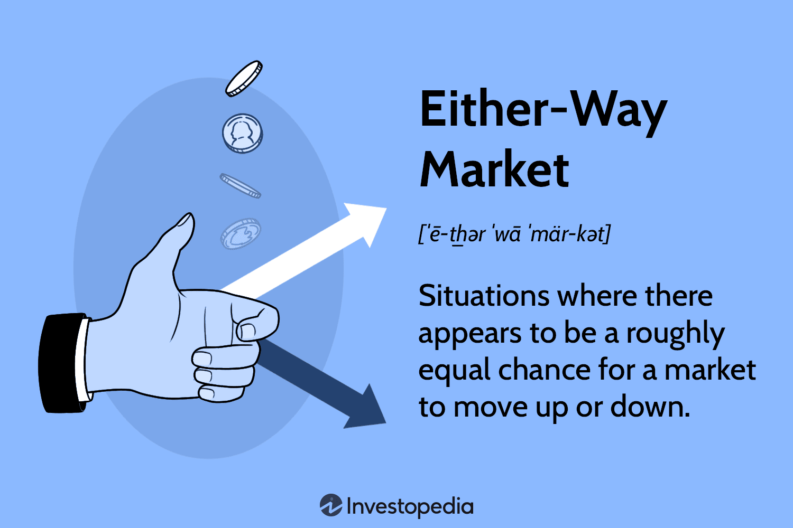

## Table of Contents

## What is an Either-Way Market?

An Either-Way Market is a type of financial market where the price of a stock or asset can move either up or down, and it's hard to predict which way it will go. This kind of market happens when there are almost equal numbers of buyers and sellers, so the market is balanced. Because it's hard to know which way the price will move, traders and investors need to be careful and might use different strategies to manage their risks.

In an Either-Way Market, it's common to see the price of stocks or assets stay pretty steady without big changes. This can be frustrating for people who want to make money from big price swings. But it can also be a good time for investors who like to buy and hold onto their investments for a long time, waiting for the market to eventually move in their favor. Understanding these markets helps traders and investors make smarter choices about when to buy or sell.

## How does an Either-Way Market differ from a Bull or Bear Market?

An Either-Way Market is different from a Bull or Bear Market because in an Either-Way Market, the price of stocks or assets can go up or down, and it's hard to tell which way it will go. This happens when there are about the same number of people wanting to buy as there are wanting to sell, so the market stays balanced. In this kind of market, the prices don't change much, and it can be tough for traders who want to make money from big price swings.

On the other hand, a Bull Market is when the prices of stocks or assets are going up, and more people want to buy than sell. People feel good about the market and think prices will keep going up, so they keep buying. A Bear Market is the opposite; it's when the prices are going down, and more people want to sell than buy. People feel worried about the market and think prices will keep going down, so they keep selling. Both Bull and Bear Markets are easier to predict than an Either-Way Market because the trend is clearer.

## What are the key characteristics of an Either-Way Market?

An Either-Way Market is a type of market where the price of stocks or assets can go either up or down. It's tough to predict which way it will go because there are about the same number of people who want to buy as those who want to sell. This balance makes the market stable, but it also means that the prices don't change much. Traders who like to make money from big price swings might find this market frustrating because there aren't many big moves.

In an Either-Way Market, the price of stocks or assets tends to stay pretty steady. This can be a good time for investors who like to buy and hold onto their investments for a long time. They can wait for the market to eventually move in their favor without worrying about big ups and downs. Understanding these markets is important for traders and investors because it helps them decide when to buy or sell and how to manage their risks.

## What causes an Either-Way Market to form?

An Either-Way Market forms when there's a balance between people who want to buy and people who want to sell. This happens because everyone has different opinions about where the market is going. Some think the prices will go up, so they buy. Others think the prices will go down, so they sell. When these two groups are about the same size, the market stays balanced, and prices don't change much.

This kind of market can also happen when there's not a lot of big news or events that would make people want to buy or sell a lot. Without strong reasons to move the market one way or the other, it stays in the middle. This can make it hard for traders who like to make money from big price changes because they have to wait for something to happen that will push the market in one direction.

## How can investors identify an Either-Way Market?

Investors can identify an Either-Way Market by looking at how the prices of stocks or assets are moving. In an Either-Way Market, the prices don't go up or down a lot. They stay pretty much the same, without big changes. This happens because there are about the same number of people who want to buy as those who want to sell. When investors see that the market is not moving much and there's no clear trend, it might be an Either-Way Market.

Another way to spot an Either-Way Market is by watching the trading [volume](/wiki/volume-trading-strategy). In this kind of market, the number of stocks or assets being bought and sold is not very high. This shows that people are not rushing to buy or sell, which keeps the market balanced. Investors should also pay attention to the news and events. If there's not a lot of big news that would make people want to buy or sell a lot, it could mean the market is in an Either-Way state.

## What are the common strategies for trading in an Either-Way Market?

In an Either-Way Market, where prices don't move much, traders often use a strategy called range trading. This means they buy stocks or assets when the price is low and sell them when the price goes up a bit. They keep doing this within a small range, making small profits each time. This works well because the market stays balanced, and prices don't change a lot.

Another strategy is to use options, which are agreements that let you buy or sell at a certain price later. Traders can use options to make money even if the market doesn't move much. For example, they can sell options that they think won't be used, making money from the fees. This can be a good way to make some profit in a market that's hard to predict.

Some investors also choose to wait it out in an Either-Way Market. They might hold onto their investments and not trade much, waiting for the market to eventually move in one direction. This can be a safe strategy because they don't lose money from big price swings. They just wait for a better time to trade when the market becomes a Bull or Bear Market.

## What are the risks associated with investing in an Either-Way Market?

Investing in an Either-Way Market can be risky because the prices don't move much. This means that traders who like to make money from big price changes might not make much profit. They have to be patient and wait for small changes in the price, which can be frustrating. Also, since it's hard to predict which way the market will go, traders might make the wrong guess and lose money if they buy or sell at the wrong time.

Another risk is that the market could suddenly change from an Either-Way Market to a Bull or Bear Market. If this happens, investors who were waiting for the market to move might be caught off guard. They could lose money if they don't react quickly enough to the new market conditions. This makes it important for investors to keep an eye on the market and be ready to change their strategies if needed.

## How does an Either-Way Market affect different types of investment portfolios?

An Either-Way Market can be tough for people who like to trade a lot and make money from big price changes. If you have an investment portfolio that focuses on short-term trading, you might not see much profit in this kind of market. The prices don't move up or down a lot, so it's hard to make money from quick trades. Traders might get frustrated because they have to wait for small changes in the price, and they could lose money if they guess wrong about which way the market will go.

On the other hand, an Either-Way Market can be good for people who like to hold onto their investments for a long time. If you have a portfolio that is set up for long-term investing, this kind of market might not bother you much. You can keep your investments without worrying about big ups and downs. You just wait for the market to eventually move in your favor, and in the meantime, your portfolio stays pretty stable.

Overall, how an Either-Way Market affects your investment portfolio depends on your strategy. If you're a short-term trader, you might need to be patient and use strategies like range trading or options to make small profits. If you're a long-term investor, you can sit tight and wait for the market to change, keeping your portfolio safe from big swings.

## Can technical analysis be effectively used in an Either-Way Market?

Yes, technical analysis can be used in an Either-Way Market, but it might be a bit trickier than in a Bull or Bear Market. In an Either-Way Market, prices don't move a lot, so traders need to look for small changes and patterns. They might use tools like support and resistance levels to see where the price might go up or down a little bit. They can also use indicators like moving averages to help them see if the market is starting to move in one direction. The key is to be patient and look for small opportunities to make trades.

Even though the market is hard to predict, technical analysis can still help traders make some money. For example, if a trader sees that the price keeps going up and down between two levels, they might use range trading to buy low and sell high within that range. This can help them make small profits even when the market is not moving much. By paying close attention to the charts and using the right tools, traders can find ways to trade successfully in an Either-Way Market.

## What historical examples best illustrate an Either-Way Market?

One good example of an Either-Way Market happened in the late 1990s, right before the dot-com bubble burst. During this time, the stock market was pretty stable, and it was hard to tell if prices would go up or down. A lot of people were buying and selling tech stocks, but the market was balanced because there were about the same number of buyers and sellers. This made it tough for traders to make big profits because the prices didn't change much. They had to wait for small changes and use strategies like range trading to make money.

Another example is the period after the 2008 financial crisis, around 2010 to 2012. After the big drop in stock prices, the market started to recover, but it didn't move up or down a lot. There were times when it seemed like the market might go up, but then it would go back to being stable. This was because people were still worried about the economy, so they were careful about buying and selling. Investors who liked to hold onto their investments for a long time did well during this time because they didn't have to worry about big price swings. They could just wait for the market to eventually move in their favor.

## How do global economic factors influence an Either-Way Market?

Global economic factors can have a big impact on an Either-Way Market. When there's not a lot of big news or events happening around the world, the market can stay balanced because people don't have strong reasons to buy or sell a lot. For example, if countries are not making big changes to their interest rates or if there are no major political events, the market might not move much. This can make it hard for traders to predict which way the market will go, so they have to be careful and patient.

On the other hand, if something big happens in the global economy, like a sudden change in oil prices or a new trade agreement, it can push the market out of its Either-Way state. These events can make people feel more sure about buying or selling, which can tip the balance and cause the market to move up or down. Investors need to keep an eye on these global factors because they can change the market quickly, and being ready to adjust their strategies can help them make better choices.

## What advanced techniques can traders use to profit in an Either-Way Market?

In an Either-Way Market, traders can use advanced techniques like mean reversion strategies to make profits. This means they look for stocks or assets that have moved away from their average price and bet that they will go back to that average. They might use tools like Bollinger Bands to see when a price is too high or too low compared to its usual range. When they see a price move outside of these bands, they can buy if it's low or sell if it's high, expecting it to come back to the middle. This can help them make money even when the market isn't moving much.

Another advanced technique is using options strategies like selling straddles or strangles. In a straddle, a trader sells both a call option and a put option at the same price. In a strangle, they sell a call option and a put option at different prices. The idea is that if the market stays in its range and doesn't move much, both options will expire worthless, and the trader keeps the money they got from selling them. This can be a good way to make some profit in a market that's hard to predict. By using these advanced techniques, traders can find ways to make money even when the market is not moving a lot.

## References & Further Reading

[1]: Bergstra, J., Bardenet, R., Bengio, Y., & Kégl, B. (2011). ["Algorithms for Hyper-Parameter Optimization."](https://dl.acm.org/doi/10.5555/2986459.2986743) Advances in Neural Information Processing Systems 24.

[2]: ["Advances in Financial Machine Learning"](https://www.amazon.com/Advances-Financial-Machine-Learning-Marcos/dp/1119482089) by Marcos Lopez de Prado

[3]: ["Evidence-Based Technical Analysis: Applying the Scientific Method and Statistical Inference to Trading Signals"](https://www.amazon.com/Evidence-Based-Technical-Analysis-Scientific-Statistical/dp/0470008741) by David Aronson

[4]: ["Machine Learning for Algorithmic Trading"](https://github.com/stefan-jansen/machine-learning-for-trading) by Stefan Jansen

[5]: ["Quantitative Trading: How to Build Your Own Algorithmic Trading Business"](https://www.amazon.com/Quantitative-Trading-Build-Algorithmic-Business/dp/1119800064) by Ernest P. Chan