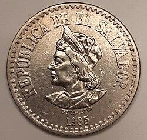

The intriguing history of El Salvador's currency, the El Salvador Colón (SVC), presents a story of economic evolution that is instrumental in understanding the nation's development. The El Salvador Colón, which served as the country's official currency until 2001, represents a significant period in the nation's economic history before the pivotal shift to the U.S. dollar. This transition, which occurred at the onset of the 21st century, underscores vital economic changes in the region, prompted by various economic challenges and policy decisions.

The history of the El Salvador Colón is marked by its introduction in 1892, which was intended to replace the peso and serve as a symbol of national identity and economic stability. Its relationship with the U.S. dollar was crucial, with the currency originally pegged at a 2:1 ratio to the dollar, illustrating early economic ties between El Salvador and the United States. Over the years, this relationship evolved, reflecting both regional economic conditions and global economic influences.



The adoption of the U.S. dollar in 2001 through the Monetary Integration Act was a response to economic challenges, including inflation and instability. By fixing the exchange rate at 8.75 colónes to 1 U.S. dollar, the country aimed to achieve greater stability and integration into the global economy. This shift towards dollarization represents a significant change in monetary policy and had a profound impact on economic activities in El Salvador.

In the contemporary era, the currency landscape is further enhanced by technological advancements such as algorithmic trading. This innovation allows for automated trading strategies that can analyze vast amounts of data, optimize trading decisions, and potentially provide new opportunities in currency markets. The inclusion of algorithmic trading and digital currencies exemplifies how modern finance continues to evolve, offering potential avenues for economic growth and stability.

This article will explore the history, features, and significance of the El Salvador Colón, alongside examining the contemporary role of algorithmic trading within the currency landscape. Understanding these aspects is crucial for comprehending El Salvador's monetary history and its broader implications on global economics.

## Table of Contents

## Origins and Adoption of the El Salvador Colón

The El Salvador Colón, named in honor of Christopher Columbus, was introduced in 1892, effectively replacing the peso as the country's official currency. This change was intended not only to modernize the monetary systems of El Salvador but also to forge a stronger sense of national identity and economic stability. The introduction of the Colón came at a time when many countries in Latin America were revamping their monetary systems, influenced by global trends in banking and economics.

Initially, the El Salvador Colón was pegged to the U.S. dollar at a 2:1 ratio, providing a measure of stability for the country's economy and facilitating trade and investment exchanges, where one Colón was the equivalent of 0.50 U.S. dollars. By the standard set during its establishment, this pegging mechanism helped to maintain macroeconomic stability and curtailed the rampant inflation that was characteristic of many currencies across the globe during periods of global economic instability.

The monetary history of El Salvador's Colón during this period is richly illustrated by the various coins and banknotes issued by the Central Reserve Bank of El Salvador. The bank was responsible for the design, production, and circulation of these notes and coins, which featured various national symbols and important figures from the country's history, enhancing the cultural and historical significance of the currency. Coins were minted in various denominations, commonly including 1, 5, 10, and 25 centavos, while banknotes ranged from 1 to 100 colónes. The designs often included emblematic depictions such as important historical figures, indigenous imagery, and national landmarks, reflecting the rich history and culture of El Salvador.

The currency represented more than mere money; it was an expression of El Salvador's sovereignty and independence. The designs and denominations were not only seen as a medium of transaction but also as a tool for instilling national pride and unity. Over the years, as financial and economic conditions evolved, adjustments were made in the issuance of coins and banknotes to reflect changes in demand and production costs, but the fundamental role of the Colón as a symbol of El Salvador’s national identity remained strong and unaltered until its eventual replacement. 

In summary, the El Salvador Colón's introduction marked a pivotal shift in the country's economic strategy, characterized by a dedication to economic stability and national coherence through the depiction of cultural heritage on its currency. This early period of the Colón set the foundation for El Salvador's monetary policy until the country's transition to the U.S. dollar in 2001.

## The Transition to the U.S. Dollar

Economic challenges marked by inflation and stagnation during the late 20th century led to the pivotal shift in El Salvador's monetary system, culminating in the adoption of the U.S. dollar as the country's primary currency in 2001. After decades of economic instability, exacerbated by civil unrest and a series of natural disasters, the need for a robust and stable monetary framework became apparent. In response to these challenges, the Salvadoran government enacted the Monetary Integration Act, effectively setting in motion the dollarization process.

The Monetary Integration Act established a fixed exchange rate of 8.75 colónes to 1 U.S. dollar, which served as a cornerstone for the transition. This legislation aimed to provide a stable economic environment by anchoring the Salvadoran economy to the U.S. dollar, mitigating the risks associated with currency devaluation. The rationale behind this move was to instill investor confidence, control inflation, and facilitate international trade by aligning with a widely accepted global currency.

The economic impacts of adopting the U.S. dollar were multifaceted. In the immediate aftermath, the transition helped curb hyperinflation, leading to a more predictable economic environment. This move also eliminated exchange rate risk, which was particularly beneficial for businesses engaging in international trade. In addition, the adoption of the U.S. dollar promoted foreign investment by offering a more stable and transparent economic landscape, thereby encouraging growth in various sectors such as tourism and manufacturing.

However, the transition also posed challenges. By relinquishing control over its monetary policy, El Salvador lost the ability to address specific local economic issues independently, such as adjusting interest rates to stimulate growth during downturns. This dependency on the U.S. monetary policy meant that the Salvadoran economy was more susceptible to external economic shocks, particularly those originating from the United States.

Despite these challenges, the adoption of the U.S. dollar is largely viewed as a stabilizing force for El Salvador, contributing to a more resilient economic framework. The initial objectives of reducing inflation and attracting investment were largely achieved, although at the cost of diminished monetary sovereignty. In the years following the dollarization, El Salvador experienced an increase in per capita GDP and improved fiscal discipline, attributed to the constraints imposed by the adoption of a foreign currency. 

Overall, dollarization has played a significant role in shaping El Salvador's fiscal policies and economic trajectory in the 21st century. This transition exemplifies the complex interplay between national and international economic dynamics and serves as a critical reference point for understanding monetary integration processes globally.

## Algorithmic Trading in the Context of El Salvador's Currency

Algorithmic trading refers to the use of computer algorithms to execute trading orders at speeds and frequencies that a human trader cannot achieve. These algorithms follow a defined set of instructions to process and analyze massive datasets, identify trading opportunities, and execute trades, ensuring efficiency and minimizing the emotional bias often associated with human trading. The relevance of [algorithmic trading](/wiki/algorithmic-trading) to currencies like the Salvadoran Colón (SVC) and the U.S. dollar lies in its ability to optimize trading strategies, improve [liquidity](/wiki/liquidity-risk-premium), and facilitate seamless market operations.

In the context of El Salvador's economy, which transitioned from the Colón to the U.S. dollar in 2001, algorithmic trading plays a crucial role. Modern trading strategies can leverage these algorithms to navigate the complexities of the Salvadoran market, particularly as the country increasingly engages with digital currencies and financial technologies. Bitcoin, which became legal tender in El Salvador in 2021, has further accentuated the importance of algorithmic trading by introducing new [cryptocurrency](/wiki/cryptocurrency) investment opportunities. 

Algorithmic trading strategies can be customized for emerging currencies and investments in El Salvador by employing techniques such as:

1. **Mean Reversion**: This strategy is based on the assumption that the price of an asset will revert to its mean over time. Traders can use historical data to determine the average price of the U.S. dollar in relation to other currencies or digital assets, crafting algorithms to capitalize on deviations from this mean.

   ```python
   def mean_reversion_strategy(prices, window_size):
       mean = prices.rolling(window=window_size).mean()
       std_dev = prices.rolling(window=window_size).std()
       z_score = (prices - mean) / std_dev
       return z_score
   ```

2. **Momentum Trading**: By identifying trends in the market, algorithms can exploit the continuation of an existing trend. This is particularly relevant in the volatile cryptocurrency markets, where rapid price movements can be considerable.

3. **Arbitrage**: This strategy takes advantage of price discrepancies across different markets or exchanges. Given the adoption of Bitcoin alongside the U.S. dollar, arbitrage opportunities may arise between cryptocurrency exchanges and traditional financial markets.

The evolution of financial markets in El Salvador is deeply intertwined with the growth of algorithmic trading. The move towards digital currencies and trading platforms presents a transformative potential by providing heightened access to global markets, fostering innovation, and driving economic growth. As El Salvador continues to integrate digital currencies with its economic framework, the application of advanced trading algorithms will likely enhance market efficiency and stability.

Moreover, algorithmic trading can serve as a tool for managing risk, improving transparency, and reducing transaction costs. As trading platforms continue to evolve, the ability to swiftly adapt to market changes remains fundamental. Financial institutions and investors in El Salvador are increasingly recognizing the significance of integrating robust algorithmic solutions into their trading operations, paving the way for a more resilient economic future.

## Conclusion

The historical trajectory of the El Salvador Colón offers profound insights into the nation's economic strategies and adaptations over time. The El Salvador Colón, as a national currency, symbolized both economic stability and a unique national identity for over a century. Its eventual replacement by the U.S. dollar in 2001 was not merely a currency exchange but a significant shift in fiscal policy reflecting broader economic challenges and strategic choices. 

The transition to dollarization presented both challenges and opportunities for El Salvador. On one hand, it mitigated the risks of local currency devaluation and hyperinflation, aligning El Salvador more closely with global economic standards. This strategic alignment facilitated increased foreign investment and trade, largely removing exchange rate risks for international business transactions. On the other hand, the adoption of the U.S. dollar also posed constraints on El Salvador's monetary policy flexibility, limiting its ability to respond independently to local economic conditions or crises.

In contemporary finance, the advent of algorithmic trading adds another layer to this fiscal narrative. By leveraging advanced computational techniques and real-time data analysis, algorithmic trading offers the potential for enhanced market efficiency and liquidity. While traditionally focused on major currencies such as the U.S. dollar, these strategies can be adapted for emerging markets and digital currencies, providing opportunities for technological growth and financial innovation within El Salvador's economy. Python, a preferred language for algorithmic trading strategies, enables the development of robust trading algorithms that can process vast datasets to make split-second trading decisions. For instance, a simple moving average crossover strategy could be implemented as follows:

```python
import pandas as pd

def moving_average_strategy(prices, short_window=40, long_window=100):
    signals = pd.DataFrame(index=prices.index)
    signals['price'] = prices
    signals['short_mavg'] = prices.rolling(window=short_window, min_periods=1).mean()
    signals['long_mavg'] = prices.rolling(window=long_window, min_periods=1).mean()
    signals['signal'] = 0.0
    signals['signal'][short_window:] = np.where(signals['short_mavg'][short_window:] > signals['long_mavg'][short_window:], 1.0, 0.0)
    signals['positions'] = signals['signal'].diff()
    return signals
```

Understanding El Salvador's unique economic journey, from the Colón to dollarization, underscores the importance of integrating historical awareness with modern financial technologies. As the global economic landscape continues to evolve, exploring these intersections can provide insights and guide future policy-making. Acknowledging and studying this unique monetary history not only enriches one's understanding of El Salvador's economic past but also highlights its potential path forward in a world increasingly driven by digital currencies and algorithmic financial strategies.

## References & Further Reading

[1]: ["Dollarization in Latin America: Quick Medicine, Bad Aftertaste."](https://www.amazon.com/Dollarization-Latin-America-Democracy-Conference/dp/1879862204) International Monetary Fund.

[2]: ["El Salvador's Daring Bitcoin Experiment"](https://www.ndtvprofit.com/markets/el-salvador-bitcoin-experiment-100k-milestone-economic-impact) by BBC News.

[3]: ["The Panama and El Salvador Currency Decisions: Dollarization as a Technological Innovation"](https://www.ionajournal.ca/exchange/2024/3/26/dollarization-in-latin-america-the-experience-of-ecuador-panam-and-el-salvador) by U.S. International Trade Commission.

[4]: ["Algorithmic Trading and DMA: An Introduction to Direct Access Trading Strategies"](https://www.amazon.com/Algorithmic-Trading-DMA-introduction-strategies/dp/0956399207) by Barry Johnson.

[5]: ["Currency Boards versus Dollarization: Lessons from the Cook Islands" (IMF Working Paper)](https://www.thefreelibrary.com/Currency+boards+vs.+dollarization%3a+lessons+from+the+Cook+Islands.-a0179241463) by Andrew Berg and Eduardo Borensztein.