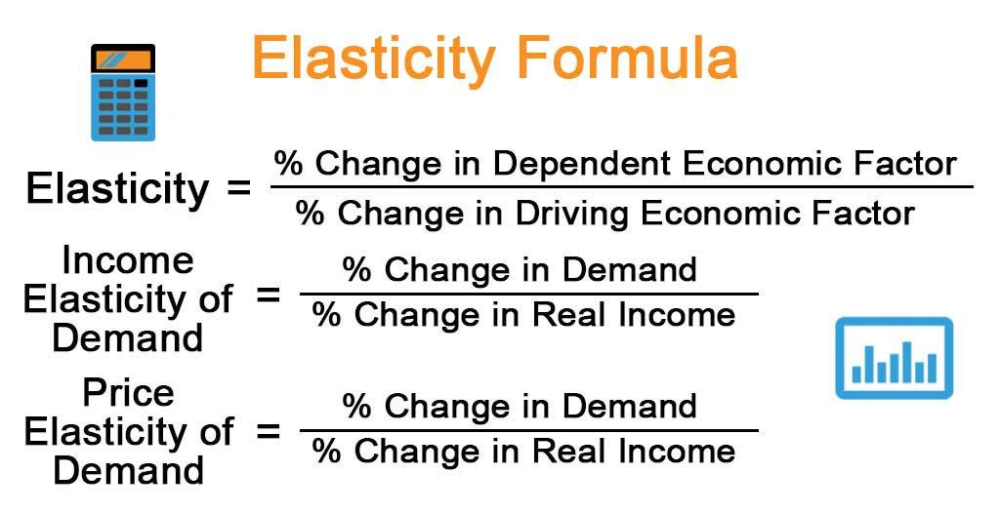

Economic elasticity is a key concept in understanding how various factors influence market behavior. It measures the responsiveness of one economic variable to changes in another, such as how demand or supply will adjust in response to price changes. This concept is particularly significant in evaluating how markets react to shifts, providing valuable insights into consumer behavior and producer responses. Understanding these dynamics can inform pricing strategies, supply chain adjustments, and economic policymaking.

Algorithmic trading, a modern approach to financial markets, executes trades using pre-programmed instructions. These algorithms analyze a plethora of market signals to make lightning-fast trading decisions that human traders might miss. Incorporating elasticity measures into these algorithms can enhance their effectiveness. By understanding how prices impact demand and supply through elasticity, algorithms can predict market responses with greater accuracy, optimizing trading strategies.



This article explores the intersection of economic elasticity and algorithmic trading, focusing particularly on how elasticity formulas can be integrated into trading systems. By quantifying the degree of responsiveness, traders can adapt strategies dynamically, taking advantage of market variability to enhance performance and profitability.

## Table of Contents

## Understanding Economic Elasticity

Economic elasticity describes the responsiveness of one economic variable to changes in another. It plays a crucial role in analyzing market behavior by providing insights into how various factors such as demand, supply, and price interact.

There are several types of elasticity, each focusing on different economic relationships:

1. **Price Elasticity of Demand (PED):** This measures the sensitivity of the quantity demanded of a product to changes in its price. The formula for PED is given by:
$$
   \text{PED} = \frac{\%\ \text{Change in Quantity Demanded}}{\%\ \text{Change in Price}}

$$

   Products with a high PED are considered elastic and experience significant changes in demand when prices fluctuate. Conversely, products with low PED are inelastic, indicating that demand remains relatively stable despite price changes.

2. **Price Elasticity of Supply (PES):** PES quantifies the responsiveness of the quantity supplied of a product to changes in its price. A product with high PES sees a substantial increase in supply when the price rises, and vice versa.

3. **Income Elasticity of Demand:** This type reflects how the quantity demanded of a product changes with consumer income. It helps classify goods into normal (positive income elasticity) or inferior (negative income elasticity) categories.

4. **Cross-Price Elasticity of Demand:** This measures how the quantity demanded of one good changes in response to a price change in another good. A positive cross-price elasticity suggests that the two goods are substitutes, while a negative value indicates that they are complements.

Elastic goods, those with high elasticity, are typically non-essential items where consumers can easily substitute with alternatives in response to price changes. In contrast, inelastic goods are often essential items or those with fewer substitutes available, maintaining stable demand even when prices change dramatically. Understanding these concepts is pivotal for businesses and policymakers to make informed pricing, production, and strategic decisions.

## The Economic Elasticity Formula

Economic elasticity is a quantitative assessment of how the quantity demanded or supplied of a good responds to changes in price, income, or the price of other goods. The concept is encapsulated through various formulas tailored to different elasticity types, each crucial for economic analysis and decision-making.

### Price Elasticity of Demand (PED)

Price elasticity of demand quantifies the responsiveness of the quantity demanded to a change in price. It is calculated using the formula:

$$
\text{PED} = \frac{\%\text{ Change in Quantity Demanded}}{\%\text{ Change in Price}}
$$

This formula helps determine whether a product is elastic or inelastic. An elastic demand implies a substantial change in quantity demanded with price adjustments, whereas inelastic demand indicates minimal change.

### Price Elasticity of Supply (PES)

Price elasticity of supply measures how the quantity supplied of a good changes in response to price variations. It is expressed as:

$$
\text{PES} = \frac{\%\text{ Change in Quantity Supplied}}{\%\text{ Change in Price}}
$$

A product with greater supply elasticity means that producers can increase supply significantly with a price increase.

### Income Elasticity of Demand

Income elasticity of demand assesses how quantity demanded responds to consumer income changes:

$$
\text{Income Elasticity} = \frac{\%\text{ Change in Quantity Demanded}}{\%\text{ Change in Income}}
$$

Positive income elasticity denotes a normal good, while negative implies an inferior good, where demand decreases as income increases.

### Cross-Price Elasticity of Demand

Cross-price elasticity examines the effect on the demand for a good when the price of another good changes:

$$
\text{Cross-Price Elasticity} = \frac{\%\text{ Change in Quantity Demanded of Good A}}{\%\text{ Change in Price of Good B}}
$$

Positive cross-price elasticity indicates substitute goods, whereas negative suggests complementary goods.

Understanding these elasticities is fundamental in crafting strategies within economic environments and [algorithmic trading](/wiki/algorithmic-trading) systems. Calculating and interpreting elasticity values enable traders and economists to predict market behavior accurately and make informed decisions, facilitating optimized strategies in pricing, risk management, and market adaptation.

### Implementation Example in Python

To illustrate how elasticity can be calculated using Python, consider the following code for computing the price elasticity of demand:

```python
def calculate_ped(initial_price, final_price, initial_quantity, final_quantity):
    price_change = (final_price - initial_price) / initial_price
    quantity_change = (final_quantity - initial_quantity) / initial_quantity
    ped = quantity_change / price_change
    return ped

# Example usage
initial_price = 50
final_price = 55
initial_quantity = 1000
final_quantity = 900

ped = calculate_ped(initial_price, final_price, initial_quantity, final_quantity)
print(f"Price Elasticity of Demand: {ped}")
```

This code provides a basic framework for determining the price elasticity of demand by inputting initial and final price and quantity values. Understanding elasticity measures helps in aligning economic goals with real-world trading and market conditions.

## Elasticity in Algorithmic Trading

Algorithmic trading employs sophisticated computer algorithms to execute trades in financial markets efficiently. These algorithms analyze numerous input signals to make trading decisions in real-time. By integrating economic elasticity measures, these algorithms can significantly improve their predictive capabilities concerning market responses to price fluctuations.

Economic elasticity, a measure of responsiveness, allows algorithms to better anticipate how changes in prices can impact the supply and demand of financial instruments. By incorporating the principles of elasticity into algorithmic strategies, traders can refine their stop-loss limits, making them more responsive to market shifts. For example, if an instrument exhibits high price elasticity, algorithms can adjust stop-loss limits more dynamically to prevent unexpected losses.

In addition to enhancing stop-loss mechanisms, elasticity can inform profit target levels. By understanding how quantity demanded reacts to price changes, algorithms can set more accurate profit targets, maximizing returns when market conditions are favorable. An algorithm that anticipates an increased demand response to a small price drop might lower its selling price slightly to capture higher volumes, optimizing profit realization.

Timing is another crucial aspect where elasticity can be beneficial. Markets often experience shifts that require timely entry or [exit](/wiki/exit-strategy) strategies. By using elasticity measures, algorithms can better time their trades to align with probable market reactions. For instance, if a positive price elasticity is detected, algorithms might be programmed to initiate trades swiftly in anticipation of increased demand, capitalizing on brief windows of opportunity. 

Incorporating elasticity into algorithmic trading frameworks enhances the agility and accuracy with which trades are executed. By accounting for how variations in prices affect market forces, traders can achieve a more nuanced approach, improving both risk management and return optimization across diverse market conditions.

## Mathematical Formulations of Elasticity in Trading

Price elasticity of demand (PED) is a quantitative measure showing how the quantity demanded of a financial instrument responds to a price change. It is expressed as:

$$
\text{PED} = \frac{\% \text{ Change in Quantity Demanded}}{\% \text{ Change in Price}}
$$

A higher PED indicates a significant change in demand with price variations, classifying the instrument as elastic. A lower PED suggests inelastic behavior, where demand remains relatively stable despite price changes.

Price elasticity of supply (PES) quantifies how the quantity supplied of a financial instrument adjusts to price changes. This elasticity is calculated similarly:

$$
\text{PES} = \frac{\% \text{ Change in Quantity Supplied}}{\% \text{ Change in Price}}
$$

Instruments with high PES can quickly adapt their supply in reaction to price shifts, while those with low PES show limited supply adjustments.

Income elasticity of demand measures how demand for a financial instrument responds to changes in consumer income, formulated as:

$$
\text{Income Elasticity} = \frac{\% \text{ Change in Demand}}{\% \text{ Change in Income}}
$$

A positive income elasticity implies that demand increases with rising income, characterizing the instrument as a normal good, while a negative elasticity signifies an inferior good, where demand decreases as income increases.

Cross-price elasticity examines how the demand for one financial instrument changes in response to the price fluctuation of another related product:

$$
\text{Cross-Price Elasticity} = \frac{\% \text{ Change in Quantity Demanded of Instrument A}}{\% \text{ Change in Price of Instrument B}}
$$

Positive cross-price elasticity indicates substitute instruments, where an increase in the price of one leads to increased demand for the other. Conversely, negative elasticity signifies complementary instruments, where an increase in the price of one results in reduced demand for the other.

These mathematical formulations form vital inputs for algorithmic trading strategies. By integrating elasticity measures, algorithms can forecast market behavior, identify optimal entry and exit points, and adjust trading parameters to align with anticipated market movements. Python code examples can be implemented to automate these calculations, facilitating responsiveness in dynamic trading environments.

## Practical Applications and Benefits

Elasticity metrics are integral tools for predicting market movements, optimizing trading strategies, and managing risks in algorithmic trading. By quantifying how sensitive quantities such as demand and supply are to price changes, traders are equipped with actionable insights that enhance decision-making processes. The use of elasticity insights enables traders to effectively diversify portfolios and balance risk-return profiles. Understanding the elasticity of financial instruments helps traders to allocate resources optimally, adjusting positions in response to shifts in price dynamics and market conditions. 

For instance, a high price elasticity of demand (PED) indicates that the quantity demanded is highly responsive to price changes, signaling the need for adaptive trading strategies to mitigate risks associated with price [volatility](/wiki/volatility-trading-strategies). Conversely, low PED suggests that demand is relatively inelastic, allowing traders to maintain positions with a degree of stability in volatile markets.

Algorithmic traders, in particular, stand to gain a substantial competitive edge by incorporating elasticity measures into their automated trading systems. These metrics enable algorithms to anticipate market shifts with greater precision, improving the timing of trades and enhancing profit margins. By integrating elasticity calculations, algorithms can dynamically adjust stop-loss orders and profit targets based on expected price fluctuations.

The formula for price elasticity of demand (PED) can be given by: 

$$
\text{PED} = \frac{\% \text{ Change in Quantity Demanded}}{\% \text{ Change in Price}}
$$

In a practical implementation context, a Python snippet for calculating PED might look like:

```python
def calculate_ped(change_in_quantity, change_in_price):
    return (change_in_quantity / change_in_price)

# Example: If quantity demanded changes by 10% when price changes by 5%
ped = calculate_ped(0.10, 0.05)
print(f"Price Elasticity of Demand: {ped}")
```

This quantification through elasticity supports traders in capitalizing on market volatility. When market shocks occur, the ability to quickly assess the potential impact on demand and supply metrics informs strategic shifts in trading activities. Algorithmic systems leveraging elasticity can execute trades that align with predicted market movement, contributing to more robust risk management.

In summary, elasticity metrics offer substantial benefits, empowering traders to enhance their strategies, manage risks effectively, and exploit market conditions. By understanding these dynamics, traders achieve a more nuanced approach to navigating financial markets, positioning themselves for success in an ever-evolving trading landscape.

## Challenges and Considerations

Calculating accurate elasticity is a fundamental challenge in integrating this concept into algorithmic trading systems. A precise measurement of elasticity requires access to comprehensive market data and a nuanced understanding of market dynamics. Market conditions are influenced by an array of factors including geopolitical events, economic announcements, and investor sentiment, which can all alter the elasticity of supply and demand for financial instruments.

Algorithmic traders face the challenge of continuously updating and refining their models to account for these changing elasticities. Static models may quickly become obsolete as market conditions evolve, necessitating dynamic approaches that can adapt to new data and insights. This continuous adjustment demands sophisticated [machine learning](/wiki/machine-learning) techniques and access to real-time data analytics, pushing traders to stay abreast of the latest technological developments.

Integrating elasticity metrics into algorithmic trading systems is complex and can serve as a barrier for some traders. It requires a deep understanding of both financial markets and computational techniques. For instance, incorporating elasticity might involve the use of complex algorithms to forecast price movements or optimize trade execution strategies based on predicted changes in demand or supply. Additionally, the implementation of such models demands significant computational resources and expertise in programming languages like Python to handle large datasets and perform computations efficiently.

Here is an example of how Python might be used to calculate price elasticity of demand, assuming availability of price and quantity data:

```python
def price_elasticity_of_demand(prices, quantities):
    # Calculate percentage changes
    percent_changes_price = [(prices[i+1] - prices[i]) / prices[i] for i in range(len(prices)-1)]
    percent_changes_quantity = [(quantities[i+1] - quantities[i]) / quantities[i] for i in range(len(quantities)-1)]

    # Calculate elasticity
    elasticity = [pq/q if q != 0 else float('inf') for pq, q in zip(percent_changes_quantity, percent_changes_price)]
    return elasticity

# Example data
prices = [100, 105, 110]
quantities = [20, 18, 15]

elasticity = price_elasticity_of_demand(prices, quantities)
print(elasticity)
```

In the example above, the function calculates the price elasticity of demand by determining the percentage change in quantity demanded relative to the percentage change in price over a period of time. This type of analysis can be integrated into broader trading algorithms to enhance decision-making processes, although doing so at an efficient scale remains a significant hurdle for many in the industry.

## Conclusion

Elasticity is a vital concept that enhances the capabilities of algorithmic trading models by providing a quantitative measure of how market variables respond to changes. This allows traders to make more strategic and informed decisions, leading to improved trading outcomes. Specifically, when traders understand the elasticity of demand or supply for a given financial instrument, they can better predict how price changes might impact market behavior. For instance, a high price elasticity of demand (PED) indicates that a small price drop could lead to a significant increase in demand, thus helping traders anticipate potential market movements.

Continued advancements in technology and data science promise further integration of elasticity into trading systems. As computational power increases and data collection methods become more sophisticated, traders will be able to process large datasets faster and with greater precision. This technological progress could lead to the development of more advanced algorithms that incorporate real-time elasticity measures, allowing for more adaptive and proactive trading strategies. Additionally, machine learning and [artificial intelligence](/wiki/ai-artificial-intelligence) could play significant roles in enhancing the accuracy of elasticity predictions, giving traders an edge in understanding and reacting to market dynamics. 

Overall, by leveraging elasticity insights, traders can optimize their trading strategies, manage risk more effectively, and capitalize on market opportunities with greater confidence and accuracy.

## References & Further Reading

[1]: Varian, H. R. (1992). ["Microeconomic Analysis"](https://www.amazon.com/Microeconomic-Analysis-Third-Hal-Varian/dp/0393957357). W.W. Norton & Company.

[2]: Perloff, J. M. (2020). ["Microeconomics"](https://www.pearson.com/en-us/subject-catalog/p/microeconomics/P200000007040/9780137691432). Pearson.

[3]: Hall, R. E., & Lieberman, M. (2012). ["Microeconomics: Principles and Applications"](https://books.google.com/books/about/Microeconomics_Principles_and_Applicatio.html?id=XR9uvGmChp8C). Cengage Learning.

[4]: Amadeo, K. (2021). ["What Is Price Elasticity of Demand and How Does It Work?"](https://investinganswers.com/dictionary/p/price-elasticity-demand-ped) The Balance.

[5]: Mankiw, N. G. (2020). ["Principles of Economics"](https://books.google.com/books/about/Principles_of_Economics.html?id=KQfFDwAAQBAJ). Cengage Learning.