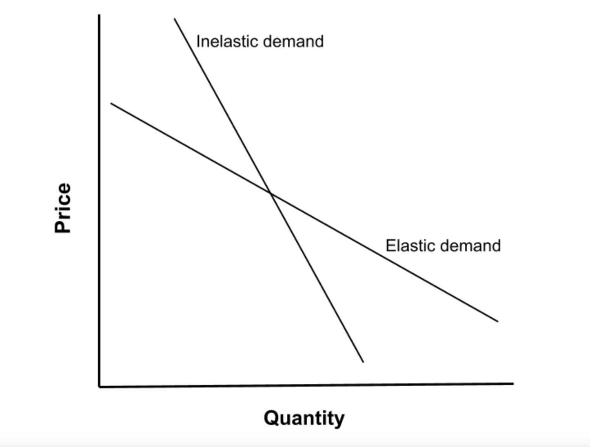

## Table of Contents

## What is the basic definition of demand elasticity?

Demand elasticity is a measure of how much the quantity demanded of a good or service changes when its price changes. It helps us understand how sensitive people are to price changes. If a small change in price leads to a big change in the quantity demanded, the demand is said to be elastic. On the other hand, if the quantity demanded doesn't change much even when the price changes a lot, the demand is inelastic.

This concept is important for businesses and economists because it helps them make decisions about pricing and predicting how changes in the market might affect sales. For example, if a product has elastic demand, a company might be careful about raising prices because it could lead to a significant drop in sales. Conversely, if a product has inelastic demand, a company might feel more comfortable increasing the price because it won't affect sales as much.

## How is the price elasticity of demand calculated?

The price elasticity of demand is calculated by dividing the percentage change in the quantity demanded by the percentage change in price. This formula helps us understand how much people's buying behavior changes when the price of a product goes up or down. For example, if the price of a candy bar goes up by 10% and people buy 20% fewer candy bars, the price elasticity of demand would be 20% divided by 10%, which equals 2.

This number tells us if the demand is elastic, inelastic, or unitary. If the result is greater than 1, the demand is elastic, meaning people are very sensitive to price changes. If it's less than 1, the demand is inelastic, meaning people don't change their buying habits much even when the price changes. If it's exactly 1, the demand is unitary, meaning the percentage change in quantity demanded is equal to the percentage change in price. Understanding this helps businesses set prices and predict how sales might change with different pricing strategies.

## What does it mean for a product to have elastic demand?

When a product has elastic demand, it means that people will buy a lot more or a lot less of it if the price changes even a little bit. For example, if the price of a soda goes up by a small amount, people might choose to drink water instead, so the amount of soda they buy drops a lot. This shows that soda has elastic demand because a small price change leads to a big change in how much people buy.

Understanding elastic demand is important for businesses because it affects how they set prices. If a company knows its product has elastic demand, it might be careful about raising prices. A small increase could lead to a big drop in sales, which could hurt the business. So, companies might keep prices stable or even lower them to keep customers buying their product.

## What does it mean for a product to have inelastic demand?

When a product has inelastic demand, it means that people will keep buying about the same amount of it even if the price goes up or down a bit. For example, if the price of medicine goes up, people still need to buy it because they need it for their health. This shows that medicine has inelastic demand because a small price change doesn't change how much people buy.

Understanding inelastic demand is important for businesses because it helps them set prices. If a company knows its product has inelastic demand, it might feel okay about raising prices a little. Even if the price goes up, people will still buy the product because they need it or really want it. So, companies might raise prices to make more money without worrying too much about losing customers.

## Can you explain the concept of unit elastic demand?

Unit elastic demand is when the change in the price of a product makes people buy exactly the same percentage more or less of it. For example, if the price of a toy goes up by 10%, and people buy 10% fewer toys, that's unit elastic demand. It's like a perfect balance where the change in price matches the change in how much people buy.

Understanding unit elastic demand helps businesses decide on their prices. If a company knows its product has unit elastic demand, it knows that raising the price will bring in the same amount of money as lowering the price. This is because the increase in price will be exactly offset by the decrease in the number of products sold. So, companies might keep the price steady to keep their sales and revenue stable.

## What factors influence the elasticity of demand for a product?

Several things can affect how much people change their buying habits when the price of a product changes. One big thing is how many other similar products are out there. If there are lots of other choices, people can easily switch to something else if the price goes up, making the demand more elastic. Another [factor](/wiki/factor-investing) is how important the product is to people. If it's something they need, like medicine, they'll keep buying it even if the price changes, making the demand inelastic. The amount of time people have to adjust to a price change also matters. If the price goes up, but people have time to find other options or change their habits, the demand might be more elastic.

Another thing that influences demand elasticity is how much of their money people spend on the product. If it's a small part of their budget, like a candy bar, they might not care much about a price change, making the demand inelastic. But if it's a big expense, like a car, even a small price change can make a big difference in how much people buy, making the demand elastic. Also, the way people see the product matters. If it's seen as a luxury, people might be more sensitive to price changes, making the demand elastic. But if it's seen as a necessity, people might be less sensitive, making the demand inelastic.

## How does the availability of substitutes affect demand elasticity?

When there are many other products that people can use instead of a certain product, the demand for that product becomes more elastic. This means if the price goes up, people can easily switch to a different product that does the same thing. For example, if the price of one brand of soda goes up, people can just buy a different brand of soda instead. Because there are so many choices, even a small price change can make a big difference in how much people buy.

On the other hand, if there aren't many other options, the demand for the product becomes more inelastic. This means people will keep buying the product even if the price changes because they don't have many other choices. For example, if there's only one medicine that helps with a specific health problem, people will keep buying it even if the price goes up because they need it. So, the availability of substitutes plays a big role in how sensitive people are to price changes.

## What role does the proportion of income spent on the good play in its elasticity?

When people spend a small part of their money on a product, they usually don't care much if the price changes a little. For example, if a candy bar gets a bit more expensive, people might still buy it because it's not a big part of their budget. This makes the demand for the product inelastic because small price changes don't affect how much people buy.

But if people spend a lot of their money on a product, even a small price change can make a big difference. For example, if the price of a car goes up, people might decide not to buy it because it's a big expense. This makes the demand for the product elastic because people are more sensitive to price changes when it's a large part of their budget. So, how much of their income people spend on a product can really affect how much they change their buying habits when the price changes.

## How does time affect the elasticity of demand?

Time can make a big difference in how much people change their buying habits when the price of a product changes. In the short term, people might not have many other options, so they keep buying the product even if the price goes up. For example, if the price of gas goes up, people still need to drive to work, so they keep buying gas. This makes the demand for gas inelastic in the short term because people don't have time to find other ways to get around.

But over time, people can find other options or change their habits. If the price of gas stays high, people might start using public transportation, carpooling, or even buying a more fuel-efficient car. This means the demand for gas becomes more elastic in the long term because people have time to adjust to the higher price. So, the longer people have to react to a price change, the more likely they are to change how much they buy, making the demand more elastic.

## What are the implications of elastic and inelastic demand for businesses?

When a business knows that the demand for its product is elastic, it needs to be careful about changing prices. If the price goes up even a little bit, people might stop buying the product because they can easily switch to something else. This means the business could lose a lot of sales. So, companies with elastic demand products might keep their prices stable or even lower them to keep customers happy and buying. For example, if a store sells a popular type of soda, and there are many other sodas people can choose from, the store might not raise the price because people could just buy a different brand.

On the other hand, if a business knows that the demand for its product is inelastic, it has more freedom to change prices. People will keep buying the product even if the price goes up because they need it or really want it. This means the business can raise prices a bit and still make more money without losing many customers. For example, if a pharmacy sells a specific medicine that people need for their health, it might raise the price a little because people will still buy it. Understanding whether demand is elastic or inelastic helps businesses make smart choices about pricing and how to keep their sales strong.

## How can a business use the concept of elasticity to set prices?

A business can use the concept of elasticity to set prices by understanding how sensitive its customers are to price changes. If a product has elastic demand, meaning people will buy a lot less if the price goes up even a little, the business should be careful about raising prices. For example, if a store sells a type of soda that has many similar options, raising the price might make people switch to another brand. So, the business might keep the price the same or even lower it to keep customers happy and keep sales strong.

On the other hand, if a product has inelastic demand, meaning people will keep buying it even if the price goes up a bit, the business can feel more comfortable raising prices. This is because people need the product or really want it, so they won't stop buying it just because it costs a little more. For example, if a pharmacy sells a medicine that people need for their health, it can raise the price a little without losing many customers. By knowing whether demand is elastic or inelastic, a business can make smart choices about pricing to keep sales and profits steady.

## What advanced econometric models are used to estimate demand elasticity more precisely?

Businesses and economists use advanced econometric models to get a better idea of how much people will change their buying habits when prices change. One popular model is the regression analysis, which looks at past sales data and price changes to figure out how much demand changes with price. This model can use different types of regression, like linear or non-linear, to see if the relationship between price and demand is simple or more complicated. Another model is the time series analysis, which looks at how demand changes over time and can help predict future demand based on past patterns. These models help businesses understand how sensitive their customers are to price changes and make better pricing decisions.

Another advanced model is the discrete choice model, which looks at how people choose between different products based on their prices and other features. This model can be really helpful for businesses that sell lots of different products or have many competitors. It helps them understand how people make choices and how price changes might affect those choices. Some businesses also use experimental methods, like setting different prices in different stores and seeing how it affects sales. These experiments can give a direct look at how people react to price changes, making it easier to estimate demand elasticity more accurately. By using these advanced models, businesses can make smarter pricing decisions and keep their sales and profits strong.

## References & Further Reading

[1]: ["Economics: Principles, Problems, and Policies"](https://www.amazon.com/Economics-Principles-Problems-McGraw-Hill-Standalone/dp/0078021758) by Campbell McConnell and Stanley Brue

[2]: Chan, E. (2013). ["Algorithmic Trading: Winning Strategies and Their Rationale"](https://github.com/ftvision/quant_trading_echan_book). Wiley.

[3]: Card, D., & Krueger, A. B. (1995). ["Time-Series Minimum-Wage Studies: A Meta-Analysis."](https://www.jstor.org/stable/2117925) American Economic Review.

[4]: ["Principles of Microeconomics"](https://ocw.mit.edu/courses/14-01sc-principles-of-microeconomics-fall-2011/) by Massachusetts Institute of Technology (OpenCourseWare)

[5]: Silver, N. (2012). ["The Signal and the Noise: Why So Many Predictions Fail—but Some Don't."](https://www.amazon.com/Signal-Noise-Many-Predictions-Fail-but/dp/0143125087) Penguin Press.

[6]: ["Introduction to Financial Engineering and Risk Management"](https://www.coursera.org/learn/financial-engineering-intro) by Columbia University on Coursera

[7]: Varian, H. R. (2014). ["Intermediate Microeconomics: A Modern Approach."](https://www.semanticscholar.org/paper/Intermediate-Microeconomics%3A-A-Modern-Approach-Varian/ceec34aa58ed21436952a83e5674d8ed1bc96e09) W.W. Norton & Company.

[8]: "The Elasticity of Demand: A Survey of Influencing Factors." Journal of Economic Perspectives.