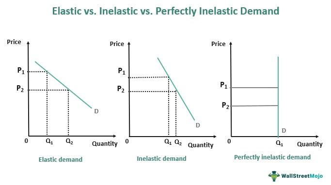

In the fast-paced world of algorithmic trading, understanding core economic concepts is crucial for success. Among these concepts, demand elasticity and demand inelasticity stand out as essential tools for traders aiming to forecast market movements effectively. These concepts elucidate how changes in price influence consumer demand, thereby impacting market dynamics and trading strategies.

Demand elasticity refers to the responsiveness of the quantity demanded of a good to changes in its price. When demand is elastic, a small price variation leads to a more than proportional change in the quantity demanded. Conversely, demand inelasticity describes situations where the quantity demanded is relatively insensitive to price changes. Both concepts are pivotal in evaluating and predicting market trends, shaping trading strategies, and optimizing economic outcomes.



For algorithmic traders, the ability to quantify and interpret demand elasticity and inelasticity can significantly influence trading algorithms and decision-making processes. By analyzing how demand reacts to price changes, traders can improve the accuracy of their models and enhance profitability. This article explores these economic principles and their application in creating robust algorithmic trading strategies. By integrating these insights into trading systems, traders can gain a competitive edge in an ever-evolving financial landscape.

## Table of Contents

## Understanding Demand Elasticity

Demand elasticity is a fundamental economic concept that measures the extent to which the quantity demanded of a good or service changes in response to a change in its price. It is a key indicator for traders who aim to predict market behavior and develop effective trading strategies. Elastic demand occurs when a slight change in price leads to a significant change in the quantity demanded. This sensitivity provides insight into consumer behavior, directly impacting market dynamics and trading decisions.

Several factors influence demand elasticity. One of the primary factors is the availability of substitutes. If numerous alternatives exist for a product, consumers can easily switch, making demand more elastic. For instance, in competitive markets such as consumer electronics or fashion, an increase in the price of a smartphone from one brand could lead to consumers purchasing a similar model from a different brand at a lower price.

The necessity of a product also plays a critical role in determining demand elasticity. Essential goods, like medications or basic food items, tend to have inelastic demand since consumers will continue purchasing them despite price increases. Conversely, non-essential items, like luxury goods or entertainment services, exhibit more elastic demand, as they are not immediately necessary, and consumers can forgo them if prices rise.

Time is another important [factor](/wiki/factor-investing) affecting elasticity. Over the short term, consumers might not have the luxury of adjusting their habits, resulting in inelastic demand. However, given more time, they may find substitutes or alter consumption patterns, leading to increased elasticity. For example, in the energy sector, consumers may initially tolerate higher gasoline prices, but over time, they might shift to public transport or electric vehicles, increasing elasticity.

Understanding demand elasticity can significantly aid traders in forecasting consumer behavior and anticipating potential market fluctuations. In [algorithmic trading](/wiki/algorithmic-trading), demand elasticity provides valuable data inputs that can refine predictive models and enhance trading strategies. For example, during a market downturn, knowing that luxury goods have elastic demand could guide traders to anticipate sharp declines in that sector.

Real-world examples illustrate the implications of elastic demand in trading. Consider the case of a seasonal product, such as holiday decorations. As prices drop post-holiday season, the quantity demanded increases substantially, reflecting high elasticity. Traders can capitalize on this predictability by adjusting their algorithms to invest in manufacturers and retailers poised to benefit from cyclical demand surges. 

In another instance, technological products often enter the market at high prices, which decrease over time due to improvements and competition. The demand for such products often exhibits elasticity; savvy traders can exploit these trends by investing in tech stocks at strategic points when price drops lead to significant increases in sales [volume](/wiki/volume-trading-strategy).

In summary, demand elasticity is an essential concept for algorithmic traders aiming to predict consumer behavior and market movements. By considering the factors that affect elasticity, such as substitutes, necessity, and time, traders can develop robust strategies that leverage the dynamic nature of demand to optimize trading outcomes.

## Exploring Demand Inelasticity

Demand inelasticity is a concept in economics where the quantity demanded by consumers remains relatively stable despite changes in price. This phenomenon is typically observed in products that are considered necessities or have few available substitutes. For instance, essential goods such as medications, basic food staples, and utilities often display inelastic demand. This stability provides a unique advantage in certain market sectors, especially during economic shifts.

In financial markets, understanding demand inelasticity is essential for predicting how specific sectors might respond to economic changes, such as price fluctuations and policy adjustments. Markets characterized by inelastic demand tend to be less volatile, offering security in times of economic uncertainty. This can be pivotal information for algorithmic traders seeking to optimize their trading strategies. By identifying stocks tied to inelastic goods or sectors, traders can target investments that promise relative stability, even amidst broader market turbulence.

Algorithmic traders incorporate this understanding by leveraging historical data to predict how particular stocks or sectors, associated with inelastic goods, might behave. By focusing on economic indicators and sector-specific news, traders can refine their algorithms to prioritize these stable assets during periods of economic [volatility](/wiki/volatility-trading-strategies). For example, sectors like healthcare, energy, or consumer staples are often characterized by inelastic demand; investments in these areas can thus provide a buffer against market downturns.

Real-world case studies highlight the strategic advantage of factoring demand inelasticity into trading models. During the COVID-19 pandemic, sectors linked to essential goods, such as pharmaceuticals and household necessities, experienced less dramatic drops in demand compared to sectors linked to luxury or non-essential goods. This differential behavior underscores the importance of sectoral demand elasticity in crafting resilient algorithmic trading strategies. By aligning their algorithms with sectors exhibiting inelastic demand, traders can make more informed and potentially lucrative decisions.

In summary, understanding and applying the concept of demand inelasticity can give algo traders a significant competitive advantage. By identifying inelastic stocks and sectors, traders can develop strategies that focus on generating stable returns while minimizing exposure to volatile market shifts.

## The Importance of Economic Concepts in Algorithmic Trading

Market movements are influenced by a range of economic indicators, and among them, demand elasticity holds significant importance. Demand elasticity measures how the quantity demanded of a good or service responds to changes in price. When applied to algorithmic trading, this concept allows traders to predict and interpret market reactions to price fluctuations, thereby aiding in the formulation of robust trading strategies.

Algorithmic trading systems are heavily reliant on data that inherently reflects consumer behavior patterns, of which demand elasticity and inelasticity are crucial aspects. By evaluating these patterns, traders are able to assess how sensitive consumers are to price changes for various securities or market sectors. This insight can be instrumental in anticipating market dynamics and making informed trading decisions.

Integrating demand elasticity into algorithmic models can significantly enhance accuracy and profitability. For instance, when a market is experiencing high elasticity, small price changes can lead to larger variations in the quantity demanded. This can present opportunities for short-term trading strategies where models can quickly capitalize on these price fluctuations. Conversely, markets exhibiting inelastic demand tend to be less volatile, which might be advantageous for long-term investment strategies focused on stability.

Risk management and predictive modeling are two areas where demand elasticity is particularly valuable. In risk management, understanding how market factors affect consumer demand can help in assessing the potential risk associated with specific trades. This can be used to establish stop-loss and profit-taking mechanisms that are aligned with expected market behavior. Similarly, in predictive modeling, algorithms that incorporate elasticity data can forecast market trends more effectively, allowing for strategic positioning in anticipation of future price movements.

Successful algorithmic strategies are those that accurately integrate these economic principles. By recognizing patterns in demand elasticity, traders can craft algorithms that optimize entry and [exit](/wiki/exit-strategy) points, balancing both risk and reward. This can be achieved through a combination of historical data analysis and forward-looking indicators that identify shifts in market elasticity.

Incorporating economic concepts such as demand elasticity into algorithmic trading is not only beneficial but essential in today’s fast-paced financial environment. Traders who adeptly navigate these principles gain a competitive advantage by being better equipped to understand and anticipate market changes. As trading systems evolve, the ability to integrate economic insights with technological models can lead to increased success in volatile markets.

## Strategies for Algo Trading Based on Demand Elasticity Concepts

In algorithmic trading, leveraging demand elasticity concepts can significantly enhance trading strategies and decision-making processes. Understanding and targeting sectors with high demand elasticity can open up opportunities for short-term trading. These sectors tend to show rapid changes in demand relative to price changes, offering potential for quick gains. For instance, luxury goods or non-essential consumer products often exhibit elastic demand, making them ideal targets for traders looking to capitalize on minor price adjustments.

On the other hand, industries exhibiting demand inelasticity provide attractive avenues for long-term investments. Products or services considered necessities, such as utilities or basic consumer staples, generally have less variable demand despite price changes. Investing in such sectors can lead to stable growth prospects, as their consumer demand remains relatively constant even during economic turbulence.

To refine trading algorithms, integrating technical indicators with demand elasticity insights is vital. Indicators such as moving averages or the Relative Strength Index (RSI) can be aligned with elasticity data to enhance the algorithm’s predictive capabilities. For example, if a sector shows high elasticity, a trader might adjust their algorithm to place greater weight on short-term price movements.

Incorporating [machine learning](/wiki/machine-learning) techniques further augments the ability to analyze demand trends and predict shifts in market elasticity. Machine learning algorithms can process vast datasets to identify patterns and forecast changes in demand elasticity. A simple machine learning model in Python using libraries like scikit-learn might involve training a regression model on historical price and demand data to predict future elasticity:

```python
from sklearn.linear_model import LinearRegression
import numpy as np

# Sample data: Prices and demand quantities
prices = np.array([100, 90, 80, 70, 60]).reshape(-1, 1)
demand = np.array([10, 12, 15, 20, 25])

# Create and train the model
model = LinearRegression()
model.fit(prices, demand)

# Predict future demand elasticity
predicted_demand = model.predict(np.array([[65], [85], [95]]))
print(predicted_demand)
```

Enhancing automated trading systems with real-time elasticity analysis allows for more strategic decision-making. By employing systems that continuously assess elasticity data, traders can adjust their strategies dynamically to reflect current market conditions. This real-time analysis can be integrated into trading platforms to alert traders to significant shifts in demand conditions, enabling timely adjustments to positions or strategies.

Overall, by combining demand elasticity insights with modern computational tools and techniques, traders can develop robust algorithmic strategies that adapt to both short-term and long-term market dynamics.

## Conclusion

Mastering demand elasticity and inelasticity is essential for effective algorithmic trading. These economic concepts provide a framework for predicting market behavior and optimizing trading strategies. Demand elasticity refers to how sensitive the quantity demanded of a good is to changes in its price, allowing traders to anticipate shifts in market demand following price fluctuations. Conversely, demand inelasticity measures how little the quantity demanded reacts to changes in price, helping identify stable markets less affected by volatility.

For algorithmic traders, understanding these principles can significantly enhance trading models. The integration of demand elasticity and inelasticity insights into algorithmic systems enables the anticipation of consumer behavior and market trends. This adaptability is crucial given the continuous evolution of financial markets. Traders who successfully incorporate these economic principles into their algorithms gain a competitive advantage, as they are better equipped to predict and respond to market dynamics.

Incorporating economic insights into algorithmic models can lead to greater success in volatile markets. By using data reflecting demand elasticity, algorithmic trading systems can improve their predictive accuracy and profitability. For instance, machine learning models can be trained to recognize patterns in demand elasticity shifts, allowing for more dynamic trade execution strategies.

Staying informed and continuously adapting trading strategies to align with economic changes are critical practices for traders seeking to leverage demand elasticity. As markets and consumer behaviors shift, ongoing education in economic theory, algorithmic trading principles, and real-time data analysis will ensure traders maintain a strategic edge. Resources such as [books](/wiki/algo-trading-books), courses, and analytical tools provide valuable knowledge to navigate market changes effectively, supporting the development of robust trading algorithms capable of thriving amidst economic fluctuations.

## Further Reading and Resources

### Suggested Books and Articles for Deeper Understanding of Demand Elasticity and Inelasticity

For those interested in expanding their knowledge of demand elasticity and inelasticity in the context of economic theory and algorithmic trading, several resources can be highly valuable. "Economics: Principles, Problems, and Policies" by Campbell McConnell and Stanly Brue provides a comprehensive overview of fundamental economic concepts, including demand elasticity. Additionally, "Algorithmic Trading: Winning Strategies and Their Rationale" by Ernie Chan offers insights into leveraging economic principles, like demand elasticity, for effective algorithmic trading strategies. For academic articles, "The Elasticity of Demand: A Survey of Influencing Factors" published in the Journal of Economic Perspectives presents detailed analyses and discussions on the topic.

### Recommended Courses on Economic Theory and Algorithmic Trading Principles

Courses that elaborate on both economic theory and the technical aspects of trading algorithms can greatly benefit traders. The Massachusetts Institute of Technology (MIT) offers an open [course](/wiki/best-algorithmic-trading-courses) titled "Principles of Microeconomics" which extensively covers demand elasticity. For algorithmic trading principles, Coursera's "Introduction to Financial Engineering and Risk Management" by Columbia University provides a solid foundation. These courses can provide the necessary theoretical and practical skills to integrate demand elasticity concepts into trading strategies.

### Online Forums and Communities for Ongoing Discussion and Knowledge Sharing

Engaging with communities devoted to economic discussions and algorithmic trading can be invaluable. Online platforms such as Reddit's /r/AlgoTrading and Stack Exchange's Quantitative Finance section offer spaces where traders and economists can exchange knowledge, discuss strategies, and keep abreast of the latest developments. These forums also serve as a resource for troubleshooting algorithms and debating economic theories.

### Analytical Tools and Platforms Offering Insights into Market Elasticity Trends

To effectively implement demand elasticity concepts in trading algorithms, analytical tools that offer real-time data and trend analysis can be crucial. Bloomberg Terminal and Thomson Reuters Eikon are leading platforms that provide extensive market data and analytics, including elasticity trends and economic indicators. For more budget-friendly options, platforms like QuantConnect offer algorithmic trading services with robust data analytics capabilities.

### Stay Updated with the Latest Research and Developments in Algo Trading and Economic Analysis

Staying current with research in algorithmic trading and economic analysis is essential for maintaining a competitive edge. The Journal of Economic Literature and the International Journal of Forecasting regularly publish articles on recent advancements in economic analysis and algorithmic trading. Subscribing to industry newsletters such as those from Algorithmic Traders Association can also keep traders informed about the latest trends and technologies impacting the markets.

These resources collectively provide a comprehensive toolkit for enhancing knowledge and practical skills in dealing with demand elasticity and inelasticity, thereby improving algorithmic trading strategies.

## References & Further Reading

[1]: ["Economics: Principles, Problems, and Policies"](https://www.amazon.com/Economics-Principles-Problems-McGraw-Hill-Standalone/dp/0078021758) by Campbell McConnell and Stanley Brue

[2]: Chan, E. (2013). ["Algorithmic Trading: Winning Strategies and Their Rationale"](https://github.com/ftvision/quant_trading_echan_book). Wiley.

[3]: Card, D., & Krueger, A. B. (1995). ["Time-Series Minimum-Wage Studies: A Meta-Analysis."](https://www.jstor.org/stable/2117925) American Economic Review.

[4]: ["Principles of Microeconomics"](https://ocw.mit.edu/courses/14-01sc-principles-of-microeconomics-fall-2011/) by Massachusetts Institute of Technology (OpenCourseWare)

[5]: Silver, N. (2012). ["The Signal and the Noise: Why So Many Predictions Fail—but Some Don't."](https://www.amazon.com/Signal-Noise-Many-Predictions-Fail-but/dp/0143125087) Penguin Press.

[6]: ["Introduction to Financial Engineering and Risk Management"](https://www.coursera.org/learn/financial-engineering-intro) by Columbia University on Coursera

[7]: Varian, H. R. (2014). ["Intermediate Microeconomics: A Modern Approach."](https://www.semanticscholar.org/paper/Intermediate-Microeconomics%3A-A-Modern-Approach-Varian/ceec34aa58ed21436952a83e5674d8ed1bc96e09) W.W. Norton & Company.

[8]: "The Elasticity of Demand: A Survey of Influencing Factors." Journal of Economic Perspectives.