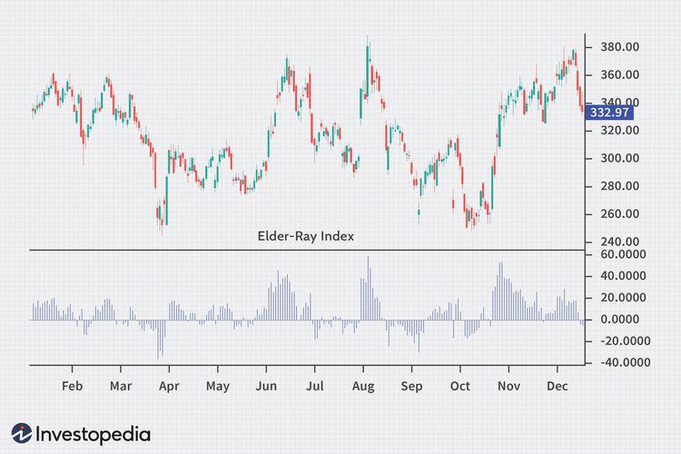

The Elder-Ray Index is a notable tool in the field of technical analysis, designed by Dr. Alexander Elder to assess the balance of power between buyers and sellers in the financial markets. This indicator plays a crucial role in evaluating market strength and direction, positioning itself as an essential resource for traders and analysts. As part of the broader category of stock market indicators, the Elder-Ray Index contributes significantly to interpreting market conditions and devising trading strategies.

Stock market indicators are quantitative tools used to evaluate the conditions of the financial markets. They assist traders in decision-making by providing insights into potential market trends, price movements, and market strength. Indicators can be categorized into various types, including leading and lagging indicators, which respectively predict and confirm trends, as well as trend and momentum indicators, which focus on price direction and speed. The Elder-Ray Index is a unique blend of these functions, providing a comprehensive view of market dynamics.



Algorithmic trading has become increasingly prominent in financial markets, leveraging the speed and precision of algorithms to execute trades based on pre-defined criteria. Technical indicators, like the Elder-Ray Index, are integral to this process, offering data-driven signals that can be programmed into trading algorithms. By integrating these indicators, traders can capitalize on market opportunities with increased accuracy and reduced emotional interference, leading to potentially higher profits and risk management.

The primary objective of this article is to explore how the Elder-Ray Index can be effectively utilized within algorithmic trading. It aims to provide a thorough understanding of this indicator, demonstrating its application in automated trading systems and its potential in enhancing trading decisions.

Key points to be discussed in the article include an overview of the Elder-Ray Index's historical development and components, its interpretation of market conditions, the interplay of various technical indicators in forming robust trading strategies, and practical applications within algorithmic trading settings. By examining these aspects, readers will gain valuable insights into incorporating the Elder-Ray Index into their algorithmic trading endeavors for improved market analysis and decision-making.

## Table of Contents

## Understanding the Elder-Ray Index

The Elder-Ray Index, developed by Dr. Alexander Elder, is a technical analysis tool designed to assess the strength of buyers and sellers in the financial markets. Introduced in the 1989 book "Trading for a Living," this index helps traders identify periods of market dominance by either bulls (buyers) or bears (sellers), providing insights into potential market trends and reversals.

The index is composed of two primary components: Bull Power and Bear Power. Bull Power measures the ability of buyers to drive prices above the average, while Bear Power assesses the pressure exerted by sellers to push prices below it. The calculation of these components involves a simple formula based on the Exponential Moving Average (EMA), which is used to smooth price data.

1. **Bull Power** is calculated as:
$$
   \text{Bull Power} = \text{High} - \text{EMA}

$$

   where "High" represents the highest price of the period.

2. **Bear Power** is derived using the formula:
$$
   \text{Bear Power} = \text{Low} - \text{EMA}

$$

   where "Low" is the lowest price of the period.

The essence of the Elder-Ray Index lies in its ability to measure the strength of market participants through these calculations. When Bull Power is positive and increasing, it indicates that buyers are gaining strength, and prices are likely to rise. Conversely, a negative and decreasing Bear Power suggests that sellers are weakening, potentially signaling a price increase. On the other hand, a rising negative Bear Power signifies strengthening sellers, indicating a potential drop in prices.

Interpreting the signals from the Elder-Ray Indicator involves understanding the interactions of Bull and Bear Power. A bullish condition may be observed when Bull Power remains positive while Bear Power is negative and rising, suggesting an opportunity to buy. Conversely, a bearish condition is implied when Bear Power is negative and strengthening, especially when Bull Power weakens or transitions into the negative.

The advantages of using the Elder-Ray Index in technical analysis are manifold. This index provides an intuitive, straightforward approach to gauging market sentiment and potential reversals. By focusing on the relative strength of buyers and sellers, traders can make more informed decisions about market entries and exits. Additionally, its reliance on the EMA ensures that price movements are not overly influenced by short-term [volatility](/wiki/volatility-trading-strategies), enhancing the reliability of its signals.

The insights garnered from the Elder-Ray Index enable traders to better navigate the complexities of financial markets, offering a balanced perspective on market dynamics that can be instrumental in developing sophisticated trading strategies.

## Stock Market Indicators: A Technical Overview

Technical indicators play a crucial role in trading strategies, providing traders with insights into market dynamics that can guide decision-making processes. These indicators are mathematical calculations based on the price, [volume](/wiki/volume-trading-strategy), or open interest of a security or contract used to predict market movements.

### Types of Stock Market Indicators

Stock market indicators are generally categorized as leading or lagging and may focus on trend, [momentum](/wiki/momentum), volatility, and volume among other factors.

**1. Leading vs. Lagging Indicators**

- **Leading Indicators**: These provide signals before the actual trend or reversal occurs. They are useful for traders looking to anticipate future movements. Examples include the Relative Strength Index (RSI) and Stochastic Oscillator.

- **Lagging Indicators**: These follow market trends and can confirm patterns or trends once they have been established. While they may not allow traders to enter or exit positions early, they provide confirmation of existing trends. The Moving Average Convergence Divergence (MACD) and simple moving averages (SMA) are common examples.

**2. Trend vs. Momentum Indicators**

- **Trend Indicators**: They help identify the direction and strength of a market trend. This category includes moving averages and MACD. 

- **Momentum Indicators**: These indicate the speed of price movement over a given time period. They are helpful in determining overbought or oversold conditions in a market, with RSI and the Commodity Channel Index (CCI) being prominent examples.

### Identifying Market Trends and Reversals

Indicators are valuable in identifying both market trends and potential reversals. For instance, a moving average crossover, where a shorter-term average crosses above a longer-term average, can signify a trend change. Momentum indicators can highlight whether a security is gaining or losing strength, which can precede price changes.

### Comparison with Other Indicators

The Elder-Ray Index, comprised of Bull Power and Bear Power components, offers a unique perspective by measuring the buying and selling pressure in the market. In contrast:

- **RSI**: Focuses on price oscillations to determine overbought or oversold levels.

- **MACD**: Combines moving averages to show momentum and trend strength but does not directly analyze buying and selling power.

Each of these indicators has unique strengths, and their effectiveness varies depending on market conditions and the trader’s objectives.

### Choosing the Right Indicators

Selecting appropriate indicators is contingent on individual trading goals and current market conditions. Traders should consider the following:

- **Objective of Strategy**: Day traders might prefer leading indicators for quick entry and exit signals, while long-term investors might prioritize lagging indicators for trend confirmation.

- **Market Conditions**: In a trending market, trend indicators like moving averages are beneficial, whereas momentum indicators are more effective in volatile or ranging markets.

Ultimately, combining multiple indicators can provide a more holistic view and bolster trading strategies. For example, using a momentum indicator like RSI with a trend indicator such as a moving average can help verify signals and reduce false positives. Traders should continuously test and refine their selection to align with their evolving strategies and market developments.

## Algorithmic Trading and Elder-Ray Index Application

Algorithmic trading, a method leveraging computer programs to execute trades at high speed and precision, has become increasingly prevalent in financial markets. Its growth is driven by advancements in technology and the need for efficient trading strategies. Technical indicators, like the Elder-Ray Index, play a crucial role in these algorithms, offering insights into market dynamics that can inform trading decisions.

Developing algorithms with the Elder-Ray Index involves integrating the index's key components—Bull Power and Bear Power—into the decision-making process. Bull Power is calculated as the difference between the highest price in a day and the 13-day exponential moving average (EMA), while Bear Power is the difference between the lowest price and the 13-day EMA. These indicators help quantify the buying (bullish) and selling (bearish) pressure in the market, serving as a foundation for establishing market entry and [exit](/wiki/exit-strategy) points.

A specific strategy using Bull Power and Bear Power might involve setting thresholds that, when crossed, trigger buy or sell orders. For example, a common strategy could involve buying stocks when Bull Power is above zero and increasing, suggesting strengthening market confidence, and selling when Bear Power is below zero and decreasing, pointing to weakening market sentiment.

Backtesting and optimization are essential steps in refining Elder-Ray-based algorithms. Backtesting involves simulating the algorithm's performance on historical market data to evaluate its effectiveness. During this process, parameters can be adjusted to optimize returns and minimize risks. Python is a popular language for developing these [backtesting](/wiki/backtesting) frameworks due to its robust libraries like Pandas for data manipulation and [backtrader](/wiki/backtrader) for simulating trading strategies.

```python
import backtrader as bt

class ElderRayStrategy(bt.Strategy):
    def __init__(self):
        self.ema = bt.ind.ExponentialMovingAverage(self.data, period=13)
        self.bull_power = self.data.high - self.ema
        self.bear_power = self.data.low - self.ema

    def next(self):
        if self.bull_power[0] > 0 and self.bear_power[0] < 0:
            if not self.position:
                self.buy()
        elif self.bull_power[0] < 0 and self.bear_power[0] > 0:
            if self.position:
                self.sell()

# Set up backtesting environment
cerebro = bt.Cerebro()
cerebro.addstrategy(ElderRayStrategy)
data = bt.feeds.YahooFinanceData(dataname='AAPL', fromdate=datetime(2020, 1, 1),
                                 todate=datetime(2021, 1, 1))
cerebro.adddata(data)
cerebro.run()
```

There are case studies attesting to the success of Elder-Ray Index-based [algorithmic trading](/wiki/algorithmic-trading) strategies. One notable example might involve a trading firm implementing a strategy using these indicators across multiple asset classes. By aligning the Bull Power and Bear Power readings with broader market trends, such firms have reported increased profitability and reduced risk, showcasing the index's potential when used judiciously.

Incorporating the Elder-Ray Index into algorithmic trading strategies offers traders a sophisticated tool for assessing market conditions. When carefully calibrated through backtesting and optimization, these algorithms can enhance decision-making and offer a competitive edge in fast-paced financial markets.

## Practical Tips for Using Elder-Ray Index in Trading

Integrating the Elder-Ray Index into personal trading systems requires an understanding of its components, Bull Power and Bear Power, which assess the strength of buying and selling pressures, respectively. To effectively utilize this indicator, traders should consider the following practical tips.

### Common Challenges and Pitfalls

One of the common challenges when using the Elder-Ray Index is its sensitivity to market noise, especially in volatile markets. This can lead to false signals. To mitigate this, traders can smooth the Bull Power and Bear Power lines using moving averages, which can help filter out short-term fluctuations and provide clearer signals.

Another pitfall is relying solely on the Elder-Ray Index without considering the broader market context. It's crucial to combine this indicator with a comprehensive analysis of market conditions, including [fundamental analysis](/wiki/fundamental-analysis) and other technical indicators, to avoid misinterpreting signals.

### Combining Elder-Ray Index with Other Tools

The effectiveness of the Elder-Ray Index can be enhanced by combining it with other technical tools. For instance, the Moving Average Convergence Divergence (MACD) indicator can be used alongside the Elder-Ray to confirm bullish or bearish trends. When both indicators align, the signals are generally more reliable.

The Relative Strength Index (RSI) can also serve as a complementary tool. While the Elder-Ray identifies the strength of buyers and sellers, the RSI provides insights into overbought or oversold conditions. Using these tools together can result in more nuanced trade decisions.

### Tips on Setting Up and Monitoring Indicators

Most trading platforms, such as MetaTrader or TradingView, offer the Elder-Ray Index as a built-in indicator. When setting it up, it is crucial to adjust the parameters according to your trading strategy and the specific market you're analyzing. Start with the default settings and modify them based on backtesting results.

Continuous monitoring is essential, and setting alerts for significant changes in Bull Power and Bear Power values can help in staying updated without constantly watching the screen. This can be done by programming alerts within your trading platform that notify you when the index values cross certain thresholds.

### Recommended Practices for Continuous Learning

Continuing education in technical analysis is vital for maximizing the potential of the Elder-Ray Index. Traders should regularly read recent literature on technical analysis and attend webinars or workshops to update their skills. Publications from reputable financial analysts and institutions often provide insights into new techniques and strategies.

Backtesting is also a recommended practice. By applying the Elder-Ray Index to historical data, traders can assess its effectiveness and optimize its parameters. Python, with libraries like Pandas and Backtrader, makes backtesting accessible. A simple script can loop through historical price data and help identify profitable configurations.

```python
import pandas as pd
import backtrader as bt

# Sample backtesting setup
class ElderRayStrategy(bt.Strategy):
    def __init__(self):
        self.bull_power = bt.indicators.Highest(self.data.high, period=13) - bt.indicators.EMA(self.data.close, period=13)
        self.bear_power = self.bull_power - (self.data.low - bt.indicators.EMA(self.data.close, period=13))

    def next(self):
        if self.bull_power[0] > 0 and self.bear_power[0] < 0:
            # Example condition for a bullish signal
            self.buy(size=10)
        elif self.bull_power[0] < 0 and self.bear_power[0] > 0:
            # Example condition for a bearish signal
            self.sell(size=10)

cerebro = bt.Cerebro()
cerebro.addstrategy(ElderRayStrategy)
data = bt.feeds.PandasData(dataname=pd.read_csv('historical_data.csv'))
cerebro.adddata(data)
cerebro.run()
cerebro.plot()
```

The code snippet sets up a simple strategy using the Elder-Ray's Bull and Bear Power to make trading decisions, showcasing the power of backtesting for strategy development. By incorporating these practical tips, traders can harness the Elder-Ray Index more effectively within their trading systems.

## Conclusion

The Elder-Ray Index, devised by Dr. Alexander Elder, serves as a pivotal instrument in technical analysis, providing traders with insights into market dynamics through the assessment of Bull Power and Bear Power. By serving as an indicator of market strength, it enables traders to perceive the balance between buyers and sellers, thereby offering a perspective on potential price movements. This article has illustrated how the Elder-Ray Index can be effectively utilized within algorithmic trading frameworks, fostering enhanced trading strategies through its integration.

Algorithmic trading, characterized by its precision and speed, benefits significantly from the incorporation of technical analysis tools like the Elder-Ray Index. By codifying trading strategies into algorithms, traders can ruthlessly exploit slight fluctuations in market strength, as identified by the Bull and Bear Power components. This synergy between technical indicators and automation allows for more sophisticated and reactive trading operations, enhancing overall strategy effectiveness. Moreover, the practice of backtesting and optimizing these algorithms ensures robust, data-driven decision-making processes.

Traders are encouraged to explore and experiment with the Elder-Ray Index within their own trading frameworks. This exploration not only aids in understanding the intricate dynamics of market forces but also in customizing trading strategies that align with individual trading goals and market conditions. The flexibility of the Elder-Ray Index, when combined with other indicators, allows for the creation of comprehensive strategies tailored to diverse market landscapes.

As the future of algorithmic trading continues to advance, the role of technical indicators remains integral. Innovations in technology and data analysis will likely lead to the development of even more nuanced tools, further enhancing the capability of algorithmic systems. Traders who remain adaptable and continuously integrate evolving indicators like the Elder-Ray Index will likely maintain a competitive edge in increasingly complex financial markets.

For those interested in expanding their understanding and application of the Elder-Ray Index, resources such as Dr. Alexander Elder’s book "Trading for a Living" provide comprehensive insights into the theory and practice of this indicator. Additionally, online platforms and forums dedicated to technical analysis and trading strategies offer community-driven knowledge and shared experiences, promoting continuous learning and adaptation.

By combining technical analysis with automated systems, traders can harness the full potential of indicators like the Elder-Ray Index, driving informed and strategic trading decisions in a rapidly evolving market environment.

## References & Further Reading

[1]: Elder, A. (1993). ["Trading for a Living: Psychology, Trading Tactics, Money Management."](https://www.amazon.com/Trading-Living-Psychology-Tactics-Management/dp/0471592242) John Wiley & Sons.

[2]: Pring, M. J. (2002). ["Technical Analysis Explained: The Successful Investor's Guide to Spotting Investment Trends and Turning Points."](https://archive.org/details/technicalanalysi00prin) McGraw Hill Professional.

[3]: Murphy, J. J. (1999). ["Technical Analysis of the Financial Markets: A Comprehensive Guide to Trading Methods and Applications."](https://archive.org/details/technicalanalysi0000murp) New York Institute of Finance.

[4]: Aronson, D. R. (2007). ["Evidence-Based Technical Analysis: Applying the Scientific Method and Statistical Inference to Trading Signals."](https://onlinelibrary.wiley.com/doi/book/10.1002/9781118268315) Wiley Trading.

[5]: Pardo, R. (2008). ["The Evaluation and Optimization of Trading Strategies."](https://onlinelibrary.wiley.com/doi/book/10.1002/9781119196969) Wiley.

[6]: Chan, E. P. (2009). ["Quantitative Trading: How to Build Your Own Algorithmic Trading Business."](https://github.com/ftvision/quant_trading_echan_book) Wiley.