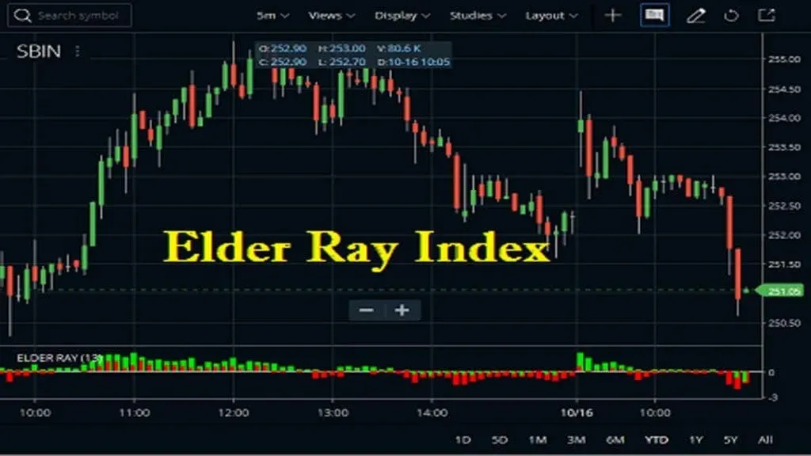

## Table of Contents

## What is the Elder-Ray Index?

The Elder-Ray Index is a tool used in stock market analysis to help traders understand the power behind price movements. It was created by Dr. Alexander Elder, who wanted to give traders a way to see if buyers or sellers were in control of the market. The index uses two main parts: the Bull Power and the Bear Power. Bull Power shows how strong the buyers are by comparing the highest price of the day to a moving average. Bear Power shows how strong the sellers are by comparing the lowest price of the day to the same moving average.

Traders use the Elder-Ray Index to make decisions about buying or selling stocks. If the Bull Power is high, it means buyers are strong and the price might go up, so it could be a good time to buy. If the Bear Power is high, it means sellers are strong and the price might go down, so it might be a good time to sell. By looking at both Bull Power and Bear Power, traders can get a better idea of the market's direction and make smarter trading choices.

## Who developed the Elder-Ray Index?

The Elder-Ray Index was developed by Dr. Alexander Elder. He is a well-known trader and author who wanted to help other traders understand the stock market better. Dr. Elder created this tool to show how strong buyers and sellers are at any given time.

The Elder-Ray Index uses two main parts: Bull Power and Bear Power. Bull Power tells you how strong the buyers are by looking at the highest price of the day compared to a moving average. Bear Power tells you how strong the sellers are by looking at the lowest price of the day compared to the same moving average. By using these two parts, traders can make better decisions about when to buy or sell stocks.

## What are the main components of the Elder-Ray Index?

The Elder-Ray Index has two main parts: Bull Power and Bear Power. Bull Power shows how strong the buyers are. It does this by comparing the highest price of the day to a moving average. If the Bull Power is high, it means buyers are strong and the price might go up. This can be a good time to buy stocks.

Bear Power shows how strong the sellers are. It does this by comparing the lowest price of the day to the same moving average. If the Bear Power is high, it means sellers are strong and the price might go down. This can be a good time to sell stocks. By looking at both Bull Power and Bear Power, traders can understand if the market is going up or down and make better trading choices.

## How is the Bull Power calculated in the Elder-Ray Index?

Bull Power in the Elder-Ray Index shows how strong buyers are. To calculate Bull Power, you need to find the difference between the highest price of the day and a moving average. The moving average is usually the 13-day exponential moving average (EMA) of the stock's closing prices. So, you take the highest price of the day and subtract the 13-day EMA from it. The result is the Bull Power.

If the Bull Power is a big positive number, it means buyers are very strong. This could mean the price of the stock might go up soon. Traders look at Bull Power to decide if it's a good time to buy the stock. By understanding how strong the buyers are, traders can make better choices about when to buy.

## How is the Bear Power calculated in the Elder-Ray Index?

Bear Power in the Elder-Ray Index shows how strong sellers are. To calculate Bear Power, you need to find the difference between the lowest price of the day and a moving average. The moving average is usually the 13-day exponential moving average (EMA) of the stock's closing prices. So, you take the 13-day EMA and subtract the lowest price of the day from it. The result is the Bear Power.

If the Bear Power is a big negative number, it means sellers are very strong. This could mean the price of the stock might go down soon. Traders look at Bear Power to decide if it's a good time to sell the stock. By understanding how strong the sellers are, traders can make better choices about when to sell.

## What does a positive Bull Power indicate?

A positive Bull Power means that buyers are strong. It shows that the highest price of the day was above the 13-day moving average. This is a good sign for people who want to buy stocks because it means the price might go up soon.

Traders look at Bull Power to decide if it's a good time to buy. When Bull Power is positive and high, it tells them that buyers are pushing the price up. This can help them make better choices about when to buy stocks.

## What does a negative Bear Power indicate?

A negative Bear Power means that sellers are strong. It shows that the lowest price of the day was below the 13-day moving average. This is a good sign for people who want to sell stocks because it means the price might go down soon.

Traders look at Bear Power to decide if it's a good time to sell. When Bear Power is negative and low, it tells them that sellers are pushing the price down. This can help them make better choices about when to sell stocks.

## How can the Elder-Ray Index be used in trading strategies?

The Elder-Ray Index can help traders decide when to buy or sell stocks by showing how strong buyers and sellers are. If the Bull Power is high and positive, it means buyers are strong and the stock price might go up soon. This could be a good time to buy the stock. On the other hand, if the Bear Power is low and negative, it means sellers are strong and the stock price might go down. This could be a good time to sell the stock. By looking at both Bull Power and Bear Power, traders can get a better idea of the market's direction and make smarter choices.

Traders can also use the Elder-Ray Index to find good entry and [exit](/wiki/exit-strategy) points for their trades. For example, if the Bull Power starts to rise from a low point, it might be a good time to buy because it shows that buyers are getting stronger. If the Bear Power starts to drop from a high point, it might be a good time to sell because it shows that sellers are getting weaker. By watching these changes, traders can time their trades better and improve their chances of making money in the stock market.

## What are the limitations of using the Elder-Ray Index?

The Elder-Ray Index is a helpful tool, but it has some limits. One big problem is that it uses a moving average, which can be slow to change. This means the index might not show you what's happening in the market right now. If the market moves quickly, the Elder-Ray Index might not be quick enough to help you make the best choices.

Another limit is that the Elder-Ray Index can give you false signals. Sometimes, it might look like buyers or sellers are very strong, but the stock price doesn't move the way you expect. This can happen because the index only looks at the highest and lowest prices of the day, not other important things like news or big events that can change the market. So, you should not use the Elder-Ray Index by itself. It's better to use it with other tools and information to make smarter trading choices.

## How does the Elder-Ray Index perform in different market conditions?

The Elder-Ray Index can work well in different market conditions, but it's not perfect. In a strong bull market, where prices are going up a lot, the Bull Power part of the index will often be high and positive. This can help traders see that buyers are in control and it might be a good time to buy stocks. But, if the market is moving very fast, the Elder-Ray Index might not catch up quickly enough because it uses a moving average. So, in a fast-moving bull market, the index might not give you the best signals right away.

In a bear market, where prices are going down, the Bear Power part of the index will often be low and negative. This can show traders that sellers are in control and it might be a good time to sell stocks. But, just like in a bull market, the Elder-Ray Index can be slow to change. If the market suddenly drops a lot, the index might not show you the new market conditions fast enough. So, in a fast-moving bear market, you might need to use other tools along with the Elder-Ray Index to make the best trading choices.

In a sideways market, where prices are not going up or down much, the Elder-Ray Index can be tricky to use. Both Bull Power and Bear Power might not show big changes, making it hard to decide when to buy or sell. In these conditions, the index might give you false signals, making you think the market is moving when it's not. So, in a sideways market, it's really important to use the Elder-Ray Index with other tools and information to get a better picture of what's happening.

## Can the Elder-Ray Index be combined with other technical indicators for better results?

Yes, the Elder-Ray Index can be combined with other technical indicators to get better results. One way to do this is to use it with the Moving Average Convergence Divergence (MACD). The MACD can help you see the strength and direction of a trend, while the Elder-Ray Index shows you the power of buyers and sellers. By using both, you can get a clearer picture of the market. For example, if the MACD shows a strong uptrend and the Elder-Ray Index has high Bull Power, it might be a good time to buy.

Another useful combination is with the Relative Strength Index (RSI). The RSI tells you if a stock is overbought or oversold, which can help you avoid bad trades. If the RSI shows that a stock is overbought but the Elder-Ray Index still has high Bull Power, it might mean the stock will keep going up for a bit longer. But if the RSI shows the stock is oversold and the Elder-Ray Index has low Bear Power, it might be a good time to buy. By using the Elder-Ray Index with other indicators, you can make smarter trading choices and improve your chances of making money in the stock market.

## What are some common mistakes traders make when using the Elder-Ray Index?

One common mistake traders make when using the Elder-Ray Index is relying on it too much by itself. The Elder-Ray Index uses a moving average, which can be slow to change. This means it might not show what's happening in the market right now. If the market moves fast, the index might not give the best signals quickly enough. Traders should use the Elder-Ray Index with other tools like the MACD or RSI to get a better picture of the market and avoid making bad trades.

Another mistake is not understanding that the Elder-Ray Index can give false signals. Sometimes, it might look like buyers or sellers are strong, but the stock price doesn't move as expected. This can happen because the index only looks at the highest and lowest prices of the day, not other important things like news or big events that can change the market. Traders should always use the Elder-Ray Index with other information to make sure they are making the best choices.

## What is the Elder-Ray Index and how does it work?

The Elder-Ray Index, developed by Dr. Alexander Elder, is a technical analysis tool designed to assess the strength of buyers and sellers in the financial markets. Introduced in the 1989 book "Trading for a Living," this index helps traders identify periods of market dominance by either bulls (buyers) or bears (sellers), providing insights into potential market trends and reversals.

The index is composed of two primary components: Bull Power and Bear Power. Bull Power measures the ability of buyers to drive prices above the average, while Bear Power assesses the pressure exerted by sellers to push prices below it. The calculation of these components involves a simple formula based on the Exponential Moving Average (EMA), which is used to smooth price data.

1. **Bull Power** is calculated as:
$$
   \text{Bull Power} = \text{High} - \text{EMA}

$$

   where "High" represents the highest price of the period.

2. **Bear Power** is derived using the formula:
$$
   \text{Bear Power} = \text{Low} - \text{EMA}

$$

   where "Low" is the lowest price of the period.

The essence of the Elder-Ray Index lies in its ability to measure the strength of market participants through these calculations. When Bull Power is positive and increasing, it indicates that buyers are gaining strength, and prices are likely to rise. Conversely, a negative and decreasing Bear Power suggests that sellers are weakening, potentially signaling a price increase. On the other hand, a rising negative Bear Power signifies strengthening sellers, indicating a potential drop in prices.

Interpreting the signals from the Elder-Ray Indicator involves understanding the interactions of Bull and Bear Power. A bullish condition may be observed when Bull Power remains positive while Bear Power is negative and rising, suggesting an opportunity to buy. Conversely, a bearish condition is implied when Bear Power is negative and strengthening, especially when Bull Power weakens or transitions into the negative.

The advantages of using the Elder-Ray Index in technical analysis are manifold. This index provides an intuitive, straightforward approach to gauging market sentiment and potential reversals. By focusing on the relative strength of buyers and sellers, traders can make more informed decisions about market entries and exits. Additionally, its reliance on the EMA ensures that price movements are not overly influenced by short-term [volatility](/wiki/volatility-trading-strategies), enhancing the reliability of its signals.

The insights garnered from the Elder-Ray Index enable traders to better navigate the complexities of financial markets, offering a balanced perspective on market dynamics that can be instrumental in developing sophisticated trading strategies.

## References & Further Reading

[1]: Elder, A. (1993). ["Trading for a Living: Psychology, Trading Tactics, Money Management."](https://www.amazon.com/Trading-Living-Psychology-Tactics-Management/dp/0471592242) John Wiley & Sons.

[2]: Pring, M. J. (2002). ["Technical Analysis Explained: The Successful Investor's Guide to Spotting Investment Trends and Turning Points."](https://archive.org/details/technicalanalysi00prin) McGraw Hill Professional.

[3]: Murphy, J. J. (1999). ["Technical Analysis of the Financial Markets: A Comprehensive Guide to Trading Methods and Applications."](https://archive.org/details/technicalanalysi0000murp) New York Institute of Finance.

[4]: Aronson, D. R. (2007). ["Evidence-Based Technical Analysis: Applying the Scientific Method and Statistical Inference to Trading Signals."](https://onlinelibrary.wiley.com/doi/book/10.1002/9781118268315) Wiley Trading.

[5]: Pardo, R. (2008). ["The Evaluation and Optimization of Trading Strategies."](https://onlinelibrary.wiley.com/doi/book/10.1002/9781119196969) Wiley.

[6]: Chan, E. P. (2009). ["Quantitative Trading: How to Build Your Own Algorithmic Trading Business."](https://github.com/ftvision/quant_trading_echan_book) Wiley.